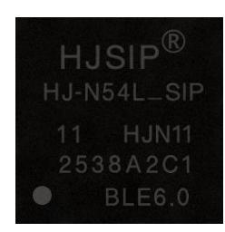
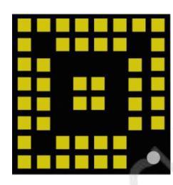
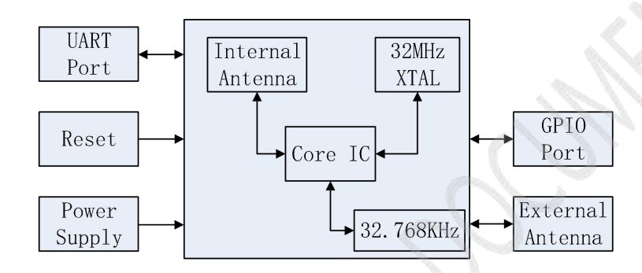
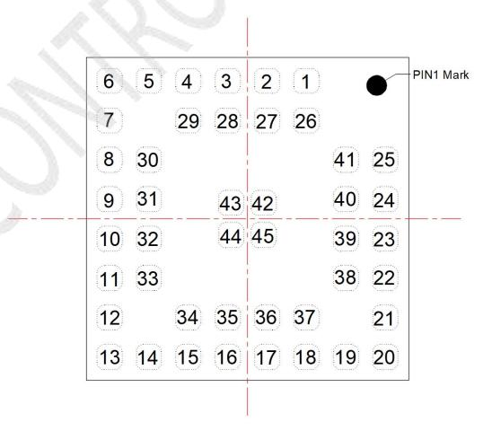
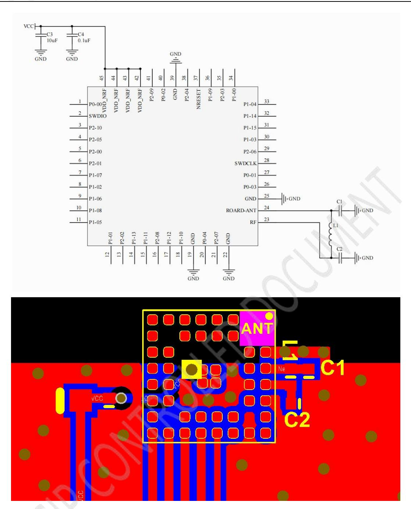
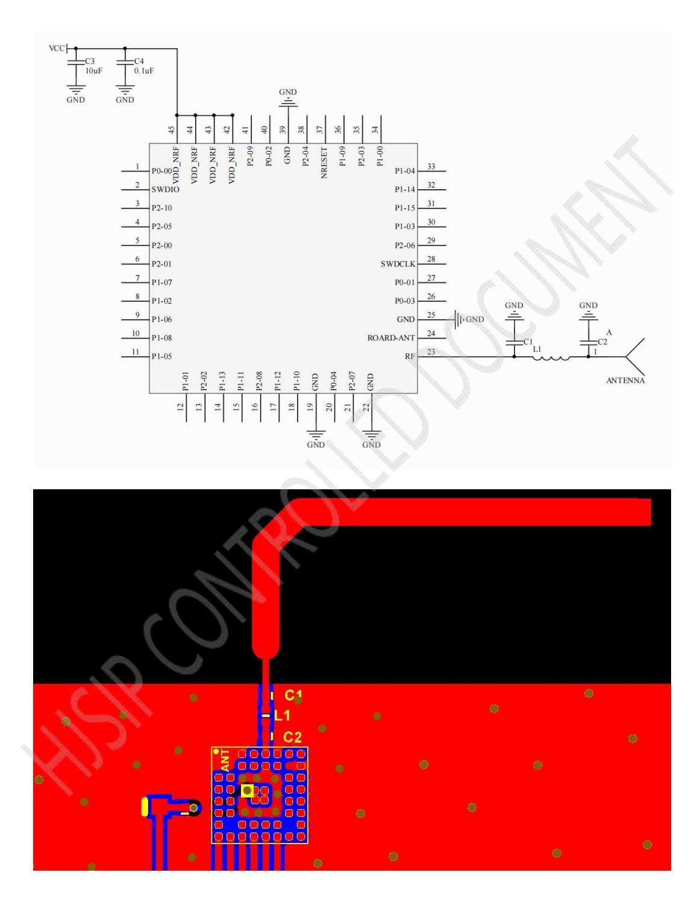
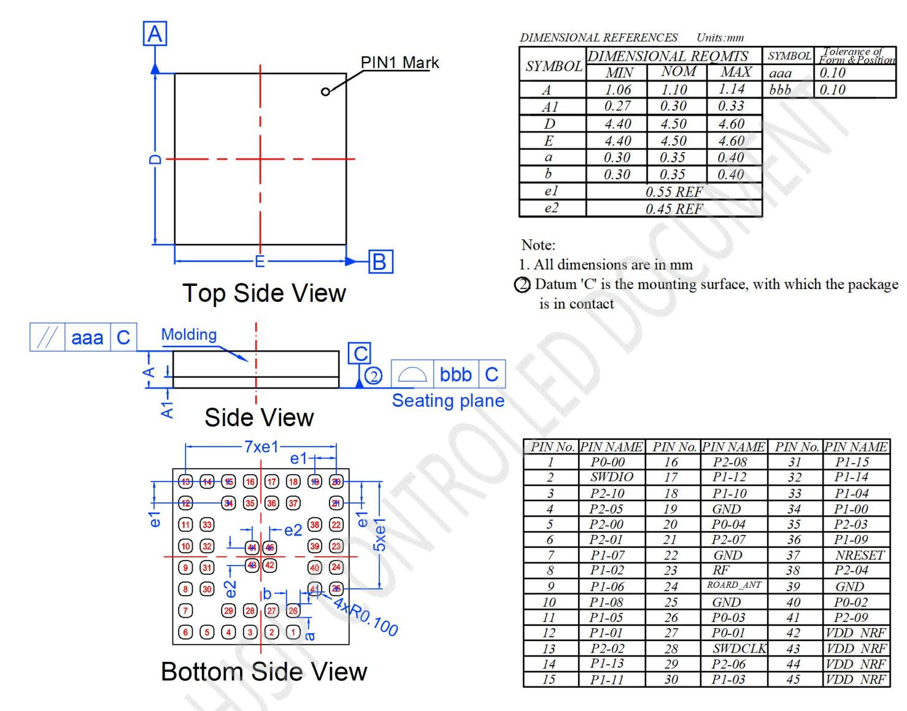
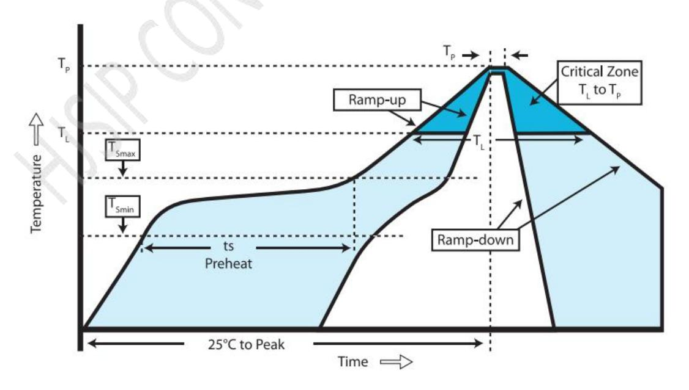
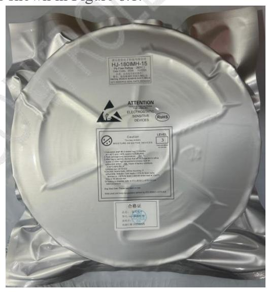

- [**HJ-N54L\_SIP\_Hardware Design Manual**](#hj-n54l_sip_hardware-design-manual)
      - [**Preface**](#preface)
      - [**Copyright Notice**](#copyright-notice)
- [**Contents**](#contents)
- [**Version History**](#version-history)
- [**Applicable module selection**](#applicable-module-selection)
  - [1 Introduction](#1-introduction)
  - [2 Product overview](#2-product-overview)
    - [2.1 Key features](#21-key-features)
    - [**2.2 Application Scenarios**](#22-application-scenarios)
    - [**2.3 Functional block diagram**](#23-functional-block-diagram)
- [**2.4 Pins distribution diagram**](#24-pins-distribution-diagram)
- [**2.5 Pins description table**](#25-pins-description-table)
- [**3 RF Features**](#3-rf-features)
- [**3.1 Antenna interface and operating frequency band**](#31-antenna-interface-and-operating-frequency-band)
- [**3.2 Antenna application reference**](#32-antenna-application-reference)
      - [3.2.1 Use module build-in antenna wiring diagram](#321-use-module-build-in-antenna-wiring-diagram)
      - [3.2.2 Use the external PCB antenna wiring diagram](#322-use-the-external-pcb-antenna-wiring-diagram)
  - [**\*Special attention \***](#special-attention-)
  - [**3.3 RF Features**](#33-rf-features)
- [**4 Electrical Parameters**](#4-electrical-parameters)
- [**4.1 Absolute Maximum Ratings**](#41-absolute-maximum-ratings)
  - [**4.2 DC Characteristics**](#42-dc-characteristics)
- [**5 Notices for Hardware Design**](#5-notices-for-hardware-design)
- [**6 Mechanical specifications**](#6-mechanical-specifications)
- [**7 SMT production**](#7-smt-production)
    - [**7.1 Precautions for ultrasonic welding**](#71-precautions-for-ultrasonic-welding)
- [**7.2 Soldering Recommendations**](#72-soldering-recommendations)
- [**7.3 Humidity sensing properties**](#73-humidity-sensing-properties)
- [**8 Packaging**](#8-packaging)
- [**8.1 Packaging method**](#81-packaging-method)
  - [**8.2 Label information**](#82-label-information)

# **HJ-N54L\_SIP\_Hardware Design Manual**

**Based on Nordic nRF54L15 Ultra-small size 4.5\*4.5\*1.1mm Configure 1.5MB NVM and 256KB RAM Ultra-low-cost BLE 6.0 module**

> Version:V1.1 Date:2025/10/09

| Version: | V1.1       |
|----------|------------|
| Date:    | 2025/10/09 |
| State:   | published  |

#### **Preface**

Thank you forusing the Bluetooth module provided by HJSIP. The HJ-N54L\_SIP module is a high-performance BLE 6.0 Bluetooth module.The module adopts LGA45 packaging and supports both internal and external antennas. The product also has features oflow power consumption, small size and strong anti-interference ability, and is suitable for a variety of application scenarios. This module is mainly used for data communication, and the company doesnot assume responsibility for property losses orpersonal injuries caused by improper operations ofusers. Please develop the product according to the technical specifications and reference design in the manual. At the same time, pay attention to the generalsafety matters that should be concerned about when using mobile products.

Before the announcement, the company has the right to modify the contentof this manual according to the needs oftechnological development.

#### **Copyright Notice**

The copyright of this manual belongs to HJSIP. Anyone who copies, references or modifies this manual without written consent of HJSIP will bear legal responsibility.

# **Contents**

| Version History                                    | 1 |
|----------------------------------------------------|---|
| Applicable module selection                        | 1 |
| 1 Introduction                                     | 1 |
| 2 Product overview                                 | 1 |
| 2.1 Key features                                   | 1 |
| 2.2 Application Scenarios                          | 1 |
| 2.3 Functional block diagram                       | 1 |
| 2.4 Pins distribution diagram                      | 1 |
| 2.5 Pins description table                         | 1 |
| 3 RF Features                                      | 1 |
| 3.1 Antenna interface and operating frequency band | 1 |
| 3.2 Antenna application reference                  | 1 |
| 3.3 RF Features                                    | 1 |
| 4 Electrical Parameters                            | 1 |
| 4.1 Absolute Maximum Ratings                       | 1 |
| 4.2 DC Characteristics                             | 1 |
| 5 Notices for Hardware Design                      | 1 |
| 6 Mechanical specifications                        | 1 |
| 7 SMT production                                   | 1 |
| 7.1 Precautions for ultrasonic welding             | 1 |
| 7.2 Soldering Recommendations                      | 1 |
| 7.3 Humidity sensing properties                    | 1 |
| 8 Packaging                                        | 1 |
| 8.1 Packaging method                               | 1 |
| 8.2 Label information                              | 1 |

# **Version History**

| Version | Date       | <b>Change Description</b>                                                                                                           | Reviser | Reviewer |
|---------|------------|-------------------------------------------------------------------------------------------------------------------------------------|---------|----------|
| V1.0    | 2025/09/15 | The first version.                                                                                                                  | WYW     | LMY      |
| V1.1    | 2025/10/09 | Table 2-1: "Ultra-Low Power Multi-Protocol 2.4GHz Radio" is changed to "Ultra-Low Power Multi-Protocol 2.4GHz Wireless Transceiver" | WYW     | LMY      |

# **Applicable module selection**

| No. | Module model          | Type                                                        | Description                                                                                                                                                                                                                                                                                                                                                                              |
|-----|-----------------------|-------------------------------------------------------------|------------------------------------------------------------------------------------------------------------------------------------------------------------------------------------------------------------------------------------------------------------------------------------------------------------------------------------------------------------------------------------------|
| 1   | HJ-N54L_SIP_ SPPv2 | Serial port transparent transmission standard version | Built-in serial port transparent firmware, the firmware module is a two-way communication bridge between Bluetooth devices or mobile phones and MCU, users do not need to understand the Bluetooth protocol stack, through the serial port command operation and serial port data can be received, simple operation, shorten the user development cycle, speed up the product to market. |
| 2   | HJ-N54L_SIP_ CUSv2 | Customized version for customers                            | This version supports customer customized firmware, customers according to product needs to propose functions, we will customize modules with dedicated firmware versions to supply to customers.                                                                                                                                                                                        |
| 3   | HJ-N54L_SIP_ EMP   | Customer development version                                | Provide standard SDK to facilitate customers' secondary development of OPEN CPU.                                                                                                                                                                                                                                                                                                         |

## 1 Introduction

The HJ-N54L\_SIP module is a high-performance IoT Bluetooth transceiver. Based on nRF54L15, it supports Bluetooth LE, channel detection, Bluetooth Mesh, Zigbee, Thread, Matter, Amazon Sidewalk and 2.4GHz proprietary protocols. It is equipped with 1.5MB NVM and 256KB RAM. The module is packaged in LGA45 and supports built-in antenna and external antenna. The product also features low power consumption, small size, strong anti-interference ability, and is suitable for various application scenarios.

Figure 1.1: HJ-N54L\_SIP top and bottom view

## 2 Product overview

### 2.1 Key features

Table 2-1: HJ-N54L SIP key characteristics

| Characteristic        | Description                                                                                                                                                                                                                                                                                                                                                                                                                          |
|-----------------------|--------------------------------------------------------------------------------------------------------------------------------------------------------------------------------------------------------------------------------------------------------------------------------------------------------------------------------------------------------------------------------------------------------------------------------------|
| Function              | - Ultra-low-power multiprotocol 2.4GHz wireless transceiver - Integrated multi-purpose MCU functionality - 128 MHz Arm Cortex-M33 processor - Comprehensive set of peripherals,including new Global RTC available in System OFF, 14-bit ADC, and high-speed serial interfaces - Secure boot, secure firmware update, secure storage - Cryptographic accelerator with side-channel leakage protection,tamper detectors |
| Size                  | 4.5mm * 4.5mm * 1.1mm (W*L*H, include internal antenna)                                                                                                                                                                                                                                                                                                                                                                              |
| Package               | LGA45                                                                                                                                                                                                                                                                                                                                                                                                                                |
| Wight                 | 0.5g                                                                                                                                                                                                                                                                                                                                                                                                                                 |
| Power Supply          | 1.7V-3.6V                                                                                                                                                                                                                                                                                                                                                                                                                            |
| Low power consumption | Sleep current<1uA                                                                                                                                                                                                                                                                                                                                                                                                                    |
| RF characteristics    | - Working frequency 2.4GHz, supporting the free ISM band - output power:-8dBm~+8dBm - sensitivity:-96dBm (1Mbps) - TX current(0dBm): TYP. 4.8mA - RX current: TYP. 3.4mA - The transmission distance of the built-in antenna in open areas: 20~50m - The wireless transmission distance of the external antenna in open areas: 50~200m                                                                             |
| GPIO port             | Max. 32                                                                                                                                                                                                                                                                                                                                                                                                                              |
| Operation Temperature | -40 ~ +105°C                                                                                                                                                                                                                                                                                                                                                                                                                         |
| Storage Temperature   | $-40 ~ +125$ °C                                                                                                                                                                                                                                                                                                                                                                                                                      |
| Product Certification | Comply with the ROHS standard                                                                                                                                                                                                                                                                                                                                                                                                        |

### **2.2 Application Scenarios**

- 2.4GHz Bluetooth Low Energy system;
- Smart home, wireless remote control;
- Consumer electronics products such as sports and healthcare;
- Industrial monitoring;
- Intelligent transportation, etc.

### **2.3 Functional block diagram**

**Figure 2.1**:**HJ-N54L\_SIP functional block diagram**

# **2.4 Pins distribution diagram**

**Figure 2.2**:**HJ-N54L\_SIP pins distribution diagram(top view)**

# **2.5 Pins description table**

**Table 2-2**:**HJ-N54L\_SIP pins definition table**

| PIN | Name      | Type                    | Description                                                                                                                                                                                                                                                                                |
|-----|-----------|-------------------------|--------------------------------------------------------------------------------------------------------------------------------------------------------------------------------------------------------------------------------------------------------------------------------------------|
| 1   | P0-00     | I/O                     | GPIO                                                                                                                                                                                                                                                                                       |
| 2   | SWDIO     | Debug                   | Simulation debugging port                                                                                                                                                                                                                                                            |
| 3   | P2-10     | I/O                     | GPIO                                                                                                                                                                                                                                                                                       |
| 4   | P2-05     | I/O                     | GPIO                                                                                                                                                                                                                                                                                       |
| 5   | P2-00     | I/O                     | GPIO                                                                                                                                                                                                                                                                                       |
| 6   | P2-01     | I/O                     | GPIO                                                                                                                                                                                                                                                                                       |
| 7   | P1-07     | I/O                     | GPIO                                                                                                                                                                                                                                                                                       |
| 8   | P1-02     | I/O                     | GPIO                                                                                                                                                                                                                                                                                       |
| 9   | P1-06     | I/O                     | GPIO                                                                                                                                                                                                                                                                                       |
| 10  | P1-08     | I/O                     | GPIO                                                                                                                                                                                                                                                                                       |
| 11  | P1-05     | I/O                     | GPIO                                                                                                                                                                                                                                                                                       |
| 12  | P1-01     | 32.768K interface/ GPIO | An 32.768K crystal oscillator has been internally connected. No other components can be connected to it; otherwise, it will affect the oscillator's operation. If the internal oscillator is not used, it can be used as a general I/O port.                                            |
| 13  | P2-02     | I/O                     | GPIO                                                                                                                                                                                                                                                                                       |
| 14  | P1-13     | I/O                     | GPIO                                                                                                                                                                                                                                                                                       |
| 15  | P1-11     | I/O                     | GPIO                                                                                                                                                                                                                                                                                       |
| 16  | P2-08     | I/O                     | GPIO                                                                                                                                                                                                                                                                                       |
| 17  | P1-12     | I/O                     | GPIO                                                                                                                                                                                                                                                                                       |
| 18  | P1-10     | I/O                     | GPIO                                                                                                                                                                                                                                                                                       |
| 19  | GND       | Power GND               | Power GND                                                                                                                                                                                                                                                                                  |
| 20  | P0-04     | I/O                     | GPIO                                                                                                                                                                                                                                                                                       |
| 21  | P2-07     | I/O                     | GPIO                                                                                                                                                                                                                                                                                       |
| 22  | GND       | Power GND               | Power GND                                                                                                                                                                                                                                                                                  |
| 23  | RF        | RF OUTPUT               | RF signal output. If the space is sufficient, it is advisable to add a PI circuit to connect to an external antenna.                                                                                                                                                                       |
| 24  | ROARD ANT | Build-in ANT            | Built-in antenna interface An internal matching circuit has been integrated. If using the built-in antenna, simply connect PIN23 to PIN24; Depending on your product structure, to achieve the best antenna effect, an additional PI is required. Please refer to 3.2.1 for details. |
| 25  | GND       | Power GND               | Power GND                                                                                                                                                                                                                                                                                  |
| 26  | P0-03     | I/O                     | GPIO                                                                                                                                                                                                                                                                                       |
| 27  | P0-01     | I/O                     | GPIO                                                                                                                                                                                                                                                                                       |
| 28  | SWDCLK    | Debug                   | Programming and debugging interface clock                                                                                                                                                                                                                                                  |
| 29  | P2-06     | I/O                     | GPIO                                                                                                                                                                                                                                                                                       |
| 30  | P1-03     | I/O                     | GPIO                                                                                                                                                                                                                                                                                       |
| 31  | P1-15     | I/O                     | GPIO                                                                                                                                                                                                                                                                                       |
| 32  | P1-14     | I/O                     | GPIO                                                                                                                                                                                                                                                                                       |
| 33  | P1-04     | I/O                     | GPIO                                                                                                                                                                                                                                                                                       |
| 34  | P1-00     | 32.768K interface/ GPIO | An 32.768K crystal oscillator has been internally connected. No other components can be connected to it; otherwise, it will affect the oscillator's operation. If the internal oscillator is not used, it can be used as a general I/O port.                                            |
| 35  | P2-03     | I/O                     | GPIO                                                                                                                                                                                                                                                                                       |
| 36  | P1-09     | I/O                     | GPIO                                                                                                                                                                                                                                                                                       |
| 37  | NRESET    | RESET                   | Reset pin, low level effective, low level duration > 1 second                                                                                                                                                                                                                              |
| 38  | P2-04     | I/O                     | GPIO                                                                                                                                                                                                                                                                                       |
| 39  | GND       | Power GND               | Power GND                                                                                                                                                                                                                                                                                  |
| 40  | P0-02     | I/O                     | GPIO                                                                                                                                                                                                                                                                                       |
| 41  | P2-09     | I/O                     | GPIO                                                                                                                                                                                                                                                                                       |
| 42  | VDD_NRF   | Power                   | Power input, 1.7-3.6V                                                                                                                                                                                                                                                                      |
| 43  | VDD_NRF   | Power                   | Power input, 1.7-3.6V                                                                                                                                                                                                                                                                      |
| 44  | VDD_NRF   | Power                   | Power input, 1.7-3.6V                                                                                                                                                                                                                                                                      |
| 45  | VDD_NRF   | Power                   | Power input, 1.7-3.6V                                                                                                                                                                                                                                                                      |

# **3 RF Features**

The module set two ways: build-in antenna and external antenna. You can choose one of them.

# **3.1 Antenna interface and operating frequency band**

Module antenna interface characteristic impedance 50 ohms.

The radio frequency working band is 2.402 ~ 2.480GHz.

# **3.2 Antenna application reference**

#### 3.2.1 Use module build-in antenna wiring diagram

An internal matching circuit has been integrated. If using the build-in antenna, simply connect PIN23 and PIN24;

**Depending on your product structure, to achieve the best antenna effect, an additional PI is required. Connect PIN23 to PIN24 through a π-type filter circuit. Then you can use the internal high-performance antenna, as shown in Figure 3.1. The communication distance in open areas is 20 to 50 meters.**

It is important to note that no devices should be placed near the antenna, no wires should be routed, no devices should be placed on the back of the module,and copper should avoid the area of the onboard antenna. (Except for the antenna part)the copper on the back of the module should be large enough for the GND, and the antenna should be given as much clearance as possible.

**Figure 3.1**:**Use the module's build-in antenna**

#### 3.2.2 Use the external PCB antenna wiring diagram

The PIN24 is suspended, and the PIN23 is connected to the PCB antenna through a π filter circuit, as shown in Figure 3.2 below, and the communication distance in open ground can reach 50~200 meters.

## **\*Special attention \***

1) If you have requirements for the distance of the product and the external π circuit needs to be matched, please send the PCBA circuit board to our company to complete this task.

2) When designing the circuit, no devices or wires should be placed near the antenna, and no devices should be placed on the back of the module. The copper cladding should cover the module and the π -shaped filter circuit, avoiding the PCB antenna.

**Figure 3.2**:**Use the external antenna**

## **3.3 RF Features**

**Table 3-1**:**RF features**

| Attribute                | Value                       | Remarks                                   |
|--------------------------|-----------------------------|-------------------------------------------|
| Wireless modulation mode | (G)FSK                      | /                                         |
| Frequency range          | 2.402 - 2.480Ghz            | bandwidth: 2MHz                           |
| Number of channels       | 40                          | /                                         |
| Air speed                | 1Mbps 2Mbps 125Kbps 500Kbps | /                                         |
| Rf port impedance        | 50 Ohm                      | /                                         |
| Transmission power       | Max. +8dbm                  | /                                         |
| TX current               | TYP. 4.8mA                  | @+0dBm 1Mbps                              |
| RX current               | TYP. 3.4mA                  | @1Mbps                                    |
| Sensitivity              | TYP. -96dbm                 | 1Mbps                                     |
| Antenna                  | Build-in antenna            | An external antenna can also be connected |

# **4 Electrical Parameters**

# **4.1 Absolute Maximum Ratings**

**Table 4-1**:**Absolute Maximum Ratings**

| Parameter                            | Min. | Max.         | Unit |
|--------------------------------------|------|--------------|------|
| VCC                                  | 1.7  | 3.9          | V    |
| VCC(extended operating temperature)  | 1.7  | 3.7          | V    |
| VI/O                                 | 0    | VCC+0.3(3.9) | V    |
| VI/O(extended operating temperature) | 0    | VCC+0.3(3.7) | V    |
| Storage temperature                  | -40  | +125         | °C   |

## **4.2 DC Characteristics**

**Table 4-2**:**Recommended Operating Conditions**

| Parameter                           | Min. | Typ. | Max. | Unit |
|-------------------------------------|------|------|------|------|
| VCC                                 | 1.7  | 3.3  | 3.6  | V    |
| VCC(extended operating temperature) | 1.7  | 3.3  | 3.4  | V    |
| Sleep current                       | /    | < 1  | /    | uA   |
| operating temperature               | -40  | /    | +85  | °C   |
| extended operating temperature      | +85  | /    | +105 | °C   |

**Table 4-3**:**Dc features ofI/O ports**

| IO Pin            | Drive capability | Min.    | Max.    | Unit |
|-------------------|------------------|---------|---------|------|
| Input low level   | /                | 0       | 0.3*VCC | V    |
| Input high level  | /                | 0.7*VCC | VCC     | V    |
| Output low level  | 0.5mA            | 0       | 0.4     | V    |
| Output high level | 5.0mA            | VCC-0.4 | VCC     | V    |

# **5 Notices for Hardware Design**

- The module antenna should be placed at the edge of the circuit board,close to the main board edge or corner. It is best to place the module in the corner of the circuit board.
- No other components should be placed near the antenna of the Bluetooth module or on its back,

and no traces should be routed there, otherwise it will affect the Bluetooth performance.

- Each layer of the circuit board should be fully covered with copper and connected to GND, and the copper coverage area should be large enough (except for the antenna part), and well grounded.
- As manyvias as possible should be drilled in the copper coverage area of the entire circuit board, especially near the module and antenna.
- If there are high-power devices or high-voltage conversion circuits on the circuit board, the GND copper coverage of the module should be isolated from the GND copper coverage of other parts, and connected by a single point grounding method. As many viasas possible should be drilled to reduce interference to the RF signal.
- The module should not be placed in a metal shell. If a metal shell must be used, the antenna should be led out.
- For products with this Bluetooth module, some metal components such as screws and inductors should be kept as far away as possible from the RF antennapart of the Bluetooth module.
- The filter capacitor at the power supply should be placed as close as possible to the power input pin of the module. If it is capacitor-powered or space is limited, the filter capacitor at the power input can be removed as the module has an internal filter capacitor.
- Please refer to the pin diagram for all pins and pay attention to the IO mode and status ofthe IO connected to them.
- When the input power is not battery power ,and mains power with voltage reduction, it is recommended to use a magnetic bead or inductor for filtering in series.
- Unused pins can be left floating.

# **6 Mechanical specifications**

**Figure 6.1**:**HJ-N54L\_SIP dimension**

# **7 SMT production**

### **7.1 Precautions for ultrasonic welding**

Please carefully consider using ultrasonic welding technology. If it is necessary to use ultrasonic welding technology, please use 40KHz high frequency ultrasound welding technology. Keep the module away from the ultrasonic soldering line and the fixing column during the design method to prevent damage to the module!

For specific ultrasonic welding matters, please contactour company for technical consultation.

# **7.2 Soldering Recommendations**

HJ-N54L\_SIP series modules use high temperature resistant materials, manufacturing by Lead-free Process. The maximum temperature resistance is 265℃. Ten continuous reflow soldering has no effect on properties and strength. Specific parameters as shown in Table 7-1.

**Table 7-1**:**Reflow solderingparameters**

| Parameter                         | Value             |
|-----------------------------------|-------------------|
| Features                          | Lead-free process |
| Average ramp up rate(TSMAX to Tp) | max3°C/sec. max   |
| Temperature Min(TSmin)            | 150°C             |
| Temperature Max(TSmax)            | 200°C             |
| Preheat time (Min to Max) (tS)    | 80~100sec         |
| Peak Temperature (TP)             | 250±5°C           |
| Ramp-down Rate                    | 6°C/sec. max      |
| Time 25°C to Peak Temp (TP)       | 8 min. max        |

**Figure 7.1**:**Temperature Curve of Reflow Welding**

# **7.3 Humidity sensing properties**

The HJ-N54L\_SIP series modules have a humidity sensitivity of level 3.

If any of the following two conditions are met, the HJ-N54L\_SIP module should be fully baked prior before reflow soldering, otherwise the module may cause permanent damage during reflow soldering.

- After unpacking or vacuum packaging is damaged and air leaks, the module needs to be SMT within 168 hours when the temperature is less than 30 degrees and the relative humidity is less than 60%. If the above conditions are not met, bake.
- Vacuum packaging is not opened, but beyond the shelf life, also need to be baked.

# **8 Packaging**

# **8.1 Packaging method**

**Table 8-1**:**Packaging method**

| Type           | Packaging method |
|----------------|------------------|
| HJ-N54L_SIP_XX | Roll tape        |

Use chip-grade anti-static aluminum foil bags to seal and pack with braid. Each bag is put in desiccant. Industrial grade vacuum pump ensures no air leakage, moisture, water and dust (IP65). The actual packaging effect is shown in Figure 8.1.

**Figure 8.1:package figure**

## **8.2 Label information**

All packages are labeled with cargo information, ROHS label, anti-static label, etc.

| 【A】 Tangshan Hongjia electronic Technology Co., LTD |
|-----------------------------------------------------|
| 【B】 HJ-XXX-XXX                                      |
| 【C】 Pb Free Reflow(260°C)                           |
| 【D】 Date Code:2508 HJ0218                           |
| 【E】 Note: Must be stored in a vacuum Seal           |
| 【F】 Warning: Humidity sensitivity level MSL:XX      |
| 【G】 QTY:1500PCS SEAL DATE:20250218                  |

**Figure 8.2:Product label drawing**

**Table 8-2**:**Module information description**

| No. | Description                                                                                                     |
|-----|-----------------------------------------------------------------------------------------------------------------|
| A   | company name                                                                                                    |
| B   | product model                                                                                                   |
| C   | Lead-free reflow mark and reflow temperature setting value                                                      |
| D   | Production date Example: 2508 HJ0218 represents the product produced in the 8th week of 2025, on February 18 |
| E   | Storage precautions                                                                                             |
| F   | Humidity sensitivity level                                                                                      |
| G   | Quantity of product + date of sale                                                                              |