- [nPM1300](#npm1300)
- [nPM1300](#npm1300-1)
- [Key features](#key-features)
      - [**Features:**](#features)
      - [**Applications:**](#applications)
- [Contents](#contents)
- [1 Revision history](#1-revision-history)
- [2 About this document](#2-about-this-document)
- [2.1 Document status](#21-document-status)
- [2.2 Core component chapters](#22-core-component-chapters)
- [3 Product overview](#3-product-overview)
- [3.1 Block diagram](#31-block-diagram)
  - [3.1.1 In-circuit configurations](#311-in-circuit-configurations)
- [3.2 System description](#32-system-description)
- [NORDIC®](#nordic)
    - [SEMICONDUCTOR](#semiconductor)
- [3.3 Power-on reset (POR) and brownout reset (BOR)](#33-power-on-reset-por-and-brownout-reset-bor)
- [3.4 Supported battery types](#34-supported-battery-types)
- [3.5 Thermal protection](#35-thermal-protection)
- [3.6 System efficiency](#36-system-efficiency)
- [3.7 Electrical characteristics](#37-electrical-characteristics)
- [3.8 System electrical specification](#38-system-electrical-specification)
- [4 Absolute maximum ratings](#4-absolute-maximum-ratings)
- [5 Recommended operating conditions](#5-recommended-operating-conditions)
- [5.1 Dissipation ratings](#51-dissipation-ratings)
- [5.2 CSP light sensitivity](#52-csp-light-sensitivity)
- [6 Core Components](#6-core-components)
- [6.1 SYSREG — System regulator](#61-sysreg--system-regulator)
  - [6.1.1 VBUS input current limiter](#611-vbus-input-current-limiter)
  - [6.1.2 VBUS overvoltage protection](#612-vbus-overvoltage-protection)
  - [6.1.3 USB port detection](#613-usb-port-detection)
  - [6.1.4 USB2.0 Selective Suspend](#614-usb20-selective-suspend)
  - [6.1.5 VBUSOUT](#615-vbusout)
  - [6.1.6 Electrical specification](#616-electrical-specification)
  - [6.1.7 Electrical characteristics](#617-electrical-characteristics)
  - [6.1.8 Registers](#618-registers)
  - [**Instances**](#instances)
  - [**Register overview**](#register-overview)
    - [6.1.8.1 TASKUPDATEILIMSW](#6181-taskupdateilimsw)
    - [6.1.8.2 VBUSINILIM0](#6182-vbusinilim0)
  - [6.1.8.3 VBUSINILIMSTARTUP](#6183-vbusinilimstartup)
  - [6.1.8.4 VBUSSUSPEND](#6184-vbussuspend)
  - [6.1.8.5 USBCDETECTSTATUS](#6185-usbcdetectstatus)
  - [6.1.8.6 VBUSINSTATUS](#6186-vbusinstatus)
- [6.2 CHARGER — Battery charger](#62-charger--battery-charger)
- [NORDIC®](#nordic-1)
  - [SEMICONDUCTOR](#semiconductor-1)
  - [6.2.1 Charging cycle](#621-charging-cycle)
  - [6.2.2 Termination voltage (VTERMSET)](#622-termination-voltage-vtermset)
  - [6.2.3 Charge current limit (ICHG)](#623-charge-current-limit-ichg)
  - [6.2.4 Monitor battery temperature](#624-monitor-battery-temperature)
  - [6.2.5 Charger thermal regulation](#625-charger-thermal-regulation)
  - [6.2.6 Charger error conditions](#626-charger-error-conditions)
  - [6.2.7 Charging status (CHG) and error indication (ERR)](#627-charging-status-chg-and-error-indication-err)
  - [**Charging status**](#charging-status)
  - [**Error indications**](#error-indications)
  - [6.2.8 End-of-charge and recharge](#628-end-of-charge-and-recharge)
  - [6.2.9 Dynamic power-path management](#629-dynamic-power-path-management)
  - [6.2.10 Battery discharge current limit](#6210-battery-discharge-current-limit)
  - [6.2.11 Electrical specification](#6211-electrical-specification)
  - [6.2.12 Electrical characteristics](#6212-electrical-characteristics)
  - [6.2.13 Registers](#6213-registers)
      - [**Instances**](#instances-1)
      - [**Register overview**](#register-overview-1)
    - [6.2.13.1 TASKRELEASEERR](#62131-taskreleaseerr)
    - [6.2.13.2 TASKCLEARCHGERR](#62132-taskclearchgerr)
    - [6.2.13.3 TASKCLEARSAFETYTIMER](#62133-taskclearsafetytimer)
  - [6.2.13.4 BCHGENABLESET](#62134-bchgenableset)
  - [6.2.13.5 BCHGENABLECLR](#62135-bchgenableclr)
  - [6.2.13.6 BCHGDISABLESET](#62136-bchgdisableset)
  - [6.2.13.7 BCHGDISABLECLR](#62137-bchgdisableclr)
  - [6.2.13.8 BCHGISETMSB](#62138-bchgisetmsb)
  - [6.2.13.9 BCHGISETLSB](#62139-bchgisetlsb)
  - [6.2.13.10 BCHGISETDISCHARGEMSB](#621310-bchgisetdischargemsb)
  - [6.2.13.11 BCHGISETDISCHARGELSB](#621311-bchgisetdischargelsb)
  - [6.2.13.12 BCHGVTERM](#621312-bchgvterm)
  - [6.2.13.13 BCHGVTERMR](#621313-bchgvtermr)
    - [6.2.13.14 BCHGVTRICKLESEL](#621314-bchgvtricklesel)
  - [6.2.13.15 BCHGITERMSEL](#621315-bchgitermsel)
  - [6.2.13.16 NTCCOLD](#621316-ntccold)
  - [6.2.13.17 NTCCOLDLSB](#621317-ntccoldlsb)
  - [6.2.13.18 NTCCOOL](#621318-ntccool)
  - [6.2.13.19 NTCCOOLLSB](#621319-ntccoollsb)
  - [6.2.13.20 NTCWARM](#621320-ntcwarm)
  - [6.2.13.21 NTCWARMLSB](#621321-ntcwarmlsb)
  - [6.2.13.22 NTCHOT](#621322-ntchot)
  - [6.2.13.23 NTCHOTLSB](#621323-ntchotlsb)
  - [6.2.13.24 DIETEMPSTOP](#621324-dietempstop)
  - [6.2.13.25 DIETEMPSTOPLSB](#621325-dietempstoplsb)
  - [6.2.13.26 DIETEMPRESUME](#621326-dietempresume)
  - [6.2.13.27 DIETEMPRESUMELSB](#621327-dietempresumelsb)
  - [6.2.13.28 BCHGILIMSTATUS](#621328-bchgilimstatus)
  - [6.2.13.29 NTCSTATUS](#621329-ntcstatus)
  - [6.2.13.30 DIETEMPSTATUS](#621330-dietempstatus)
  - [6.2.13.31 BCHGCHARGESTATUS](#621331-bchgchargestatus)
  - [6.2.13.32 BCHGERRREASON](#621332-bchgerrreason)
  - [6.2.13.33 BCHGERRSENSOR](#621333-bchgerrsensor)
  - [6.2.13.34 BCHGCONFIG](#621334-bchgconfig)
    - [6.2.13.35 BCHGVBATLOWCHARGE](#621335-bchgvbatlowcharge)
- [6.3 BUCK — Buck regulators](#63-buck--buck-regulators)
  - [6.3.1 On/Off control](#631-onoff-control)
  - [6.3.2 Output voltage selection](#632-output-voltage-selection)
  - [6.3.3 BUCK mode selection](#633-buck-mode-selection)
  - [6.3.4 Active output capacitor discharge](#634-active-output-capacitor-discharge)
  - [6.3.5 Component selection](#635-component-selection)
  - [6.3.6 Electrical specification](#636-electrical-specification)
  - [6.3.7 Electrical characteristics](#637-electrical-characteristics)
  - [6.3.8 Registers](#638-registers)
  - [**Instances**](#instances-2)
  - [**Register overview**](#register-overview-2)
  - [6.3.8.1 BUCK1ENASET](#6381-buck1enaset)
  - [6.3.8.2 BUCK1ENACLR](#6382-buck1enaclr)
  - [6.3.8.3 BUCK2ENASET](#6383-buck2enaset)
  - [6.3.8.4 BUCK2ENACLR](#6384-buck2enaclr)
  - [6.3.8.5 BUCK1PWMSET](#6385-buck1pwmset)
    - [6.3.8.6 BUCK1PWMCLR](#6386-buck1pwmclr)
  - [6.3.8.7 BUCK2PWMSET](#6387-buck2pwmset)
  - [6.3.8.8 BUCK2PWMCLR](#6388-buck2pwmclr)
  - [6.3.8.9 BUCK1NORMVOUT](#6389-buck1normvout)
  - [6.3.8.10 BUCK1RETVOUT](#63810-buck1retvout)
    - [6.3.8.11 BUCK2NORMVOUT](#63811-buck2normvout)
      - [Configure BUCK2 output voltage normal mode](#configure-buck2-output-voltage-normal-mode)
    - [6.3.8.12 BUCK2RETVOUT](#63812-buck2retvout)
  - [6.3.8.13 BUCKENCTRL](#63813-buckenctrl)
  - [6.3.8.14 BUCKVRETCTRL](#63814-buckvretctrl)
    - [6.3.8.15 BUCKPWMCTRL](#63815-buckpwmctrl)
  - [6.3.8.16 BUCKSWCTRLSEL](#63816-buckswctrlsel)
    - [6.3.8.17 BUCK1VOUTSTATUS](#63817-buck1voutstatus)
  - [6.3.8.18 BUCK2VOUTSTATUS](#63818-buck2voutstatus)
  - [6.3.8.19 BUCKCTRL0](#63819-buckctrl0)
    - [6.3.8.20 BUCKSTATUS](#63820-buckstatus)
- [6.4 LOADSW/LDO — Load switches/LDO regulators](#64-loadswldo--load-switchesldo-regulators)
      - [**Load switch mode**](#load-switch-mode)
      - [**LDO mode**](#ldo-mode)
  - [6.4.1 Electrical specification](#641-electrical-specification)
  - [6.4.2 Electrical characteristics](#642-electrical-characteristics)
  - [6.4.3 Registers](#643-registers)
      - [**Instances**](#instances-3)
  - [**Register overview**](#register-overview-3)
    - [6.4.3.1 TASKLDSW1SET](#6431-taskldsw1set)
  - [6.4.3.2 TASKLDSW1CLR](#6432-taskldsw1clr)
    - [6.4.3.3 TASKLDSW2SET](#6433-taskldsw2set)
  - [6.4.3.4 TASKLDSW2CLR](#6434-taskldsw2clr)
  - [6.4.3.5 LDSWSTATUS](#6435-ldswstatus)
    - [6.4.3.6 LDSW1GPISEL](#6436-ldsw1gpisel)
  - [6.4.3.7 LDSW2GPISEL](#6437-ldsw2gpisel)
    - [6.4.3.8 LDSWCONFIG](#6438-ldswconfig)
  - [6.4.3.9 LDSW1LDOSEL](#6439-ldsw1ldosel)
    - [6.4.3.10 LDSW2LDOSEL](#64310-ldsw2ldosel)
  - [6.4.3.11 LDSW1VOUTSEL](#64311-ldsw1voutsel)
  - [6.4.3.12 LDSW2VOUTSEL](#64312-ldsw2voutsel)
- [6.5 LEDDRV — LED drivers](#65-leddrv--led-drivers)
  - [6.5.1 Electrical specification](#651-electrical-specification)
  - [6.5.2 Registers](#652-registers)
      - [**Instances**](#instances-4)
  - [**Register overview**](#register-overview-4)
  - [6.5.2.1 LEDDRV0MODESEL](#6521-leddrv0modesel)
  - [6.5.2.2 LEDDRV1MODESEL](#6522-leddrv1modesel)
  - [6.5.2.3 LEDDRV2MODESEL](#6523-leddrv2modesel)
  - [6.5.2.4 LEDDRV0SET](#6524-leddrv0set)
    - [6.5.2.5 LEDDRV0CLR](#6525-leddrv0clr)
  - [6.5.2.6 LEDDRV1SET](#6526-leddrv1set)
  - [6.5.2.7 LEDDRV1CLR](#6527-leddrv1clr)
  - [6.5.2.8 LEDDRV2SET](#6528-leddrv2set)
    - [6.5.2.9 LEDDRV2CLR](#6529-leddrv2clr)
- [6.6 GPIO — General purpose input/output](#66-gpio--general-purpose-inputoutput)
  - [6.6.1 Pin configuration](#661-pin-configuration)
      - [**General purpose input**](#general-purpose-input)
  - [**Control input**](#control-input)
  - [**Output**](#output)
  - [6.6.2 Electrical specification](#662-electrical-specification)
  - [6.6.3 Registers](#663-registers)
      - [**Instances**](#instances-5)
      - [**Register overview**](#register-overview-5)
    - [6.6.3.1 GPIOMODE\[0\]](#6631-gpiomode0)
  - [6.6.3.2 GPIOMODE\[1\]](#6632-gpiomode1)
    - [6.6.3.3 GPIOMODE\[2\]](#6633-gpiomode2)
  - [6.6.3.4 GPIOMODE\[3\]](#6634-gpiomode3)
  - [6.6.3.5 GPIOMODE\[4\]](#6635-gpiomode4)
  - [6.6.3.6 GPIODRIVE\[0\]](#6636-gpiodrive0)
  - [6.6.3.7 GPIODRIVE\[1\]](#6637-gpiodrive1)
  - [6.6.3.8 GPIODRIVE\[2\]](#6638-gpiodrive2)
  - [6.6.3.9 GPIODRIVE\[3\]](#6639-gpiodrive3)
  - [6.6.3.10 GPIODRIVE\[4\]](#66310-gpiodrive4)
  - [6.6.3.11 GPIOPUEN\[0\]](#66311-gpiopuen0)
  - [6.6.3.12 GPIOPUEN\[1\]](#66312-gpiopuen1)
  - [6.6.3.13 GPIOPUEN\[2\]](#66313-gpiopuen2)
  - [6.6.3.14 GPIOPUEN\[3\]](#66314-gpiopuen3)
  - [6.6.3.15 GPIOPUEN\[4\]](#66315-gpiopuen4)
  - [6.6.3.16 GPIOPDEN\[0\]](#66316-gpiopden0)
  - [6.6.3.17 GPIOPDEN\[1\]](#66317-gpiopden1)
  - [6.6.3.18 GPIOPDEN\[2\]](#66318-gpiopden2)
  - [6.6.3.19 GPIOPDEN\[3\]](#66319-gpiopden3)
  - [6.6.3.20 GPIOPDEN\[4\]](#66320-gpiopden4)
  - [6.6.3.21 GPIOOPENDRAIN\[0\]](#66321-gpioopendrain0)
  - [6.6.3.22 GPIOOPENDRAIN\[1\]](#66322-gpioopendrain1)
  - [6.6.3.23 GPIOOPENDRAIN\[2\]](#66323-gpioopendrain2)
  - [6.6.3.24 GPIOOPENDRAIN\[3\]](#66324-gpioopendrain3)
  - [6.6.3.25 GPIOOPENDRAIN\[4\]](#66325-gpioopendrain4)
  - [6.6.3.26 GPIODEBOUNCE\[0\]](#66326-gpiodebounce0)
  - [6.6.3.27 GPIODEBOUNCE\[1\]](#66327-gpiodebounce1)
  - [6.6.3.28 GPIODEBOUNCE\[2\]](#66328-gpiodebounce2)
  - [6.6.3.29 GPIODEBOUNCE\[3\]](#66329-gpiodebounce3)
  - [6.6.3.30 GPIODEBOUNCE\[4\]](#66330-gpiodebounce4)
  - [6.6.3.31 GPIOSTATUS](#66331-gpiostatus)
- [7 System features](#7-system-features)
- [7.1 System Monitor](#71-system-monitor)
  - [**Measurement request priority**](#measurement-request-priority)
  - [7.1.1 Single-shot measurements](#711-single-shot-measurements)
  - [7.1.2 Automatic measurements](#712-automatic-measurements)
  - [7.1.2.1 Automatic measurements during charging](#7121-automatic-measurements-during-charging)
  - [7.1.3 Timed measurements](#713-timed-measurements)
  - [7.1.4 Measurement results](#714-measurement-results)
  - [**VBAT**](#vbat)
  - [**VBUS**](#vbus)
  - [**VSYS**](#vsys)
  - [**Battery temperature (Kelvin)**](#battery-temperature-kelvin)
  - [**Die temperature in °C**](#die-temperature-in-c)
  - [7.1.5 Events and interrupts](#715-events-and-interrupts)
  - [7.1.6 Battery temperature measurement](#716-battery-temperature-measurement)
  - [7.1.7 Monitor battery state of charge](#717-monitor-battery-state-of-charge)
  - [7.1.8 Battery current measurement](#718-battery-current-measurement)
  - [7.1.9 Electrical specification](#719-electrical-specification)
  - [7.1.10 Registers](#7110-registers)
      - [**Instances**](#instances-6)
      - [**Register overview**](#register-overview-6)
  - [7.1.10.1 TASKVBATMEASURE](#71101-taskvbatmeasure)
  - [7.1.10.2 TASKNTCMEASURE](#71102-taskntcmeasure)
    - [7.1.10.3 TASKTEMPMEASURE](#71103-tasktempmeasure)
    - [7.1.10.4 TASKVSYSMEASURE](#71104-taskvsysmeasure)
  - [7.1.10.5 TASKIBATMEASURE](#71105-taskibatmeasure)
  - [7.1.10.6 TASKVBUS7MEASURE](#71106-taskvbus7measure)
  - [7.1.10.7 TASKDELAYEDVBATMEASURE](#71107-taskdelayedvbatmeasure)
  - [7.1.10.8 ADCCONFIG](#71108-adcconfig)
  - [7.1.10.9 ADCNTCRSEL](#71109-adcntcrsel)
    - [7.1.10.10 ADCAUTOTIMCONF](#711010-adcautotimconf)
  - [7.1.10.11 TASKAUTOTIMUPDATE](#711011-taskautotimupdate)
  - [7.1.10.12 ADCDELTIMCONF](#711012-adcdeltimconf)
  - [7.1.10.13 ADCIBATMEASSTATUS](#711013-adcibatmeasstatus)
    - [7.1.10.14 ADCVBATRESULTMSB](#711014-adcvbatresultmsb)
  - [7.1.10.15 ADCNTCRESULTMSB](#711015-adcntcresultmsb)
      - [Battery temperature measurement result MSB](#battery-temperature-measurement-result-msb)
  - [7.1.10.16 ADCTEMPRESULTMSB](#711016-adctempresultmsb)
  - [7.1.10.17 ADCVSYSRESULTMSB](#711017-adcvsysresultmsb)
  - [7.1.10.18 ADCGP0RESULTLSBS](#711018-adcgp0resultlsbs)
    - [7.1.10.19 ADCVBAT0RESULTMSB](#711019-adcvbat0resultmsb)
  - [7.1.10.20 ADCVBAT1RESULTMSB](#711020-adcvbat1resultmsb)
  - [7.1.10.21 ADCVBAT2RESULTMSB](#711021-adcvbat2resultmsb)
  - [7.1.10.22 ADCVBAT3RESULTMSB](#711022-adcvbat3resultmsb)
    - [7.1.10.23 ADCGP1RESULTLSBS](#711023-adcgp1resultlsbs)
  - [7.1.10.24 ADCIBATMEASEN](#711024-adcibatmeasen)
- [7.2 POF — Power-fail comparator](#72-pof--power-fail-comparator)
  - [7.2.1 Electrical specification](#721-electrical-specification)
  - [7.2.2 Registers](#722-registers)
      - [**Instances**](#instances-7)
      - [**Register overview**](#register-overview-7)
    - [7.2.2.1 POFCONFIG](#7221-pofconfig)
- [7.3 TIMER — Timer/monitor](#73-timer--timermonitor)
  - [7.3.1 Boot monitor](#731-boot-monitor)
  - [7.3.2 Watchdog timer](#732-watchdog-timer)
  - [7.3.3 Wake-up timer](#733-wake-up-timer)
  - [7.3.4 General purpose timer](#734-general-purpose-timer)
  - [7.3.5 Electrical specification](#735-electrical-specification)
  - [7.3.6 Registers](#736-registers)
      - [**Instances**](#instances-8)
      - [**Register overview**](#register-overview-8)
    - [7.3.6.1 TIMERSET](#7361-timerset)
  - [7.3.6.2 TIMERCLR](#7362-timerclr)
  - [7.3.6.3 TIMERTARGETSTROBE](#7363-timertargetstrobe)
    - [7.3.6.4 WATCHDOGKICK](#7364-watchdogkick)
    - [7.3.6.5 TIMERCONFIG](#7365-timerconfig)
  - [7.3.6.6 TIMERSTATUS](#7366-timerstatus)
    - [7.3.6.7 TIMERHIBYTE](#7367-timerhibyte)
  - [7.3.6.8 TIMERMIDBYTE](#7368-timermidbyte)
  - [7.3.6.9 TIMERLOBYTE](#7369-timerlobyte)
- [7.4 Ship and Hibernate modes](#74-ship-and-hibernate-modes)
  - [7.4.1 Electrical specification](#741-electrical-specification)
  - [7.4.2 Registers](#742-registers)
      - [**Instances**](#instances-9)
      - [**Register overview**](#register-overview-9)
    - [7.4.2.1 TASKENTERHIBERNATE](#7421-taskenterhibernate)
  - [7.4.2.2 TASKSHPHLDCFGSTROBE](#7422-taskshphldcfgstrobe)
  - [7.4.2.3 TASKENTERSHIPMODE](#7423-taskentershipmode)
  - [7.4.2.4 TASKRESETCFG](#7424-taskresetcfg)
    - [7.4.2.5 SHPHLDCONFIG](#7425-shphldconfig)
  - [7.4.2.6 SHPHLDSTATUS](#7426-shphldstatus)
  - [7.4.2.7 LPRESETCONFIG](#7427-lpresetconfig)
- [7.5 RESET — Reset control](#75-reset--reset-control)
  - [**Normal operation**](#normal-operation)
  - [**Ship and Hibernate modes**](#ship-and-hibernate-modes)
  - [**Two-button reset**](#two-button-reset)
  - [**Host software reset**](#host-software-reset)
  - [**Scratch registers, reason for reset**](#scratch-registers-reason-for-reset)
- [7.6 TWI — I2 C compatible two-wire interface](#76-twi--i2-c-compatible-two-wire-interface)
      - [**Main Features**](#main-features)
      - [**Interface supply**](#interface-supply)
      - [**Addressing**](#addressing)
  - [7.6.1 TWI timing diagram](#761-twi-timing-diagram)
  - [7.6.2 Electrical specification](#762-electrical-specification)
- [7.7 Event and interrupt registers](#77-event-and-interrupt-registers)
  - [7.7.1 Registers](#771-registers)
  - [**Instances**](#instances-10)
      - [**Register overview**](#register-overview-10)
  - [7.7.1.1 TASKSWRESET](#7711-taskswreset)
  - [7.7.1.2 EVENTSADCSET](#7712-eventsadcset)
  - [7.7.1.3 EVENTSADCCLR](#7713-eventsadcclr)
  - [7.7.1.4 INTENEVENTSADCSET](#7714-inteneventsadcset)
  - [7.7.1.5 INTENEVENTSADCCLR](#7715-inteneventsadcclr)
  - [7.7.1.6 EVENTSBCHARGER0SET](#7716-eventsbcharger0set)
    - [7.7.1.7 EVENTSBCHARGER0CLR](#7717-eventsbcharger0clr)
    - [7.7.1.8 INTENEVENTSBCHARGER0SET](#7718-inteneventsbcharger0set)
  - [7.7.1.9 INTENEVENTSBCHARGER0CLR](#7719-inteneventsbcharger0clr)
    - [7.7.1.10 EVENTSBCHARGER1SET](#77110-eventsbcharger1set)
  - [7.7.1.11 EVENTSBCHARGER1CLR](#77111-eventsbcharger1clr)
  - [7.7.1.12 INTENEVENTSBCHARGER1SET](#77112-inteneventsbcharger1set)
    - [7.7.1.13 INTENEVENTSBCHARGER1CLR](#77113-inteneventsbcharger1clr)
  - [7.7.1.14 EVENTSBCHARGER2SET](#77114-eventsbcharger2set)
    - [7.7.1.15 EVENTSBCHARGER2CLR](#77115-eventsbcharger2clr)
  - [7.7.1.16 INTENEVENTSBCHARGER2SET](#77116-inteneventsbcharger2set)
    - [7.7.1.17 INTENEVENTSBCHARGER2CLR](#77117-inteneventsbcharger2clr)
  - [7.7.1.18 EVENTSSHPHLDSET](#77118-eventsshphldset)
    - [7.7.1.19 EVENTSSHPHLDCLR](#77119-eventsshphldclr)
  - [7.7.1.20 INTENEVENTSSHPHLDSET](#77120-inteneventsshphldset)
    - [7.7.1.21 INTENEVENTSSHPHLDCLR](#77121-inteneventsshphldclr)
  - [7.7.1.22 EVENTSVBUSIN0SET](#77122-eventsvbusin0set)
  - [7.7.1.23 EVENTSVBUSIN0CLR](#77123-eventsvbusin0clr)
    - [7.7.1.24 INTENEVENTSVBUSIN0SET](#77124-inteneventsvbusin0set)
  - [7.7.1.25 INTENEVENTSVBUSIN0CLR](#77125-inteneventsvbusin0clr)
  - [7.7.1.26 EVENTSVBUSIN1SET](#77126-eventsvbusin1set)
    - [7.7.1.27 EVENTSVBUSIN1CLR](#77127-eventsvbusin1clr)
    - [7.7.1.28 INTENEVENTSVBUSIN1SET](#77128-inteneventsvbusin1set)
  - [7.7.1.29 INTENEVENTSVBUSIN1CLR](#77129-inteneventsvbusin1clr)
  - [7.7.1.30 EVENTSGPIOSET](#77130-eventsgpioset)
  - [7.7.1.31 EVENTSGPIOCLR](#77131-eventsgpioclr)
  - [7.7.1.32 INTENEVENTSGPIOSET](#77132-inteneventsgpioset)
    - [7.7.1.33 INTENEVENTSGPIOCLR](#77133-inteneventsgpioclr)
- [7.8 Reset and error registers](#78-reset-and-error-registers)
  - [7.8.1 Registers](#781-registers)
      - [**Instances**](#instances-11)
      - [**Register overview**](#register-overview-11)
  - [7.8.1.1 TASKCLRERRLOG](#7811-taskclrerrlog)
  - [7.8.1.2 SCRATCH0](#7812-scratch0)
  - [7.8.1.3 SCRATCH1](#7813-scratch1)
    - [7.8.1.4 RSTCAUSE](#7814-rstcause)
  - [7.8.1.5 CHARGERERRREASON](#7815-chargererrreason)
  - [7.8.1.6 CHARGERERRSENSOR](#7816-chargererrsensor)
- [8 Application](#8-application)
- [8.1 Schematic](#81-schematic)
- [8.2 Supplying from BUCK](#82-supplying-from-buck)
- [8.3 USB port negotiation](#83-usb-port-negotiation)
- [8.4 Charging and error states](#84-charging-and-error-states)
- [8.5 Termination voltage and current](#85-termination-voltage-and-current)
- [8.6 NTC thermistor configuration](#86-ntc-thermistor-configuration)
- [8.7 Ship mode](#87-ship-mode)
- [9 Hardware and layout](#9-hardware-and-layout)
- [9.1 Pin assignments](#91-pin-assignments)
  - [9.1.1 QFN32 pin assignments](#911-qfn32-pin-assignments)
  - [9.1.2 CSP ball assignments](#912-csp-ball-assignments)
- [9.2 Mechanical specifications](#92-mechanical-specifications)
  - [9.2.1 QFN32 package](#921-qfn32-package)
  - [9.2.2 CSP package](#922-csp-package)
- [9.3 Reference circuitry](#93-reference-circuitry)
  - [9.3.1 Configuration 1](#931-configuration-1)
  - [9.3.2 Configuration 2](#932-configuration-2)
  - [9.3.3 Configuration 3](#933-configuration-3)
  - [9.3.4 PCB guidelines](#934-pcb-guidelines)
  - [9.3.5 PCB layout example](#935-pcb-layout-example)
      - [**QFN PCB layout**](#qfn-pcb-layout)
  - [**WLCSP PCB layout**](#wlcsp-pcb-layout)
- [10 Ordering information](#10-ordering-information)
- [10.1 IC marking](#101-ic-marking)
- [10.2 Box labels](#102-box-labels)
  - [10.3 Order code](#103-order-code)
- [10.4 Code ranges and values](#104-code-ranges-and-values)
- [10.5 Product options](#105-product-options)
- [11 Legal notices](#11-legal-notices)
  - [**Liability disclaimer**](#liability-disclaimer)
      - [**RoHS and REACH statement**](#rohs-and-reach-statement)
      - [**Trademarks**](#trademarks)
      - [**Copyright notice**](#copyright-notice)

# nPM1300

**Product Specification**

v1.2.1

# nPM1300

nPM1300 is a highly integrated Power Management IC (PMIC) for rechargeable applications. It is design compatible with an nRF52, nRF53, or nRF54 Series System on Chip (SoC) and nRF91 Series System in Package (SiP) for developing low-power wireless solutions.

nPM1300 has several power and system management features that can be implemented with dedicated components. Power management is achieved through flexible power regulation and a linear-mode lithium-ion (Li-ion), lithium-polymer (Li-poly), and lithium iron phosphate (LiFePO4) battery charger in a compact 3.1x2.4 mm WLCSP or 5x5 mm QFN32 package. A minimum of 5 passive components are required.

nPM1300 supports charging up to 800 mA and delivers up to 500 mA of adjustable regulated voltage. Power is supplied to external components from two configurable, dual mode 200 mA BUCK regulators, and two dual purpose 50 mA LDO/100 mA load switches. In addition, an unregulated power rail delivers up to 1340 mA when powered from battery, or up to 1.5 A when powered from a USB port configured as DCP.

The host can read battery temperature, voltage, and current, which are utilized by a fuel gauge algorithm in the nRF Connect Software Development Kit. The fuel gauge provides the application with a battery state-of-charge estimate comparable to Coulomb counters at a significantly lower power consumption.

Low quiescent current (IQ) extends battery life during shipping and storage with Ship mode. Battery life can also be extended during operation with auto-controlled Hysteretic mode for high efficiency down to 1 µA load currents.

The integrated system management features reduce the cost and size of applications. The following integrated features are found in the device:

- System-level watchdog
- Intelligent power-loss warning
- Ship and Hibernate modes for increased battery life
- Up to 5 GPIO pins and 3 LED drivers
- System Monitor
- Ultra-low power, high accuracy fuel gauge tailored for embedded IoT applications

System management features and I/Os are configured through an I2 C compatible two-wire Interface (TWI).

The nPM1300 Evaluation Kit allows for simple evaluation and code-free configuration of nPM1300. By connecting to the nPM PowerUP app found in nRF Connect for Desktop, the nPM1300 settings can easily be configured through an intuitive GUI and exported as code to be implemented in your MCU's application.

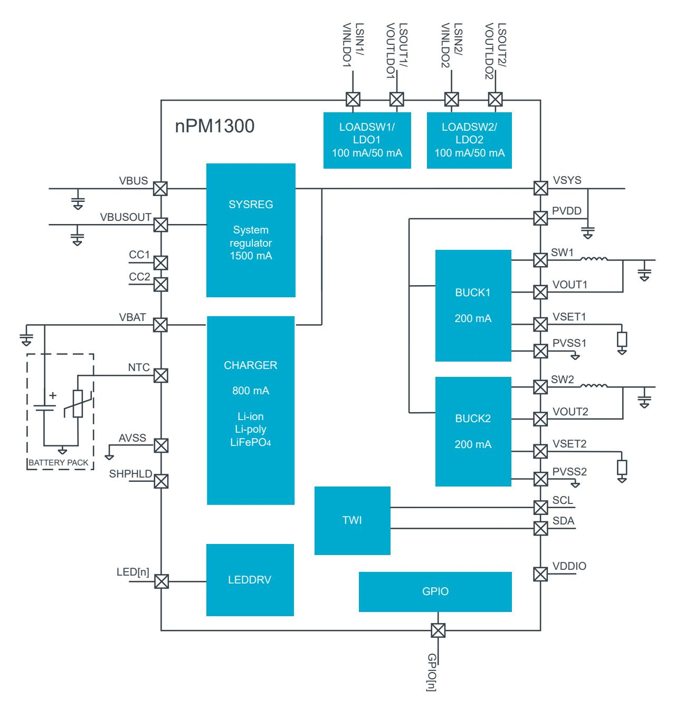

*Figure 1: nPM1300*

# Key features

#### **Features:**

- 800 mA linear battery charger
  - Linear charger for lithium-ion, lithium-polymer, and lithium iron phosphate batteries
  - Configurable charge current from 32 mA to 800 mA
  - Charging termination voltage from 3.5 V to 4.45 V
  - Configurable thermal regulation
  - JEITA compliant
  - Dynamic power-path management
- Input current limiter
  - USB Type-C compliant
  - 4.0 V to 5.5 V operational input voltage range
  - 22 V tolerant
- Two 200 mA buck regulators
  - Automatic transition between Hysteretic and pulse width modulation (PWM) modes
  - Forced PWM mode for low-ripple operation
  - Pin-selectable output voltage
- Ultra-low power, high accuracy fuel gauge tailored for embedded IoT applications
  - Battery voltage, current and temperature monitored by nPM1300
  - Nordic Fuel Gauge algorithm running on host System-on-Chip/MCU

- Two 50 mA LDO/100 mA load switches
- I 2 C compatible TWI for control and monitoring
- 10-bit ADC for system monitoring
  - Measures VBUS voltage, battery voltage, current, and die temperature
- Three pre-configured and programmable 5 mA low-side LED drivers
- Configurable timer
  - Boot monitor
  - Watchdog timer with selectable reset or power cycling
  - Wake-up timer
  - General purpose timer
- Power-fail warning (POF)
- Configurable hard reset
- General purpose GPIOs that can control BUCKs, load switches, interrupt output, reset, power fail warning, or as a general purpose I/O
- Seamless integration and code free configuration with the nPM1300 Evaluation Kit and nPM PowerUp desktop app
- Package options available:
  - 3.1x2.4 mm WLCSP package
  - 5.0x5.0 mm QFN package

#### **Applications:**

- Wearables
  - Health/fitness sensor and monitoring devices
- Computer peripherals and I/O devices
  - Mouse
  - Keyboard
  - Multi-touch trackpad
- Asset trackers

- Interactive entertainment devices
  - Remote controls
  - Gaming controllers
- IoT applications
  - Smart/low-energy sensors
  - Loggers
  - Actuator controls

4490\_483 v1.2.1 iv

# Contents

|      | nPM1300.                                                | ii  |
|------|---------------------------------------------------------|-----|
|      | Key features.                                           | iv  |
| 1    | Revision history.                                       | 8   |
| 2    | About this document.                                    | 9   |
|      | 2.1 Document status.                                    | 9   |
|      | 2.2 Core component chapters.                            | 9   |
| 3    | Product overview.                                       | 10  |
|      | 3.1 Block diagram.                                      | 10  |
|      | 3.1.1 In-circuit configurations.                        | 11  |
|      | 3.2 System description.                                 | 12  |
|      | 3.3 Power-on reset (POR) and brownout reset (BOR).      | 13  |
|      | 3.4 Supported battery types.                            | 13  |
|      | 3.5 Thermal protection.                                 | 13  |
|      | 3.6 System efficiency.                                  | 13  |
|      | 3.7 Electrical characteristics.                         | 14  |
|      | 3.8 System electrical specification.                    | 15  |
| 4    | Absolute maximum ratings.                               | 16  |
| 5    | Recommended operating conditions.                       | 17  |
|      | 5.1 Dissipation ratings.                                | 17  |
|      | 5.2 CSP light sensitivity.                              | 18  |
| 6    | Core Components.                                        | 19  |
|      | 6.1 SYSREG — System regulator.                          | 19  |
|      | 6.1.1 VBUS input current limiter.                       | 19  |
|      | 6.1.2 VBUS overvoltage protection.                      | 19  |
|      | 6.1.3 USB port detection.                               | 19  |
|      | 6.1.4 USB2.0 Selective Suspend.                         | 20  |
|      | 6.1.5 VBUSOUT.                                          | 20  |
|      | 6.1.6 Electrical specification.                         | 20  |
|      | 6.1.7 Electrical characteristics.                       | 21  |
|      | 6.1.8 Registers.                                        | 22  |
|      | 6.2 CHARGER — Battery charger.                          | 25  |
|      | 6.2.1 Charging cycle.                                   | 26  |
|      | 6.2.2 Termination voltage (VTERMSET).                   | 27  |
|      | 6.2.3 Charge current limit (ICHG).                      | 27  |
|      | 6.2.4 Monitor battery temperature.                      | 28  |
|      | 6.2.5 Charger thermal regulation.                       | 29  |
|      | 6.2.6 Charger error conditions.                         | 30  |
|      | 6.2.7 Charging status (CHG) and error indication (ERR). | 30  |
|      | 6.2.8 End-of-charge and recharge.                       | 31  |
|      | 6.2.9 Dynamic power-path management.                    | 31  |
|      | 6.2.10 Battery discharge current limit.                 | 31  |
|      | 6.2.11 Electrical specification.                        | 32  |
|      | 6.2.12 Electrical characteristics.                      | 34  |
|      | 6.2.13 Registers.                                       | 35  |
|      | 6.3 BUCK — Buck regulators.                             | 46  |
|      | 6.3.1 On/Off control.                                   | 46  |
|      | 6.3.2 Output voltage selection.                         | 46  |
|      | 6.3.3 BUCK mode selection.                              | 47  |
|      | 6.3.4 Active output capacitor discharge.                | 48  |
|      | 6.3.5 Component selection.                              | 48  |
|      | 6.3.6 Electrical specification.                         | 48  |
|      | 6.3.7 Electrical characteristics.                       | 49  |
|      | 6.3.8 Registers.                                        | 61  |
|      | 6.4 LOADSW/LDO — Load switches/LDO regulators.          | 71  |
|      | 6.4.1 Electrical specification.                         | 71  |
|      | 6.4.2 Electrical characteristics.                       | 72  |
|      | 6.4.3 Registers.                                        | 75  |
|      | 6.5 LEDDRV — LED drivers.                               | 81  |
|      | 6.5.1 Electrical specification.                         | 81  |
|      | 6.5.2 Registers.                                        | 82  |
|      | 6.6 GPIO — General purpose input/output.                | 84  |
|      | 6.6.1 Pin configuration.                                | 85  |
|      | 6.6.2 Electrical specification.                         | 86  |
|      | 6.6.3 Registers.                                        | 87  |
|   |                                                         |     |
| 7    | System features.                                        | 97  |
|      | 7.1 System Monitor.                                     | 97  |
|      | 7.1.1 Single-shot measurements.                         | 97  |
|      | 7.1.2 Automatic measurements.                           | 98  |
|      | 7.1.3 Timed measurements.                               | 98  |
|      | 7.1.4 Measurement results.                              | 98  |
|      | 7.1.5 Events and interrupts.                            | 100 |
|      | 7.1.6 Battery temperature measurement.                  | 100 |
|      | 7.1.7 Monitor battery state of charge.                  | 100 |
|      | 7.1.8 Battery current measurement.                      | 100 |
|      | 7.1.9 Electrical specification.                         | 101 |
|      | 7.1.10 Registers.                                       | 101 |
|      | 7.2 POF — Power-fail comparator.                        | 108 |
|      | 7.2.1 Electrical specification.                         | 109 |
|      | 7.2.2 Registers.                                        | 110 |
|   |                                                         |     |
|      | 7.3 TIMER — Timer/monitor.                              | 111 |
|      | 7.3.1 Boot monitor.                                     | 112 |
|      | 7.3.2 Watchdog timer.                                   | 112 |
|      | 7.3.3 Wake-up timer.                                    | 113 |
|      | 7.3.4 General purpose timer.                            | 113 |
|      | 7.3.5 Electrical specification.                         | 113 |
|      | 7.3.6 Registers.                                        | 114 |
|      | 7.4 Ship and Hibernate modes.                           | 117 |
|      | 7.4.1 Electrical specification.                         | 117 |
|      | 7.4.2 Registers.                                        | 118 |
|      | 7.5 RESET — Reset control.                              | 120 |
|      | 7.6 TWI — I2C compatible two-wire interface.            | 121 |
|      | 7.6.1 TWI timing diagram.                               | 122 |
|      | 7.6.2 Electrical specification.                         | 122 |
|      | 7.7 Event and interrupt registers.                      | 123 |
|      | 7.7.1 Registers.                                        | 123 |
|      | 7.8 Reset and error registers.                          | 145 |
|      | 7.8.1 Registers.                                        | 145 |
| 8    | Application.                                            | 148 |
|      | 8.1 Schematic.                                          | 148 |
|      | 8.2 Supplying from BUCK.                                | 148 |
|      | 8.3 USB port negotiation.                               | 149 |
|      | 8.4 Charging and error states.                          | 149 |
|      | 8.5 Termination voltage and current.                    | 149 |
|      | 8.6 NTC thermistor configuration.                       | 149 |
|      | 8.7 Ship mode.                                          | 149 |
| 9    | Hardware and layout.                                    | 150 |
|      | 9.1 Pin assignments.                                    | 150 |
|      | 9.1.1 QFN32 pin assignments.                            | 150 |
|      | 9.1.2 CSP ball assignments.                             | 152 |
|      | 9.2 Mechanical specifications.                          | 154 |
|      | 9.2.1 QFN32 package.                                    | 154 |
|      | 9.2.2 CSP package.                                      | 154 |
|      | 9.3 Reference circuitry.                                | 155 |
|      | 9.3.1 Configuration 1.                                  | 156 |
|      | 9.3.2 Configuration 2.                                  | 158 |
|      | 9.3.3 Configuration 3.                                  | 159 |
|      | 9.3.4 PCB guidelines.                                   | 161 |
|      | 9.3.5 PCB layout example.                               | 161 |
| 10   | Ordering information.                                   | 165 |
|      | 10.1 IC marking.                                        | 165 |
|      | 10.2 Box labels.                                        | 165 |
|      | 10.3 Order code.                                        | 166 |
|      | 10.4 Code ranges and values.                            | 167 |
|      | 10.5 Product options.                                   | 168 |
| 11   | Legal notices.                                          | 170 |
|      |                                                         |     |

4490\_483 v1.2.1 vi

4490\_483 v1.2.1 vii

# 1 Revision history

| Date          | Version | Description                                                                                                                                                                                                                                                                                                                                                                               |
|---------------|---------|-------------------------------------------------------------------------------------------------------------------------------------------------------------------------------------------------------------------------------------------------------------------------------------------------------------------------------------------------------------------------------------------|
| December 2025 | 1.2.1   | LOADSW/LDO – Corrected to reflect functionality                                                                                                                                                                                                                                                                                                                                           |
| March 2025    | 1.2     | The following has been added or updated: • CHARGER – Added register BCHGVBATLOWCHARGE; added information for enabling charging for low voltage batteries • LOADSW/LDO – Added value to LDSWSTATUS register • POF – Updated signal polarity; electrical specification • System Monitor – Updated equations • Battery detection has been disabled • Editorial |
| July 2024     | 1.1     | The following has been added or updated: • Battery current measurement on page 100 • Battery discharge current limit on page 31                                                                                                                                                                                                                                                     |
| October 2023  | 1.0     | First release                                                                                                                                                                                                                                                                                                                                                                             |

# 2 About this document

This document is organized into chapters that are based on the modules available in the IC.

# 2.1 Document status

The document status reflects the level of maturity of the document.

| Document name                         | Description                                                                                                                                                                                                                                                      |
|---------------------------------------|------------------------------------------------------------------------------------------------------------------------------------------------------------------------------------------------------------------------------------------------------------------|
| Objective Product Specification (OPS) | Applies to document versions up to 1.0.  This document contains target specifications for product development.                                                                                                                                             |
| Product Specification (PS)            | Applies to document versions 1.0 and higher.  This document contains final product specifications. Nordic Semiconductor ASA reserves the right to make changes at any time without notice in order to improve design and supply the best possible product. |

*Table 1: Defined document names*

# 2.2 Core component chapters

Every core component has a unique capitalized name or an abbreviation of its name, e.g. LED, used for identification and reference. This name is used in chapter headings and references, and it will appear in the C-code header file to identify the component.

The core component instance name, which is different from the core component name, is constructed using the core component name followed by a numbered postfix, starting with 0, for example, LED0. A postfix is normally only used if a core component can be instantiated more than once. The core component instance name is also used in the C-code header file to identify the core component instance.

The chapters describing core components may include the following information:

- A detailed functional description of the core component
- Register configuration for the core component
- Electrical specification tables, containing performance data which apply for the operating conditions described in [Recommended operating conditions](#page-16-2) on page 17.

# 3 Product overview

nPM1300 is a highly integrated Power Management IC (PMIC) for rechargeable applications. It is design compatible with an nRF52, nRF53, or nRF54 Series System on Chip (SoC) and nRF91 Series System in Package (SiP) for developing low-power wireless solutions.

nPM1300 has several power and system management features that can be implemented with dedicated components. Power management is achieved through flexible power regulation and a linear-mode lithium-ion (Li-ion), lithium-polymer (Li-poly), and lithium iron phosphate (LiFePO4) battery charger in a compact 3.1x2.4 mm WLCSP or 5x5 mm QFN32 package. A minimum of five passive components are required.

nPM1300 supports charging up to 800 mA and delivers up to 500 mA of adjustable regulated voltage. Power is supplied to external components from two configurable, dual mode 200 mA BUCK regulators, and two dual purpose 50 mA LDO/100 mA load switches. In addition, an unregulated power rail delivers up to 1340 mA when powered from battery, or up to 1.5 A when powered from a USB port configured as DCP.

The host can read battery temperature, voltage, and current, which are utilized by a fuel gauge algorithm in the nRF Connect Software Development Kit. The fuel gauge provides the application with a battery state-of-charge estimate comparable to Coulomb counters at a significantly lower power consumption.

Low quiescent current (IQ) extends battery life during shipping and storage with Ship mode. Battery life can also be extended during operation with auto-controlled Hysteretic mode for high efficiency down to 1 µA load currents.

The integrated system management features reduce the cost and size of applications. The following integrated features are found in the device:

- System-level watchdog
- Intelligent power-loss warning
- Ship and Hibernate modes for increased battery life
- Up to 5 GPIO pins and 3 LED drivers
- System Monitor
- Ultra-low power, high accuracy fuel gauge tailored for embedded IoT applications

System management features and I/Os are configured through an I2 C compatible two-wire Interface (TWI).

The nPM1300 Evaluation Kit provides simple evaluation and code-free configuration of nPM1300. Connecting to the nPM PowerUP app found in nRF Connect for Desktop enables the nPM1300 settings to be easily configured through an intuitive GUI and exported as code to be implemented in your MCU's application.

# 3.1 Block diagram

The block diagram illustrates the overall system.

*Figure 2: Block diagram*

## 3.1.1 In-circuit configurations

The device is configurable for different applications and battery characteristics through input pins.

The following pins must be configured before power-on reset. For the full pin list, see [Pin assignments](#page-149-1) on page 150.

| Pin             | Function                                                            | Reference                                                                             |
|-----------------|---------------------------------------------------------------------|---------------------------------------------------------------------------------------|
| <b>VDDIO</b>    | Supply for the TWI control interface and GPIOs                      | Interface supply on page 121, GPIO — General purpose input/output on page 84 |
| <b>VSET1</b>    | BUCK1 enable and VOUT1 voltage level selection at power-on reset | BUCK — Buck regulators on page 46                                                  |
| <b>VSET2</b>    | BUCK2 enable and VOUT2 voltage level selection at power-on reset | BUCK — Buck regulators on page 46                                                  |
| <b>CC1, CC2</b> | USB charger detection (USB Type-C)                                  | USB port detection on page 19                                                      |

*Table 2: In-circuit configurations*

# 3.2 System description

The device has the following core components that are described in detail in their respective chapters.

- [SYSREG System regulator](#page-18-1) on page 19
- [CHARGER Battery charger](#page-24-0) on page 25
- [BUCK Buck regulators](#page-45-0) on page 46
- [LOADSW/LDO Load switches/LDO regulators](#page-70-0) on page 71
- [LEDDRV LED drivers](#page-80-0) on page 81
- [GPIO General purpose input/output](#page-83-0) on page 84

The system regulator (SYSREG) is supplied by VBUS. It supports 4.0 V to 5.5 V for internal functions and tolerates transient voltages up to 22 V. Overvoltage protection is implemented for both internal and external circuitry. SYSREG also implements current limiting for VBUS to comply with the USB Type-C specification. SYSREG supports Type-C charger detection.

The battery charger (CHARGER) is a JEITA compliant linear battery charger for lithium-ion (Li-ion), lithiumpolymer (Li-poly), and lithium iron phosphate (LiFePO4) batteries. CHARGER controls the charge cycle using a standard Li-ion charge profile. CHARGER implements dynamic power-path management regulating current in and out of the battery, depending on system requirements, to ensure immediate system operation from **VBUS** if the battery is depleted. Safety features, such as [battery temperature monitoring](#page-27-0) and [charger thermal regulation](#page-28-0) are supported.

Two independent, highly efficient buck regulators (BUCK) supply the application circuitry and offer several output voltage options. BUCK is controlled through registers or GPIO pins. Default output voltage can be set with external resistors.

The two load switches (LOADSW/LDO) can function as switches or linear voltage regulators to complement the power distribution network. LOADSW/LDO is controlled through registers or GPIO pins.

The System Monitor provides measurements for battery voltage, battery current, VBUS, battery, and die temperature.

GPIO has the following configurable features:

- General purpose input
- Control input
- Output
- BUCK[n] control
- LOADSW[n] control

# NORDIC®

### SEMICONDUCTOR

The device also features [Ship and Hibernate modes](#page-116-0), the lowest quiescent current states. They disconnect the battery from the system and reduce the quiescent current of the device to extend battery life. Hibernate mode can be utilized during normal operation as the device can autonomously wake-up after a preconfigured timeout. This makes it possible to extend battery life to the maximum capacity.

# 3.3 Power-on reset (POR) and brownout reset (BOR)

The device is supplied by **VBUS** or **VBAT**.

When one of the following conditions are met, a power-on reset (POR) occurs.

- **VBUS** > [VBUS](#page-19-2)POR
- **VBAT** > [VBAT](#page-31-0)POR

When both of the following conditions are met, a brownout reset (BOR) occurs.

- **VBUS** < [VBUS](#page-19-2)BOR
- **VBAT** < [VBAT](#page-31-0)BOR

# 3.4 Supported battery types

The charger supports rechargeable Li-ion, Li-polymer, or LiFePO4 batteries.

Battery packs connected to the **VBAT** pin must contain the following protection circuitry:

- Overvoltage protection
- Undervoltage protection
- Overcurrent discharge protection
- Thermal fuse to protect from overtemperature (if NTC thermistor is not present)

# 3.5 Thermal protection

A global thermal shutdown is triggered when the die temperature exceeds the operating temperature range, see [TSD](#page-14-0). All device functions are disabled in thermal shutdown. The device functions are re-enabled when the temperature is sufficiently reduced according to a hysteresis [TSD](#page-14-0)HYST. The die temperature limit is only monitored when charging is enabled or when a BUCK is enabled and is in PWM mode.

A secondary mechanism disables the charger when the die reaches the host software programmable temperature of [DIETEMPSTOP](#page-41-0) on page 42 . Once this temperature is reached, charging stops but all other functionality remains active. Charging restarts when the die temperature reaches the host software programmable temperature of [DIETEMPRESUME](#page-42-0) on page 43.

# 3.6 System efficiency

Shown here is the characterization of the power path system efficiency under different load current conditions.

In the following figure, the load current is swept from 100 nA to 200 mA and back to capture mode change hysteresis.

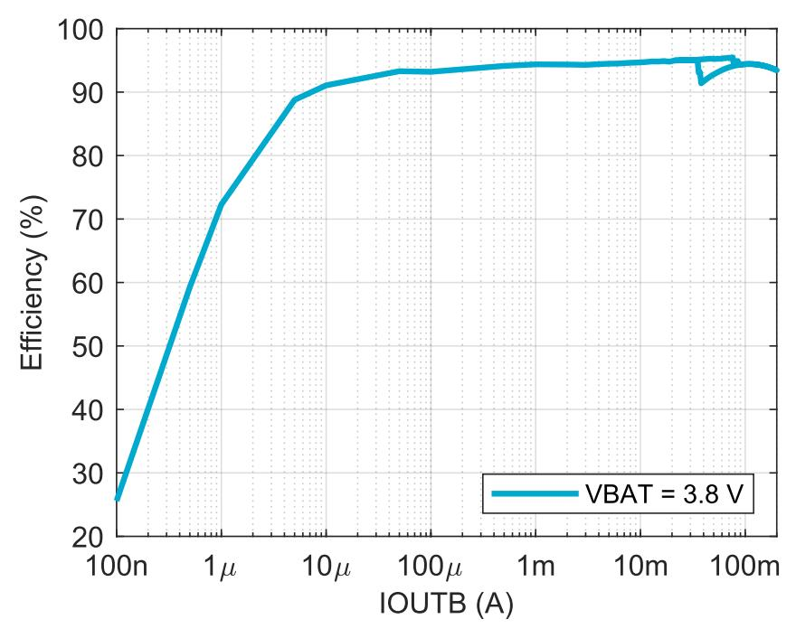

*Figure 3: VOUT = 3.3 V system efficiency, MODE = AUTO, VIN = 3.8 V*

# 3.7 Electrical characteristics

The following graphs show quiescent current characteristics.

*Figure 4: SHIP mode current vs. junction temperature*

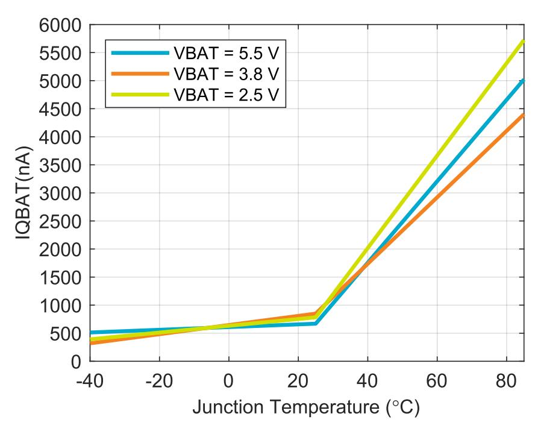

*Figure 5: Discharge mode current vs. junction temperature*

# 3.8 System electrical specification

| Symbol  | Description                                                                 | Min. | Typ. | Max. | Unit |
|---------|-----------------------------------------------------------------------------|------|------|------|------|
| IQSHIP  | Ship mode quiescent current                                                 |      | 370  |      | nA   |
| IQSHIPT | Hibernate mode quiescent current                                         |      | 500  |      | nA   |
| IQBAT   | Quiescent current, battery operation, no BUCK load, VBUS disconnected |      | 800  |      | nA   |
| TSD     | Thermal shutdown threshold                                               |      | 120  |      | °C   |
| TSDHYST | Thermal shutdown hysteresis                                              |      | 20   |      | °C   |

*Table 3: System electrical specification*

# 4 Absolute maximum ratings

Maximum ratings are the extreme limits to which the device can be exposed for a limited amount of time without permanently damaging it. Exposure to absolute maximum ratings for prolonged periods of time may affect the reliability of the device.

| Pin                                                                                                                                                                    | Note                                                         | Min. | Max.      | Unit |
|------------------------------------------------------------------------------------------------------------------------------------------------------------------------|--------------------------------------------------------------|------|-----------|------|
| VBUS                                                                                                                                                                   | Power (relative to pins AVSS, PVSS1, and PVSS2)        | -0.3 | 22        | V    |
| VBAT, VSYS, PVDD, VDDIO                                                                                                                                                | Power (relative to pins AVSS, PVSS1, and PVSS2)        | -0.3 | 5.5       | V    |
| NTC, CC1, CC2, SHPHLD, LED0, LED1, LED2, LSIN1/VINLDO1, LSOUT1/VOUTLDO1, LSIN2/ VINLDO2, LSOUT2/VOUTLDO2, VSET1, VSET2, VBUSOUT, VOUT1, VOUT2, SW1, SW2 | Analog pins (relative to pins AVSS, PVSS1, and PVSS2)  | -0.3 | 5.5       | V    |
| GPIO[04], SDA, SCL                                                                                                                                                     | Digital pins (relative to pins AVSS, PVSS1, and PVSS2) | -0.3 | VDDIO+0.3 | V    |

*Table 4: Absolute maximum ratings*

|                        | Note                       | Min. | Max. | Unit |
|------------------------|----------------------------|------|------|------|
| Storage temperature |                            | -40  | +125 | °C   |
| MSL QFN                | Moisture sensitivity level |      | 2    |      |
| MSL CSP                | Moisture sensitivity level |      | 1    |      |
| ESD HBM                | Human Body Model Class 2   |      | 2    | kV   |
| ESD CDM                | Charged Device Model       |      | 500  | V    |

*Table 5: Environmental ratings*

# 5 Recommended operating conditions

The operating conditions are the physical parameters that the chip can operate within.

| Symbol | Description          | Min. | Max  | Unit |
|--------|----------------------|------|------|------|
| VBUSOP | Supply voltage       | 4.0  | 5.5  | V    |
| VBATOP | Battery voltage      | 2.3  | 4.45 | V    |
| VDDIO  | I/O supply voltage   | 1.7  | VSYS | V    |
| TJ     | Junction temperature | -40  | +125 | °C   |
| TA     | Ambient temperature  | -40  | +85  | °C   |

*Table 6: Recommended operating conditions*

**Note:** Any system features powered by VSYS will only operate when the VSYS voltage > VSYSPOF.

# 5.1 Dissipation ratings

Thermal resistances and thermal characterization parameters as defined by JESD51-7 are shown in the following tables.

| Symbol               | Parameter                                    | QFN 32 pins | Units |
|----------------------|----------------------------------------------|-------------|-------|
| $R_{\Theta JA}$      | Junction-to-ambient thermal resistance       | 24.2        | °C/W  |
| $R_{\Theta JC(top)}$ | Junction-to-case (top) thermal resistance    | 10.7        | °C/W  |
| $R_{\Theta JB}$      | Junction-to-board thermal resistance         | 8.8         | °C/W  |
| $\Psi_{JT}$          | Junction-to-top characterization parameter   | 0.15        | °C/W  |
| $\Psi_{JB}$          | Junction-to-board characterization parameter | 8.9         | °C/W  |

*Table 7: QFN32 thermal resistance and characterization parameters*

| Symbol    | Parameter                                    | CSP 35 pins | Units |
|-----------|----------------------------------------------|-------------|-------|
| RϴJA      | Junction-to-ambient thermal resistance       | 48.3        | °C/W  |
| RϴJC(top) | Junction-to-case (top) thermal resistance    | 6.0         | °C/W  |
| RϴJB      | Junction-to-board thermal resistance         | 23.0        | °C/W  |
| ΨJT       | Junction-to-top characterization parameter   | 0.5         | °C/W  |
| ΨJB       | Junction-to-board characterization parameter | 23.4        | °C/W  |

*Table 8: CSP thermal resistance and characterization parameters*

# 5.2 CSP light sensitivity

The CSP package is sensitive to light.

All CSP package variants are sensitive to visible and close-range infrared light. The final product design must shield the chip through encapsulation or shielding/coating the CSP device.

CSP package variant CAAA has a backside coating that covers the marking side of the device with a light absorbing film. The side edges and the ball side of the device are still exposed and need to be protected.

# 6 Core Components

# 6.1 SYSREG — System regulator

VBUS supplies the input voltage to the system regulator (SYSREG). VBUS voltage is supplied by an AC wall adapter or a USB port.

SYSREG supplies VSYS.

Features of SYSREG are the following:

- Operating voltage up to 5.5 V
- Overvoltage protection to 22 V
- Undervoltage detection
- USB port detection and a current limiter to comply with the USB specification
- Provides **VBUSOUT** voltage for host devices

## 6.1.1 VBUS input current limiter

The VBUS input current limiter manages VBUS current limitation and charger detection for USB Type-C compatible chargers.

It supplies **VSYS** but does not regulate its voltage. VBUS voltage is seen at **VSYS** as a supply, if the VBUS voltage is within specified limits and higher than VBAT by at least [VBUS](#page-20-1)VALID.

There are two USB compliant, accurate current limits: [IBUS](#page-19-2)100MA (100 mA) and [IBUS](#page-19-2)500MA (500 mA).

In addition, there are current limits in 100 mA steps from 600 mA to 1500 mA. The 1500 mA limit is compatible with USB Type-C.

The default current limit is IBUS100MA (100 mA). Host software can configure the current in register [VBUSINILIM0](#page-22-0) on page 23. When TASK.UPDATE.ILIMSW is written, VBUSIN.LIM0 takes effect.

## 6.1.2 VBUS overvoltage protection

The overvoltage threshold for **VBUS** is [VBUS](#page-19-2)OVP. The undervoltage threshold for **VBUS** is [VBUS](#page-19-2)MIN.

SYSREG is disabled when VBUSvoltage is above the overvoltage threshold [VBUS](#page-19-2)OVP, or below the undervoltage threshold [VBUS](#page-19-2)MIN. This isolates **VBUS** and prevents current flowing from **VSYS** to **VBUS**.

## 6.1.3 USB port detection

USB charger detection is performed through pins **CC1** and **CC2**. These pins must be connected directly to the USB connector for detection to happen.

These pins have internal pull-downs with resistance equal to [R](#page-19-2)d.

When the device is plugged into a wall adaptor or USB power source, USB port detection runs automatically. One of the CC lines is connected to a pull-up at the source. The other CC line stays pulled down. The voltage over the corresponding Rd determines if a connection was made and if SYSREG can deliver 500 mA or higher current.

Comparators with thresholds at V[RDCONN](#page-19-2), V[RD1A5](#page-19-2), and V[RD3A](#page-19-2) monitor CC line voltage when VBUS is present. All comparator output is debounced with t[RDDEB](#page-19-2) and available to host software through register [USBCDETECTSTATUS](#page-23-0) on page 24.

If enabled, an interrupt is issued to the host whenever a threshold is crossed (when voltage decreases or increases). The events are visible in register [EVENTSVBUSIN1SET](#page-139-0) on page 140.

The USB power source capability is detected by one CC line at a time, depending on the orientation of the USB plug on the device. The other CC line remains at 0 V. The charger type is defined in the VBUSIN.CC1CMP or VBUSIN.CC2CMP field, depending on which pin is used for connection.

The default VBUS current limit of 100 mA is used until the power source capability is detected. Host software can update the VBUS current limit in [VBUSINILIM0](#page-22-0) on page 23 after device detection. When a USB cable is unplugged and plugged back in, or a reset occurs, the default current limit is used.

When TASK.UPDATE.ILIMSW is written, VBUSIN.LIM0 takes effect. The VBUS current limit reverts to its default value (100 mA) when the following occur:

- A reset
- The USB cable is unplugged and plugged back in

If USB Type-C configuration is not used, **CC1** and **CC2** can be left floating or connected to ground. The default VBUS current limit will remain at 100 mA until the host negotiates and configures a higher current.

**Note:** Overvoltage or undervoltage events may occur when connecting or removing a supply to **VBUS**.

## 6.1.4 USB2.0 Selective Suspend

The device can satisfy USB2.0 Selective Suspend mode current consumption through configuration. It must be informed by host software through the TWI in register [VBUSSUSPEND](#page-23-1) on page 24 to minimize current consumption from VBUS to I[SUSP](#page-19-2).

The current consumed through pin **VBUSOUT** is not included. VBUS is disconnected from VSYS but VBUSOUT remains active. As a consequence, charging is paused. The device exits this mode only when instructed by the host software through a TWI command. Charging resumes automatically.

## 6.1.5 VBUSOUT

The device supplies **VBUSOUT** voltage when **VBUS** voltage is present and higher than VBAT by at least [VBUS](#page-20-1)VALID.

**VBUSOUT** provides overvoltage and undervoltage protection for safe connection to the nRF device. Designs using the **VBUSOUT** pin as a supply must make sure the voltage level complies with the nRF device due to output resistance R[VBUSOUT](#page-19-2). When USB is suspended, the combined current for nPM1300 and the **VBUSOUT** pin must be within the allowed USB suspend current.

**VBUSOUT** must have a decoupling capacitor.

## 6.1.6 Electrical specification

| Symbol     | Description                                                                     | Min. | Typ. | Max. | Unit |
|------------|---------------------------------------------------------------------------------|------|------|------|------|
| VBUSOVP    | Overvoltage protection threshold                                                |      | 5.5  |      | V    |
| VBUSVALIDR | VBUS valid threshold, VBUS - VBAT, VBUS rising                               |      | 210  |      | mV   |
| VBUSVALIDF | VBUS valid threshold, VBUS - VBAT, VBUS falling or VBAT rising               |      | 160  |      | mV   |
| VBUSPOR    | Power-on reset release voltage for VBUS                                         |      | 3.9  |      | V    |
| VBUSBOR    | Brownout reset trigger for VBUS with VBAT not present                        |      | 3.8  |      | V    |
| VBUSMIN    | Undervoltage threshold with VBAT present                                        |      | 3.6  |      | V    |
| IBUS100MA  | VBUS input current limit, 100 mA 1                                              |      |      | 95   | mA   |
| IBUS500MA  | VBUS input current limit, 500 mA 1                                              |      |      | 495  | mA   |
| IBUSLIMACC | Accuracy of IBUS current limit (steps from 600 to 1500 mA)1                  | -10  |      | +10  | %    |
| ISUSP      | VBUS current consumption in suspend mode Current from VBUSOUT is excluded |      | 1.8  |      | mA   |
| RON        | Resistance between VBUS and VSYS VBUSINLIM0 = 15 (1.5 A) VBUS = 5 V       |      | 300  |      | mΩ   |
| RVBUSOUT   | On resistance of the VBUSOUT switch VBUS = 5.0 V                             |      | 7.5  |      | Ω    |
| Rd         | Pull-down resistance on pins CC1 and CC2                                        |      | 5.1  |      | kΩ   |
| VRDCONN    | Threshold to detect connection                                                  |      | 0.2  |      | V    |
| VRD1A5     | Threshold to detect charger type on CC1 or CC2 pins                          |      | 0.66 |      | V    |
| VRD3A      | Threshold for 3 A current limit                                                 |      | 1.23 |      | V    |
| tRDDEB     | Debounce time for CC voltage level detection                                 |      | 15   |      | ms   |

*Table 9: SYSREG electrical specification*

## 6.1.7 Electrical characteristics

The following graphs show typical electrical characteristics for VBUSIN.

1 Includes internal device consumption and current flowing through pin **VBUSOUT**.

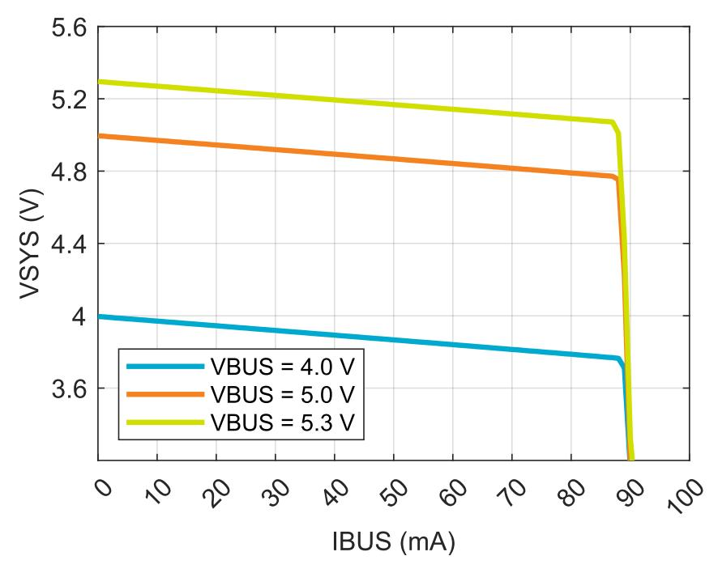

*Figure 6: VSYS voltage vs. VBUS current, ILIM = 100 mA*

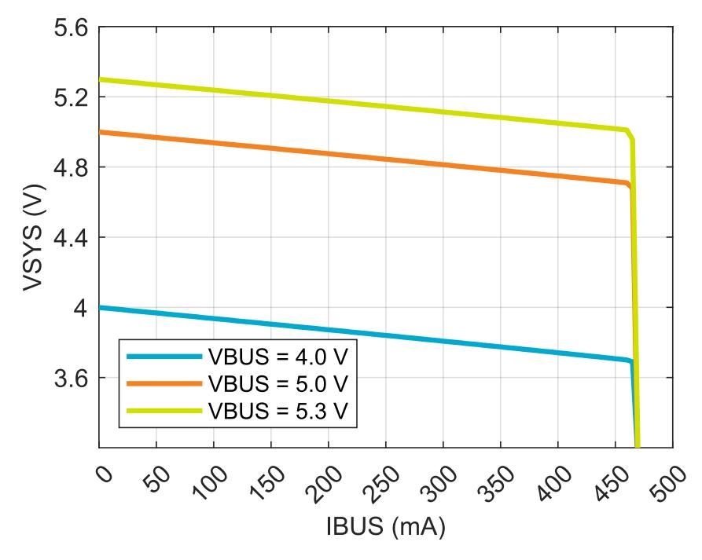

*Figure 7: VSYS voltage vs. VBUS current, ILIM = 500 mA*

## 6.1.8 Registers

## **Instances**

| Instance | Base address | Description         |
|----------|--------------|---------------------|
| VBUSIN   | 0x00000200   | VBUSIN registers    |
|          |              | VBUSIN register map |

## **Register overview**

| Register          | Offset | Description                                                                                                             |
|-------------------|--------|-------------------------------------------------------------------------------------------------------------------------|
| TASKUPDATEILIMSW  | 0x0    | Select input current limit                                                                                              |
| VBUSINILIM0       | 0x1    | Configure input current limit NOTE: Reset value from OTP, value listed in this table may not be correct.             |
| VBUSINILIMSTARTUP | 0x2    | Configure input current limit for startup NOTE: Reset value from OTP, value listed in this table may not be correct. |
| VBUSSUSPEND       | 0x3    | Enable suspend mode                                                                                                     |
| USBCDETECTSTATUS  | 0x5    | Status of charger detection                                                                                             |
| VBUSINSTATUS      | 0x7    | Status register                                                                                                         |

### 6.1.8.1 TASKUPDATEILIMSW

Address offset: 0x0

Select input current limit

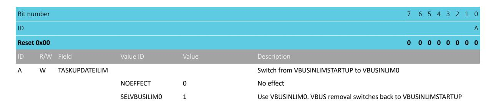

### 6.1.8.2 VBUSINILIM0

Address offset: 0x1

Configure input current limit NOTE: Reset value from OTP, value listed in this table may not be correct.

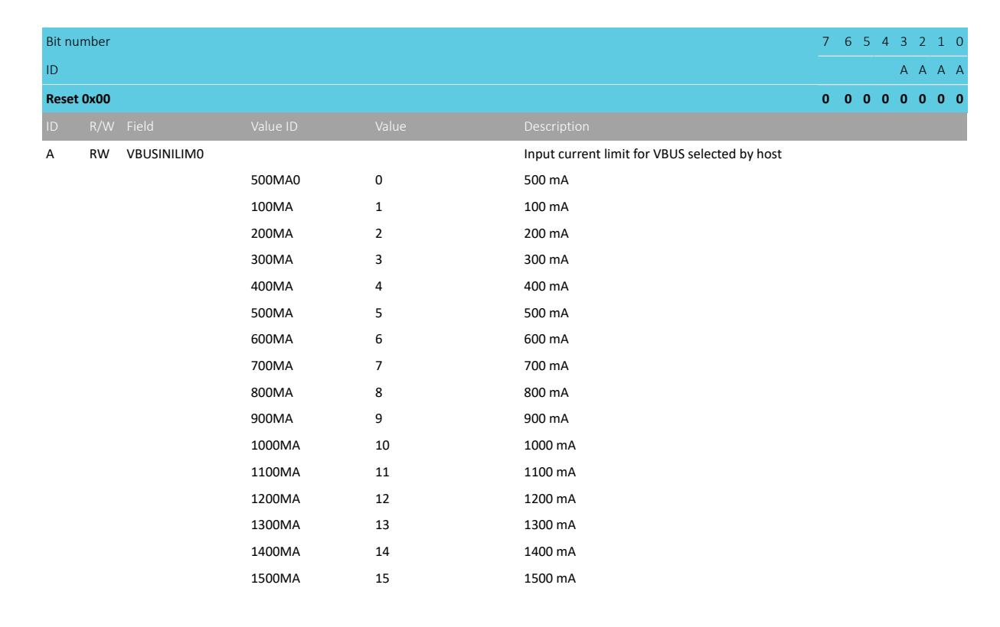

## 6.1.8.3 VBUSINILIMSTARTUP

Address offset: 0x2

Configure input current limit for startup NOTE: Reset value from OTP, value listed in this table may not be correct.

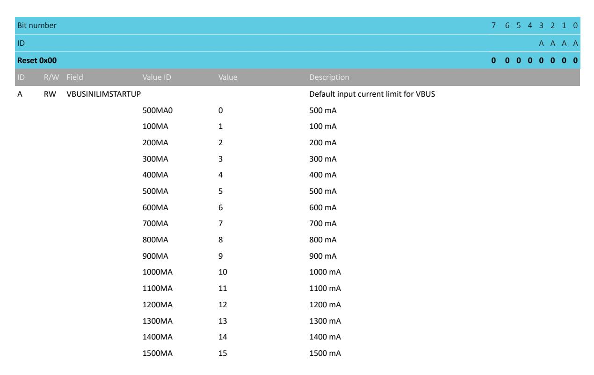

## 6.1.8.4 VBUSSUSPEND

Address offset: 0x3 Enable suspend mode

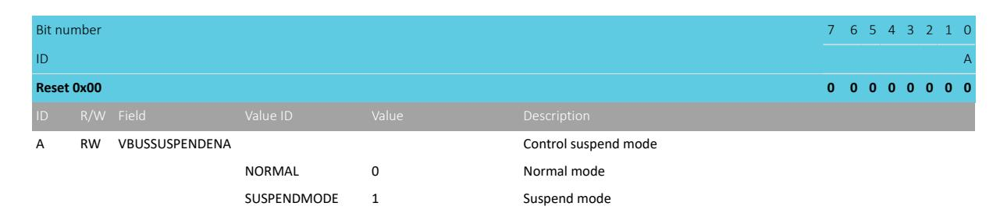

## 6.1.8.5 USBCDETECTSTATUS

Address offset: 0x5

Status of charger detection

## 6.1.8.6 VBUSINSTATUS

Address offset: 0x7

Status register

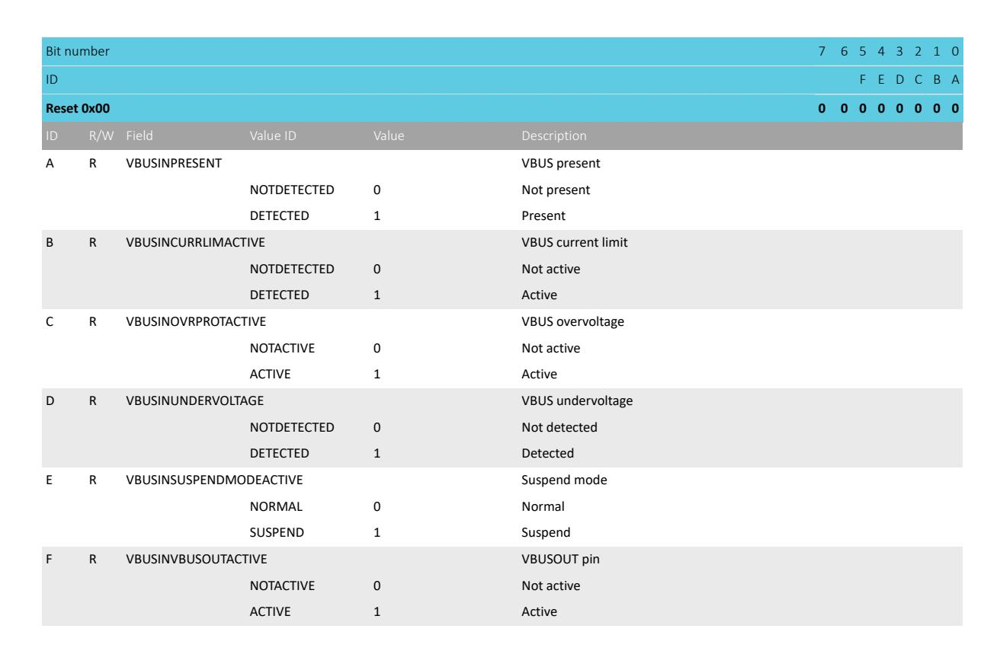

# 6.2 CHARGER — Battery charger

The battery charger is suitable for general purpose applications with lithium-ion (Li-ion), lithium-polymer (Li-poly), and lithium iron phosphate (LiFePO4) batteries. The following sections describe how to configure CHARGER to match the battery type.

The main features of the battery charger are the following:

- Linear charger for Li-ion, Li-poly, and LiFePO4 battery chemistries
- Bidirectional power FET for dynamic power-path management

# NORDIC®

## SEMICONDUCTOR

- Automatic trickle, constant current, constant voltage, and end-of-charge/recharge cycle
- Maintains **VBUS** current below programmed limit
- JEITA compliant with a configurable battery charging temperature profile

Charging is configured and enabled through host software. The voltage and charging current are configurable and the device manages the charging cycle after the charging parameters are defined.

V[TERM](#page-26-0) must be set to a lower voltage than the battery overvoltage protection.

## 6.2.1 Charging cycle

Host software enables charging through register [BCHGENABLESET](#page-36-0) on page 37. Battery charging starts when **VBUS** voltage is present and higher than VBAT by at least [VBUS](#page-20-1)VALIDR. Charging stops in case VBUS-VBAT is less than [VBUS](#page-20-1)VALIDF either because VBUS drops or VBAT rises. Once charging has started, host software must use register [EVENTSBCHARGER0CLR](#page-127-0) on page 128 to initialize battery charger events.

When charging is enabled, charging will not start if the battery voltage is less than [VBAT](#page-32-0)LOW. Charging batteries with a voltage lower than [VBAT](#page-32-0)LOW is enabled by setting register [BCHGVBATLOWCHARGE](#page-44-0) on page 45. When charging starts, it enters trickle charging. Constant current charging starts when the battery voltage is above V[TRICKLE\\_FAST](#page-32-0). After the battery voltage reaches V[TERM](#page-26-0), the charger enters constant voltage charging. The battery voltage is maintained while monitoring current flow into the battery. When the current into the battery drops below I[TERM](#page-32-0), charging is complete. Charging is disabled using register [BCHGENABLECLR](#page-36-1) on page 37.

If charging is enabled on a fully charged battery, up to 100 ms of trickle charge and up to 4 ms of constant current charging is applied.

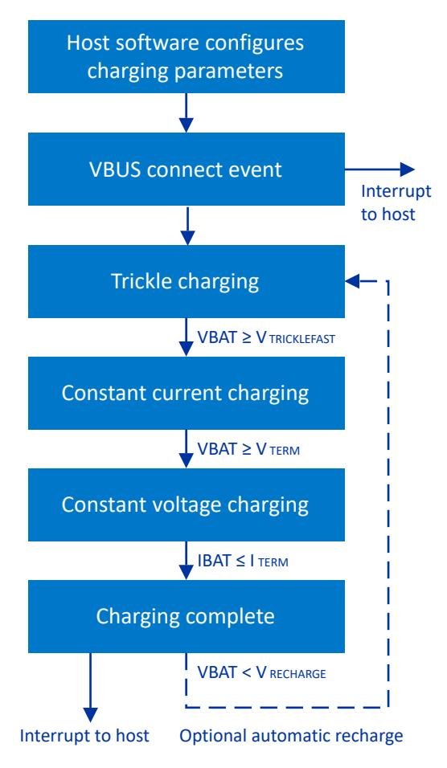

*Figure 8: Charging cycle flow chart*

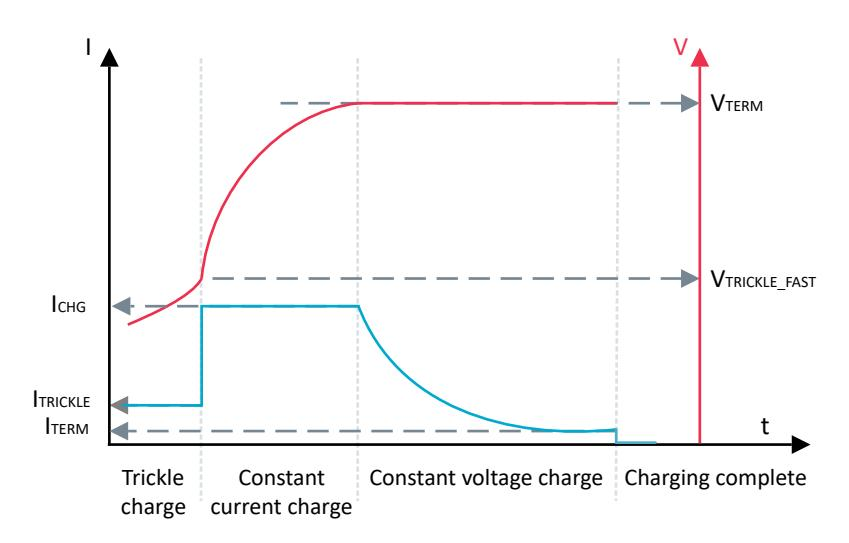

*Figure 9: Charging cycle*

**Note:** Events [EVENTBATDETECTED](#page-132-0) and [EVENTBATLOST](#page-132-0) and status bit [BATTERYDETECTED](#page-43-0) are not available.

**Note:** When attempting to start charging when VBUS is present but no battery is connected, the host software will see repeated charger events (such as [EVENTCHGCOMPLETED](#page-129-0)).

## 6.2.2 Termination voltage (VTERMSET)

VTERM is configured through TWI according to the battery type in use, see register [BCHGVTERM](#page-38-0) on page 39.

For a higher battery temperature range, a lower termination voltage (VTERMR) is available and configured separately in register [BCHGVTERMR](#page-39-0) on page 40. VTERM and VTERMR can be set to the same value.

## 6.2.3 Charge current limit (ICHG)

The charge current limit is set between 32 mA and 800 mA in 2 mA steps. Charging current ICHG is configured with TWI with a default value of 32 mA.

**Note:** Do not configure the charge current outside this range as it can lead to device instability.

CHARGER must be disabled before changing the current setting in registers [BCHGISETMSB](#page-37-0) on page 38 and [BCHGISETLSB](#page-37-1) on page 38. The setting takes effect when charging is enabled.

The charge current is configured using a 9-bit value. The following shows how the register value for [BCHGISETMSB](#page-37-0) on page 38 can be calculated, where ICHG is the charge current in mA:

$$I_{\text{SETMSB}} = \text{floor}\left(\frac{I_{\text{CHG}}}{4}\right)$$

The following shows how the register value for [BCHGISETLSB](#page-37-1) on page 38 can be calculated, where ICHG is the charge current in mA:

$$I_{\text{SETLSB}} = \begin{cases} 1, & \frac{I_{\text{CHG}}}{2} \text{ is odd} \\ 0, & \frac{I_{\text{CHG}}}{2} \text{ is even} \end{cases}$$

Some example charging currents are found in the following table.

| ICHG   | BCHGISETMSB | BCHGISETLSB |
|--------|-------------|-------------|
| 32 mA  | 8           | 0           |
| 34 mA  | 8           | 1           |
| 400 mA | 100         | 0           |
| 800 mA | 200         | 0           |

*Table 10: Charging current*

Trickle charging current, ITRICKLE, is 10% of ICHG. Trickle charging is active when VBAT < VTRICKLE\_FAST (default 2.9 V).

Termination current, ITERM, is programmable to 10% (default) or 20% of ICHG. Termination current is active in the constant voltage phase of charging. Charging stops when the charging current reaches this value.

These parameters are configured in registers [BCHGVTRICKLESEL](#page-39-1) on page 40 and [BCHGITERMSEL](#page-39-2) on page 40.

## 6.2.4 Monitor battery temperature

CHARGER supports three types of NTC thermistors for battery temperature (TBAT) monitoring. Only one can be enabled at a time.

The host software must select the corresponding setting that matches the battery thermistor before enabling charging in register [ADCNTCRSEL](#page-103-0) on page 104. The following thermistor resistors are supported.

| Nominal resistance | Resistance accuracy | B25/50 | Beta accuracy | B25/85      |
|--------------------|------------------------|--------|---------------|-------------|
| 10 kΩ              | 1%                     | 3380 K | 1%            | 3434/3435 K |
| 47 kΩ              | 1%                     | 4050 K | 1%            | 4108 K      |
| 100 kΩ             | 1%                     | 4250 K | 1%            | 4311 K      |

*Table 11: Supported thermistor resistors*

**Note:** If a capacitor is placed in parallel with the thermistor, the max capacitance is 100 pF.

If a thermistor is not used, the **NTC** pin must be tied directly to ground or through a resistor. The functionality must be disabled in register [BCHGDISABLESET](#page-36-2) on page 37. This does not impact [Charger](#page-28-0) [thermal regulation](#page-28-0) on page 29.

The following battery temperature thresholds can be set: TCOLD ≤ TCOOL ≤ TWARM ≤ THOT.

These limits can be set between −20°C and +60°C, and setting adjacent thresholds to identical values is allowed. For example, setting TWARM = THOT means that there is no warm region. Charging does not happen below TCOLD or above THOT. Charging can be paused at TWARM instead of THOT by setting register [BCHGCONFIG](#page-44-1) on page 45.

The thresholds are written into corresponding registers. The battery temperature variable, KNTCTEMP, is calculated using the following equation:

$$K_{\text{NTCTEMP}} = \text{round}\left(1024 \cdot \frac{R_{\text{T}}}{R_{\text{T}} + R_{\text{B}}}\right)$$

Here, RT is the thermistor resistance at a desired temperature and RB (internal bias resistor) equals the thermistor resistance at 25°C. See [NTCCOLD](#page-40-0) on page 41, [NTCCOOL](#page-40-1) on page 41, [NTCWARM](#page-41-1) on page 42, and [NTCHOT](#page-41-2) on page 42 for more information. Default values in the registers match the JEITA guideline and are intended for the 10 kΩ thermistor defined in [Supported thermistor resistors](#page-27-1) on page 28.

| Temp. | 10 kΩ | 47 kΩ | 100 kΩ | Register |
|-------|-------|-------|--------|----------|
| 0°C   | 749   | 787   | 799    | NTCCOLD  |
| 10°C  | 658   | 684   | 693    | NTCCOOL  |
| 45°C  | 337   | 306   | 297    | NTCWARM  |
| 60°C  | 237   | 197   | 186    | NTCHOT   |

*Table 12: Battery temperature default values*

The charging current can be reduced by 50% between NTCCOLD and NTCCOOL. The termination voltage can be configured independently between NTCWARM and NTCHOT. Default is ICOOL (50% of ICHG), but this can be disabled.

| Temperature region | Temperature limits, default setting                  | Charge current       | Termination voltage |
|-----------------------|------------------------------------------------------|----------------------|------------------------|
| Cold                  | $T_{BAT} < T_{COLD}$ $T_{COLD} = 0°C$             | 0 (OFF)              | N/A                    |
| Cool                  | $T_{COLD} < T_{BAT} < T_{COOL}$ $T_{COOL} = 10°C$ | $I_{COOL} / I_{CHG}$ | $V_{TERM}$             |
| Nominal               | $T_{COOL} < T_{BAT} < T_{WARM}$ $T_{WARM} = 45°C$ | $I_{CHG}$            | $V_{TERM}$             |
| Warm                  | $T_{WARM} < T_{BAT} < T_{HOT}$ $T_{HOT} = 60°C$   | $I_{CHG}$            | $V_{TERMR}$            |
| Hot                   | $T_{BAT} > T_{HOT}$                                  | 0 (OFF)              | N/A                    |

*Table 13: Battery temperature regions*

Battery temperature is measured by the on-chip System Monitor at regular intervals during charging. The latest result is available in registers [ADCNTCRESULTMSB](#page-104-0) on page 105 and [ADCGP0RESULTLSBS](#page-105-0) on page 106.

When the battery temperature rises over TWARM or THOT, or falls below TCOOL or TCOLD, an interrupt is sent.

## 6.2.5 Charger thermal regulation

Heat dissipation from the linear charger is managed by setting a maximum temperature limit for the die. This limit must not exceed device and PCB temperature requirements.

To enable automatic thermistor and die temperature monitoring during charging, set register [TASKAUTOTIMUPDATE](#page-104-1) on page 105. This should also be set after setting the automated period.

Die temperature monitoring has a default limit of T[CHGSTOP](#page-31-0). Charging stops when the die temperature reaches the limit. It resumes when the die cools down to T[CHGRESUME](#page-31-0).

TCHGSTOP controls the junction temperature rise and limits the temperature rise on the PCB and device mechanics. The device can be configured to send an interrupt when the limit is met.

The die temperature variable, KDIETEMP, is calculated with the following equation:

$$K_{\text{DIETEMP}} = \text{round}\left(\frac{394.67^{\circ}\text{C} - T_{\text{D}}}{0.7926}\right)$$

Here, TD represents the die temperature limit in degrees Celsius.

Registers [DIETEMPSTOP](#page-41-0) on page 42 and [DIETEMPSTOPLSB](#page-42-1) on page 43 are concatenated to create a 10-bit value that defines the charging stop temperature T[CHGSTOP](#page-31-0). Registers [DIETEMPRESUME](#page-42-0) on page 43 and [DIETEMPRESUMELSB](#page-42-2) on page 43 are concatenated to create a 10-bit value that defines the charging resume temperature T[CHGRESUME](#page-31-0). The host software reads register [DIETEMPSTATUS](#page-43-1) on page 44 to determine if the die temperature is above TCHGSTOP.

The following table consists of die temperature value examples.

| KDIETEMP | TD    |
|----------|-------|
| 435      | 50°C  |
| 422      | 60°C  |
| 410      | 70°C  |
| 397      | 80°C  |
| 384      | 90°C  |
| 372      | 100°C |
| 359      | 110°C |

*Table 14: Die temperature example*

## 6.2.6 Charger error conditions

A CHARGER error condition occurs when one of the following are present:

- Trickle charge timeout, see t[OUTTRICKLE](#page-32-0)
- Safety timer expires, see t[OUTCHARGE](#page-32-0)

After an error is detected, charging is disabled. The charging error indication is activated and the charging indication is deactivated. Error conditions are cleared when **VBUS** is disconnected and reconnected again.

Errors are reported in register [BCHGERRREASON](#page-43-2) on page 44 and [BCHGERRSENSOR](#page-44-2) on page 45. Host software clears errors with register [TASKCLEARCHGERR](#page-35-0) on page 36 and releases the charger from the error state with register [TASKRELEASEERR](#page-35-1) on page 36.

When the safety timer expires, the host must make sure it is safe to charge before resetting register [TASKCLEARSAFETYTIMER](#page-35-2) on page 36.

## 6.2.7 Charging status (CHG) and error indication (ERR)

When CHARGER is enabled and the LEDs are configured, the LEDs indicate the charging status.

The **LED[n]** pins sink 5 mA of current when active. They are high impedance when disabled. This is suitable for driving LEDs or connecting to host GPIOs in a weak pull-up configuration. The LED anode must be connected to a voltage rail that allows forward bias. If a general purpose open drain output is needed,

the LED pins can be used with a pull-up resistor connected to a voltage rail. See [LEDDRV — LED drivers](#page-80-0) on page 81 for more information.

## **Charging status**

Charging status is available in register [BCHGCHARGESTATUS](#page-43-0) on page 44.

LED drivers are configured through TWI to indicate if charging is active or charging is complete.

The charging indication turns off when charging is complete. It turns on when charging starts. The charging indication is off when CHARGER is disabled temporarily due to die temperature exceeding the configured limit.

The charging indication is off when battery temperature is below cold or above hot thresholds. No error is indicated in these cases. The charging indication is off when VBUS > [VBUS](#page-31-0)OVP and no error is indicated.

## **Error indications**

Errors are reported in register [BCHGERRREASON](#page-43-2) on page 44 and [BCHGERRSENSOR](#page-44-2) on page 45.

## 6.2.8 End-of-charge and recharge

Charging terminates automatically when the battery voltage reaches V[TERM](#page-31-0) and charging current is less than I[TERM](#page-31-0). An interrupt is issued to the host.

Unless disabled through bit [DISABLE.RECHARGE,](#page-36-2) charging restarts automatically when VBAT is less than V[RECHARGE](#page-31-0) and an interrupt is sent to the host.

## 6.2.9 Dynamic power-path management

CHARGER manages battery current flow to maintain **VSYS** voltage.

The battery is isolated when **VBUS** is connected and the battery is fully charged. Under this condition, **VBUS** supplies **VSYS**. When **VBUS** is disconnected, CHARGER supplies **VSYS** from **VBAT**.

The system load requirements are prioritized over battery charge current when **VBUS** is connected and the battery is charging. During charging, if the system current load exceeds [IBUS](#page-19-2)LIM, the battery charge current decreases to maintain the **VSYS** voltage. CHARGER reduces the current to maintain an internal voltage of V[CHDROPOUT](#page-31-0) above the **VBAT** voltage. If more current is required, CHARGER enters supplement state to provide current from the battery, up to [IBAT](#page-31-0)LIM.

**Note:** VSYS must not be supplied from an external source.

## 6.2.10 Battery discharge current limit

There are two selectable levels to limit battery discharge current and optimize current measurement and fuel gauge performance.

The discharge current limit is configured through registers [BCHGISETDISCHARGEMSB](#page-38-1) on page 39 and [BCHGISETDISCHARGELSB](#page-38-2) on page 39.

If the system load exceeds the discharge current limit, **VSYS** voltage drops below [VSYS](#page-108-0)POF causing the device to reset, as described in [POF — Power-fail comparator](#page-107-0) on page 108.

The two discharge current settings are found in the following table.

| Discharge current limit selection | Purpose                                                                                                                 | Maximum battery discharge current | BCHGISETDISCHARGEMSB | BCHGISETDISCHARGELSB |
|--------------------------------------------|-------------------------------------------------------------------------------------------------------------------------|--------------------------------------------|----------------------|----------------------|
| Low                                        | Increase current measurement accuracy and optimize fuel gauge performance at lower discharge currents | 200 mA1                                    | 42                   | 0                    |
| High                                       | Maximum range of current measurement                                                                              | 1 A1                                       | 207                  | 1                    |

*Table 15: Discharge current limit selection recommendations*

## 6.2.11 Electrical specification

1 Validated through simulation.

| Symbol        | Description                                                                            | Min. | Typ.                               | Max. | Unit |
|---------------|----------------------------------------------------------------------------------------|------|------------------------------------|------|------|
| VBATPOR       | VBAT power-on reset release voltage                                                    |      | 2.75                               |      | V    |
| VBATBOR       | VBAT brownout reset trigger                                                            |      | 2.4                                |      | V    |
| VBATLOW       | Minimum VBAT voltage for charging                                                      |      | 2.1                                |      | V    |
| VRECHARGE     | Battery voltage level needed to restart charging, % of VTERM                        |      | 95                                 |      | %    |
| VTERMACC      | Accuracy of termination voltage VBUS = 5.0 V TJ > 0°C                         | -1   |                                    | +1   | %    |
| VTERM         | Range of termination voltage                                                           |      | 3.50 to 3.65 4.00 to 4.45 |      | V    |
| VTERMR        | Range of termination voltage for NTCHOT > T > NTCWARM                               |      | 3.50 to 3.65 4.00 to 4.45 |      | V    |
| VTERM_STEP    | Termination voltage step size                                                          |      | 50                                 |      | mV   |
| ICHG          | Range of constant currents                                                             |      | 32 to 800                          |      | mA   |
| ICHGSTEP      | Charging current step                                                                  |      | 2                                  |      | mA   |
| ITRICKLE      | Trickle charging current, % of ICHG                                                    |      | 10                                 |      | %    |
| ICOOL         | Reduced charging current, % of ICHG                                                    |      | 50                                 |      | %    |
| ITERM         | Termination current, % of ICHG                                                         |      | 10 20                           |      | %    |
| VTRICKLE_FAST | Default threshold where trickle charging stops and constant current charging starts |      | 2.9                                |      | V    |
| VCHDROPOUT    | Charger dropout voltage                                                                |      | 60                                 |      | mV   |
| IBATLIMLOW    | Discharging battery current limit on low setting                                    |      | 290                                |      | mA   |
| IBATLIMHIGH   | Discharging battery current limit on high setting                                   |      | 1460                               |      | mA   |
| RONCHARGER    | Resistance between pins VBAT and VSYS                                                  |      | 160                                |      | mΩ   |
| TACC          | Temperature accuracy when using suggested NTC                                       |      | 2                                  |      | °C   |
| TCHGSTOP      | Die temperature where charging stops (default)                                      |      | 110                                |      | °C   |
| TCHGRESUME    | Die temperature where charging resumes (default)                                    |      | 100                                |      | °C   |
| tOUTTRICKLE   | Trickle charging timeout                                                               |      | 10                                 |      | min  |
| Symbol        | Description                                                                            | Min. | Typ.                               | Max. | Unit |
| tOUTCHARGE    | Charging timeout which covers constant current and constant voltage                 |      | 7                                  |      | h    |

*Table 16: Electrical specification*

## 6.2.12 Electrical characteristics

The following graphs show typical electrical characteristics for CHARGER.

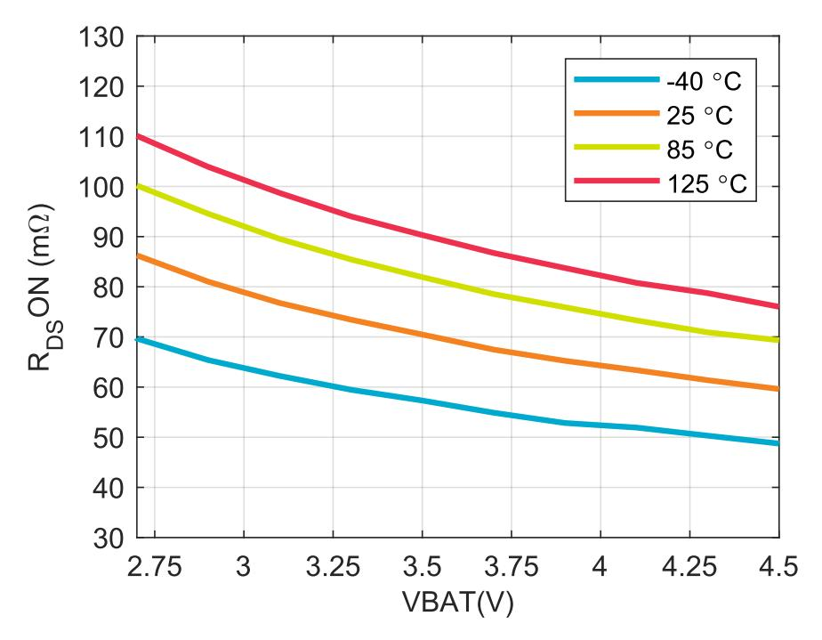

*Figure 10: WLCSP CHARGER RON vs. junction temperature*

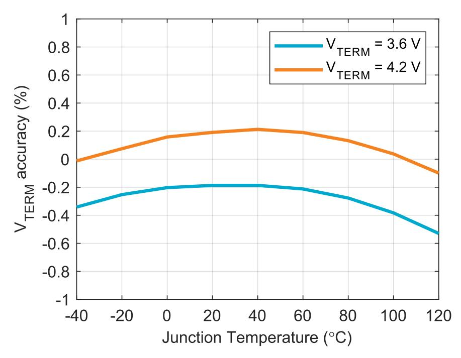

*Figure 11: VTERM vs. junction temperature*

## 6.2.13 Registers

#### **Instances**

| Instance | Base address | Description           |
|----------|--------------|-----------------------|
| BCHARGER | 0x00000300   | CHARGER registers     |
|          |              | BCHARGER register map |

#### **Register overview**

| Register             | Offset | Description                                                           |
|----------------------|--------|-----------------------------------------------------------------------|
| TASKRELEASEERR       | 0x0    | Release charger from error                                            |
| TASKCLEARCHGERR      | 0x1    | Clear error registers                                                 |
| TASKCLEARSAFETYTIMER | 0x2    | Clear safety timers                                                   |
| BCHGENABLESET        | 0x4    | Enable charger                                                        |
| BCHGENABLECLR        | 0x5    | Disable charger                                                       |
| BCHGDISABLESET       | 0x6    | Disable automatic recharge and battery temperature monitoring         |
| BCHGDISABLECLR       | 0x7    | Enable automatic recharge and battery temperature monitoring          |
| BCHGISETMSB          | 0x8    | Configure charge current MSB                                          |
| BCHGISETLSB          | 0x9    | Configure charge current LSB                                          |
| BCHGISETDISCHARGEMSB | 0xA    | Configure discharge current limit MSB                                 |
| BCHGISETDISCHARGELSB | 0xB    | Configure discharge current limit LSB                                 |
| BCHGVTERM            | 0xC    | Configure termination voltage for cool and nominal temperature region |
| BCHGVTERMR           | 0xD    | Configure termination voltage for warm temperature region             |
| BCHGVTRICKLESEL      | 0xE    | Select trickle charge voltage threshold                               |
| BCHGITERMSEL         | 0xF    | Select terminaton current                                             |
| NTCCOLD              | 0x10   | NTC thermistor threshold for cold temperature region                  |
| NTCCOLDLSB           | 0x11   | NTC thermistor threshold for cold temperature region                  |
| NTCCOOL              | 0x12   | NTC thermistor threshold for cool temperature region                  |

| Register          | Offset | Description                                                                                           |
|-------------------|--------|-------------------------------------------------------------------------------------------------------|
| NTCCOOLLSB        | 0x13   | NTC thermistor threshold for cool temperature region                                                  |
| NTCWARM           | 0x14   | NTC thermistor threshold for warm temperature region                                                  |
| NTCWARMLSB        | 0x15   | NTC thermistor threshold for warm temperature region                                                  |
| NTCHOT            | 0x16   | NTC thermistor threshold for hot temperature region                                                   |
| NTCHOTLSB         | 0x17   | NTC thermistor threshold for hot temperature region                                                   |
| DIETEMPSTOP       | 0x18   | Die temperature threshold to stop charging                                                            |
| DIETEMPSTOPLSB    | 0x19   | Die temperature threshold to stop charging                                                            |
| DIETEMPRESUME     | 0x1A   | Die temperature threshold to resume charging                                                          |
| DIETEMPRESUMELSB  | 0x1B   | Die temperature threshold to resume charging                                                          |
| BCHGILIMSTATUS    | 0x2D   | Battery discharge current limit status                                                                |
| NTCSTATUS         | 0x32   | Battery temperature region status                                                                     |
| DIETEMPSTATUS     | 0x33   | Die temperature status                                                                                |
| BCHGCHARGESTATUS  | 0x34   | Charging status                                                                                       |
| BCHGERRREASON     | 0x36   | Charge error. Latched error reasons. Cleared with TASKSCLEARCHGERR                                    |
| BCHGERRSENSOR     | 0x37   | Charger error. Latched conditions. Cleared with TASKSCLEARCHGERR                                      |
| BCHGCONFIG        | 0x3C   | Charger configuration                                                                                 |
| BCHGVBATLOWCHARGE | 0x50   | Enable charging at low battery voltage NOTE: Reset value from OTP, value listed in this table may not |
|                   |        | be correct.                                                                                           |

### 6.2.13.1 TASKRELEASEERR

Address offset: 0x0

Release charger from error

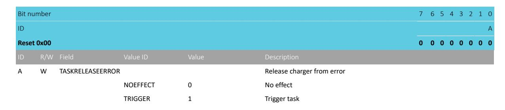

### 6.2.13.2 TASKCLEARCHGERR

Address offset: 0x1 Clear error registers

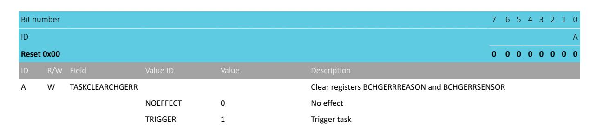

### 6.2.13.3 TASKCLEARSAFETYTIMER

Address offset: 0x2 Clear safety timers

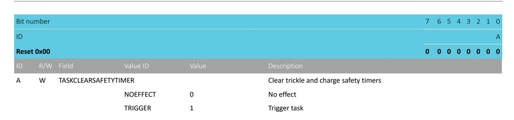

## 6.2.13.4 BCHGENABLESET

Address offset: 0x4 Enable charger

| Bit number |     |                   |            |       |                                                                          | 7 |  | 6 5 4 3 2 1 0 |     |
|------------|-----|-------------------|------------|-------|--------------------------------------------------------------------------|---|--|---------------|-----|
| ID         |     |                   |            |       |                                                                          |   |  |               | B A |
| Reset 0x00 |     |                   |            |       |                                                                          | 0 |  | 0 0 0 0 0 0 0 |     |
| ID         |     | R/W Field         | Value ID   | Value | Description                                                              |   |  |               |     |
| A          | RW  | ENABLECHARGING    |            |       | Enable charger. (Read 0: Charging disabled). (Read 1: Charging enabled). |   |  |               |     |
|            | W1S |                   |            |       |                                                                          |   |  |               |     |
|            |     |                   | NOEFFECT   | 0     | No effect                                                                |   |  |               |     |
|            |     |                   | ENABLECHG  | 1     | Enable battery charging                                                  |   |  |               |     |
| B          | RW  | ENABLEFULLCHGCOOL |            |       | Enable charging of cool battery with full current. (Read 0: 50% charge   |   |  |               |     |
|            | W1S |                   |            |       | current value of BCHGISETMSB and BCHGISETLSB registers). (Read 1: 100%   |   |  |               |     |
|            |     |                   |            |       | charge current value of BCHGISETMSB and BCHGISETLSB registers).          |   |  |               |     |
|            |     |                   | NOEFFECT   | 0     | No effect                                                                |   |  |               |     |
|            |     |                   | ENABLECOOL | 1     | Enable charging of cool battery                                          |   |  |               |     |

## 6.2.13.5 BCHGENABLECLR

Address offset: 0x5 Disable charger

## 6.2.13.6 BCHGDISABLESET

Address offset: 0x6

Disable automatic recharge and battery temperature monitoring

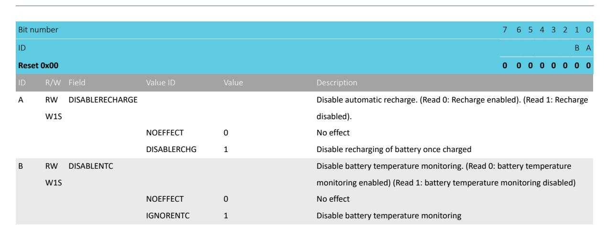

## 6.2.13.7 BCHGDISABLECLR

Address offset: 0x7

Enable automatic recharge and battery temperature monitoring

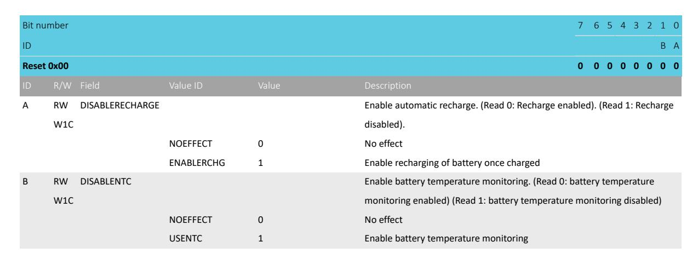

## 6.2.13.8 BCHGISETMSB

Address offset: 0x8

Configure charge current MSB

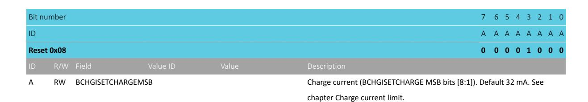

## 6.2.13.9 BCHGISETLSB

Address offset: 0x9

Configure charge current LSB

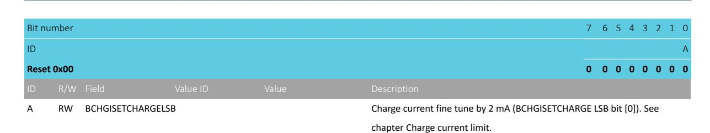

## 6.2.13.10 BCHGISETDISCHARGEMSB

Address offset: 0xA

Configure discharge current limit MSB

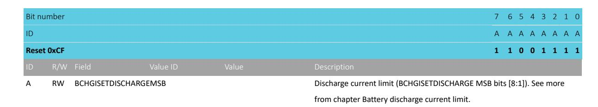

## 6.2.13.11 BCHGISETDISCHARGELSB

Address offset: 0xB

Configure discharge current limit LSB

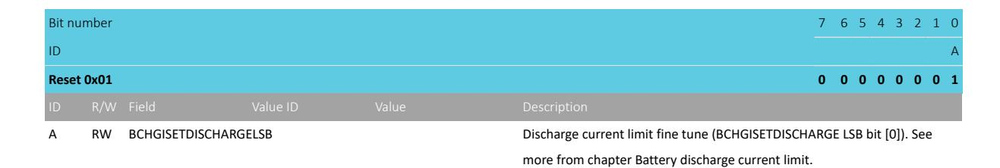

## 6.2.13.12 BCHGVTERM

Address offset: 0xC

Configure termination voltage for cool and nominal temperature region

| ID Reset 0x02 ID R/W Field Value ID Value Description | A A A A 0 0 0 0 0 0 1 0                                          |  |
|-------------------------------------------------------------------------|------------------------------------------------------------------------|--|
|                                                                         |                                                                        |  |
|                                                                         |                                                                        |  |
|                                                                         |                                                                        |  |
| A RW BCHGVTERMNORM                                                | Configure termination voltage for cool and nominal temperature region. |  |
|                                                                         | Values 14-15 are equals with default value (3.60 V).                   |  |
| 3V50 0 3.50 V                                                     |                                                                        |  |
| 3V55 1 3.55 V                                                     |                                                                        |  |
| 3V60 2 3.60 V (default)                                           |                                                                        |  |
| 3V65 3 3.65 V                                                     |                                                                        |  |
| 4V00 4 4.00 V                                                     |                                                                        |  |
| 4V05 5 4.05 V                                                     |                                                                        |  |
| 4V10 6 4.10 V                                                     |                                                                        |  |
| 4V15 7 4.15 V                                                     |                                                                        |  |
| 4V20 8 4.20 V                                                     |                                                                        |  |
| 4V25 9 4.25 V                                                     |                                                                        |  |

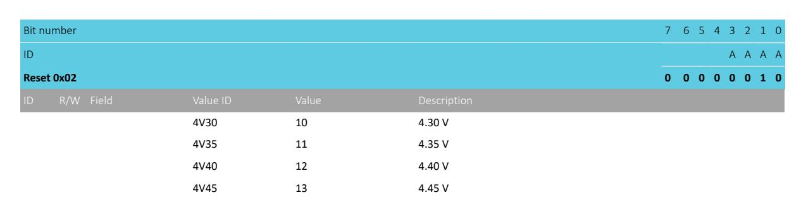

## 6.2.13.13 BCHGVTERMR

Address offset: 0xD

Configure termination voltage for warm temperature region

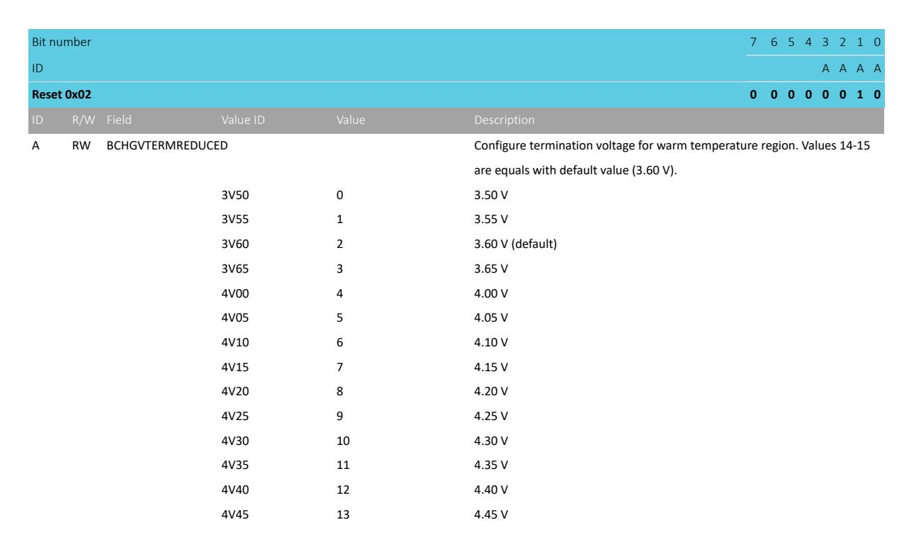

### 6.2.13.14 BCHGVTRICKLESEL

Address offset: 0xE

Select trickle charge voltage threshold

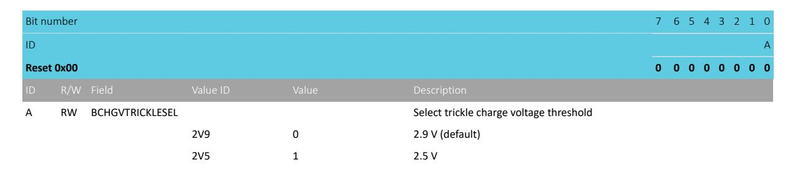

## 6.2.13.15 BCHGITERMSEL

Address offset: 0xF

Select terminaton current

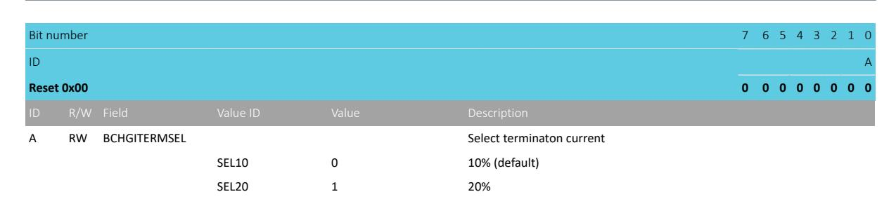

## 6.2.13.16 NTCCOLD

Address offset: 0x10

NTC thermistor threshold for cold temperature region

## 6.2.13.17 NTCCOLDLSB

Address offset: 0x11

NTC thermistor threshold for cold temperature region

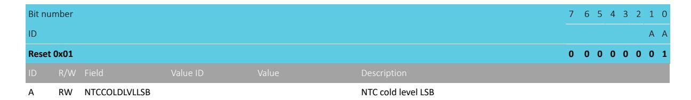

## 6.2.13.18 NTCCOOL

Address offset: 0x12

NTC thermistor threshold for cool temperature region

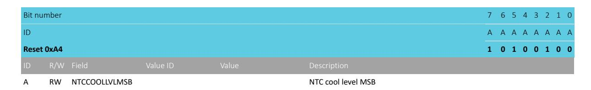

## 6.2.13.19 NTCCOOLLSB

Address offset: 0x13

NTC thermistor threshold for cool temperature region

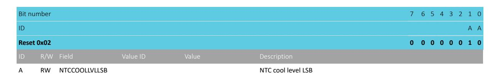

## 6.2.13.20 NTCWARM

Address offset: 0x14

NTC thermistor threshold for warm temperature region

## 6.2.13.21 NTCWARMLSB

Address offset: 0x15

NTC thermistor threshold for warm temperature region

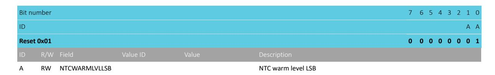

## 6.2.13.22 NTCHOT

Address offset: 0x16

NTC thermistor threshold for hot temperature region

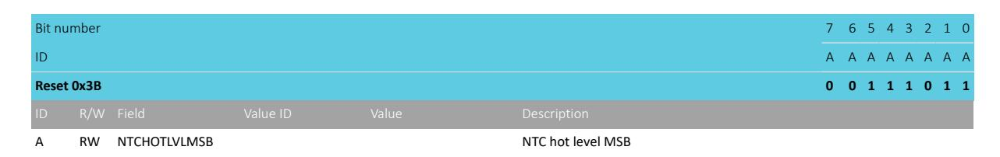

## 6.2.13.23 NTCHOTLSB

Address offset: 0x17

NTC thermistor threshold for hot temperature region

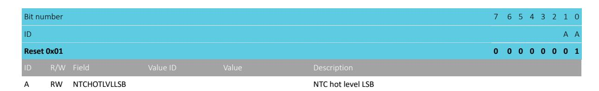

## 6.2.13.24 DIETEMPSTOP

Address offset: 0x18

Die temperature threshold to stop charging

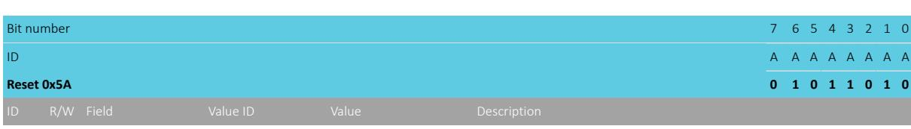

A RW DIETEMPSTOPCHG

A RW DIETEMPSTOPCHG Die temperature stop charging level

## 6.2.13.25 DIETEMPSTOPLSB

Address offset: 0x19

Die temperature threshold to stop charging

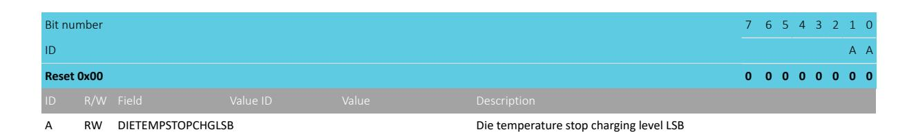

## 6.2.13.26 DIETEMPRESUME

Address offset: 0x1A

Die temperature threshold to resume charging

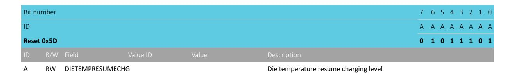

## 6.2.13.27 DIETEMPRESUMELSB

Address offset: 0x1B

Die temperature threshold to resume charging

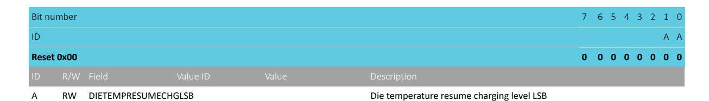

## 6.2.13.28 BCHGILIMSTATUS

Address offset: 0x2D

Battery discharge current limit status

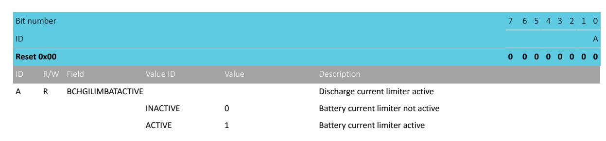

## 6.2.13.29 NTCSTATUS

Address offset: 0x32

Battery temperature region status

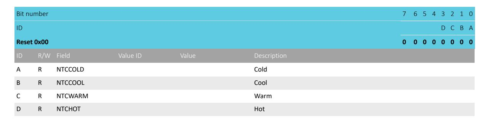

## 6.2.13.30 DIETEMPSTATUS

Address offset: 0x33

Die temperature status

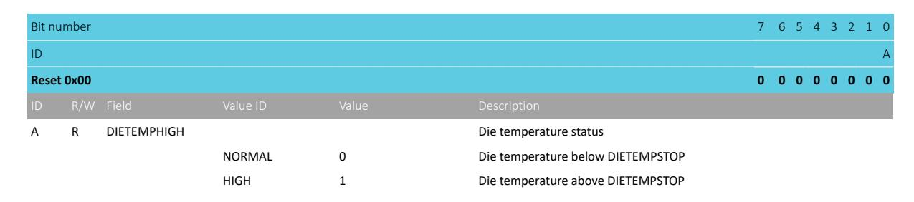

## 6.2.13.31 BCHGCHARGESTATUS

Address offset: 0x34

Charging status

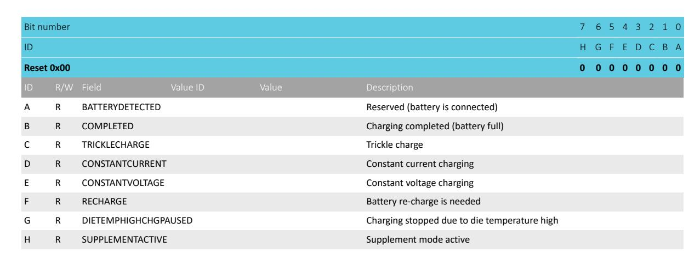

## 6.2.13.32 BCHGERRREASON

Address offset: 0x36

Charge error. Latched error reasons. Cleared with TASKSCLEARCHGERR

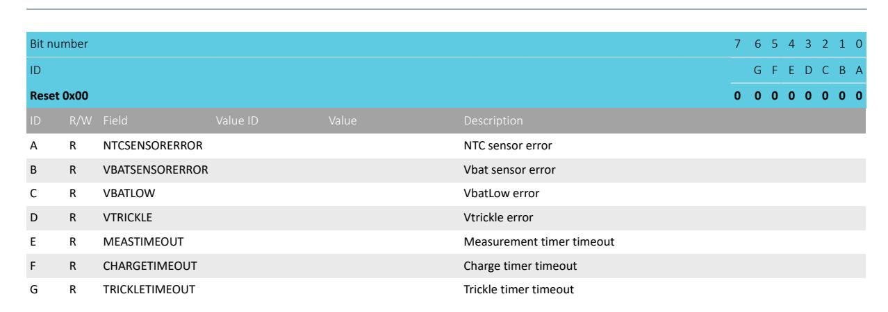

## 6.2.13.33 BCHGERRSENSOR

Address offset: 0x37

Charger error. Latched conditions. Cleared with TASKSCLEARCHGERR

|    | Bit number |                |          |                                  |                                          | 7 |  |  | 6 5 4 3 2 1 0 |
|----|------------|----------------|----------|----------------------------------|------------------------------------------|---|--|--|---------------|
| ID |            |                |          |                                  |                                          | H |  |  | G F E D C B A |
|    | Reset 0x00 |                |          |                                  |                                          | 0 |  |  | 0 0 0 0 0 0 0 |
| ID |            | R/W Field      | Value ID | Value                            | Description                              |   |  |  |               |
| A  | R          | SENSORNTCCOLD  |          |                                  | NTC cold region active when error occurs |   |  |  |               |
| B  | R          | SENSORNTCCOOL  |          |                                  | NTC cool region active when error occurs |   |  |  |               |
| C  | R          | SENSORNTCWARM  |          |                                  | NTC warm region active when error occurs |   |  |  |               |
| D  | R          | SENSORNTCHOT   |          |                                  | NTC hot region active when error occurs  |   |  |  |               |
| E  | R          | SENSORVTERM    |          |                                  | Vterm status when error occurs           |   |  |  |               |
| F  | R          | SENSORRECHARGE |          |                                  | Recharge status when error occurs        |   |  |  |               |
| G  | R          | SENSORVTRICKLE |          |                                  | Vtrickle status when error occurs        |   |  |  |               |
| H  | R          | SENSORVBATLOW  |          | Vbatlow status when error occurs |                                          |   |  |  |               |

## 6.2.13.34 BCHGCONFIG

Address offset: 0x3C Charger configuration

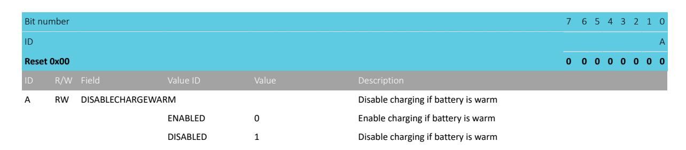

### 6.2.13.35 BCHGVBATLOWCHARGE

Address offset: 0x50

Enable charging at low battery voltage NOTE: Reset value from OTP, value listed in this table may not be correct.

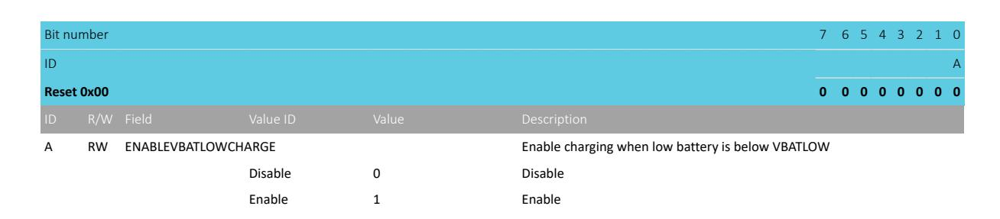

# 6.3 BUCK — Buck regulators

BUCK consists of two step-down buck regulators, BUCK1 and BUCK2.

BUCK has the following features:

- Ultra-high efficiency (low IQ) and low noise operation
- PWM and Hysteretic modes with automatic switching based on load
- TWI configurable for forcing PWM mode to minimize output voltage ripple
- Configurable output voltages between 1.0 V and 3.3 V

Hysteretic mode offers efficiency at lower load currents and typically operates up to half the maximum PWM current. PWM mode provides a clean supply operation due to a constant switching frequency, F[BUCK](https://infocenter.nordicsemi.com/topic/ps_npm1100/chapters/core_components/buck/doc/frontpage.html#elec_param__table_w2f_lvh_gmb). This provides optimal coexistence with RF circuits. BUCK can automatically change between Hysteretic and PWM modes.

**Note:** The outputs of BUCK1 and BUCK2 must not be tied together as they are not intended to operate in such configuration.

## 6.3.1 On/Off control

BUCK is enabled in the following ways.

- **VSET[n]** pin
- Control registers
- **GPIO[n]** pin

The **VSET1** and **VSET2** pins are enabled only at power-on. If resistor RVSETn is present, BUCK is enabled with the output voltage defined by the resistor value. If the pin is grounded, BUCK is disabled. See [Default](#page-46-1) [VOUT1 using an external resistor](#page-46-1) on page 47 and [Default VOUT2 using an external resistor](#page-46-2) on page 47.

Control registers [BUCK1ENASET](#page-61-0) on page 62, [BUCK1ENACLR](#page-61-1) on page 62, [BUCK2ENASET](#page-62-0) on page 63, and [BUCK2ENACLR](#page-62-1) on page 63 have enable and disable bits for each BUCK. These registers override the default BUCK state.

A GPIO can be configured in register [BUCKENCTRL](#page-66-0) on page 67 to enable or disable BUCK.

If BUCK is disabled during power up, the system defaults to software control of BUCK.

## 6.3.2 Output voltage selection

The output voltage range for BUCK is programmable with TWI. The default output voltage selection is found on pins **VSET1** and **VSET2**, which are configured using an external resistor to **GND**. Only the output voltages shown in the tables can be selected using resistors. The **VOUT[n]** pins have two voltage configuration registers that are selectable through a GPIO pin with predefined voltage settings available.

The **VSET[n]** pins are effective only at start up. The external resistor (maximum 5% tolerance) defines the default output voltage setting as found in the following table.

| Symbol | Nominal resistance | VOUT1 start up output voltage |
|--------|--------------------|-------------------------------|
| RVSET1 | <100 Ω (grounded)  | 0 V (OFF)                     |
|        | 4.7 kΩ             | 1.0 V                         |
|        | 10 kΩ              | 1.2 V                         |
|        | 22 kΩ              | 1.5 V                         |
|        | 47 kΩ              | 1.8 V                         |
|        | 68 kΩ              | 2.0 V                         |
|        | 100 kΩ             | 2.2 V                         |
|        | 150 kΩ             | 2.5 V                         |
|        | 250...500 kΩ       | 2.7 V                         |

*Table 17: Default VOUT1 using an external resistor*

| Symbol | Nominal resistance | VOUT2 start up output voltage |
|--------|--------------------|-------------------------------|
| RVSET2 | <100 Ω (grounded)  | 0 V (OFF)                     |
|        | 4.7 kΩ             | 1.8 V                         |
|        | 10 kΩ              | 2.0 V                         |
|        | 22 kΩ              | 2.2 V                         |
|        | 47 kΩ              | 2.4 V                         |
|        | 68 kΩ              | 2.5 V                         |
|        | 100 kΩ             | 2.7 V                         |
|        | 150 kΩ             | 3.0 V                         |
|        | 250...500 kΩ       | 3.3 V                         |

*Table 18: Default VOUT2 using an external resistor*

**Note:** Do not leave **VSET[n]** floating, make sure that the **VSET[n]** pins have the correct configuration.

The output voltage range is from 1.0 V to 3.3 V in 100 mV steps and is set in the voltage configuration registers [BUCK1NORMVOUT](#page-63-0) on page 64 and [BUCK2NORMVOUT](#page-64-0) on page 65. Once the voltage is selected, register [BUCKSWCTRLSEL](#page-68-0) on page 69 must be written to for the values to take effect.

Registers [BUCK1VOUTSTATUS](#page-68-1) on page 69 and [BUCK2VOUTSTATUS](#page-68-2) on page 69 indicate the status or current voltage setting.

A GPIO can be configured to select between two voltage levels. The output voltage for retention mode is configured in registers [BUCK1RETVOUT](#page-64-1) on page 65 and [BUCK2RETVOUT](#page-65-0) on page 66. Select a GPIO to control retention voltage in register [BUCKVRETCTRL](#page-67-0) on page 68.

## 6.3.3 BUCK mode selection

BUCK operates in Automatic mode by default. When in Automatic mode, BUCK selects Hysteretic mode for low load currents, and PWM mode for high load currents.

In PWM mode, BUCK provides a clean supply operation due to constant switching frequency and lower voltage ripple for optimal coexistence with RF circuits.

Forced pulse width modulation (PWM) is set by the following:

- Control register bits in [BUCK\[n\]PWMSET](#page-62-2)
- **GPIO[n]** pins in register [BUCKPWMCTRL](#page-67-1) on page 68 overriding the register setting for one or both BUCKs

Hysteretic mode can be forced in register [BUCKCTRL0](#page-69-0) on page 70 for each BUCK. This setting is not available using GPIO.

## 6.3.4 Active output capacitor discharge

When the converter is disabled, active discharge can be enabled or disabled in register [BUCKCTRL0](#page-69-0) on page 70 using R[DISCH](#page-47-2) from the output capacitors. The default setting is disabled.

Capacitor discharge is forced when there is a power cycle reset. See figure [Power cycle](#page-112-3) on page 113.

## 6.3.5 Component selection

Recommended values for the inductor are shown in the following table.

| Parameter                 | Value | Unit |
|---------------------------|-------|------|
| Nominal inductance        | 2.2   | μH   |
| Inductor tolerance        | ≤ 20  | %    |
| DC resistance (DCR)       | ≤ 400 | mΩ   |
| Saturation current (Isat) | > 350 | mA   |
| Rated current (Imax)      | > 200 | mA   |

*Table 19: Recommended inductor specifications*

| Parameter             | Value | Unit |
|-----------------------|-------|------|
| Effective capacitance | ≥ 4   | μF   |
| ESR                   | ≤ 50  | mΩ   |

*Table 20: Recommended capacitor specifications*

## 6.3.6 Electrical specification

| Symbol     | Description                                                          | Min. | Typ. | Max. | Unit |
|------------|----------------------------------------------------------------------|------|------|------|------|
| VOUT[n]ACC | Output voltage accuracy                                              | -5   |      | +5   | %    |
| VSYSMIN    | Minimum VSYS voltage for enabling BUCK (dependent on POF setting) |      | 2.7  |      | V    |
| IOUT       | Maximum BUCK current to maintain performance                      |      |      | 200  | mA   |
| VDROP_OUT  | Drop-out voltage 1 mA load                                           |      | 100  |      | mV   |

| Symbol         | Description                                                                      | Min. | Typ.       | Max. | Unit |
|----------------|----------------------------------------------------------------------------------|------|------------|------|------|
| RDISCH         | Active output capacitor discharge resistance                                  |      | 2          |      | kΩ   |
| IPWMTHRES      | Load current threshold from Hysteretic to PWM mode (mode = AUTO)              |      | 90         |      | mA   |
| IHYSTTHRES     | Load current threshold from PWM to Hysteretic mode (mode = AUTO)              |      | 40         |      | mA   |
| VOUTRIPPLEPWM  | VOUT ripple in PWM mode IOUT = 200 mA                                         |      | 5          |      | mVpp |
| VOUTRIPPLEHYST | VOUT ripple in Hysteretic mode                                                   |      | 50         |      | mVpp |
| EFFBUCK        | Efficiency in PWM mode VSYS = 3.8 V VOUT = 3.3 V IOUT = 200 mA          |      | 93         |      | %    |
| fBUCK          | Switching frequency in PWM mode                                                  |      | 3.6        |      | MHz  |
| tSTRT          | Start-up time VOUT = 3.3 V C = 10 µF                                       |      | 1.2        |      | ms   |
| tPWMMODE       | Transition time Hysteretic to PWM mode Automatic (and via TWI or GPIO)     |      | 90 (55) |      | μs   |
| tHYST          | Transition time Hysteretic to PWM mode Automatic (and through TWI or GPIO) |      | 35 (25) |      | μs   |

*Table 21: BUCK electrical specification*

## 6.3.7 Electrical characteristics

The following graphs show typical electrical characteristics for BUCK.

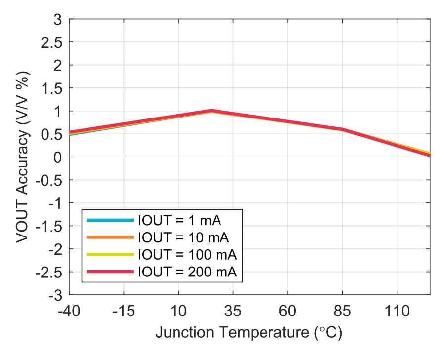

*Figure 12: VBAT = 4.35 V: VOUT = 3.0 V vs. junction temperature*

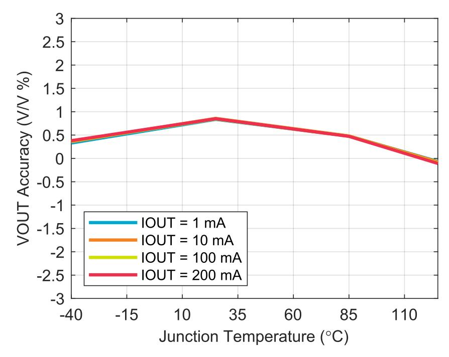

*Figure 13: VBAT = 3.8: VOUT = 3.0 V vs. junction temperature*

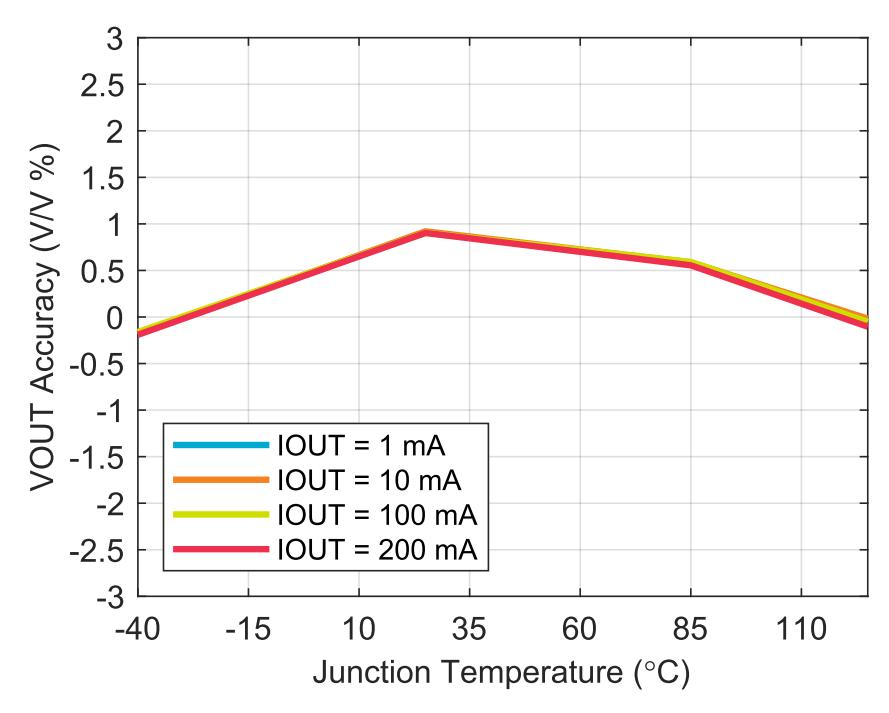

*Figure 14: VBAT = 4.35 V: VOUT = 1.8 vs. junction temperature*

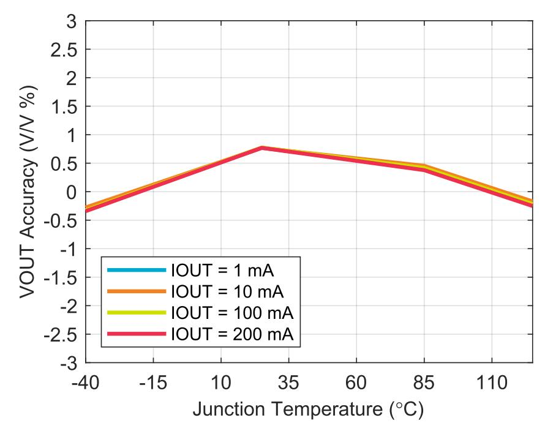

*Figure 15: VBAT = 3.8 V: VOUT = 1.8 vs. junction temperature*

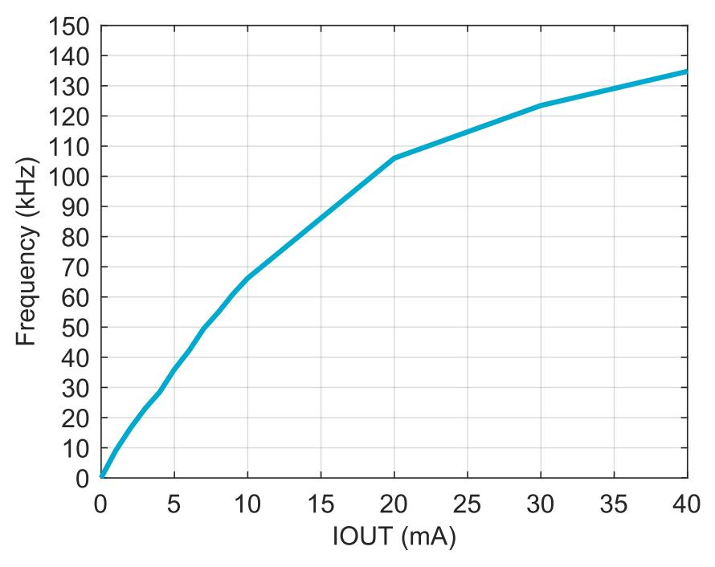

*Figure 16: VBAT = 3.8 V: VOUT = 2.0 V: PFM frequency vs. current*

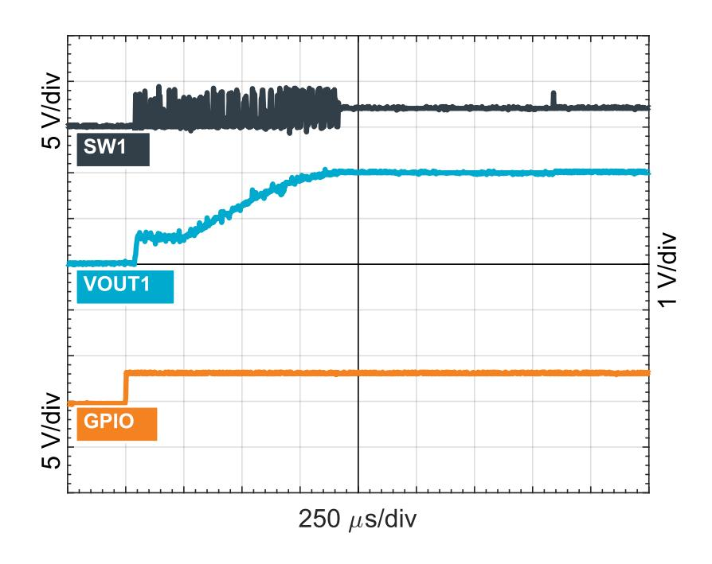

*Figure 17: VBAT = 3.8 V: VOUT = 2.0 V: GPIO BUCK start*


*Figure 18: VBAT = 3.8 V: VOUT = 2.0 V: GPIO PWM mode selection*


*Figure 19: VBAT = 3.8 V: VOUT = 2.0 V: GPIO PFM mode selection*


*Figure 20: VBAT = 3.8 V: VOUT = 2.0 V: Auto mode extreme load transient*


*Figure 21: VBAT = 3.8 V: VOUT = 2.0 V: PWM mode extreme load transient*


*Figure 22: VBAT = 3.8 V: VOUT = 2.0 V: VBUS detach*


*Figure 23: VOUT = 1.0 V: PWM Efficiency*


*Figure 24: VOUT = 1.8 V: PWM efficiency*

*Figure 25: VOUT = 2.1 V: PWM efficiency*


*Figure 26: VOUT = 3.3 V: PWM efficiency*


*Figure 27: VOUT = 1.0 V: Hysteretic efficiency*


*Figure 28: VOUT = 1.8 V: Hysteretic efficiency*


*Figure 29: VOUT = 2.1 V: Hysteretic efficiency*


*Figure 30: VOUT = 3.3 V: Hysteretic efficiency*


*Figure 31: VOUT = 1.8 V: FFT 10 mA: PFM*


*Figure 32: VOUT = 1.8 V: FFT 50 mA: PFM*


*Figure 33: VOUT = 1.8 V: FFT 100 mA: PWM: clock = 3.6 MHz*


*Figure 34: VOUT = 1.8 V: FFT 200 mA: PWM: clock = 3.6 MHz*


*Figure 35: BUCK dropout*

## 6.3.8 Registers

## **Instances**

| Instance | Base address | Description    |
|----------|--------------|----------------|
| BUCK     | 0x00000400   | BUCK registers |
|          |              | BUCK register  |

## **Register overview**

| Register        | Offset | Description                                                              |
|-----------------|--------|--------------------------------------------------------------------------|
| BUCK1ENASET     | 0x0    | Enable BUCK1                                                             |
| BUCK1ENACLR     | 0x1    | Disable BUCK1                                                            |
| BUCK2ENASET     | 0x2    | Enable BUCK2                                                             |
| BUCK2ENACLR     | 0x3    | Disable BUCK2                                                            |
| BUCK1PWMSET     | 0x4    | Enable PWM mode for BUCK1                                                |
| BUCK1PWMCLR     | 0x5    | Disable PWM mode for BUCK1                                               |
| BUCK2PWMSET     | 0x6    | Enable PWM mode for BUCK2                                                |
| BUCK2PWMCLR     | 0x7    | Disable PWM mode for BUCK2                                               |
| BUCK1NORMVOUT   | 0x8    | Configure BUCK1 output voltage normal mode                               |
| BUCK1RETVOUT    | 0x9    | Configure BUCK1 output voltage retention mode                            |
| BUCK2NORMVOUT   | 0xA    | Configure BUCK2 output voltage normal mode                               |
| BUCK2RETVOUT    | 0xB    | Configure BUCK2 output voltage retention mode                            |
| BUCKENCTRL      | 0xC    | Select GPIOs for BUCK1 and BUCK2 enabling                                |
| BUCKVRETCTRL    | 0xD    | Select GPIOs for controlling BUCK1 and BUCK2 retention voltage selection |
| BUCKPWMCTRL     | 0xE    | Select GPIOs for PWM mode controlling BUCK1 and BUCK2                    |
| BUCKSWCTRLSEL   | 0xF    | BUCK output voltage set by pin or register                               |
| BUCK1VOUTSTATUS | 0x10   | BUCK1 output voltage target                                              |
| BUCK2VOUTSTATUS | 0x11   | BUCK2 output voltage target                                              |
| BUCKCTRL0       | 0x15   | BUCK auto mode and pull down control                                     |
| BUCKSTATUS      | 0x34   | BUCK status register                                                     |

## 6.3.8.1 BUCK1ENASET

Address offset: 0x0

Enable BUCK1


## 6.3.8.2 BUCK1ENACLR

Address offset: 0x1

Disable BUCK1


## 6.3.8.3 BUCK2ENASET

Address offset: 0x2

Enable BUCK2


## 6.3.8.4 BUCK2ENACLR

Address offset: 0x3

Disable BUCK2


## 6.3.8.5 BUCK1PWMSET

Address offset: 0x4

Enable PWM mode for BUCK1


### 6.3.8.6 BUCK1PWMCLR

Address offset: 0x5

Disable PWM mode for BUCK1


## 6.3.8.7 BUCK2PWMSET

Address offset: 0x6

Enable PWM mode for BUCK2


## 6.3.8.8 BUCK2PWMCLR

Address offset: 0x7

Disable PWM mode for BUCK2


## 6.3.8.9 BUCK1NORMVOUT

Address offset: 0x8

Configure BUCK1 output voltage normal mode


## 6.3.8.10 BUCK1RETVOUT

Address offset: 0x9

Configure BUCK1 output voltage retention mode


### 6.3.8.11 BUCK2NORMVOUT

Address offset: 0xA

#### Configure BUCK2 output voltage normal mode

### 6.3.8.12 BUCK2RETVOUT

Address offset: 0xB

Configure BUCK2 output voltage retention mode


## 6.3.8.13 BUCKENCTRL

Address offset: 0xC

Select GPIOs for BUCK1 and BUCK2 enabling

| Bit number |    |               |          |       |                                                 | 7 |  |  | 6 5 4 3 2 1 0 |
|------------|----|---------------|----------|-------|-------------------------------------------------|---|--|--|---------------|
| ID         |    |               |          |       |                                                 | D |  |  | C B B B A A A |
| Reset 0x00 |    |               |          |       |                                                 | 0 |  |  | 0 0 0 0 0 0 0 |
| ID         |    | R/W Field     | Value ID | Value | Description                                     |   |  |  |               |
| A          | RW | BUCK1ENGPISEL |          |       | Select which GPIO controls BUCK1 enable         |   |  |  |               |
|            |    |               | NOTUSED  | 0     | Not used                                        |   |  |  |               |
|            |    |               | GPIO0    | 1     | GPIO 0 selected                                 |   |  |  |               |
|            |    |               | GPIO1    | 2     | GPIO 1 selected                                 |   |  |  |               |
|            |    |               | GPIO2    | 3     | GPIO 2 selected                                 |   |  |  |               |
|            |    |               | GPIO3    | 4     | GPIO 3 selected                                 |   |  |  |               |
|            |    |               | GPIO4    | 5     | GPIO 4 selected                                 |   |  |  |               |
|            |    |               | NOTUSED1 | 6     | No GPIO selected                                |   |  |  |               |
|            |    |               | NOTUSED2 | 7     | No GPIO selected                                |   |  |  |               |
| B          | RW | BUCK2ENGPISEL |          |       | Select which GPIO controls BUCK2 enable         |   |  |  |               |
|            |    |               | NOTUSED1 | 0     | Not used                                        |   |  |  |               |
|            |    |               | GPIO0    | 1     | GPIO 0 selected                                 |   |  |  |               |
|            |    |               | GPIO1    | 2     | GPIO 1 selected                                 |   |  |  |               |
|            |    |               | GPIO2    | 3     | GPIO 2 selected                                 |   |  |  |               |
|            |    |               | GPIO3    | 4     | GPIO 3 selected                                 |   |  |  |               |
|            |    |               | GPIO4    | 5     | GPIO 4 selected                                 |   |  |  |               |
|            |    |               | NOTUSED3 | 6     | No GPIO selected                                |   |  |  |               |
|            |    |               | NOTUSED4 | 7     | No GPIO selected                                |   |  |  |               |
| C          | RW | BUCK1ENGPIINV |          |       | Invert the sense of the selected GPIO for BUCK1 |   |  |  |               |
|            |    |               | NORMAL   | 0     | Not inverted                                    |   |  |  |               |
|            |    |               | INVERTED | 1     | Inverted                                        |   |  |  |               |
| D          | RW | BUCK2ENGPIINV |          |       | Invert the sense of the selected GPIO for BUCK2 |   |  |  |               |
|            |    |               | NORMAL   | 0     | Not inverted                                    |   |  |  |               |
|            |    |               | INVERTED | 1     | Inverted                                        |   |  |  |               |
|            |    |               |          |       |                                                 |   |  |  |               |

## 6.3.8.14 BUCKVRETCTRL

Address offset: 0xD

Select GPIOs for controlling BUCK1 and BUCK2 retention voltage selection


### 6.3.8.15 BUCKPWMCTRL

Address offset: 0xE

Select GPIOs for PWM mode controlling BUCK1 and BUCK2

|            | Bit number |                | 7        |       | 6 5 4 3 2 1 0                              |   |  |               |  |
|------------|------------|----------------|----------|-------|--------------------------------------------|---|--|---------------|--|
| ID         |            |                |          |       |                                            | D |  | C B B B A A A |  |
| Reset 0x00 |            |                |          |       |                                            | 0 |  | 0 0 0 0 0 0 0 |  |
| ID         |            | R/W Field      | Value ID | Value | Description                                |   |  |               |  |
| A          | RW         | BUCK1PWMGPISEL |          |       | Select which GPIO controls BUCK1 force PWM |   |  |               |  |
|            |            |                | NOTUSED1 | 0     | Not used                                   |   |  |               |  |
|            |            |                | GPIO0    | 1     | GPIO 0 selected                            |   |  |               |  |
|            |            |                | GPIO1    | 2     | GPIO 1 selected                            |   |  |               |  |
|            |            |                | GPIO2    | 3     | GPIO 2 selected                            |   |  |               |  |
|            |            |                | GPIO3    | 4     | GPIO 3 selected                            |   |  |               |  |
|            |            |                | GPIO4    | 5     | GPIO 4 selected                            |   |  |               |  |
|            |            |                | NOTUSED  | 6     | Not used                                   |   |  |               |  |
|            |            |                | NOTUSED2 | 7     | Not used                                   |   |  |               |  |
| B          | RW         | BUCK2PWMGPISEL |          |       | Select which GPIO controls BUCK2 force PWM |   |  |               |  |


## 6.3.8.16 BUCKSWCTRLSEL

Address offset: 0xF

BUCK output voltage set by pin or register


### 6.3.8.17 BUCK1VOUTSTATUS

Address offset: 0x10

BUCK1 output voltage target


## 6.3.8.18 BUCK2VOUTSTATUS

Address offset: 0x11

BUCK2 output voltage target


## 6.3.8.19 BUCKCTRL0

Address offset: 0x15

BUCK auto mode and pull down control

| Bit number |    |                  |          |       |                                           | 7 | 6 5 4 3 2 1 0 |         |  |
|------------|----|------------------|----------|-------|-------------------------------------------|---|---------------|---------|--|
| ID         |    |                  |          |       |                                           |   |               | D C B A |  |
| Reset 0x00 |    |                  |          |       |                                           | 0 | 0 0 0 0 0 0 0 |         |  |
| ID         |    | R/W Field        | Value ID | Value | Description                               |   |               |         |  |
| A          | RW | BUCK1AUTOCTRLSEL |          |       | BUCK1 control                             |   |               |         |  |
|            |    |                  | AUTO     | 0     | Select auto switching between PFM and PWM |   |               |         |  |
|            |    |                  | PFM      | 1     | Select PFM mode only                      |   |               |         |  |
| B          | RW | BUCK2AUTOCTRLSEL |          |       | BUCK2 control                             |   |               |         |  |
|            |    |                  | AUTO     | 0     | Select auto switching between PFM and PWM |   |               |         |  |
|            |    |                  | PFM      | 1     | Select PFM mode only                      |   |               |         |  |
| C          | RW | BUCK1ENPULLDOWN  |          |       | BUCK1 pull down                           |   |               |         |  |
|            |    |                  | LOW      | 0     | BUCK1 pull down disabled                  |   |               |         |  |
|            |    |                  | HIGH     | 1     | BUCK1 pull down enabled                   |   |               |         |  |
| D          | RW | BUCK2ENPULLDOWN  |          |       | BUCK2 pull down                           |   |               |         |  |
|            |    |                  | LOW      | 0     | BUCK2 pull down disabled                  |   |               |         |  |
|            |    |                  | HIGH     | 1     | BUCK2 pull down enabled                   |   |               |         |  |

### 6.3.8.20 BUCKSTATUS

Address offset: 0x34 BUCK status register

|    | Bit number |              |                  |       |                     | 7 |  |  | 6 5 4 3 2 1 0 |  |
|----|------------|--------------|------------------|-------|---------------------|---|--|--|---------------|--|
| ID |            |              |                  |       |                     | F |  |  | E D D C B A A |  |
|    | Reset 0x00 |              |                  |       |                     | 0 |  |  | 0 0 0 0 0 0 0 |  |
| ID |            | R/W Field    | Value ID         | Value | Description         |   |  |  |               |  |
| A  | R          | BUCK1MODE    |                  |       | BUCK1 mode          |   |  |  |               |  |
|    |            |              | AUTOMODE         | 0     | Auto mode           |   |  |  |               |  |
|    |            |              | PFMMODE          | 1     | PFM mode            |   |  |  |               |  |
|    |            |              | PWMMODE          | 2     | Force PWM mode      |   |  |  |               |  |
|    |            |              | RFU              | 3     | Reserved (PWM mode) |   |  |  |               |  |
| B  | R          | BUCK1PWRGOOD |                  |       | BUCK1 status        |   |  |  |               |  |
|    |            |              | BUCKDISABLED     | 0     | BUCK powered off    |   |  |  |               |  |
|    |            |              | BUCKPOWERED      | 1     | BUCK powered on     |   |  |  |               |  |
| C  | R          | BUCK1PWMOK   |                  |       | BUCK1 PWM status    |   |  |  |               |  |
|    |            |              | PWMMODEDISABLED0 |       | PWM mode disabled   |   |  |  |               |  |
|    |            |              | PWMMODEENABLED1  |       | PWM mode enabled    |   |  |  |               |  |
| D  | R          | BUCK2MODE    |                  |       | BUCK2 mode          |   |  |  |               |  |
|    |            |              | AUTOMODE         | 0     | Auto mode           |   |  |  |               |  |
|    |            |              | PFMMODE          | 1     | PFM mode            |   |  |  |               |  |
|    |            |              | PWMMODE          | 2     | Force PWM mode      |   |  |  |               |  |
|    |            |              | RFU              | 3     | Reserved (PWM mode) |   |  |  |               |  |
|    |            |              |                  |       |                     |   |  |  |               |  |


# 6.4 LOADSW/LDO — Load switches/LDO regulators

Two load switches are available for use as switches or LDOs. They have dedicated input pins where voltage cannot exceed VSYS. The input voltage can be equal to **VOUT1**, **VOUT2**, or any voltage up to the **VSYS** voltage.

The mode is selected using registers [LDSW\[n\]LDOSEL.](#page-78-0)

The load switches (and LDOs) are OFF by default and can be controlled through control registers or GPIO pins using the following bits.

- Control register bits for each load switch or LDO:
  - [TASK.LDSW\[n\]SET](#page-75-0)
  - [TASK.LDSW\[n\]CLR](#page-75-1)
- GPIO[n], once configured by host software:
  - [LDSW\[n\]GPISEL](#page-76-0)

When a GPIO is used to control a load switch or LDO, it uses edges. When the GPIO toggles from LOW to HIGH, the switch or LDO turns ON (switch conducting). When the GPIO toggles from HIGH to LOW, the switch or LDO turns OFF.

Each load switch or LDO can be assigned to a separate GPIO, or a single GPIO can control both switches or LDOs.

A pull-down resistor R[LSPD](#page-71-1) on the **LSOUT[n]** pin is enabled in a register bit for load switch or LDO. See register [LDSWCONFIG](#page-77-0) on page 78.

#### **Load switch mode**

Soft start is enabled by default. This ensures that the current to **LSOUT[n]** is limited for t[SS](#page-71-1). Once soft start is complete, there will be no current limiting provided by the load switch. Only current limiting from the power source connected to **LSIN[n]** will provide limiting.

The soft start current limit for a load switch can be set in register [LDSWCONFIG](#page-77-0) on page 78.

#### **LDO mode**

The load switches can be independently configured as LDOs. The LDO output voltage is configurable in registers [LDSW\[n\]VOUTSEL](#page-78-1).

The LDO can be supplied from **VOUT1**, **VOUT2** or **VSYS**, but must comply with [VIN](#page-71-2)LDO.

## 6.4.1 Electrical specification

| Symbol  | Description                                                               | Min. | Typ. | Max. | Unit |
|---------|---------------------------------------------------------------------------|------|------|------|------|
| RDSONLS | Switch on-resistance LSIN = 3.3 V                                      |      | 200  |      | mΩ   |
| ILS     | Current LSOUT ≥ 1.2 V                                                  |      |      | 100  | mA   |
| tSS     | Soft start time Soft start current limit = 25 mA, 10 µF, 0 V to 5 V |      | 1.8  |      | ms   |
| RLSPD   | Pull-down resistor (active discharge) at LSOUT                         |      | 2    |      | kΩ   |
| VINLS   | Input voltage range                                                       | 1.0  |      | VSYS | V    |

*Table 22: LOADSW electrical specification*

| Symbol       | Description                    | Min. | Typ. | Max. | Unit |
|--------------|--------------------------------|------|------|------|------|
| IOUTLDO      | Output current VOUT > 1.2 V    |      |      | 50   | mA   |
| IOUTLDO      | Output current VOUT < 1.2 V    |      |      | 10   | mA   |
| VINLDO       | Input voltage range            | 2.6  |      | VSYS | V    |
| VOUTLDO      | Minimum setting output voltage |      | 1.0  |      | V    |
| VOUTLDO      | Maximum setting output voltage |      | 3.3  |      | V    |
| VOUTLDO step | Output voltage step size       |      | 100  |      | mV   |

*Table 23: LDO electrical specification*

## 6.4.2 Electrical characteristics

The following graphs show typical electrical characteristics for LOADSW.


*Figure 36: LOADSW RDSON vs. junction temperature*

The following graphs show electrical characteristics for LDO.


*Figure 37: LDO voltage accuracy vs. junction temperature (VBUS = 5.5 V)*

*Figure 38: LDO voltage accuracy vs. junction temperature (VBAT = 3.8 V)*


*Figure 39: LDO dropout vs. junction temperature*


*Figure 40: VINLDO = 3.8 V: VOUTLDO = 1.8 V: LDO load transient*


*Figure 41: VOUTLDO = 1.8 V or 3.0 V: Leakage current vs. junction temperature (no load)*

## 6.4.3 Registers

#### **Instances**

| Instance | Base address | Description       |
|----------|--------------|-------------------|
| LDSW     | 0x00000800   | LOADSW registers  |
|          |              | LDSW register map |

## **Register overview**

| Register     | Offset | Description                      |
|--------------|--------|----------------------------------|
| TASKLDSW1SET | 0x0    | Enable LDSW1                     |
| TASKLDSW1CLR | 0x1    | Disable LDSW1                    |
| TASKLDSW2SET | 0x2    | Enable LDSW2                     |
| TASKLDSW2CLR | 0x3    | Disable LDSW2                    |
| LDSWSTATUS   | 0x4    | Load switch and LDO status       |
| LDSW1GPISEL  | 0x5    | LDSW1 GPIO control select        |
| LDSW2GPISEL  | 0x6    | LDSW2 GPIO control select        |
| LDSWCONFIG   | 0x7    | Load switch or LDO configuration |
| LDSW1LDOSEL  | 0x8    | Select LDSW1 mode                |
| LDSW2LDOSEL  | 0x9    | Select LDSW2 mode                |
| LDSW1VOUTSEL | 0xC    | LDO1 programmable output voltage |
| LDSW2VOUTSEL | 0xD    | LDO2 programmable output voltage |

### 6.4.3.1 TASKLDSW1SET

Address offset: 0x0

Enable LDSW1


## 6.4.3.2 TASKLDSW1CLR

Address offset: 0x1

Disable LDSW1


### 6.4.3.3 TASKLDSW2SET

Address offset: 0x2

Enable LDSW2

## 6.4.3.4 TASKLDSW2CLR

Address offset: 0x3 Disable LDSW2

|    | Bit number |              |          |       |                    | 7 |  | 6 5 4 3 2 1 0 |   |
|----|------------|--------------|----------|-------|--------------------|---|--|---------------|---|
| ID |            |              |          |       |                    |   |  |               | A |
|    | Reset 0x00 |              |          |       |                    | 0 |  | 0 0 0 0 0 0 0 |   |
| ID |            | R/W Field    | Value ID | Value | Description        |   |  |               |   |
| A  | W          | TASKLDSW2CLR |          |       | Clear LDSW2 enable |   |  |               |   |
|    |            |              | NOEFFECT | 0     | No effect          |   |  |               |   |
|    |            |              | CLR      | 1     | Clear enable       |   |  |               |   |

## 6.4.3.5 LDSWSTATUS

Address offset: 0x4

Load switch and LDO status


### 6.4.3.6 LDSW1GPISEL

Address offset: 0x5

LDSW1 GPIO control select

|    | Bit number |             |          |       |                                       | 7 |  |  | 6 5 4 3 2 1 0 |
|----|------------|-------------|----------|-------|---------------------------------------|---|--|--|---------------|
| ID |            |             |          |       |                                       |   |  |  | B A A A       |
|    | Reset 0x00 |             |          |       |                                       | 0 |  |  | 0 0 0 0 0 0 0 |
| ID |            | R/W Field   | Value ID | Value | Description                           |   |  |  |               |
| A  | RW         | LDSW1GPISEL |          |       | Select which GPIO controls LDSW1      |   |  |  |               |
|    |            |             | NOTUSED1 | 0     | No GPIO selected                      |   |  |  |               |
|    |            |             | GPIO0    | 1     | GPIO 0 selected                       |   |  |  |               |
|    |            |             | GPIO1    | 2     | GPIO 1 selected                       |   |  |  |               |
|    |            |             | GPIO2    | 3     | GPIO 2 selected                       |   |  |  |               |
|    |            |             | GPIO3    | 4     | GPIO 3 selected                       |   |  |  |               |
|    |            |             | GPIO4    | 5     | GPIO 4 selected                       |   |  |  |               |
|    |            |             | NOTUSED2 | 6     | No GPIO selected                      |   |  |  |               |
|    |            |             | NOTUSED3 | 7     | No GPIO selected                      |   |  |  |               |
| B  | RW         | LDSW1GPIINV |          |       | Invert the sense of the selected GPIO |   |  |  |               |
|    |            |             | NORMAL   | 0     | Not inverted                          |   |  |  |               |
|    |            |             | INVERTED | 1     | Inverted                              |   |  |  |               |

## 6.4.3.7 LDSW2GPISEL

Address offset: 0x6

LDSW2 GPIO control select


### 6.4.3.8 LDSWCONFIG

Address offset: 0x7

Load switch or LDO configuration


| Bit number |    |                      |             |       |                                   | 7 |  | 6 5 4 3 2 1 0 |  |  |
|------------|----|----------------------|-------------|-------|-----------------------------------|---|--|---------------|--|--|
| ID         |    |                      |             |       |                                   | F |  | E D D C C B A |  |  |
| Reset 0x00 |    |                      |             |       |                                   | 0 |  | 0 0 0 0 0 0 0 |  |  |
| ID         |    | R/W Field            | Value ID    | Value | Description                       |   |  |               |  |  |
|            |    |                      | NOSOFTSTART | 1     | Soft start disabled               |   |  |               |  |  |
| C          | RW | LDSW1SOFTSTARTSEL    |             |       | Select soft start level for LDSW1 |   |  |               |  |  |
|            |    |                      | 25MA        | 0     | 25 mA                             |   |  |               |  |  |
|            |    |                      | 50MA        | 1     | 50 mA                             |   |  |               |  |  |
|            |    |                      | 75MA        | 2     | 75 mA                             |   |  |               |  |  |
|            |    |                      | 100MA       | 3     | 100 mA                            |   |  |               |  |  |
| D          | RW | LDSW2SOFTSTARTSEL    |             |       | Select soft start level for LDSW2 |   |  |               |  |  |
|            |    |                      | 25MA        | 0     | 25 mA                             |   |  |               |  |  |
|            |    |                      | 50MA        | 1     | 50 mA                             |   |  |               |  |  |
|            |    |                      | 75MA        | 2     | 75 mA                             |   |  |               |  |  |
|            |    |                      | 100MA       | 3     | 100 mA                            |   |  |               |  |  |
| E          | RW | LDSW1ACTIVEDISCHARGE |             |       | LDSW1 active discharge enable     |   |  |               |  |  |
|            |    |                      | NODISCHARGE | 0     | No discharge                      |   |  |               |  |  |
|            |    |                      | ACTIVE      | 1     | Active discharge enabled          |   |  |               |  |  |
| F          | RW | LDSW2ACTIVEDISCHARGE |             |       | LDSW2 active discharge enable     |   |  |               |  |  |
|            |    |                      | NODISCHARGE | 0     | No discharge                      |   |  |               |  |  |
|            |    |                      | ACTIVE      | 1     | Active discharge enabled          |   |  |               |  |  |

## 6.4.3.9 LDSW1LDOSEL

Address offset: 0x8 Select LDSW1 mode


### 6.4.3.10 LDSW2LDOSEL

Address offset: 0x9 Select LDSW2 mode


## 6.4.3.11 LDSW1VOUTSEL

Address offset: 0xC

LDO1 programmable output voltage


## 6.4.3.12 LDSW2VOUTSEL

Address offset: 0xD

LDO2 programmable output voltage

| Bit number |     |              |          |       | 7 6 5 4 3 2 1 0                  |
|------------|-----|--------------|----------|-------|----------------------------------|
| ID         |     |              |          |       | A A A A A                        |
| Reset 0x00 |     |              |          |       | 0 0 0 0 0 0 0 0                  |
| ID         | R/W | Field        | Value ID | Value | Description                      |
| A          | RW  | LDSW2VOUTSEL |          |       | LDO2 programmable output voltage |
|            |     |              | 1V       | 0     | 1.0 V                            |
|            |     |              | 1V1      | 1     | 1.1 V                            |
|            |     |              | 1V2      | 2     | 1.2 V                            |
|            |     |              | 1V3      | 3     | 1.3 V                            |
|            |     |              | 1V4      | 4     | 1.4 V                            |
|            |     |              | 1V5      | 5     | 1.5 V                            |
|            |     |              | 1V6      | 6     | 1.6 V                            |
|            |     |              | 1V7      | 7     | 1.7 V                            |
|            |     |              | 1V8      | 8     | 1.8 V                            |
|            |     |              | 1V9      | 9     | 1.9 V                            |
|            |     |              | 2V       | 10    | 2.0 V                            |
|            |     |              | 2V1      | 11    | 2.1 V                            |
|            |     |              | 2V2      | 12    | 2.2 V                            |

| Bit number      |          |       |             | 7 |  | 6 5 4 3 2 1 0 |  |
|-----------------|----------|-------|-------------|---|--|---------------|--|
| ID              |          |       |             |   |  | A A A A A     |  |
| Reset 0x00      |          |       |             | 0 |  | 0 0 0 0 0 0 0 |  |
| ID R/W Field | Value ID | Value | Description |   |  |               |  |
|                 | 2V3      | 13    | 2.3 V       |   |  |               |  |
|                 | 2V4      | 14    | 2.4 V       |   |  |               |  |
|                 | 2V5      | 15    | 2.5 V       |   |  |               |  |
|                 | 2V6      | 16    | 2.6 V       |   |  |               |  |
|                 | 2V7      | 17    | 2.7 V       |   |  |               |  |
|                 | 2V8      | 18    | 2.8 V       |   |  |               |  |
|                 | 2V9      | 19    | 2.9 V       |   |  |               |  |
|                 | 3V       | 20    | 3.0 V       |   |  |               |  |
|                 | 3V1      | 21    | 3.1 V       |   |  |               |  |
|                 | 3V2      | 22    | 3.2 V       |   |  |               |  |
|                 | 3V3      | 23    | 3.3 V       |   |  |               |  |

# 6.5 LEDDRV — LED drivers

LEDDRV is made of three identical low-side LED drivers on pins **LED0**, **LED1**, and **LED2**. Pin configurations are independent of each other.

The pins can be configured in registers for the following purposes:

- Charge indication
- Charge error indication
- An RGB LED (requires all three pins)
- A general purpose, open-drain output

When a pin is used as a charging indication, the charging state machine controls LEDDRV.

Pins that are used as general purpose LED drivers have a control register containing separate bits for enabling each driver, see registers [LEDDRV0SET](#page-82-0) on page 83 and [LEDDRV0CLR](#page-82-1) on page 83. The host software will set or reset the control register bit, which alters the state of the LED associated with that register bit.

LEDDRV can be used as open-drain digital output. Open Drain mode is the same as the general purpose LED drivers but with the LED removed. An external pull up resistor is required for each LED pin operating in Open Drain mode.

The system can control an RGB LED component (or three separate LEDs) . The **LED0**, **LED1**, and **LED2** pins can connect to any of the RGB LED cathodes (low-side). The anodes (common or individual) must be connected to the **VSYS** pin. The R, G, or B value is activated by enabling the associated LED register. Combinations of RG, RB, GB, and RGB are possible.

## 6.5.1 Electrical specification

| Symbol | Description                                                | Min. | Typ. | Max. | Unit |
|--------|------------------------------------------------------------|------|------|------|------|
| ILED   | LED driver current                                         |      | 5    |      | mA   |
| VLEDn  | Voltage on pin <b>LED0</b> , <b>LED1</b> , and <b>LED2</b> | 0.5  |      | VSYS | V    |

*Table 24: LEDDRV electrical specification*

## 6.5.2 Registers

#### **Instances**

| Instance | Base address | Description         |
|----------|--------------|---------------------|
| LEDDRV   | 0x00000A00   | LEDDRV registers    |
|          |              | LEDDRV register map |

## **Register overview**

| Register       | Offset | Description      |
|----------------|--------|------------------|
| LEDDRV0MODESEL | 0x0    | Select LED0 mode |
| LEDDRV1MODESEL | 0x1    | Select LED1 mode |
| LEDDRV2MODESEL | 0x2    | Select LED2 mode |
| LEDDRV0SET     | 0x3    | Turn LED0 On     |
| LEDDRV0CLR     | 0x4    | Turn LED0 Off    |
| LEDDRV1SET     | 0x5    | Turn LED1 On     |
| LEDDRV1CLR     | 0x6    | Turn LED1 Off    |
| LEDDRV2SET     | 0x7    | Turn LED2 On     |
| LEDDRV2CLR     | 0x8    | Turn LED2 Off    |

## 6.5.2.1 LEDDRV0MODESEL

Address offset: 0x0 Select LED0 mode


## 6.5.2.2 LEDDRV1MODESEL

Address offset: 0x1 Select LED1 mode


## 6.5.2.3 LEDDRV2MODESEL

Address offset: 0x2 Select LED2 mode

## 6.5.2.4 LEDDRV0SET

Address offset: 0x3

Turn LED0 On


### 6.5.2.5 LEDDRV0CLR

Address offset: 0x4

Turn LED0 Off


## 6.5.2.6 LEDDRV1SET

Address offset: 0x5

Turn LED1 On


## 6.5.2.7 LEDDRV1CLR

Address offset: 0x6

Turn LED1 Off

|    | Bit number |            |          |       |                                        | 7 |  | 6 5 4 3 2 1 0 |   |
|----|------------|------------|----------|-------|----------------------------------------|---|--|---------------|---|
| ID |            |            |          |       |                                        |   |  |               | A |
|    | Reset 0x00 |            |          |       |                                        | 0 |  | 0 0 0 0 0 0 0 |   |
| ID |            | R/W Field  | Value ID | Value | Description                            |   |  |               |   |
| A  | W          | LEDDRV1OFF |          |       | Set LED1 to be Off                     |   |  |               |   |
|    |            |            | NOEFFECT | 0     | No effect                              |   |  |               |   |
|    |            |            | CLR      | 1     | Turns Off LED1 if LEDDRVMODESEL = HOST |   |  |               |   |

## 6.5.2.8 LEDDRV2SET

Address offset: 0x7

Turn LED2 On


### 6.5.2.9 LEDDRV2CLR

Address offset: 0x8

Turn LED2 Off


# 6.6 GPIO — General purpose input/output

By default, the general purpose input/output pins, **GPIO[n]**, are set as input with weak pull-down. GPIO is supplied by the **VDDIO** pin.

The number of GPIOs varies with product variant and package. See [Pin assignments](#page-149-1) on page 150 for more information about the number of supported GPIOs.

GPIO has the following configurable features:

- General purpose input
- Control input
- Output
- BUCK control
- LOADSW control

**Note:** Events may occur when GPIO configuration is changed on the fly.

Pull-down is prioritized if both pull-up and pull-down are activated on a **GPIO** pin at the same time.

The following figure shows BUCK control.


*Figure 42: GPIO concept*

Pins **LED0**, **LED1**, and **LED2** can be used as open-drain outputs, see [LEDDRV — LED drivers](#page-80-0) on page 81.

## 6.6.1 Pin configuration

The GPIO peripheral implements up to 5 pins, **GPIO[0...4]**. Each of these pins can be individually configured in the [GPIOMODE\[n\]](#page-86-1) registers.

#### **General purpose input**

GPIO can be used as a general purpose input to monitor the input logic level. Debounce is set in register [GPIO.DEBOUNCE\[n\].](#page-94-0) Set [GPI.INPUT](#page-86-1) to use **GPIO[n]** without setting an event.

It can also be used as an input to trigger an event. Set bit [GPI.RISING.EVENT](#page-86-1) to generate an event on the rising edge. To generate an event on a falling edge, set bit [GPI.FALLING.EVENT.](#page-86-1) The events are visible in the register [EVENTSGPIOSET](#page-141-0) on page 142.

To override GPIO input states, set bit [GPI.LOGIC\[n\]](#page-86-1).

## **Control input**

For a pin to function as a control input, write 0 in bit GPI.INPUT. Debounce is set in register [GPIO.DEBOUNCE\[n\].](#page-94-0) The following components can be controlled through GPIO once enabled in the corresponding register.

- LOADSW Registers [LDSW1GPISEL](#page-76-0) on page 77 or [LDSW2GPISEL](#page-77-1) on page 78
- BUCK Register [BUCKENCTRL](#page-66-0) on page 67
- BUCK forced PWM mode Register [BUCKPWMCTRL](#page-67-1) on page 68
- BUCK **VOUT[n]** voltage level selection for active and retention modes Register [BUCKVRETCTRL](#page-67-0) on page 68
- Second reset button **GPIO0** only, see [Two-button reset](#page-120-2) on page 121

## **Output**

The GPIO outputs can be configured as logic outputs or open drain outputs in register [GPIO.OPEN.DRAIN\[n\].](#page-92-0)

When setting a GPIO as output, the host software disables any pull-up or pull-down on that GPIO. After a reset, the default is for pull-down to be enabled.

GPIO can be used as a general purpose output by setting bit [GPO.LOGIC\[n\]](#page-86-1).

GPIO can be used as an interrupt by setting one or more from the following registers:

- [INTENEVENTSADCSET](#page-125-0) on page 126
- [INTEN.EVENTS.BCHARGER\[n\]SET](#page-128-0)
- [INTENEVENTSSHPHLDSET](#page-135-0) on page 136
- [INTEN.EVENTS.VBUSIN\[n\]SET](#page-137-0)
- [INTENEVENTSGPIOSET](#page-143-0) on page 144

GPIO can indicate a watchdog event when the watchdog expires. Select bit [GPO.RESET](#page-86-1) to enable watchdog events.

An imminent power failure warning can be set by selecting bit [GPO.PLW.](#page-86-1)

Drive strength can be selected in register [GPIODRIVE\[0\]](#page-89-0) on page 90. Weak pull-up and pull-down resistors are available in the following registers:

- [GPIO.PDEN\[n\]](#page-91-0)
- [GPIO.PUEN\[n\]](#page-90-0)

## 6.6.2 Electrical specification

| Symbol | Description                          | Min.        | Typ. | Max.        | Unit |
|--------|--------------------------------------|-------------|------|-------------|------|
| VIH    | Input high voltage                   | 0.7 x VDDIO |      | VDDIO       | V    |
| VIL    | Input low voltage                    | AVSS        |      | 0.3 x VDDIO | V    |
| PUGPIO | Weak pull-up resistor                |             | 500  |             | kΩ   |
| PDGPIO | Weak pull-down resistor              |             | 500  |             | kΩ   |
| DBGPIO | Input debounce time (DEBOUNCE1=1) |             | 20   |             | ms   |

*Table 25: GPIO electrical specification*

## 6.6.3 Registers

#### **Instances**

| Instance | Base address | Description        |
|----------|--------------|--------------------|
| GPIOS    | 0x00000600   | GPIO Registers     |
|          |              | GPIOS register map |

#### **Register overview**

| Register         | Offset | Description                         |
|------------------|--------|-------------------------------------|
| GPIOMODE[0]      | 0x0    | GPIO mode configuration             |
| GPIOMODE[1]      | 0x1    | GPIO mode configuration             |
| GPIOMODE[2]      | 0x2    | GPIO mode configuration             |
| GPIOMODE[3]      | 0x3    | GPIO mode configuration             |
| GPIOMODE[4]      | 0x4    | GPIO mode configuration             |
| GPIODRIVE[0]     | 0x5    | GPIO drive strength configuration   |
| GPIODRIVE[1]     | 0x6    | GPIO drive strength configuration   |
| GPIODRIVE[2]     | 0x7    | GPIO drive strength configuration   |
| GPIODRIVE[3]     | 0x8    | GPIO drive strength configuration   |
| GPIODRIVE[4]     | 0x9    | GPIO drive strength configuration   |
| GPIOPUEN[0]      | 0xA    | GPIO pull up enable configuration   |
| GPIOPUEN[1]      | 0xB    | GPIO pull up enable configuration   |
| GPIOPUEN[2]      | 0xC    | GPIO pull up enable configuration   |
| GPIOPUEN[3]      | 0xD    | GPIO pull up enable configuration   |
| GPIOPUEN[4]      | 0xE    | GPIO pull up enable configuration   |
| GPIOPDEN[0]      | 0xF    | GPIO pull down enable configuration |
| GPIOPDEN[1]      | 0x10   | GPIO pull down enable configuration |
| GPIOPDEN[2]      | 0x11   | GPIO pull down enable configuration |
| GPIOPDEN[3]      | 0x12   | GPIO pull down enable configuration |
| GPIOPDEN[4]      | 0x13   | GPIO pull down enable configuration |
| GPIOOPENDRAIN[0] | 0x14   | GPIO open drain configuration       |
| GPIOOPENDRAIN[1] | 0x15   | GPIO open drain configuration       |
| GPIOOPENDRAIN[2] | 0x16   | GPIO open drain configuration       |
| GPIOOPENDRAIN[3] | 0x17   | GPIO open drain configuration       |
| GPIOOPENDRAIN[4] | 0x18   | GPIO open drain configuration       |
| GPIODEBOUNCE[0]  | 0x19   | GPIO debounce configuration         |
| GPIODEBOUNCE[1]  | 0x1A   | GPIO debounce configuration         |
| GPIODEBOUNCE[2]  | 0x1B   | GPIO debounce configuration         |
| GPIODEBOUNCE[3]  | 0x1C   | GPIO debounce configuration         |
| GPIODEBOUNCE[4]  | 0x1D   | GPIO debounce configuration         |
| GPIOSTATUS       | 0x1E   | GPIO status                         |

### 6.6.3.1 GPIOMODE[0]

Address offset: 0x0

GPIO mode configuration


## 6.6.3.2 GPIOMODE[1]

Address offset: 0x1

GPIO mode configuration


### 6.6.3.3 GPIOMODE[2]

Address offset: 0x2

GPIO mode configuration


## 6.6.3.4 GPIOMODE[3]

Address offset: 0x3

GPIO mode configuration


## 6.6.3.5 GPIOMODE[4]

Address offset: 0x4

GPIO mode configuration


## 6.6.3.6 GPIODRIVE[0]

Address offset: 0x5

GPIO drive strength configuration

## 6.6.3.7 GPIODRIVE[1]

Address offset: 0x6

GPIO drive strength configuration


## 6.6.3.8 GPIODRIVE[2]

Address offset: 0x7

GPIO drive strength configuration


## 6.6.3.9 GPIODRIVE[3]

Address offset: 0x8

GPIO drive strength configuration


## 6.6.3.10 GPIODRIVE[4]

Address offset: 0x9

GPIO drive strength configuration


## 6.6.3.11 GPIOPUEN[0]

Address offset: 0xA

GPIO pull up enable configuration


## 6.6.3.12 GPIOPUEN[1]

Address offset: 0xB

GPIO pull up enable configuration


## 6.6.3.13 GPIOPUEN[2]

Address offset: 0xC

GPIO pull up enable configuration


## 6.6.3.14 GPIOPUEN[3]

Address offset: 0xD

GPIO pull up enable configuration


## 6.6.3.15 GPIOPUEN[4]

Address offset: 0xE

GPIO pull up enable configuration

## 6.6.3.16 GPIOPDEN[0]

Address offset: 0xF

GPIO pull down enable configuration


## 6.6.3.17 GPIOPDEN[1]

Address offset: 0x10

GPIO pull down enable configuration


## 6.6.3.18 GPIOPDEN[2]

Address offset: 0x11

GPIO pull down enable configuration

## 6.6.3.19 GPIOPDEN[3]

Address offset: 0x12

GPIO pull down enable configuration


## 6.6.3.20 GPIOPDEN[4]

Address offset: 0x13

GPIO pull down enable configuration

## 6.6.3.21 GPIOOPENDRAIN[0]

Address offset: 0x14

GPIO open drain configuration


## 6.6.3.22 GPIOOPENDRAIN[1]

Address offset: 0x15

GPIO open drain configuration

## 6.6.3.23 GPIOOPENDRAIN[2]

Address offset: 0x16

GPIO open drain configuration

## 6.6.3.24 GPIOOPENDRAIN[3]

Address offset: 0x17

GPIO open drain configuration


## 6.6.3.25 GPIOOPENDRAIN[4]

Address offset: 0x18

GPIO open drain configuration


## 6.6.3.26 GPIODEBOUNCE[0]

Address offset: 0x19

GPIO debounce configuration


## 6.6.3.27 GPIODEBOUNCE[1]

Address offset: 0x1A

GPIO debounce configuration


## 6.6.3.28 GPIODEBOUNCE[2]

Address offset: 0x1B

GPIO debounce configuration


## 6.6.3.29 GPIODEBOUNCE[3]

Address offset: 0x1C

GPIO debounce configuration


## 6.6.3.30 GPIODEBOUNCE[4]

Address offset: 0x1D

GPIO debounce configuration


## 6.6.3.31 GPIOSTATUS

Address offset: 0x1E

GPIO status


# 7 System features

# 7.1 System Monitor

The chip includes a 10-bit ADC which is used for measuring internal parameters. It can be used in the following measurement modes:

- Single-shot
- Automatic
- Timed

## **Measurement request priority**

When multiple measurement requests happen at the same time, the priority is as follows:

- **1.** VBAT
- **2.** Battery temperature, TBAT
- **3.** Battery current, IBAT
- **4.** Die temperature, TDIE
- **5.** VSYS
- **6.** VBUS

If a measurement has been requested but the measurement has not started, a higher priority can be requested.

When a low priority measurement is requested and the system has started the measurement, a higher priority can be requested. The system will complete the lower priority measurement before the higher priority measurement.

## 7.1.1 Single-shot measurements

Single-shot measurements are triggered by a task specific for each measurement.

| Value                                               | Task                                                         |
|-----------------------------------------------------|--------------------------------------------------------------|
| Battery temperature                                 | TASKNTCMEASURE on page 102                                   |
| Battery voltage, Single-shot mode and Burst mode | TASKVBATMEASURE on page 102 ADCCONFIG on page 104         |
| VSYS voltage                                        | TASKVSYSMEASURE on page 103                                  |
| Battery current                                     | ADCIBATMEASEN on page 108 (occurs after VBAT measurement) |
| VBUS voltage                                        | TASKVBUS7MEASURE on page 103                                 |
| Die temperature                                     | TASKTEMPMEASURE on page 102                                  |

*Table 26: Tasks for single-shot measurements*

A VBAT measurement triggered in Burst mode performs four consecutive measurements, with each result available separately. Conversions are run back-to-back and complete in t[CONV](#page-100-0).

**Note:** To repeat a measurement, it must be requested once the previous request is complete. Repeat measurement requests are lost when made while the previous conversion is still ongoing. Alternate measurements can be requested, which are queued. See [System Monitor](#page-96-1) on page 97 for more information.

## 7.1.2 Automatic measurements

Automatic measurements for battery voltage are enabled in register [ADCCONFIG](#page-103-1) on page 104. The default interval is 1024 ms.

## 7.1.2.1 Automatic measurements during charging

Battery temperature and die temperature are measured automatically at regular intervals when the battery is charging. The host software can read this value and returns the latest measurement.

The measurement intervals are as follows:

- Battery temperature once every 64, 128, or 1024 ms.
- Die temperature once every 4 ms, see [Charger thermal regulation](#page-28-0) on page 29.

**Note:** To enable automatic thermistor and die temperature monitoring, set register [TASKAUTOTIMUPDATE](#page-104-1) on page 105. This should also be set after changing the automated period.

## 7.1.3 Timed measurements

Timed measurements for battery voltage in Single-shot mode and Burst mode are initiated in register [ADCDELTIMCONF](#page-104-2) on page 105. See [Monitor battery state of charge](#page-99-2) on page 100 for more information.

## 7.1.4 Measurement results

Results from the ADC are stored in registers according to the following table. Some registers hold alternate results when that feature is requested. Host software must concatenate the LSB to the MSB of the result register for full accuracy.

| Value/alternate result                                                       | Register                      |
|------------------------------------------------------------------------------|-------------------------------|
| VBAT                                                                         | ADCVBATRESULTMSB on page 105  |
| Battery temperature                                                          | ADCNTCRESULTMSB on page 105   |
| Die temperature                                                              | ADCTEMPRESULTMSB on page 106  |
| VSYS Single-shot mode                                                        | ADCVSYSRESULTMSB on page 106  |
| LSBs for Single-shot mode VSYS, Die temperature, NTC thermistor, and VBAT | ADCGP0RESULTLSBS on page 106  |
| Burst mode VBAT0                                                             | ADCVBAT0RESULTMSB on page 106 |
| Burst mode VBAT1                                                             | ADCVBAT1RESULTMSB on page 107 |
| Burst mode VBAT2 Battery current IBAT                                     | ADCVBAT2RESULTMSB on page 107 |
| Burst mode VBAT3 Single-shot mode VBUS                                    | ADCVBAT3RESULTMSB on page 107 |
| LSBs for Burst mode VBAT0, VBAT1, VBAT2, VBAT3, IBAT and VBUS             | ADCGP1RESULTLSBS on page 107  |

*Table 27: ADC measurements*

The following equations can be used to read the results.

## **VBAT**

The equation for VBAT is given by the following:

$$V_{\text{BAT}} = \frac{V_{\text{BATADC}}}{1023} \text{VFS}_{\text{VBAT}}$$

Here, VBATADC is the ADC value from the VBAT register and [VFS](#page-100-0)VBAT is the full scale voltage for measuring VBAT.

## **VBUS**

The equation for VBUS is given by the following:

$$V_{\text{BUS}} = \frac{V_{\text{BUSADC}}}{1023} \text{VFS}_{\text{VBUS}}$$

Here, VBUSADC is the ADC value from the VBUS register and [VFS](#page-100-0)VBUS is the full scale voltage for measuring VBUS.

## **VSYS**

Equation for VSYS is given by the following:

$$V_{\text{SYS}} = \frac{V_{\text{SYSADC}}}{1023} \text{VFS}_{\text{VSYS}}$$

Here, VSYSADC is the ADC value from the VBUS register and [VFS](#page-100-0)VSYS is the full scale voltage for measuring VBUS.

99

**NORDIC**®
SEMICONDUCTOR

## **Battery temperature (Kelvin)**

The battery temperature TBAT (in Kelvin) is given by the following equation:

$$T_{\mathrm{BAT}} = \frac{1}{\frac{1}{T_0} - \frac{1}{\beta} \cdot \ln(\frac{1023}{T_{\mathrm{BATADC}}} - 1)}$$

Here, T0 = 298.15 K, TBATADC is the ADC value from the battery temperature register ADCNTCRESULTMSB and β is the NTC beta parameter.

## **Die temperature in °C**

The die temperature, TD (in °C), is given by the following equation:

$$T_{\rm D} = 394.67 - 0.7926 \cdot K_{\rm DIETEMP}$$

Here, KDIETEMP is the ADC value for the die temperature.

## 7.1.5 Events and interrupts

An event register and interrupt are available for each measurement and are issued once the measurement has been completed.

See registers [EVENTSADCSET](#page-123-0) on page 124, [EVENTSADCCLR](#page-124-0) on page 125, [INTENEVENTSADCSET](#page-125-0) on page 126, and [INTENEVENTSADCCLR](#page-126-0) on page 127.

## 7.1.6 Battery temperature measurement

Before using a battery temperature measurement, the appropriate NTC thermistor must be configured. See [Monitor battery temperature](#page-27-0) on page 28 for information about suitable thermistors and how to configure.

## 7.1.7 Monitor battery state of charge

The host runs the fuel gauge algorithm and periodically requests measurements from the ADC. These measurements update the algorithm parameters and allow the state of charge to be determined.

The algorithm must be provided with the battery model parameters for accurate fuel gauge readings. The battery model parameters can be created from the nPM PowerUP application.

Once the battery is modeled over the operating temperature range, the fuel gauge algorithm is optimized to operate over the full range of battery voltages, temperatures, and application currents.

## 7.1.8 Battery current measurement

Host software can request a IBAT measurement by setting bit IBAT.MEAS.ENABLE to 1 in register [ADCIBATMEASEN](#page-107-1) on page 108. This allows consecutive VBAT and IBAT measurements. When both measurements are available in the ADC registers, the ADCIBATRDY event is generated. See register [ADCIBATMEASSTATUS](#page-104-4) on page 105 for more information about the IBAT measurement.

Measurements are invalid and a new measurement is needed when bit IBAT.MEASE.INVALID is set.

Direction of current flow is shown in bit BCHARGER.MODE.

A value of 01 means the battery is discharging. During a discharge, the full scale current (in Amps) is the battery discharge current limit (as configured in registers [BCHGISETDISCHARGEMSB](#page-38-1) and [BCHGISETDISCHARGELSB\)](#page-38-2) multiplied by 1.12.

A value of 10 means the system is supplied by VBUS.

A value of 11 means the battery is charging. When charging, the full scale current (in Amps) is the charge current setting (as configured in registers [BCHGISETMSB](#page-37-0) and [BCHGISETLSB](#page-37-1)) multiplied by 1.25.

## 7.1.9 Electrical specification

| Symbol    | Description                                                                            | Min. | Typ.  | Max. | Unit |
|-----------|----------------------------------------------------------------------------------------|------|-------|------|------|
| VFSVBAT   | Full scale voltage for VBAT measurement                                                |      | 5.0   |      | V    |
| VBATACCUR | Accuracy of the VBAT measurement (3 V < VBAT < 4.5 V and -10°C < TJ < +125°C) | -1   |       | +1   | %    |
| VFSVBUS   | Full scale voltage for VBUS measurement                                                |      | 7.5   |      | V    |
| VBUSACCUR | Accuracy of the VBUS measurement                                                       |      | 1.5   |      | %    |
| VFSVSYS   | Full scale voltage for VSYS measurement                                                |      | 6.375 |      | V    |
| VSYSACCUR | Accuracy of the VSYS measurement                                                       |      | 1.5   |      | %    |
| CBATNTC   | Capacitance in parallel with the thermistor                                            | 0    |       | 100  | pF   |
| VFSTEMP   | Full scale for battery and die temperature measurements                             |      | 1.5   |      | V    |
| tCONV     | Conversion time                                                                        |      | 250   |      | μs   |
| DNL       | Differential non-linearity                                                             |      | < 0.5 |      | LSB  |

*Table 28: System Monitor electrical specification*

## 7.1.10 Registers

#### **Instances**

| Instance | Base address | Description      |
|----------|--------------|------------------|
| ADC      | 0x00000500   | SAADC registers  |
|          |              | ADC register map |

#### **Register overview**

| Register               | Offset | Description                                     |
|------------------------|--------|-------------------------------------------------|
| TASKVBATMEASURE        | 0x0    | Battery voltage measurement                     |
| TASKNTCMEASURE         | 0x1    | Battery temperature measurement                 |
| TASKTEMPMEASURE        | 0x2    | Die temperature measurement                     |
| TASKVSYSMEASURE        | 0x3    | VSYS measurement                                |
| TASKIBATMEASURE        | 0x6    | Battery current measurement                     |
| TASKVBUSMEASURE        | 0x7    | VBUS measurement                                |
| TASKDELAYEDVBATMEASURE | 0x8    | Delayed battery voltage measurement             |
| ADCCONFIG              | 0x9    | ADC configuration                               |
| ADCNTCRSEL             | 0xA    | Select battery NTC thermistor                   |
| ADCAUTOTIMCONF         | 0xB    | Auto measurement intervals                      |
| TASKAUTOTIMUPDATE      | 0xC    | Strobe for AUTOTIMCONF                          |
| ADCDELTIMCONF          | 0xD    | Configure delay for battery voltage measurement |

| Register          | Offset | Description                                                        |
|-------------------|--------|--------------------------------------------------------------------|
| ADCIBATMEASSTATUS | 0x10   | Battery current measurement status                                 |
| ADCVBATRESULTMSB  | 0x11   | Battery voltage measurement result MSB                             |
| ADCNTCRESULTMSB   | 0x12   | Battery temperature measurement result MSB                         |
| ADCTEMPRESULTMSB  | 0x13   | Die temperature measurement result MSB                             |
| ADCVSYSRESULTMSB  | 0x14   | VSYS measurement result MSB                                        |
| ADCGP0RESULTLSBS  | 0x15   | Result LSBs (VBAT, battery temperature, die temperature and VSYS)  |
| ADCVBAT0RESULTMSB | 0x16   | VBAT0 burst measurement result MSB                                 |
| ADCVBAT1RESULTMSB | 0x17   | VBAT1 burst measurement result MSB                                 |
| ADCVBAT2RESULTMSB | 0x18   | VBAT2 burst measurement result MSB                                 |
| ADCVBAT3RESULTMSB | 0x19   | VBAT3 burst or VBUS measurement result MSB                         |
| ADCGP1RESULTLSBS  | 0x1A   | VBAT burst measurement result LSBs (VBAT0, VBAT1, VBAT2 and VBAT3) |
| ADCIBATMEASEN     | 0x24   | Enable automatic battery current measurement                       |

## 7.1.10.1 TASKVBATMEASURE

Address offset: 0x0

Battery voltage measurement

## 7.1.10.2 TASKNTCMEASURE

Address offset: 0x1

Battery temperature measurement

### 7.1.10.3 TASKTEMPMEASURE

Address offset: 0x2

Die temperature measurement


### 7.1.10.4 TASKVSYSMEASURE

Address offset: 0x3 VSYS measurement


## 7.1.10.5 TASKIBATMEASURE

Address offset: 0x6

Battery current measurement


## 7.1.10.6 TASKVBUS7MEASURE

Address offset: 0x7 VBUS measurement

## 7.1.10.7 TASKDELAYEDVBATMEASURE

Address offset: 0x8

Delayed battery voltage measurement


## 7.1.10.8 ADCCONFIG

Address offset: 0x9 ADC configuration

|    | Bit number |                 |            |       |                                                   | 7 |  | 6 5 4 3 2 1 0 |     |
|----|------------|-----------------|------------|-------|---------------------------------------------------|---|--|---------------|-----|
| ID |            |                 |            |       |                                                   |   |  |               | B A |
|    | Reset 0x00 |                 |            |       |                                                   | 0 |  | 0 0 0 0 0 0 0 |     |
| ID |            | R/W Field       | Value ID   | Value | Description                                       |   |  |               |     |
| A  | RW         | VBATAUTOENABLE  |            |       | Enable VBAT Auto measurement every 1 s            |   |  |               |     |
|    |            |                 | NOAUTO     | 0     | No automatic measurements                         |   |  |               |     |
|    |            |                 | AUTOENABLE | 1     | Trigger measurement every 1 s                     |   |  |               |     |
| B  | RW         | VBATBURSTENABLE |            |       | Enable VBAT burst mode VBAT0, VBAT1, VBAT2, VBAT3 |   |  |               |     |
|    |            |                 | SINGLEMODE | 0     | Trigger a single measurement                      |   |  |               |     |
|    |            |                 | BURSTMODE  | 1     | Trigger 4 consecutive measurements                |   |  |               |     |

## 7.1.10.9 ADCNTCRSEL

Address offset: 0xA

Select battery NTC thermistor


### 7.1.10.10 ADCAUTOTIMCONF

Address offset: 0xB

Auto measurement intervals

|    | Bit number |             |          |       |                                                       | 7 |  | 6 5 4 3 2 1 0 |  |
|----|------------|-------------|----------|-------|-------------------------------------------------------|---|--|---------------|--|
| ID |            |             |          |       |                                                       |   |  | B B A A       |  |
|    | Reset 0x03 |             |          |       |                                                       | 0 |  | 0 0 0 0 0 1 1 |  |
| ID |            | R/W Field   | Value ID | Value | Description                                           |   |  |               |  |
| A  | RW         | NTCAUTOTIM  |          |       | Battery thermistor measurement interval when charging |   |  |               |  |
|    |            |             | 4MS      | 0     | 4 ms                                                  |   |  |               |  |
|    |            |             | 64MS     | 1     | 64 ms                                                 |   |  |               |  |
|    |            |             | 128MS    | 2     | 128 ms                                                |   |  |               |  |
|    |            |             | 1024MS   | 3     | 1024 ms                                               |   |  |               |  |
| B  | RW         | TEMPAUTOTIM |          |       | Die temperature measurement interval when charging    |   |  |               |  |
|    |            |             | 4MS      | 0     | 4 ms                                                  |   |  |               |  |
|    |            |             | 8MS      | 1     | 8 ms                                                  |   |  |               |  |
|    |            |             | 16MS     | 2     | 16 ms                                                 |   |  |               |  |
|    |            |             | 32MS     | 3     | 32 ms                                                 |   |  |               |  |
|    |            |             |          |       |                                                       |   |  |               |  |

## 7.1.10.11 TASKAUTOTIMUPDATE

Address offset: 0xC

Strobe for AUTOTIMCONF


## 7.1.10.12 ADCDELTIMCONF

Address offset: 0xD

Configure delay for battery voltage measurement


## 7.1.10.13 ADCIBATMEASSTATUS

Address offset: 0x10

Battery current measurement status


### 7.1.10.14 ADCVBATRESULTMSB

Address offset: 0x11

Battery voltage measurement result MSB

## 7.1.10.15 ADCNTCRESULTMSB

Address offset: 0x12

#### Battery temperature measurement result MSB


## 7.1.10.16 ADCTEMPRESULTMSB

Address offset: 0x13

Die temperature measurement result MSB


## 7.1.10.17 ADCVSYSRESULTMSB

Address offset: 0x14

VSYS measurement result MSB


## 7.1.10.18 ADCGP0RESULTLSBS

Address offset: 0x15

Result LSBs (VBAT, battery temperature, die temperature and VSYS)

### 7.1.10.19 ADCVBAT0RESULTMSB

Address offset: 0x16

VBAT0 burst measurement result MSB


## 7.1.10.20 ADCVBAT1RESULTMSB

Address offset: 0x17

VBAT1 burst measurement result MSB


## 7.1.10.21 ADCVBAT2RESULTMSB

Address offset: 0x18

VBAT2 burst measurement result MSB

## 7.1.10.22 ADCVBAT3RESULTMSB

Address offset: 0x19

VBAT3 burst or VBUS measurement result MSB

### 7.1.10.23 ADCGP1RESULTLSBS

Address offset: 0x1A

VBAT burst measurement result LSBs (VBAT0, VBAT1, VBAT2 and VBAT3)


## 7.1.10.24 ADCIBATMEASEN

Address offset: 0x24

Enable automatic battery current measurement


# 7.2 POF — Power-fail comparator

The power-fail comparator (POF) provides the host with an early warning of an impending power supply failure.

POF is generated from an always active comparator monitoring the voltage on the **VSYS** pin. It can be configured through [POFCONFIG](#page-109-1) on page 110 to give a warning through a GPIO to the host.

If voltage on the **VSYS** pin drops below VSYSPOF, but voltage remains above the respective BOR threshold on the **VBAT** or **VBUS** pins, the **VSYS** pin is disabled after t[POFWAIT](#page-108-0) and registers are reset after t[PWRDN](#page-108-0). If VSYS > VSYSPOF, the chip powers up after t[PWRDN](#page-108-0). See [Power fail warning](#page-108-1) on page 109.

**Note:** Before setting VSYSPOF, voltage on the **VSYS** pin must be higher than the selected threshold or it triggers a POF event and resets the device. The POF threshold is also reset to the default setting. VSYSPOF must be set to a higher voltage than the battery undervoltage protection level to avoid triggering the protection circuit. When **VSYS** > VSYSPOF, BUCK may start up again depending on **VSET[n]** pin configuration.

If configured, a power failure warning is issued in the following cases:

- VBUS is removed while the battery is empty or not connected (VBAT < VSYSPOF)
- VBUS rises above VBUSOVP while the battery is empty or not connected (VBAT < VSYSPOF)
- The battery is removed when VBUS is not connected
- The battery discharges until VBAT < VSYSPOF and VBUS is not connected
- Battery voltage drops momentarily below VSYSPOF and VBUS is not connected


Figure 43: Power fail warning


Figure 44: Power removal

To use the POF warning feature, set POFWARNPOLARITY and POFENA to 1 in register POFCONFIG on page 110. GPIO settings are located in GPIO — General purpose input/output on page 84.

## 7.2.1 Electrical specification

| Symbol   | Description                                                                                                               | Min. | Typ. | Max. | Unit |
|----------|---------------------------------------------------------------------------------------------------------------------------|------|------|------|------|
| POF      | VSYSPOF rising threshold, default Always 100 mV (typ.) above the falling threshold                                  |      | 2.8  |      | V    |
| VSYSPOF  | Minimum setting VSYSPOF falling threshold                                                                                 |      | 2.5  |      | V    |
| VSYSPOF  | Default setting VSYSPOF falling threshold                                                                                 |      | 2.7  |      | V    |
| VSYSPOF  | Maximum setting VSYSPOF falling threshold                                                                                 |      | 3.4  |      | V    |
| tPOF     | Reaction time (from crossing the threshold to edge on the warning signal)                                              |      | 1    |      | ms   |
| tPWRDN   | Time in power-down mode                                                                                                   |      | 100  |      | ms   |
| tPOFWAIT | Delay before enabling the active output capacitor discharge and disconnecting <b>VBAT</b> and <b>VBUS</b> from VSYS |      | 30   |      | ms   |

*Table 29: POF electrical specification*

## 7.2.2 Registers

#### **Instances**

| Instance | Base address | Description      |
|----------|--------------|------------------|
| POF      | 0x00000900   | POF registers    |
|          |              | POF register map |

#### **Register overview**

| Register  | Offset | Description                     |
|-----------|--------|---------------------------------|
| POFCONFIG | 0x0    | Configuration for power failure |

### 7.2.2.1 POFCONFIG

Address offset: 0x0

Configuration for power failure


| Bit number      |          |       |             | 7 |  |  | 6 5 4 3 2 1 0 |
|-----------------|----------|-------|-------------|---|--|--|---------------|
| ID              |          |       |             |   |  |  | C C C C B A   |
| Reset 0x00      |          |       |             | 0 |  |  | 0 0 0 0 0 0 0 |
| ID R/W Field | Value ID | Value | Description |   |  |  |               |
|                 | 2V6      | 1     | 2.6 V       |   |  |  |               |
|                 | 2V7      | 2     | 2.7 V       |   |  |  |               |
|                 | 2V9      | 3     | 2.9 V       |   |  |  |               |
|                 | 3V0      | 4     | 3.0 V       |   |  |  |               |
|                 | 3V1      | 5     | 3.1 V       |   |  |  |               |
|                 | 3V2      | 6     | 3.2 V       |   |  |  |               |
|                 | 3V3      | 7     | 3.3 V       |   |  |  |               |
|                 | 3V4      | 8     | 3.4 V       |   |  |  |               |
|                 | 3V5      | 9     | 3.5 V       |   |  |  |               |
|                 | unused10 | 10    | 2.8 V       |   |  |  |               |
|                 | unused11 | 11    | 2.8 V       |   |  |  |               |
|                 | unused12 | 12    | 2.8 V       |   |  |  |               |
|                 | unused13 | 13    | 2.8 V       |   |  |  |               |
|                 | unused14 | 14    | 2.8 V       |   |  |  |               |
|                 | unused15 | 15    | 2.8 V       |   |  |  |               |

# 7.3 TIMER — Timer/monitor

TIMER can be used in the following ways, depending on configuration.

- Boot monitor
- Watchdog timer
- Wake-up timer
- General purpose timer

TIMER is a 24-bit timer running at the frequency of the timer clock, f[TIMER](#page-112-2), and has a prescaler.

TIMER only runs one configuration at a time because it is shared for all functions. The wake-up timer wakes the system at a programmable interval when the device is in Hibernate mode. Do not use the watchdog timer or general purpose timer when the system is in Ship or Hibernate mode.

TIMER is controlled by register [TIMERCONFIG](#page-114-0) on page 115. The start value is configured with [TIMERHIBYTE](#page-115-0) on page 116, [TIMERMIDBYTE](#page-115-1) on page 116, and [TIMERLOBYTE](#page-116-2) on page 117. The settings are applied with [TIMERTARGETSTROBE](#page-114-1) on page 115. TIMER is started with [TIMERSET](#page-113-1) on page 114 and is stopped with [TIMERCLR](#page-114-2) on page 115.

Example settings are shown in the following table.

| fTIMER | TIMERHIBYTE | TIMERMIDBYTE | TIMERLOBYTE | Time       |
|--------|-------------|--------------|-------------|------------|
| 2 ms   | 0           | 0            | 250         | 0.5 s      |
| 16 ms  | 0           | 0            | 250         | 4 s        |
| 16 ms  | 0           | 1            | 0           | 4.096 s    |
| 16 ms  | 1           | 0            | 0           | 1048.576 s |
| 16 ms  | 255         | 255          | 255         | 74.5 h     |

*Table 30: Example timer register settings*

## 7.3.1 Boot monitor

After a power-on reset, the default timer is boot monitor and this is disabled. When enabled, it allows an automatic power cycle if the host does not set bit [TASK.TIMER.DIS](#page-114-2) within t[BOOT](#page-112-2).

Host software can enable the boot monitor with bit [BOOT.TIMER.EN.](#page-145-0) It can disable the boot monitor to prevent interference with firmware updates. When enabled, the boot monitor remains enabled even if the chip is reset, except for a power-on reset. Removing both VBAT and VBUS, or clearing the BOOT.TIMER.EN bit, deactivates the timer during the next power-up.

## 7.3.2 Watchdog timer

Watchdog timer expiration can be configured by host software to generate an NRESETOUT through a GPIO or a power cycle.

Power cycle means internally disconnecting **VSYS** from **VBAT** and **VBUS**. BUCK and LOADSW are actively pulled low for 100 ms. The device is reset and BUCK is re-enabled. Active pull-downs are present at pin **VOUT1**, **VOUT2**, **LSOUT1**, and **LS2OUT2** during t[PWRDN](#page-112-2).

The watchdog timer can issue a pre-warning interrupt, t[PREWARN](#page-112-2), before expiration. The reset pulse, which is active-low, through the NRESETOUT GPIO lasts for t[RESET](#page-112-2). Watchdog can be configured in register [WATCHDOGKICK](#page-114-3) on page 115.

The pre-warning interrupt is generated one cycle of the selected prescaler, either 2 ms or 16 ms, before expiry of the watchdog occurs.

The following figure shows a watchdog reset where the nPM1300 device is not reset internally.

*Figure 45: Watchdog reset*


*Figure 46: Power cycle*

**Note:** For the thermal shutdown case, tPWRDN will be longer as it waits for the die temperature to cool down below [TSD](#page-14-0) - [TSD](#page-14-0)HYST.

## 7.3.3 Wake-up timer

The wake-up timer wakes the system from Hibernate mode.

Host software configures the timer before the device enters Hibernate mode, see [Ship and Hibernate](#page-116-0) [modes](#page-116-0) on page 117.

## 7.3.4 General purpose timer

The general purpose timer interrupts the host after a timeout with the WATCHDOG.WARNING event.

Prescaler is configured in register [TIMERCONFIG](#page-114-0) on page 115 with the default set to 16 ms.

When the prescaler is configured to 16 ms in [TIMERCONFIG](#page-114-0) on page 115 and [TIMERHIBYTE](#page-115-0) on page 116 is 5, [TIMERMIDBYTE](#page-115-1) on page 116 is 2 and [TIMERLOBYTE](#page-116-2) on page 117 is 1, then the general purpose timer will wake after 5251 seconds.

## 7.3.5 Electrical specification

Both prescaler settings 16 ms and (2 ms) are included. Values in parenthesis are for the 2 ms prescaler.

| Symbol   | Description                                                                                                        | Min. | Typ.        | Max. | Unit            |
|----------|--------------------------------------------------------------------------------------------------------------------|------|-------------|------|-----------------|
| fTIMER   | Frequency of timer clock                                                                                           |      | 64 (512) |      | Hz              |
| tPREWARN | Time between watchdog timer interrupt and reset/power cycle                                                     |      | 16 (2)   |      | ms              |
| tPER_MIN | Minimum time period                                                                                                |      | 16 (2)   |      | ms              |
| tPER_MAX | Maximum time period                                                                                                |      | 3 (9)    |      | days (hours) |
| tBOOT    | Amount of time before a power cycle is performed when no traffic is observed on TWI and BOOT.TIMER.EN is set |      | 10          |      | s               |
| tPWRDN   | Length of power cycle                                                                                              |      | 100         |      | ms              |
| tRESET   | Length of reset pulse                                                                                              |      | 100         |      | ms              |
| fACCUR   | Accuracy of timer clock                                                                                            |      | 3           |      | %               |

*Table 31: TIMER electrical specification*

## 7.3.6 Registers

#### **Instances**

| Instance | Base address | Description        |
|----------|--------------|--------------------|
| TIMER    | 0x00000700   | TIMER registers    |
|          |              | TIMER register map |

#### **Register overview**

| Register          | Offset | Description                  |
|-------------------|--------|------------------------------|
| TIMERSET          | 0x0    | Start timer                  |
| TIMERCLR          | 0x1    | Stop timer                   |
| TIMERTARGETSTROBE | 0x3    | Strobe for timer target      |
| WATCHDOGKICK      | 0x4    | Watchdog kick                |
| TIMERCONFIG       | 0x5    | Timer mode selection         |
| TIMERSTATUS       | 0x6    | Timers status                |
| TIMERHIBYTE       | 0x8    | Timer most significant byte  |
| TIMERMIDBYTE      | 0x9    | Timer middle byte            |
| TIMERLOBYTE       | 0xA    | Timer least significant byte |

### 7.3.6.1 TIMERSET

Address offset: 0x0

Start timer


## 7.3.6.2 TIMERCLR

Address offset: 0x1

Stop timer

|    | Bit number |              |          |       |                    | 7 |  | 6 5 4 3 2 1 0 |   |
|----|------------|--------------|----------|-------|--------------------|---|--|---------------|---|
| ID |            |              |          |       |                    |   |  |               | A |
|    | Reset 0x00 |              |          |       |                    | 0 |  | 0 0 0 0 0 0 0 |   |
| ID |            | R/W Field    | Value ID | Value | Description        |   |  |               |   |
| A  | W          | TASKTIMERDIS |          |       | Stop timer         |   |  |               |   |
|    |            |              | NOEFFECT | 0     | No effect          |   |  |               |   |
|    |            |              | SET      | 1     | Timer stop request |   |  |               |   |

## 7.3.6.3 TIMERTARGETSTROBE

Address offset: 0x3

Strobe for timer target


### 7.3.6.4 WATCHDOGKICK

Address offset: 0x4

Watchdog kick


### 7.3.6.5 TIMERCONFIG

Address offset: 0x5

Timer mode selection

| Bit number |    |                |                   |       |                                               | 7 |  | 6 5 4 3 2 1 0 |         |
|------------|----|----------------|-------------------|-------|-----------------------------------------------|---|--|---------------|---------|
| ID         |    |                |                   |       |                                               |   |  |               | B A A A |
| Reset 0x00 |    |                |                   |       |                                               | 0 |  | 0 0 0 0 0 0 0 |         |
| ID         |    | R/W Field      | Value ID          | Value | Description                                   |   |  |               |         |
| A          | RW | TIMERMODESEL   |                   |       | Select watchdog and timer modes               |   |  |               |         |
|            |    |                | BOOTMONITOR       | 0     | Boot monitor                                  |   |  |               |         |
|            |    |                | WATCHDOGWARNING1  |       | Watchdog warning                              |   |  |               |         |
|            |    |                | WATCHDOGRESET     | 2     | Watchdog reset                                |   |  |               |         |
|            |    |                | GENPURPOSETIMER 3 |       | General purpose timer                         |   |  |               |         |
|            |    |                | WAKEUPTIMER       | 4     | Wakeup timer                                  |   |  |               |         |
| B          | RW | TIMERPRESCALER |                   |       | Select between 16 ms and 2 ms timer prescaler |   |  |               |         |
|            |    |                | SLOW              | 0     | 16 ms prescaler                               |   |  |               |         |
|            |    |                | FAST              | 1     | 2 ms prescaler                                |   |  |               |         |

## 7.3.6.6 TIMERSTATUS

Address offset: 0x6

Timers status

### 7.3.6.7 TIMERHIBYTE

Address offset: 0x8

Timer most significant byte


## 7.3.6.8 TIMERMIDBYTE

Address offset: 0x9 Timer middle byte


## 7.3.6.9 TIMERLOBYTE

Address offset: 0xA

Timer least significant byte


# 7.4 Ship and Hibernate modes

Ship and Hibernate modes isolate the battery from the system and minimize the quiescent current.

Hibernate mode is identical to Ship mode with the exception that, in Hibernate mode, the timer is running and functions as an additional wake-up source.

The device enters Ship mode through register [TASKENTERSHIPMODE](#page-118-0) on page 119. Register [SHPHLDCONFIG](#page-118-1) on page 119 configures the **SHPHLD** button press time, and register [TASKSHPHLDCFGSTROBE](#page-118-2) on page 119 applies the configured value. When VBUS is not present, the device enters Ship mode immediately. The host software must wait until [EVENTSVBUSIN0SET](#page-136-0) on page 137 to ensure VBUS is disconnected and discharged before writing to the register.

The device enters Hibernate mode through register [TASKENTERHIBERNATE](#page-117-1) on page 118. The host software must wait until [EVENTSVBUSIN0SET](#page-136-0) on page 137 to ensure VBUS is disconnected and discharged before writing to the register. To apply the timer value, registers [TIMERHIBYTE](#page-115-0) on page 116, [TIMERMIDBYTE](#page-115-1) on page 116, and [TIMERLOBYTE](#page-116-2) on page 117 must be configured before register [TIMERTARGETSTROBE](#page-114-1) on page 115. In Hibernate mode, the quiescent current is higher compared to Ship mode because the low-power timer is running.

Exiting Hibernate mode using a button press must be configured in register [SHPHLDCONFIG](#page-118-1) on page 119 and [TASKSHPHLDCFGSTROBE](#page-118-2) on page 119.

When entering Ship mode, BUCK can be configured to discharge by enabling their pull downs, see [BUCKCTRL0](#page-69-0) on page 70.

**Note:** [SHPHLDCONFIG](#page-118-1) on page 119 and [TASKSHPHLDCFGSTROBE](#page-118-2) on page 119 must be set before entering either Ship or Hibernate modes.

The following are alternative ways to exit Ship and Hibernate modes.

- Pulling pin SHPHLD low for a minimum period of tshipToActive (see [SHPHLDCONFIG](#page-118-1) on page 119). A push button to GND is required.
- Applying a voltage on VBUS > [VBUS](#page-19-2)POR.
- Exiting automatically through the Wake-up timer (only from Hibernate mode).

## 7.4.1 Electrical specification

| Symbol        | Description                                                                   | Min. | Typ.                                                            | Max. | Unit |
|---------------|-------------------------------------------------------------------------------|------|-----------------------------------------------------------------|------|------|
| tshipToActive | Duration <b>SHPHLD</b> pin must be held low to exit Ship or Hibernate mode |      | 16 32 64 96 (default) 304 608 1008 3008 |      | ms   |
| VIL           | Input low voltage for <b>SHPHLD</b> pin                                       | AVSS |                                                                 | 0.4  | V    |
| VIH           | Input high voltage for <b>SHPHLD</b> pin                                      | 1.2  |                                                                 | VBAT | V    |
| tRESETBUT     | Amount of time for a button press to cause a power cycle                   |      | 10                                                              |      | s    |
| RSHPHLD       | Pull-up resistor on <b>SHPHLD</b> pin                                         |      | 50                                                              |      | kΩ   |

*Table 32: Ship mode electrical specification*

## 7.4.2 Registers

#### **Instances**

| Instance | Base address | Description         |
|----------|--------------|---------------------|
| SHIP     | 0x00000B00   | SHIP registers      |
|          |              | SHPHLD register map |

#### **Register overview**

| Register            | Offset | Description                    |
|---------------------|--------|--------------------------------|
| TASKENTERHIBERNATE  | 0x0    | Enter Hibernate                |
| TASKSHPHLDCFGSTROBE | 0x1    | Load SHPHLD configuration      |
| TASKENTERSHIPMODE   | 0x2    | Enter Ship mode                |
| TASKRESETCFG        | 0x3    | Reset configuration            |
| SHPHLDCONFIG        | 0x4    | Configuration for SHPHLD       |
| SHPHLDSTATUS        | 0x5    | Status of the SHPHLD pin       |
| LPRESETCONFIG       | 0x6    | Long press reset configuration |

### 7.4.2.1 TASKENTERHIBERNATE

Address offset: 0x0 Enter Hibernate


## 7.4.2.2 TASKSHPHLDCFGSTROBE

Address offset: 0x1

Load SHPHLD configuration

| Bit number |   |                        |          |       |                               | 7 |  | 6 5 4 3 2 1 0 |   |
|------------|---|------------------------|----------|-------|-------------------------------|---|--|---------------|---|
| ID         |   |                        |          |       |                               |   |  |               | A |
| Reset 0x00 |   |                        |          |       |                               | 0 |  | 0 0 0 0 0 0 0 |   |
| ID         |   | R/W Field              | Value ID | Value | Description                   |   |  |               |   |
| A          | W | TASKSHPHLDCONFIGSTROBE |          |       | Load the SHPHLD configuration |   |  |               |   |
|            |   |                        | NOEFFECT | 0     | No effect                     |   |  |               |   |
|            |   |                        | TRIGGER  | 1     | Strobe config                 |   |  |               |   |

## 7.4.2.3 TASKENTERSHIPMODE

Address offset: 0x2 Enter Ship mode


## 7.4.2.4 TASKRESETCFG

Address offset: 0x3 Reset configuration


### 7.4.2.5 SHPHLDCONFIG

Address offset: 0x4

Configuration for SHPHLD


## 7.4.2.6 SHPHLDSTATUS

Address offset: 0x5

Status of the SHPHLD pin


## 7.4.2.7 LPRESETCONFIG

Address offset: 0x6

Long press reset configuration


# 7.5 RESET — Reset control

The **SHPHLD** pin is a reset control, in addition to being used for exiting Ship and Hibernate mode.

The **SHPHLD** pin has an internal pull-up resistor RSHPHLD to VBAT or VBUS depending on which has the highest voltage. The functionality of the pin is determined by the device mode.

## **Normal operation**

If configured, a short logic-low pulse on **SHPHLD** sends an interrupt to the host. Host software reads the pin state in register [SHPHLDSTATUS](#page-119-1) on page 120.

A long logic-low (> t[RESETBUT](#page-116-0) ) on **SHPHLD** causes a power cycle and resets the whole system. This feature is enabled by default after power-up, but can be disabled by the host software. See register [LPRESETCONFIG](#page-119-2) on page 120 for more information.

## **Ship and Hibernate modes**

When a logic-low occurs for longer than t[shipToActive](#page-116-0), the device wakes up from Ship or Hibernate mode, performs an internal reset, and transitions to normal operation.

## **Two-button reset**

A two-button reset is implemented by connecting one button to the **SHPHLD** pin and another button to **GPIO0**. This feature is enabled by setting [LPRESETCONFIG](#page-119-2) on page 120, and then [TASKSHPHLDCFGSTROBE](#page-118-2) on page 119 to apply the configured value. Pressing and holding both buttons for longer than t[RESETBUT](#page-116-0) starts a power cycle.

## **Host software reset**

Host software can reset the device by writing the TASKSWRESET bit in register [TASKSWRESET](#page-123-1) on page 124. As a consequence, a power cycle is performed. A reset is not possible in Ship or Hibernate mode.

## **Scratch registers, reason for reset**

Only POR and TASKCLRERRLOG can initialize the context registers found at [SCRATCH\[n\]](#page-145-0). The cause of the first reset is reported in register [RSTCAUSE](#page-145-1) on page 146.

# 7.6 TWI — I2 C compatible two-wire interface

TWI is a two-wire interface that controls and monitors the device state through registers.

#### **Main Features**

- I 2 C compatible up to 400 kHz
- TWI clock supports 100 kHz to 1 MHz

A GPIO pin can be set as an interrupt pin, see [GPIO — General purpose input/output](#page-83-0) on page 84.

#### **Interface supply**

TWI is supplied by VDDIO. It is recommended to connect **VDDIO** to a BUCK output, **VOUT1**, or **VOUT2**. VDDIO must be present in all operating modes of the chip, except in Ship and Hibernate modes.

#### **Addressing**

The 7-bit slave address is 110 1011.

The registers have 16-bit addressing and 8-bit data. The upper address byte is the register instance base address (bank address). The lower byte is the offset within an instance (bank).

Figure 47: TWI write example


Figure 48: TWI read example

## 7.6.1 TWI timing diagram


Figure 49: TWI timing diagram

## 7.6.2 Electrical specification

| Symbol  | Description                                                          | Min. | Typ. | Max. | Units |
|---------|----------------------------------------------------------------------|------|------|------|-------|
| fSCL    | Bit rate for TWI                                                     | 100  |      | 1000 | kbps  |
| tSU_DAT | Data setup time before positive edge on SCL, all modes            | 50   |      |      | ns    |
| tHD_DAT | Data hold time after negative edge on SCL, all modes              | 0    |      |      | ns    |
| tHD_STA | Hold time from for START condition (SDA low to SCL low), 100 kbps | 260  |      |      | ns    |
| tSU_STO | Setup time from SCL high to STOP condition, 100 kbps              | 260  |      |      | ns    |
| tBUF    | Bus free time between STOP and START conditions                   |      | 500  |      | ns    |

*Table 33: TWI electrical specification*

# 7.7 Event and interrupt registers

This section details the event and interrupt related registers.

## 7.7.1 Registers

## **Instances**

| Instance | Base address | Description       |
|----------|--------------|-------------------|
| MAIN     | 0x00000000   | MAIN registers    |
|          |              | MAIN Register map |

#### **Register overview**

| Register                | Offset | Description                                                           |
|-------------------------|--------|-----------------------------------------------------------------------|
| TASKSWRESET             | 0x1    | Task force a full reboot power-cycle                                  |
| EVENTSADCSET            | 0x2    | ADC Event Set                                                         |
| EVENTSADCCLR            | 0x3    | ADC Event Clear                                                       |
| INTENEVENTSADCSET       | 0x4    | ADC Interrupt Enable Set                                              |
| INTENEVENTSADCCLR       | 0x5    | ADC Interrupt Enable Clear                                            |
| EVENTSBCHARGER0SET      | 0x6    | Battery temperature region and die temperature Event Set              |
| EVENTSBCHARGER0CLR      | 0x7    | Battery temperature region and die temperature Event Clear            |
| INTENEVENTSBCHARGER0SET | 0x8    | Battery temperature region and die temperature Interrupt Enable Set   |
| INTENEVENTSBCHARGER0CLR | 0x9    | Battery temperature region and die temperature Interrupt Enable Clear |
| EVENTSBCHARGER1SET      | 0xA    | Charger Event Set                                                     |
| EVENTSBCHARGER1CLR      | 0xB    | Charger Event Clear                                                   |
| INTENEVENTSBCHARGER1SET | 0xC    | Charger Interrupt Enable Set                                          |
| INTENEVENTSBCHARGER1CLR | 0xD    | Charger Interrupt Enable Clear                                        |
| EVENTSBCHARGER2SET      | 0xE    | Battery Event Set                                                     |
| EVENTSBCHARGER2CLR      | 0xF    | Battery Event Clear                                                   |
| INTENEVENTSBCHARGER2SET | 0x10   | Battery Interrupt Enable Set                                          |
| INTENEVENTSBCHARGER2CLR | 0x11   | Battery Interrupt Enable Clear                                        |

| Register              | Offset | Description                                          |
|-----------------------|--------|------------------------------------------------------|
| EVENTSSHPHLDSET       | 0x12   | SHPHLD pin and watchdog Event Set                    |
| EVENTSSHPHLDCLR       | 0x13   | SHPHLD pin and watchdog Event Clear                  |
| INTENEVENTSSHPHLDSET  | 0x14   | SHPHLD pin and watchdog Interrupt Enable Set         |
| INTENEVENTSSHPHLDCLR  | 0x15   | SHPHLD pin and watchdog Interrupt Enable Clear       |
| EVENTSVBUSIN0SET      | 0x16   | VBUS Event Set                                       |
| EVENTSVBUSIN0CLR      | 0x17   | VBUS Event Clear                                     |
| INTENEVENTSVBUSIN0SET | 0x18   | VBUS Interrupt Enable Set                            |
| INTENEVENTSVBUSIN0CLR | 0x19   | VBUS Interrupt Enable Clear                          |
| EVENTSVBUSIN1SET      | 0x1A   | Thermal and charger detection Event Set              |
| EVENTSVBUSIN1CLR      | 0x1B   | Thermal and charger detection Event Clear            |
| INTENEVENTSVBUSIN1SET | 0x1C   | Thermal and charger detection Interrupt Enable Set   |
| INTENEVENTSVBUSIN1CLR | 0x1D   | Thermal and charger detection Interrupt Enable Clear |
| EVENTSGPIOSET         | 0x22   | GPIO Event Set                                       |
| EVENTSGPIOCLR         | 0x23   | GPIO Event Clear                                     |
| INTENEVENTSGPIOSET    | 0x24   | GPIO Interrupt Enable Set                            |
| INTENEVENTSGPIOCLR    | 0x25   | GPIO Interrupt Enable Clear                          |

## 7.7.1.1 TASKSWRESET

Address offset: 0x1

Task force a full reboot power-cycle

|    | Bit number |             |          |       |                                                | 7 |  |  | 6 5 4 3 2 1 0 |
|----|------------|-------------|----------|-------|------------------------------------------------|---|--|--|---------------|
| ID |            |             |          |       |                                                |   |  |  | A             |
|    | Reset 0x00 |             |          |       |                                                | 0 |  |  | 0 0 0 0 0 0 0 |
| ID |            | R/W Field   | Value ID | Value | Description                                    |   |  |  |               |
| A  | W          | TASKSWRESET |          |       | Turn off all supplies and apply internal reset |   |  |  |               |
|    |            |             | NOEFFECT | 0     | No effect                                      |   |  |  |               |
|    |            |             | TRIGGER  | 1     | Trigger task                                   |   |  |  |               |

## 7.7.1.2 EVENTSADCSET

Address offset: 0x2

ADC Event Set

|    | Bit number |                 |          |                                                                         | 7                                                                    |  |  |  | 6 5 4 3 2 1 0 |  |  |
|----|------------|-----------------|----------|-------------------------------------------------------------------------|----------------------------------------------------------------------|--|--|--|---------------|--|--|
| ID |            |                 |          |                                                                         | H                                                                    |  |  |  | G F E D C B A |  |  |
|    | Reset 0x00 |                 |          |                                                                         | 0                                                                    |  |  |  | 0 0 0 0 0 0 0 |  |  |
| ID |            | R/W Field       | Value ID | Value                                                                   | Description                                                          |  |  |  |               |  |  |
| A  | RW         | EVENTADCVBATRDY |          |                                                                         | VBAT measurement finished. Writing 1 sets the event (for debugging). |  |  |  |               |  |  |
|    | W1S        |                 |          |                                                                         |                                                                      |  |  |  |               |  |  |
|    |            |                 | LOW      | 0                                                                       | Low                                                                  |  |  |  |               |  |  |
|    |            |                 | HIGH     | 1                                                                       | High                                                                 |  |  |  |               |  |  |
| B  | RW         | EVENTADCNTCRDY  |          |                                                                         | Battery NTC measurement finished. Writing 1 sets the event (for      |  |  |  |               |  |  |
|    | W1S        |                 |          |                                                                         | debugging).                                                          |  |  |  |               |  |  |
|    |            |                 | LOW      | 0                                                                       | Low                                                                  |  |  |  |               |  |  |
|    |            |                 | HIGH     | 1                                                                       | High                                                                 |  |  |  |               |  |  |
| C  | RW         | EVENTADCTEMPRDY |          | Internal die temperature measurement finished. Writing 1 sets the event |                                                                      |  |  |  |               |  |  |
|    | W1S        |                 |          |                                                                         | (for debugging).                                                     |  |  |  |               |  |  |
|    |            |                 | LOW      | 0                                                                       | Low                                                                  |  |  |  |               |  |  |
|    |            |                 | HIGH     | 1                                                                       | High                                                                 |  |  |  |               |  |  |
|    |            |                 |          |                                                                         |                                                                      |  |  |  |               |  |  |

|    | Bit number             |                    |          |       |                                                                           | 7 |  |  |  | 6 5 4 3 2 1 0 |  |  |
|----|------------------------|--------------------|----------|-------|---------------------------------------------------------------------------|---|--|--|--|---------------|--|--|
| ID |                        |                    |          |       |                                                                           | H |  |  |  | G F E D C B A |  |  |
|    | Reset 0x00             |                    |          |       |                                                                           | 0 |  |  |  | 0 0 0 0 0 0 0 |  |  |
| ID |                        | R/W Field          | Value ID | Value | Description                                                               |   |  |  |  |               |  |  |
| D  | RW                     | EVENTADCVSYSRDY    |          |       | VSYS voltage measurement measurement finished. Writing 1 sets the event   |   |  |  |  |               |  |  |
|    | W1S                    |                    |          |       | (for debugging).                                                          |   |  |  |  |               |  |  |
|    |                        |                    | LOW      | 0     | Low                                                                       |   |  |  |  |               |  |  |
|    |                        |                    | HIGH     | 1     | High                                                                      |   |  |  |  |               |  |  |
| E  | RW                     | EVENTADCVSET1RDY   |          |       | VSET1 pin measurement finished. Writing 1 sets the event (for debugging). |   |  |  |  |               |  |  |
|    | W1S                    |                    |          |       |                                                                           |   |  |  |  |               |  |  |
|    |                        |                    | LOW      | 0     | Low                                                                       |   |  |  |  |               |  |  |
|    |                        |                    | HIGH     | 1     | High                                                                      |   |  |  |  |               |  |  |
| F  | RW EVENTADCVSET2RDY |                    |          |       | VSET2 pin measurement finished. Writing 1 sets the event (for debugging). |   |  |  |  |               |  |  |
|    | W1S                    |                    |          |       |                                                                           |   |  |  |  |               |  |  |
|    |                        |                    | LOW      | 0     | Low                                                                       |   |  |  |  |               |  |  |
|    |                        |                    | HIGH     | 1     | High                                                                      |   |  |  |  |               |  |  |
| G  | RW                     | EVENTADCIBATRDY    |          |       | IBAT measurement finished. Writing 1 sets the event (for debugging).      |   |  |  |  |               |  |  |
|    | W1S                    |                    |          |       |                                                                           |   |  |  |  |               |  |  |
|    |                        |                    | LOW      | 0     | Low                                                                       |   |  |  |  |               |  |  |
|    |                        |                    | HIGH     | 1     | High                                                                      |   |  |  |  |               |  |  |
| H  | RW                     | EVENTADCVBUS7V0RDY |          |       | VBUS measurement finished. Writing 1 sets the event (for debugging).      |   |  |  |  |               |  |  |
|    | W1S                    |                    |          |       |                                                                           |   |  |  |  |               |  |  |
|    |                        |                    | LOW      | 0     | Low                                                                       |   |  |  |  |               |  |  |
|    |                        |                    | HIGH     | 1     | High                                                                      |   |  |  |  |               |  |  |

## 7.7.1.3 EVENTSADCCLR

Address offset: 0x3 ADC Event Clear

| Bit number |           |                  |          |       | 7 6 5 4 3 2 1 0                                                                                               |
|------------|-----------|------------------|----------|-------|---------------------------------------------------------------------------------------------------------------|
| ID         |           |                  |          |       | H G F E D C B A                                                                                               |
| Reset 0x00 |           |                  |          |       | 0 0 0 0 0 0 0 0                                                                                               |
| ID         | R/W       | Field            | Value ID | Value | Description                                                                                                   |
| A          | RW W1C | EVENTADCVBATRDY  |          |       | VBAT measurement finished. Writing 1 clears the event (e.g. to acknowledge an interrupt).                     |
|            |           |                  | LOW      | 0     | Low                                                                                                           |
|            |           |                  | HIGH     | 1     | High                                                                                                          |
| B          | RW W1C | EVENTADCNTCRDY   |          |       | Battery NTC measurement finished. Writing 1 clears the event (e.g. to acknowledge an interrupt).              |
|            |           |                  | LOW      | 0     | Low                                                                                                           |
|            |           |                  | HIGH     | 1     | High                                                                                                          |
| C          | RW W1C | EVENTADCTEMPRDY  |          |       | Internal die temperature measurement finished. Writing 1 clears the event (e.g. to acknowledge an interrupt). |
|            |           |                  | LOW      | 0     | Low                                                                                                           |
|            |           |                  | HIGH     | 1     | High                                                                                                          |
| D          | RW W1C | EVENTADCVSYSRDY  |          |       | VSYS voltage measurement measurement finished. Writing 1 clears the event (e.g. to acknowledge an interrupt). |
|            |           |                  | LOW      | 0     | Low                                                                                                           |
|            |           |                  | HIGH     | 1     | High                                                                                                          |
| E          | RW W1C | EVENTADCVSET1RDY |          |       | VSET1 pin measurement finished. Writing 1 clears the event (e.g. to acknowledge an interrupt).                |
|            |           |                  | LOW      | 0     | Low                                                                                                           |

| Bit number 7 ID H Reset 0x00 0 ID R/W Field Value ID Value Description HIGH 1 High F RW EVENTADCVSET2RDY VSET2 pin measurement finished. Writing 1 clears the event (e.g. to W1C acknowledge an interrupt). LOW 0 Low HIGH 1 High G RW EVENTADCIBATRDY W1C an interrupt). LOW 0 Low HIGH 1 High |  |  |                                                                            |
|-------------------------------------------------------------------------------------------------------------------------------------------------------------------------------------------------------------------------------------------------------------------------------------------------------------------------------------------------------------------------------------------------------------|--|--|----------------------------------------------------------------------------|
|                                                                                                                                                                                                                                                                                                                                                                                                             |  |  | 6 5 4 3 2 1 0                                                              |
|                                                                                                                                                                                                                                                                                                                                                                                                             |  |  | G F E D C B A                                                              |
|                                                                                                                                                                                                                                                                                                                                                                                                             |  |  | 0 0 0 0 0 0 0                                                              |
|                                                                                                                                                                                                                                                                                                                                                                                                             |  |  |                                                                            |
|                                                                                                                                                                                                                                                                                                                                                                                                             |  |  |                                                                            |
|                                                                                                                                                                                                                                                                                                                                                                                                             |  |  |                                                                            |
|                                                                                                                                                                                                                                                                                                                                                                                                             |  |  |                                                                            |
|                                                                                                                                                                                                                                                                                                                                                                                                             |  |  |                                                                            |
|                                                                                                                                                                                                                                                                                                                                                                                                             |  |  |                                                                            |
|                                                                                                                                                                                                                                                                                                                                                                                                             |  |  | IBAT measurement finished. Writing 1 clears the event (e.g. to acknowledge |
|                                                                                                                                                                                                                                                                                                                                                                                                             |  |  |                                                                            |
|                                                                                                                                                                                                                                                                                                                                                                                                             |  |  |                                                                            |
|                                                                                                                                                                                                                                                                                                                                                                                                             |  |  |                                                                            |
| H RW EVENTADCVBUS7V0RDY VBUS measurement finished. Writing 1 clears the event (e.g. to                                                                                                                                                                                                                                                                                                             |  |  |                                                                            |
| W1C acknowledge an interrupt).                                                                                                                                                                                                                                                                                                                                                                           |  |  |                                                                            |
| LOW 0 Low                                                                                                                                                                                                                                                                                                                                                                                             |  |  |                                                                            |
| HIGH 1 High                                                                                                                                                                                                                                                                                                                                                                                           |  |  |                                                                            |

## 7.7.1.4 INTENEVENTSADCSET

Address offset: 0x4

ADC Interrupt Enable Set

| Bit number |           |                  |          |       |                                                    | 7 |  | 6 5 4 3 2 1 0 |  |
|------------|-----------|------------------|----------|-------|----------------------------------------------------|---|--|---------------|--|
| ID         |           |                  |          |       |                                                    | H |  | G F E D C B A |  |
| Reset 0x00 |           |                  |          |       |                                                    | 0 |  | 0 0 0 0 0 0 0 |  |
| ID         |           | R/W Field        | Value ID | Value | Description                                        |   |  |               |  |
| A          | RW W1S | EVENTADCVBATRDY  |          |       | Writing 1 enables interrupts from EVENTADCVBATRDY  |   |  |               |  |
|            |           |                  | LOW      | 0     | Low                                                |   |  |               |  |
|            |           |                  | HIGH     | 1     | High                                               |   |  |               |  |
| B          | RW W1S | EVENTADCNTCRDY   |          |       | Writing 1 enables interrupts from EVENTADCNTCRDY   |   |  |               |  |
|            |           |                  | LOW      | 0     | Low                                                |   |  |               |  |
|            |           |                  | HIGH     | 1     | High                                               |   |  |               |  |
| C          | RW W1S | EVENTADCTEMPRDY  |          |       | Writing 1 enables interrupts from EVENTADCTEMPRDY  |   |  |               |  |
|            |           |                  | LOW      | 0     | Low                                                |   |  |               |  |
|            |           |                  | HIGH     | 1     | High                                               |   |  |               |  |
| D          | RW W1S | EVENTADCVSYSRDY  |          |       | Writing 1 enables interrupts from EVENTADCVSYSRDY  |   |  |               |  |
|            |           |                  | LOW      | 0     | Low                                                |   |  |               |  |
|            |           |                  | HIGH     | 1     | High                                               |   |  |               |  |
| E          | RW W1S | EVENTADCVSET1RDY |          |       | Writing 1 enables interrupts from EVENTADCVSET1RDY |   |  |               |  |
|            |           |                  | LOW      | 0     | Low                                                |   |  |               |  |
|            |           |                  | HIGH     | 1     | High                                               |   |  |               |  |
| F          | RW W1S | EVENTADCVSET2RDY |          |       | Writing 1 enables interrupts from EVENTADCVSET2RDY |   |  |               |  |
|            |           |                  | LOW      | 0     | Low                                                |   |  |               |  |
|            |           |                  | HIGH     | 1     | High                                               |   |  |               |  |
| G          | RW W1S | EVENTADCIBATRDY  |          |       | Writing 1 enables interrupts from EVENTADCIBATRDY  |   |  |               |  |

| Bit number |     |                    |          |       |                                                      | 7 |  |  | 6 5 4 3 2 1 0 |  |
|------------|-----|--------------------|----------|-------|------------------------------------------------------|---|--|--|---------------|--|
| ID         |     |                    |          |       |                                                      | H |  |  | G F E D C B A |  |
| Reset 0x00 |     |                    |          |       |                                                      | 0 |  |  | 0 0 0 0 0 0 0 |  |
| ID         |     | R/W Field          | Value ID | Value | Description                                          |   |  |  |               |  |
|            |     |                    | LOW      | 0     | Low                                                  |   |  |  |               |  |
|            |     |                    | HIGH     | 1     | High                                                 |   |  |  |               |  |
| H          | RW  | EVENTADCVBUS7V0RDY |          |       | Writing 1 enables interrupts from EVENTADCVBUS7V0RDY |   |  |  |               |  |
|            | W1S |                    |          |       |                                                      |   |  |  |               |  |
|            |     |                    | LOW      | 0     | Low                                                  |   |  |  |               |  |
|            |     |                    | HIGH     | 1     | High                                                 |   |  |  |               |  |

## 7.7.1.5 INTENEVENTSADCCLR

Address offset: 0x5

ADC Interrupt Enable Clear

|                | Bit number |                    |          |       | 7                                                     |  | 6 5 4 3 2 1 0 |  |
|----------------|------------|--------------------|----------|-------|-------------------------------------------------------|--|---------------|--|
| ID             |            |                    |          |       | H                                                     |  | G F E D C B A |  |
|                | Reset 0x00 |                    |          |       | 0                                                     |  | 0 0 0 0 0 0 0 |  |
| ID             |            | R/W Field          | Value ID | Value | Description                                           |  |               |  |
| A RW W1C |            | EVENTADCVBATRDY    |          |       | Writing 1 disables interrupts from EVENTADCVBATRDY    |  |               |  |
|                |            |                    | LOW      | 0     | Low                                                   |  |               |  |
|                |            |                    | HIGH     | 1     | High                                                  |  |               |  |
| B              | RW W1C  | EVENTADCNTCRDY     |          |       | Writing 1 disables interrupts from EVENTADCNTCRDY     |  |               |  |
|                |            |                    | LOW      | 0     | Low                                                   |  |               |  |
|                |            |                    | HIGH     | 1     | High                                                  |  |               |  |
| C              | RW W1C  | EVENTADCTEMPRDY    |          |       | Writing 1 disables interrupts from EVENTADCTEMPRDY    |  |               |  |
|                |            |                    | LOW      | 0     | Low                                                   |  |               |  |
|                |            |                    | HIGH     | 1     | High                                                  |  |               |  |
| D              | RW W1C  | EVENTADCVSYSRDY    |          |       | Writing 1 disables interrupts from EVENTADCVSYSRDY    |  |               |  |
|                |            |                    | LOW      | 0     | Low                                                   |  |               |  |
|                |            |                    | HIGH     | 1     | High                                                  |  |               |  |
| E              | RW W1C  | EVENTADCVSET1RDY   |          |       | Writing 1 disables interrupts from EVENTADCVSET1RDY   |  |               |  |
|                |            |                    | LOW      | 0     | Low                                                   |  |               |  |
|                |            |                    | HIGH     | 1     | High                                                  |  |               |  |
| F              | RW W1C  | EVENTADCVSET2RDY   |          |       | Writing 1 disables interrupts from EVENTADCVSET2RDY   |  |               |  |
|                |            |                    | LOW      | 0     | Low                                                   |  |               |  |
|                |            |                    | HIGH     | 1     | High                                                  |  |               |  |
| G              | RW W1C  | EVENTADCIBATRDY    |          |       | Writing 1 disables interrupts from EVENTADCIBATRDY    |  |               |  |
|                |            |                    | LOW      | 0     | Low                                                   |  |               |  |
|                |            |                    | HIGH     | 1     | High                                                  |  |               |  |
| H              | RW W1C  | EVENTADCVBUS7V0RDY |          |       | Writing 1 disables interrupts from EVENTADCVBUS7V0RDY |  |               |  |
|                |            |                    | LOW      | 0     | Low                                                   |  |               |  |
|                |            |                    | HIGH     | 1     | High                                                  |  |               |  |
|                |            |                    |          |       |                                                       |  |               |  |

## 7.7.1.6 EVENTSBCHARGER0SET

Address offset: 0x6

Battery temperature region and die temperature Event Set

| Bit number |     |                    |          |       |                                                                               | 7 |  | 6 5 4 3 2 1 0 |  |
|------------|-----|--------------------|----------|-------|-------------------------------------------------------------------------------|---|--|---------------|--|
| ID         |     |                    |          |       |                                                                               |   |  | F E D C B A   |  |
| Reset 0x00 |     |                    |          |       |                                                                               | 0 |  | 0 0 0 0 0 0 0 |  |
| ID         |     | R/W Field          | Value ID | Value | Description                                                                   |   |  |               |  |
| A          | RW  | EVENTNTCCOLD       |          |       | Battery temperature in cold region. Writing 1 sets the event (for debugging). |   |  |               |  |
|            | W1S |                    |          |       |                                                                               |   |  |               |  |
|            |     |                    | LOW      | 0     | Low                                                                           |   |  |               |  |
|            |     |                    | HIGH     | 1     | High                                                                          |   |  |               |  |
| B          | RW  | EVENTNTCCOOL       |          |       | Battery temperature in cool region. Writing 1 sets the event (for debugging). |   |  |               |  |
|            | W1S |                    |          |       |                                                                               |   |  |               |  |
|            |     |                    | LOW      | 0     | Low                                                                           |   |  |               |  |
|            |     |                    | HIGH     | 1     | High                                                                          |   |  |               |  |
| C          | RW  | EVENTNTCWARM       |          |       | Battery temperature in warm region. Writing 1 sets the event (for             |   |  |               |  |
|            | W1S |                    |          |       | debugging).                                                                   |   |  |               |  |
|            |     |                    | LOW      | 0     | Low                                                                           |   |  |               |  |
|            |     |                    | HIGH     | 1     | High                                                                          |   |  |               |  |
| D          | RW  | EVENTNTCHOT        |          |       | Battery temperature in hot region. Writing 1 sets the event (for debugging).  |   |  |               |  |
|            | W1S |                    |          |       |                                                                               |   |  |               |  |
|            |     |                    | LOW      | 0     | Low                                                                           |   |  |               |  |
|            |     |                    | HIGH     | 1     | High                                                                          |   |  |               |  |
| E          | RW  | EVENTDIETEMPHIGH   |          |       | Die temperature is over TCHGSTOP. Charging stops. Writing 1 sets the event    |   |  |               |  |
|            | W1S |                    |          |       | (for debugging).                                                              |   |  |               |  |
|            |     |                    | LOW      | 0     | Low                                                                           |   |  |               |  |
|            |     |                    | HIGH     | 1     | High                                                                          |   |  |               |  |
| F          | RW  | EVENTDIETEMPRESUME |          |       | Die temperature is under TCHGRESUME. Charging resumes. Writing 1 sets         |   |  |               |  |
|            | W1S |                    |          |       | the event (for debugging).                                                    |   |  |               |  |
|            |     |                    | LOW      | 0     | Low                                                                           |   |  |               |  |
|            |     |                    | HIGH     | 1     | High                                                                          |   |  |               |  |
|            |     |                    |          |       |                                                                               |   |  |               |  |

### 7.7.1.7 EVENTSBCHARGER0CLR

Address offset: 0x7

Battery temperature region and die temperature Event Clear

|    | Bit number |              |          |       |                                                                         | 7 |  |  | 6 5 4 3 2 1 0 |  |
|----|------------|--------------|----------|-------|-------------------------------------------------------------------------|---|--|--|---------------|--|
| ID |            |              |          |       |                                                                         |   |  |  | F E D C B A   |  |
|    | Reset 0x00 |              |          |       |                                                                         | 0 |  |  | 0 0 0 0 0 0 0 |  |
| ID | R/W Field  |              | Value ID | Value | Description                                                             |   |  |  |               |  |
| A  | RW         | EVENTNTCCOLD |          |       | Battery temperature in cold region. Writing 1 clears the event (e.g. to |   |  |  |               |  |
|    | W1C        |              |          |       | acknowledge an interrupt).                                              |   |  |  |               |  |
|    |            |              | LOW      | 0     | Low                                                                     |   |  |  |               |  |
|    |            |              | HIGH     | 1     | High                                                                    |   |  |  |               |  |
| B  | RW         | EVENTNTCCOOL |          |       | Battery temperature in cool region. Writing 1 clears the event (e.g. to |   |  |  |               |  |
|    | W1C        |              |          |       | acknowledge an interrupt).                                              |   |  |  |               |  |
|    |            |              | LOW      | 0     | Low                                                                     |   |  |  |               |  |
|    |            |              | HIGH     | 1     | High                                                                    |   |  |  |               |  |
| C  | RW         | EVENTNTCWARM |          |       | Battery temperature in warm region. Writing 1 clears the event (e.g. to |   |  |  |               |  |
|    | W1C        |              |          |       | acknowledge an interrupt).                                              |   |  |  |               |  |

|    | Bit number               |          |       | 7 6 5 4 3 2 1 0                                                      |
|----|--------------------------|----------|-------|-------------------------------------------------------------------------|
| ID |                          |          |       | F E D C B A                                                             |
|    | Reset 0x00               |          |       | 0 0 0 0 0 0 0 0                                                      |
| ID | R/W Field                | Value ID | Value | Description                                                             |
|    |                          | LOW      | 0     | Low                                                                     |
|    |                          | HIGH     | 1     | High                                                                    |
| D  | RW EVENTNTCHOT        |          |       | Battery temperature in hot region. Writing 1 clears the event (e.g. to  |
|    | W1C                      |          |       | acknowledge an interrupt).                                              |
|    |                          | LOW      | 0     | Low                                                                     |
|    |                          | HIGH     | 1     | High                                                                    |
| E  | RW EVENTDIETEMPHIGH   |          |       | Die temperature is over TCHGSTOP. Charging stops. Writing 1 clears the  |
|    | W1C                      |          |       | event (e.g. to acknowledge an interrupt).                               |
|    |                          | LOW      | 0     | Low                                                                     |
|    |                          | HIGH     | 1     | High                                                                    |
| F  | RW EVENTDIETEMPRESUME |          |       | Die temperature is under TCHGRESUME. Charging resumes. Writing 1 clears |
|    | W1C                      |          |       | the event (e.g. to acknowledge an interrupt).                           |
|    |                          | LOW      | 0     | Low                                                                     |
|    |                          | HIGH     | 1     | High                                                                    |
|    |                          |          |       |                                                                         |

### 7.7.1.8 INTENEVENTSBCHARGER0SET

Address offset: 0x8

Battery temperature region and die temperature Interrupt Enable Set

| Bit number |     |                    |          |       |                                                      | 7 |  | 6 5 4 3 2 1 0 |  |  |
|------------|-----|--------------------|----------|-------|------------------------------------------------------|---|--|---------------|--|--|
| ID         |     |                    |          |       |                                                      |   |  | F E D C B A   |  |  |
| Reset 0x00 |     |                    |          |       |                                                      | 0 |  | 0 0 0 0 0 0 0 |  |  |
| ID         |     | R/W Field          | Value ID | Value | Description                                          |   |  |               |  |  |
| A          | RW  | EVENTNTCCOLD       |          |       | Writing 1 enables interrupts from EVENTNTCCOLD       |   |  |               |  |  |
|            | W1S |                    |          |       |                                                      |   |  |               |  |  |
|            |     |                    | LOW      | 0     | Low                                                  |   |  |               |  |  |
|            |     |                    | HIGH     | 1     | High                                                 |   |  |               |  |  |
| B          | RW  | EVENTNTCCOOL       |          |       | Writing 1 enables interrupts from EVENTNTCCOOL       |   |  |               |  |  |
|            | W1S |                    |          |       |                                                      |   |  |               |  |  |
|            |     |                    | LOW      | 0     | Low                                                  |   |  |               |  |  |
|            |     |                    | HIGH     | 1     | High                                                 |   |  |               |  |  |
| C          | RW  | EVENTNTCWARM       |          |       | Writing 1 enables interrupts from EVENTNTCWARM       |   |  |               |  |  |
|            | W1S |                    |          |       |                                                      |   |  |               |  |  |
|            |     |                    | LOW      | 0     | Low                                                  |   |  |               |  |  |
|            |     |                    | HIGH     | 1     | High                                                 |   |  |               |  |  |
| D          | RW  | EVENTNTCHOT        |          |       | Writing 1 enables interrupts from EVENTNTCHOT        |   |  |               |  |  |
|            | W1S |                    |          |       |                                                      |   |  |               |  |  |
|            |     |                    | LOW      | 0     | Low                                                  |   |  |               |  |  |
|            |     |                    | HIGH     | 1     | High                                                 |   |  |               |  |  |
| E          | RW  | EVENTDIETEMPHIGH   |          |       | Writing 1 enables interrupts from EVENTDIETEMPHIGH   |   |  |               |  |  |
|            | W1S |                    |          |       |                                                      |   |  |               |  |  |
|            |     |                    | LOW      | 0     | Low                                                  |   |  |               |  |  |
|            |     |                    | HIGH     | 1     | High                                                 |   |  |               |  |  |
| F          | RW  | EVENTDIETEMPRESUME |          |       | Writing 1 enables interrupts from EVENTDIETEMPRESUME |   |  |               |  |  |
|            | W1S |                    |          |       |                                                      |   |  |               |  |  |
|            |     |                    | LOW      | 0     | Low                                                  |   |  |               |  |  |
|            |     |                    | HIGH     | 1     | High                                                 |   |  |               |  |  |

## 7.7.1.9 INTENEVENTSBCHARGER0CLR

Address offset: 0x9

Battery temperature region and die temperature Interrupt Enable Clear

| Bit number |                    |                    |       | 7 6 5 4 3 2 1 0                                    |
|------------|--------------------|--------------------|-------|-------------------------------------------------------|
| ID         |                    |                    |       | F E D C B A                                           |
| Reset 0x00 |                    |                    |       | 0 0 0 0 0 0 0 0                                    |
| ID         | R/W Field          | Value ID           | Value | Description                                           |
| A          | RW EVENTNTCCOLD |                    |       | Writing 1 disables interrupts from EVENTNTCCOLD       |
|            | W1C                |                    |       |                                                       |
|            |                    | LOW                | 0     | Low                                                   |
|            |                    | HIGH               | 1     | High                                                  |
| B          | RW EVENTNTCCOOL |                    |       | Writing 1 disables interrupts from EVENTNTCCOOL       |
|            | W1C                |                    |       |                                                       |
|            |                    | LOW                | 0     | Low                                                   |
|            |                    | HIGH               | 1     | High                                                  |
| C          | RW EVENTNTCWARM |                    |       | Writing 1 disables interrupts from EVENTNTCWARM       |
|            | W1C                |                    |       |                                                       |
|            |                    | LOW                | 0     | Low                                                   |
|            |                    | HIGH               | 1     | High                                                  |
| D          | RW EVENTNTCHOT  |                    |       | Writing 1 disables interrupts from EVENTNTCHOT        |
|            | W1C                |                    |       |                                                       |
|            |                    | LOW                | 0     | Low                                                   |
|            |                    | HIGH               | 1     | High                                                  |
| E          | RW                 | EVENTDIETEMPHIGH   |       | Writing 1 disables interrupts from EVENTDIETEMPHIGH   |
|            | W1C                |                    |       |                                                       |
|            |                    | LOW                | 0     | Low                                                   |
|            |                    | HIGH               | 1     | High                                                  |
| F          | RW                 | EVENTDIETEMPRESUME |       | Writing 1 disables interrupts from EVENTDIETEMPRESUME |
|            | W1C                |                    |       |                                                       |
|            |                    | LOW                | 0     | Low                                                   |
|            |                    | HIGH               | 1     | High                                                  |

### 7.7.1.10 EVENTSBCHARGER1SET

Address offset: 0xA Charger Event Set

|    | Bit number |                 |          |       |                                                                              | 7 |  |  | 6 5 4 3 2 1 0 |
|----|------------|-----------------|----------|-------|------------------------------------------------------------------------------|---|--|--|---------------|
| ID |            |                 |          |       |                                                                              |   |  |  | F E D C B A   |
|    | Reset 0x00 |                 |          |       |                                                                              | 0 |  |  | 0 0 0 0 0 0 0 |
| ID |            | R/W Field       | Value ID | Value | Description                                                                  |   |  |  |               |
| A  | RW         | EVENTSUPPLEMENT |          |       | Supplement mode activated. Writing 1 sets the event (for debugging).         |   |  |  |               |
|    | W1S        |                 |          |       |                                                                              |   |  |  |               |
|    |            |                 | LOW      | 0     | Low                                                                          |   |  |  |               |
|    |            |                 | HIGH     | 1     | High                                                                         |   |  |  |               |
| B  | RW         | EVENTCHGTRICKLE |          |       | Tickle charge started. Writing 1 sets the event (for debugging).             |   |  |  |               |
|    | W1S        |                 |          |       |                                                                              |   |  |  |               |
|    |            |                 | LOW      | 0     | Low                                                                          |   |  |  |               |
|    |            |                 | HIGH     | 1     | High                                                                         |   |  |  |               |
| C  | RW         | EVENTCHGCC      |          |       | Constant current charging started. Writing 1 sets the event (for debugging). |   |  |  |               |
|    | W1S        |                 |          |       |                                                                              |   |  |  |               |

|    | Bit number              |          |       | 7 6 5 4 3 2 1 0                                                           |
|----|-------------------------|----------|-------|------------------------------------------------------------------------------|
| ID |                         |          |       | F E D C B A                                                                  |
|    | Reset 0x00              |          |       | 0 0 0 0 0 0 0 0                                                           |
| ID | R/W Field               | Value ID | Value | Description                                                                  |
|    |                         | LOW      | 0     | Low                                                                          |
|    |                         | HIGH     | 1     | High                                                                         |
| D  | RW EVENTCHGCV        |          |       | Constant voltage charging started. Writing 1 sets the event (for debugging). |
|    | W1S                     |          |       |                                                                              |
|    |                         | LOW      | 0     | Low                                                                          |
|    |                         | HIGH     | 1     | High                                                                         |
| E  | RW EVENTCHGCOMPLETED |          |       | Charging completed (battery full). Writing 1 sets the event (for debugging). |
|    | W1S                     |          |       |                                                                              |
|    |                         | LOW      | 0     | Low                                                                          |
|    |                         | HIGH     | 1     | High                                                                         |
| F  | RW EVENTCHGERROR     |          |       | Charging error. Writing 1 sets the event (for debugging).                    |
|    | W1S                     |          |       |                                                                              |
|    |                         | LOW      | 0     | Low                                                                          |
|    |                         | HIGH     | 1     | High                                                                         |
|    |                         |          |       |                                                                              |

## 7.7.1.11 EVENTSBCHARGER1CLR

Address offset: 0xB Charger Event Clear

|    | Bit number |                   |          |       |                                                                                | 7 |  | 6 5 4 3 2 1 0 |  |
|----|------------|-------------------|----------|-------|--------------------------------------------------------------------------------|---|--|---------------|--|
| ID |            |                   |          |       |                                                                                |   |  | F E D C B A   |  |
|    | Reset 0x00 |                   |          |       |                                                                                | 0 |  | 0 0 0 0 0 0 0 |  |
| ID |            | R/W Field         | Value ID | Value | Description                                                                    |   |  |               |  |
| A  | RW         | EVENTSUPPLEMENT   |          |       | Supplement mode activated. Writing 1 clears the event (e.g. to acknowledge     |   |  |               |  |
|    | W1C        |                   |          |       | an interrupt).                                                                 |   |  |               |  |
|    |            |                   | LOW      | 0     | Low                                                                            |   |  |               |  |
|    |            |                   | HIGH     | 1     | High                                                                           |   |  |               |  |
| B  | RW         | EVENTCHGTRICKLE   |          |       | Tickle charge started. Writing 1 clears the event (e.g. to acknowledge an      |   |  |               |  |
|    | W1C        |                   |          |       | interrupt).                                                                    |   |  |               |  |
|    |            |                   | LOW      | 0     | Low                                                                            |   |  |               |  |
|    |            |                   | HIGH     | 1     | High                                                                           |   |  |               |  |
| C  | RW         | EVENTCHGCC        |          |       | Constant current charging started. Writing 1 clears the event (e.g. to         |   |  |               |  |
|    | W1C        |                   |          |       | acknowledge an interrupt).                                                     |   |  |               |  |
|    |            |                   | LOW      | 0     | Low                                                                            |   |  |               |  |
|    |            |                   | HIGH     | 1     | High                                                                           |   |  |               |  |
| D  | RW         | EVENTCHGCV        |          |       | Constant voltage charging started. Writing 1 clears the event (e.g. to         |   |  |               |  |
|    | W1C        |                   |          |       | acknowledge an interrupt).                                                     |   |  |               |  |
|    |            |                   | LOW      | 0     | Low                                                                            |   |  |               |  |
|    |            |                   | HIGH     | 1     | High                                                                           |   |  |               |  |
| E  | RW         | EVENTCHGCOMPLETED |          |       | Charging completed (battery full). Writing 1 clears the event (e.g. to         |   |  |               |  |
|    | W1C        |                   |          |       | acknowledge an interrupt).                                                     |   |  |               |  |
|    |            |                   | LOW      | 0     | Low                                                                            |   |  |               |  |
|    |            |                   | HIGH     | 1     | High                                                                           |   |  |               |  |
| F  | RW         | EVENTCHGERROR     |          |       | Charging error. Writing 1 clears the event (e.g. to acknowledge an interrupt). |   |  |               |  |
|    | W1C        |                   |          |       |                                                                                |   |  |               |  |
|    |            |                   | LOW      | 0     | Low                                                                            |   |  |               |  |
|    |            |                   | HIGH     | 1     | High                                                                           |   |  |               |  |
|    |            |                   |          |       |                                                                                |   |  |               |  |

## 7.7.1.12 INTENEVENTSBCHARGER1SET

Address offset: 0xC

Charger Interrupt Enable Set

|    | Bit number |                   |          |       |                                                     | 7 |  | 6 5 4 3 2 1 0 |  |
|----|------------|-------------------|----------|-------|-----------------------------------------------------|---|--|---------------|--|
| ID |            |                   |          |       |                                                     |   |  | F E D C B A   |  |
|    | Reset 0x00 |                   |          |       |                                                     | 0 |  | 0 0 0 0 0 0 0 |  |
| ID |            | R/W Field         | Value ID | Value | Description                                         |   |  |               |  |
| A  | RW         | EVENTSUPPLEMENT   |          |       | Writing 1 enables interrupts from EVENTSUPPLEMENT   |   |  |               |  |
|    | W1S        |                   |          |       |                                                     |   |  |               |  |
|    |            |                   | LOW      | 0     | Low                                                 |   |  |               |  |
|    |            |                   | HIGH     | 1     | High                                                |   |  |               |  |
| B  | RW         | EVENTCHGTRICKLE   |          |       | Writing 1 enables interrupts from EVENTCHGTRICKLE   |   |  |               |  |
|    | W1S        |                   |          |       |                                                     |   |  |               |  |
|    |            |                   | LOW      | 0     | Low                                                 |   |  |               |  |
|    |            |                   | HIGH     | 1     | High                                                |   |  |               |  |
| C  | RW         | EVENTCHGCC        |          |       | Writing 1 enables interrupts from EVENTCHGCC        |   |  |               |  |
|    | W1S        |                   |          |       |                                                     |   |  |               |  |
|    |            |                   | LOW      | 0     | Low                                                 |   |  |               |  |
|    |            |                   | HIGH     | 1     | High                                                |   |  |               |  |
| D  | RW         | EVENTCHGCV        |          |       | Writing 1 enables interrupts from EVENTCHGCV        |   |  |               |  |
|    | W1S        |                   |          |       |                                                     |   |  |               |  |
|    |            |                   | LOW      | 0     | Low                                                 |   |  |               |  |
|    |            |                   | HIGH     | 1     | High                                                |   |  |               |  |
| E  | RW         | EVENTCHGCOMPLETED |          |       | Writing 1 enables interrupts from EVENTCHGCOMPLETED |   |  |               |  |
|    | W1S        |                   |          |       |                                                     |   |  |               |  |
|    |            |                   | LOW      | 0     | Low                                                 |   |  |               |  |
|    |            |                   | HIGH     | 1     | High                                                |   |  |               |  |
| F  | RW         | EVENTCHGERROR     |          |       | Writing 1 enables interrupts from EVENTCHGERROR     |   |  |               |  |
|    | W1S        |                   |          |       |                                                     |   |  |               |  |
|    |            |                   | LOW      | 0     | Low                                                 |   |  |               |  |
|    |            |                   | HIGH     | 1     | High                                                |   |  |               |  |
|    |            |                   |          |       |                                                     |   |  |               |  |

### 7.7.1.13 INTENEVENTSBCHARGER1CLR

Address offset: 0xD

Charger Interrupt Enable Clear

|    | Bit number |                 |          |       |                                                    | 7 |  | 6 5 4 3 2 1 0 |  |  |
|----|------------|-----------------|----------|-------|----------------------------------------------------|---|--|---------------|--|--|
| ID |            |                 |          |       |                                                    |   |  | F E D C B A   |  |  |
|    | Reset 0x00 |                 |          |       |                                                    | 0 |  | 0 0 0 0 0 0 0 |  |  |
| ID |            | R/W Field       | Value ID | Value | Description                                        |   |  |               |  |  |
| A  | RW         | EVENTSUPPLEMENT |          |       | Writing 1 disables interrupts from EVENTSUPPLEMENT |   |  |               |  |  |
|    | W1C        |                 |          |       |                                                    |   |  |               |  |  |
|    |            |                 | LOW      | 0     | Low                                                |   |  |               |  |  |
|    |            |                 | HIGH     | 1     | High                                               |   |  |               |  |  |
| B  | RW         | EVENTCHGTRICKLE |          |       | Writing 1 disables interrupts from EVENTCHGTRICKLE |   |  |               |  |  |
|    | W1C        |                 |          |       |                                                    |   |  |               |  |  |
|    |            |                 | LOW      | 0     | Low                                                |   |  |               |  |  |
|    |            |                 | HIGH     | 1     | High                                               |   |  |               |  |  |
| C  | RW         | EVENTCHGCC      |          |       | Writing 1 disables interrupts from EVENTCHGCC      |   |  |               |  |  |
|    | W1C        |                 |          |       |                                                    |   |  |               |  |  |

|    | Bit number              |          |       | 7 6 5 4 3 2 1 0                                   |
|----|-------------------------|----------|-------|------------------------------------------------------|
| ID |                         |          |       | F E D C B A                                          |
|    | Reset 0x00              |          |       | 0 0 0 0 0 0 0 0                                   |
| ID | R/W Field               | Value ID | Value | Description                                          |
|    |                         | LOW      | 0     | Low                                                  |
|    |                         | HIGH     | 1     | High                                                 |
| D  | RW EVENTCHGCV        |          |       | Writing 1 disables interrupts from EVENTCHGCV        |
|    | W1C                     |          |       |                                                      |
|    |                         | LOW      | 0     | Low                                                  |
|    |                         | HIGH     | 1     | High                                                 |
| E  | RW EVENTCHGCOMPLETED |          |       | Writing 1 disables interrupts from EVENTCHGCOMPLETED |
|    | W1C                     |          |       |                                                      |
|    |                         | LOW      | 0     | Low                                                  |
|    |                         | HIGH     | 1     | High                                                 |
| F  | RW EVENTCHGERROR     |          |       | Writing 1 disables interrupts from EVENTCHGERROR     |
|    | W1C                     |          |       |                                                      |
|    |                         | LOW      | 0     | Low                                                  |
|    |                         | HIGH     | 1     | High                                                 |
|    |                         |          |       |                                                      |

## 7.7.1.14 EVENTSBCHARGER2SET

Address offset: 0xE Battery Event Set

| Bit number |     |                  |          |       |                                                                        | 7 |  | 6 5 4 3 2 1 0 |       |  |
|------------|-----|------------------|----------|-------|------------------------------------------------------------------------|---|--|---------------|-------|--|
| ID         |     |                  |          |       |                                                                        |   |  |               | C B A |  |
|            |     |                  |          |       |                                                                        |   |  |               |       |  |
| Reset 0x00 |     |                  |          |       |                                                                        | 0 |  | 0 0 0 0 0 0 0 |       |  |
| ID         |     | R/W Field        | Value ID | Value | Description                                                            |   |  |               |       |  |
| A          | RW  | EVENTBATDETECTED |          |       | Reserved (Battery detected). Writing 1 sets the event (for debugging). |   |  |               |       |  |
|            | W1S |                  |          |       |                                                                        |   |  |               |       |  |
|            |     |                  | LOW      | 0     | Low                                                                    |   |  |               |       |  |
|            |     |                  | HIGH     | 1     | High                                                                   |   |  |               |       |  |
| B          | RW  | EVENTBATLOST     |          |       | Reserved (Battery lost). Writing 1 sets the event (for debugging).     |   |  |               |       |  |
|            | W1S |                  |          |       |                                                                        |   |  |               |       |  |
|            |     |                  | LOW      | 0     | Low                                                                    |   |  |               |       |  |
|            |     |                  | HIGH     | 1     | High                                                                   |   |  |               |       |  |
| C          | RW  | EVENTBATRECHARGE |          |       | Battery re-charge needed. Writing 1 sets the event (for debugging).    |   |  |               |       |  |
|            | W1S |                  |          |       |                                                                        |   |  |               |       |  |
|            |     |                  | LOW      | 0     | Low                                                                    |   |  |               |       |  |
|            |     |                  | HIGH     | 1     | High                                                                   |   |  |               |       |  |

### 7.7.1.15 EVENTSBCHARGER2CLR

Address offset: 0xF Battery Event Clear

| Bit number |     |                  |          |       |                                                                              | 7 |  |  | 6 5 4 3 2 1 0 |
|------------|-----|------------------|----------|-------|------------------------------------------------------------------------------|---|--|--|---------------|
| ID         |     |                  |          |       |                                                                              |   |  |  | C B A         |
| Reset 0x00 |     |                  |          |       |                                                                              | 0 |  |  | 0 0 0 0 0 0 0 |
| ID         |     | R/W Field        | Value ID | Value | Description                                                                  |   |  |  |               |
| A          | RW  | EVENTBATDETECTED |          |       | Reserved (Battery detected). Writing 1 clears the event (e.g. to acknowledge |   |  |  |               |
|            | W1C |                  |          |       | an interrupt).                                                               |   |  |  |               |
|            |     |                  | LOW      | 0     | Low                                                                          |   |  |  |               |
|            |     |                  | HIGH     | 1     | High                                                                         |   |  |  |               |
| B          | RW  | EVENTBATLOST     |          |       | Reserved (Battery lost). Writing 1 clears the event (e.g. to acknowledge an  |   |  |  |               |
|            | W1C |                  |          |       | interrupt).                                                                  |   |  |  |               |
|            |     |                  | LOW      | 0     | Low                                                                          |   |  |  |               |
|            |     |                  | HIGH     | 1     | High                                                                         |   |  |  |               |
| C          | RW  | EVENTBATRECHARGE |          |       | Battery re-charge needed. Writing 1 clears the event (e.g. to acknowledge    |   |  |  |               |
|            | W1C |                  |          |       | an interrupt).                                                               |   |  |  |               |
|            |     |                  | LOW      | 0     | Low                                                                          |   |  |  |               |
|            |     |                  | HIGH     | 1     | High                                                                         |   |  |  |               |

## 7.7.1.16 INTENEVENTSBCHARGER2SET

Address offset: 0x10

Battery Interrupt Enable Set

| Bit number |     |                  |          |       |                                                               | 7 |  | 6 5 4 3 2 1 0 |       |  |
|------------|-----|------------------|----------|-------|---------------------------------------------------------------|---|--|---------------|-------|--|
| ID         |     |                  |          |       |                                                               |   |  |               | C B A |  |
| Reset 0x00 |     |                  |          |       |                                                               | 0 |  | 0 0 0 0 0 0 0 |       |  |
| ID         |     | R/W Field        | Value ID | Value | Description                                                   |   |  |               |       |  |
| A          | RW  | EVENTBATDETECTED |          |       | Reserved (Writing 1 enables interrupts from EVENTBATDETECTED) |   |  |               |       |  |
|            | W1S |                  |          |       |                                                               |   |  |               |       |  |
|            |     |                  | LOW      | 0     | Low                                                           |   |  |               |       |  |
|            |     |                  | HIGH     | 1     | High                                                          |   |  |               |       |  |
| B          | RW  | EVENTBATLOST     |          |       | Reserved (Writing 1 enables interrupts from EVENTBATLOST)     |   |  |               |       |  |
|            | W1S |                  |          |       |                                                               |   |  |               |       |  |
|            |     |                  | LOW      | 0     | Low                                                           |   |  |               |       |  |
|            |     |                  | HIGH     | 1     | High                                                          |   |  |               |       |  |
| C          | RW  | EVENTBATRECHARGE |          |       | Writing 1 enables interrupts from EVENTBATRECHARGE            |   |  |               |       |  |
|            | W1S |                  |          |       |                                                               |   |  |               |       |  |
|            |     |                  | LOW      | 0     | Low                                                           |   |  |               |       |  |
|            |     |                  | HIGH     | 1     | High                                                          |   |  |               |       |  |
|            |     |                  |          |       |                                                               |   |  |               |       |  |

### 7.7.1.17 INTENEVENTSBCHARGER2CLR

Address offset: 0x11

Battery Interrupt Enable Clear

|    | Bit number |                  |          |       |                                                                | 7 |  |  | 6 5 4 3 2 1 0 |  |
|----|------------|------------------|----------|-------|----------------------------------------------------------------|---|--|--|---------------|--|
| ID |            |                  |          |       |                                                                |   |  |  | C B A         |  |
|    | Reset 0x00 |                  |          |       |                                                                | 0 |  |  | 0 0 0 0 0 0 0 |  |
| ID |            | R/W Field        | Value ID | Value | Description                                                    |   |  |  |               |  |
| A  | RW         | EVENTBATDETECTED |          |       | Reserved (Writing 1 disables interrupts from EVENTBATDETECTED) |   |  |  |               |  |
|    | W1C        |                  |          |       |                                                                |   |  |  |               |  |
|    |            |                  | LOW      | 0     | Low                                                            |   |  |  |               |  |
|    |            |                  | HIGH     | 1     | High                                                           |   |  |  |               |  |
| B  | RW         | EVENTBATLOST     |          |       | Reserved (Writing 1 disables interrupts from EVENTBATLOST)     |   |  |  |               |  |
|    | W1C        |                  |          |       |                                                                |   |  |  |               |  |
|    |            |                  | LOW      | 0     | Low                                                            |   |  |  |               |  |
|    |            |                  | HIGH     | 1     | High                                                           |   |  |  |               |  |
| C  | RW         | EVENTBATRECHARGE |          |       | Writing 1 disables interrupts from EVENTBATRECHARGE            |   |  |  |               |  |
|    | W1C        |                  |          |       |                                                                |   |  |  |               |  |
|    |            |                  | LOW      | 0     | Low                                                            |   |  |  |               |  |
|    |            |                  | HIGH     | 1     | High                                                           |   |  |  |               |  |

## 7.7.1.18 EVENTSSHPHLDSET

Address offset: 0x12

SHPHLD pin and watchdog Event Set

|    | Bit number |                       |          |       | 7                                                                    |  | 6 5 4 3 2 1 0 |         |  |
|----|------------|-----------------------|----------|-------|----------------------------------------------------------------------|--|---------------|---------|--|
| ID |            |                       |          |       |                                                                      |  |               | D C B A |  |
|    | Reset 0x00 |                       |          |       | 0                                                                    |  | 0 0 0 0 0 0 0 |         |  |
| ID |            | R/W Field             | Value ID | Value | Description                                                          |  |               |         |  |
| A  | RW         | EVENTSHPHLDBTNPRESS   |          |       | SHPHLD button is pressed. Writing 1 sets the event (for debugging).  |  |               |         |  |
|    | W1S        |                       |          |       |                                                                      |  |               |         |  |
|    |            |                       | LOW      | 0     | Low                                                                  |  |               |         |  |
|    |            |                       | HIGH     | 1     | High                                                                 |  |               |         |  |
| B  | RW         | EVENTSHPHLDBTNRELEASE |          |       | SHPHLD button is released. Writing 1 sets the event (for debugging). |  |               |         |  |
|    | W1S        |                       |          |       |                                                                      |  |               |         |  |
|    |            |                       | LOW      | 0     | Low                                                                  |  |               |         |  |
|    |            |                       | HIGH     | 1     | High                                                                 |  |               |         |  |
| C  | RW         | EVENTSHPHLDEXIT       |          |       | SHPHLD button held to exit Ship mode. Writing 1 sets the event (for  |  |               |         |  |
|    | W1S        |                       |          |       | debugging).                                                          |  |               |         |  |
|    |            |                       | LOW      | 0     | Low                                                                  |  |               |         |  |
|    |            |                       | HIGH     | 1     | High                                                                 |  |               |         |  |
| D  | RW         | EVENTWATCHDOGWARN     |          |       | Watchdog timeout warning. Writing 1 sets the event (for debugging).  |  |               |         |  |
|    | W1S        |                       |          |       |                                                                      |  |               |         |  |
|    |            |                       | LOW      | 0     | Low                                                                  |  |               |         |  |
|    |            |                       | HIGH     | 1     | High                                                                 |  |               |         |  |
|    |            |                       |          |       |                                                                      |  |               |         |  |

### 7.7.1.19 EVENTSSHPHLDCLR

Address offset: 0x13

SHPHLD pin and watchdog Event Clear

|    | Bit number                  |          |       | 7 6 5 4 3 2 1 0                                                         |
|----|-----------------------------|----------|-------|----------------------------------------------------------------------------|
| ID |                             |          |       | D C B A                                                                    |
|    | Reset 0x00                  |          |       | 0 0 0 0 0 0 0 0                                                         |
| ID | R/W Field                   | Value ID | Value | Description                                                                |
| A  | RW EVENTSHPHLDBTNPRESS   |          |       | SHPHLD button is pressed. Writing 1 clears the event (e.g. to acknowledge  |
|    | W1C                         |          |       | an interrupt).                                                             |
|    |                             | LOW      | 0     | Low                                                                        |
|    |                             | HIGH     | 1     | High                                                                       |
| B  | RW EVENTSHPHLDBTNRELEASE |          |       | SHPHLD button is released. Writing 1 clears the event (e.g. to acknowledge |
|    | W1C                         |          |       | an interrupt).                                                             |
|    |                             | LOW      | 0     | Low                                                                        |
|    |                             | HIGH     | 1     | High                                                                       |
| C  | RW EVENTSHPHLDEXIT       |          |       | SHPHLD button held to exit Ship mode. Writing 1 clears the event (e.g. to  |
|    | W1C                         |          |       | acknowledge an interrupt).                                                 |
|    |                             | LOW      | 0     | Low                                                                        |
|    |                             | HIGH     | 1     | High                                                                       |
| D  | RW EVENTWATCHDOGWARN     |          |       | Watchdog timeout warning. Writing 1 clears the event (e.g. to acknowledge  |
|    | W1C                         |          |       | an interrupt).                                                             |
|    |                             | LOW      | 0     | Low                                                                        |
|    |                             | HIGH     | 1     | High                                                                       |

## 7.7.1.20 INTENEVENTSSHPHLDSET

Address offset: 0x14

SHPHLD pin and watchdog Interrupt Enable Set

|    | Bit number |                       |          |       | 7                                                       | 6 5 4 3 2 1 0 |         |  |
|----|------------|-----------------------|----------|-------|---------------------------------------------------------|---------------|---------|--|
| ID |            |                       |          |       |                                                         |               | D C B A |  |
|    | Reset 0x00 |                       |          |       | 0                                                       | 0 0 0 0 0 0 0 |         |  |
| ID |            | R/W Field             | Value ID | Value | Description                                             |               |         |  |
| A  | RW         | EVENTSHPHLDBTNPRESS   |          |       | Writing 1 enables interrupts from EVENTSHPHLDBTNPRESS   |               |         |  |
|    | W1S        |                       |          |       |                                                         |               |         |  |
|    |            |                       | LOW      | 0     | Low                                                     |               |         |  |
|    |            |                       | HIGH     | 1     | High                                                    |               |         |  |
| B  | RW         | EVENTSHPHLDBTNRELEASE |          |       | Writing 1 enables interrupts from EVENTSHPHLDBTNRELEASE |               |         |  |
|    | W1S        |                       |          |       |                                                         |               |         |  |
|    |            |                       | LOW      | 0     | Low                                                     |               |         |  |
|    |            |                       | HIGH     | 1     | High                                                    |               |         |  |
| C  | RW         | EVENTSHPHLDEXIT       |          |       | Writing 1 enables interrupts from EVENTSHPHLDEXIT       |               |         |  |
|    | W1S        |                       |          |       |                                                         |               |         |  |
|    |            |                       | LOW      | 0     | Low                                                     |               |         |  |
|    |            |                       | HIGH     | 1     | High                                                    |               |         |  |
| D  | RW         | EVENTWATCHDOGWARN     |          |       | Writing 1 enables interrupts from EVENTWATCHDOGWARN     |               |         |  |
|    | W1S        |                       |          |       |                                                         |               |         |  |
|    |            |                       | LOW      | 0     | Low                                                     |               |         |  |
|    |            |                       | HIGH     | 1     | High                                                    |               |         |  |
|    |            |                       |          |       |                                                         |               |         |  |

### 7.7.1.21 INTENEVENTSSHPHLDCLR

Address offset: 0x15

SHPHLD pin and watchdog Interrupt Enable Clear

| Bit number |           |                       |          |       |                                                          | 7 |  | 6 5 4 3 2 1 0 |         |  |
|------------|-----------|-----------------------|----------|-------|----------------------------------------------------------|---|--|---------------|---------|--|
| ID         |           |                       |          |       |                                                          |   |  |               | D C B A |  |
| Reset 0x00 |           |                       |          |       |                                                          | 0 |  | 0 0 0 0 0 0 0 |         |  |
| ID         | R/W Field |                       | Value ID | Value | Description                                              |   |  |               |         |  |
| A          | RW        | EVENTSHPHLDBTNPRESS   |          |       | Writing 1 disables interrupts from EVENTSHPHLDBTNPRESS   |   |  |               |         |  |
|            | W1C       |                       |          |       |                                                          |   |  |               |         |  |
|            |           |                       | LOW      | 0     | Low                                                      |   |  |               |         |  |
|            |           |                       | HIGH     | 1     | High                                                     |   |  |               |         |  |
| B          | RW        | EVENTSHPHLDBTNRELEASE |          |       | Writing 1 disables interrupts from EVENTSHPHLDBTNRELEASE |   |  |               |         |  |
|            | W1C       |                       |          |       |                                                          |   |  |               |         |  |
|            |           |                       | LOW      | 0     | Low                                                      |   |  |               |         |  |
|            |           |                       | HIGH     | 1     | High                                                     |   |  |               |         |  |
| C          | RW        | EVENTSHPHLDEXIT       |          |       | Writing 1 disables interrupts from EVENTSHPHLDEXIT       |   |  |               |         |  |
|            | W1C       |                       |          |       |                                                          |   |  |               |         |  |
|            |           |                       | LOW      | 0     | Low                                                      |   |  |               |         |  |
|            |           |                       | HIGH     | 1     | High                                                     |   |  |               |         |  |
| D          | RW        | EVENTWATCHDOGWARN     |          |       | Writing 1 disables interrupts from EVENTWATCHDOGWARN     |   |  |               |         |  |
|            | W1C       |                       |          |       |                                                          |   |  |               |         |  |
|            |           |                       | LOW      | 0     | Low                                                      |   |  |               |         |  |
|            |           |                       | HIGH     | 1     | High                                                     |   |  |               |         |  |

## 7.7.1.22 EVENTSVBUSIN0SET

Address offset: 0x16

VBUS Event Set

| Bit number |           |                          |          |       | 7                                                                      |  | 6 5 4 3 2 1 0 |  |
|------------|-----------|--------------------------|----------|-------|------------------------------------------------------------------------|--|---------------|--|
| ID         |           |                          |          |       |                                                                        |  | F E D C B A   |  |
| Reset 0x00 |           |                          |          |       | 0                                                                      |  | 0 0 0 0 0 0 0 |  |
| ID         |           | R/W Field                | Value ID | Value | Description                                                            |  |               |  |
| A          | RW W1S | EVENTVBUSDETECTED        |          |       | VBUS detected. Writing 1 sets the event (for debugging).               |  |               |  |
|            |           |                          | LOW      | 0     | Low                                                                    |  |               |  |
|            |           |                          | HIGH     | 1     | High                                                                   |  |               |  |
| B          | RW W1S | EVENTVBUSREMOVED         |          |       | VBUS removed. Writing 1 sets the event (for debugging).                |  |               |  |
|            |           |                          | LOW      | 0     | Low                                                                    |  |               |  |
|            |           |                          | HIGH     | 1     | High                                                                   |  |               |  |
| C          | RW        | EVENTVBUSOVRVOLTDETECTED |          |       | VBUS over voltage detected. Writing 1 sets the event (for debugging).  |  |               |  |
|            | W1S       |                          |          |       |                                                                        |  |               |  |
|            |           |                          | LOW      | 0     | Low                                                                    |  |               |  |
|            |           |                          | HIGH     | 1     | High                                                                   |  |               |  |
| D          | RW        | EVENTVBUSOVRVOLTREMOVED  |          |       | VBUS over voltage removed. Writing 1 sets the event (for debugging).   |  |               |  |
|            | W1S       |                          |          |       |                                                                        |  |               |  |
|            |           |                          | LOW      | 0     | Low                                                                    |  |               |  |
|            |           |                          | HIGH     | 1     | High                                                                   |  |               |  |
| E          | RW W1S | EVENTVBUSUNDVOLTDETECTED |          |       | VBUS under voltage detected. Writing 1 sets the event (for debugging). |  |               |  |
|            |           |                          | LOW      | 0     | Low                                                                    |  |               |  |
|            |           |                          | HIGH     | 1     | High                                                                   |  |               |  |
| F          | RW W1S | EVENTVBUSUNDVOLTREMOVED  |          |       | VBUS under voltage removed. Writing 1 sets the event (for debugging).  |  |               |  |
|            |           |                          | LOW      | 0     | Low                                                                    |  |               |  |
|            |           |                          |          |       |                                                                        |  |               |  |

| ID Reset 0x00 0 ID R/W Field Value ID Value Description | F E D C B A 0 0 0 0 0 0 0 |
|------------------------------------------------------------------------------|------------------------------|
|                                                                              |                              |
|                                                                              |                              |
|                                                                              |                              |
| Bit number 7                                                              | 6 5 4 3 2 1 0                |

## 7.7.1.23 EVENTSVBUSIN0CLR

Address offset: 0x17 VBUS Event Clear

| Bit number |     |                          |          |       | 7                                                                           |  |  |  | 6 5 4 3 2 1 0 |  |  |
|------------|-----|--------------------------|----------|-------|-----------------------------------------------------------------------------|--|--|--|---------------|--|--|
| ID         |     |                          |          |       |                                                                             |  |  |  | F E D C B A   |  |  |
|            |     |                          |          |       |                                                                             |  |  |  |               |  |  |
| Reset 0x00 |     |                          |          |       | 0                                                                           |  |  |  | 0 0 0 0 0 0 0 |  |  |
| ID         |     | R/W Field                | Value ID | Value | Description                                                                 |  |  |  |               |  |  |
| A          | RW  | EVENTVBUSDETECTED        |          |       | VBUS detected. Writing 1 clears the event (e.g. to acknowledge an           |  |  |  |               |  |  |
|            | W1C |                          |          |       | interrupt).                                                                 |  |  |  |               |  |  |
|            |     |                          | LOW      | 0     | Low                                                                         |  |  |  |               |  |  |
|            |     |                          | HIGH     | 1     | High                                                                        |  |  |  |               |  |  |
| B          | RW  | EVENTVBUSREMOVED         |          |       | VBUS removed. Writing 1 clears the event (e.g. to acknowledge an            |  |  |  |               |  |  |
|            | W1C |                          |          |       | interrupt).                                                                 |  |  |  |               |  |  |
|            |     |                          | LOW      | 0     | Low                                                                         |  |  |  |               |  |  |
|            |     |                          | HIGH     | 1     | High                                                                        |  |  |  |               |  |  |
| C          | RW  | EVENTVBUSOVRVOLTDETECTED |          |       | VBUS over voltage detected. Writing 1 clears the event (e.g. to acknowledge |  |  |  |               |  |  |
|            | W1C |                          |          |       | an interrupt).                                                              |  |  |  |               |  |  |
|            |     |                          | LOW      | 0     | Low                                                                         |  |  |  |               |  |  |
|            |     |                          | HIGH     | 1     | High                                                                        |  |  |  |               |  |  |
| D          | RW  | EVENTVBUSOVRVOLTREMOVED  |          |       | VBUS over voltage removed. Writing 1 clears the event (e.g. to acknowledge  |  |  |  |               |  |  |
|            | W1C |                          |          |       | an interrupt).                                                              |  |  |  |               |  |  |
|            |     |                          | LOW      | 0     | Low                                                                         |  |  |  |               |  |  |
|            |     |                          | HIGH     | 1     | High                                                                        |  |  |  |               |  |  |
| E          | RW  | EVENTVBUSUNDVOLTDETECTED |          |       | VBUS under voltage detected. Writing 1 clears the event (e.g. to            |  |  |  |               |  |  |
|            | W1C |                          |          |       | acknowledge an interrupt).                                                  |  |  |  |               |  |  |
|            |     |                          | LOW      | 0     | Low                                                                         |  |  |  |               |  |  |
|            |     |                          | HIGH     | 1     | High                                                                        |  |  |  |               |  |  |
| F          | RW  | EVENTVBUSUNDVOLTREMOVED  |          |       | VBUS under voltage removed. Writing 1 clears the event (e.g. to             |  |  |  |               |  |  |
|            | W1C |                          |          |       | acknowledge an interrupt).                                                  |  |  |  |               |  |  |
|            |     |                          | LOW      | 0     | Low                                                                         |  |  |  |               |  |  |
|            |     |                          | HIGH     | 1     | High                                                                        |  |  |  |               |  |  |

### 7.7.1.24 INTENEVENTSVBUSIN0SET

Address offset: 0x18

VBUS Interrupt Enable Set


|    | Bit number |                          |          |       |                                                            | 7 |  |  | 6 5 4 3 2 1 0 |  |
|----|------------|--------------------------|----------|-------|------------------------------------------------------------|---|--|--|---------------|--|
| ID |            |                          |          |       |                                                            |   |  |  | F E D C B A   |  |
|    | Reset 0x00 |                          |          |       |                                                            | 0 |  |  | 0 0 0 0 0 0 0 |  |
| ID |            | R/W Field                | Value ID | Value | Description                                                |   |  |  |               |  |
| B  | RW         | EVENTVBUSREMOVED         |          |       | Writing 1 enables interrupts from EVENTVBUSREMOVED         |   |  |  |               |  |
|    | W1S        |                          |          |       |                                                            |   |  |  |               |  |
|    |            |                          | LOW      | 0     | Low                                                        |   |  |  |               |  |
|    |            |                          | HIGH     | 1     | High                                                       |   |  |  |               |  |
| C  | RW         | EVENTVBUSOVRVOLTDETECTED |          |       | Writing 1 enables interrupts from EVENTVBUSOVRVOLTDETECTED |   |  |  |               |  |
|    | W1S        |                          |          |       |                                                            |   |  |  |               |  |
|    |            |                          | LOW      | 0     | Low                                                        |   |  |  |               |  |
|    |            |                          | HIGH     | 1     | High                                                       |   |  |  |               |  |
| D  | RW         | EVENTVBUSOVRVOLTREMOVED  |          |       | Writing 1 enables interrupts from EVENTVBUSOVRVOLTREMOVED  |   |  |  |               |  |
|    | W1S        |                          |          |       |                                                            |   |  |  |               |  |
|    |            |                          | LOW      | 0     | Low                                                        |   |  |  |               |  |
|    |            |                          | HIGH     | 1     | High                                                       |   |  |  |               |  |
| E  | RW         | EVENTVBUSUNDVOLTDETECTED |          |       | Writing 1 enables interrupts from EVENTVBUSUNDVOLTDETECTED |   |  |  |               |  |
|    | W1S        |                          |          |       |                                                            |   |  |  |               |  |
|    |            |                          | LOW      | 0     | Low                                                        |   |  |  |               |  |
|    |            |                          | HIGH     | 1     | High                                                       |   |  |  |               |  |
| F  | RW         | EVENTVBUSUNDVOLTREMOVED  |          |       | Writing 1 enables interrupts from EVENTVBUSUNDVOLTREMOVED  |   |  |  |               |  |
|    | W1S        |                          |          |       |                                                            |   |  |  |               |  |
|    |            |                          | LOW      | 0     | Low                                                        |   |  |  |               |  |
|    |            |                          | HIGH     | 1     | High                                                       |   |  |  |               |  |

## 7.7.1.25 INTENEVENTSVBUSIN0CLR

Address offset: 0x19

VBUS Interrupt Enable Clear

|    | Bit number 7 6 5 4 3 2 1 0 |          |       |                                                             |  |  |  |  |
|----|----------------------------------|----------|-------|-------------------------------------------------------------|--|--|--|--|
| ID |                                  |          |       | F E D C B A                                                 |  |  |  |  |
|    | Reset 0x00                       |          |       | 0 0 0 0 0 0 0 0                                          |  |  |  |  |
| ID | R/W Field                        | Value ID | Value | Description                                                 |  |  |  |  |
| A  | RW EVENTVBUSDETECTED          |          |       | Writing 1 disables interrupts from EVENTVBUSDETECTED        |  |  |  |  |
|    | W1C                              |          |       |                                                             |  |  |  |  |
|    |                                  | LOW      | 0     | Low                                                         |  |  |  |  |
|    |                                  | HIGH     | 1     | High                                                        |  |  |  |  |
| B  | RW EVENTVBUSREMOVED           |          |       | Writing 1 disables interrupts from EVENTVBUSREMOVED         |  |  |  |  |
|    | W1C                              |          |       |                                                             |  |  |  |  |
|    |                                  | LOW      | 0     | Low                                                         |  |  |  |  |
|    |                                  | HIGH     | 1     | High                                                        |  |  |  |  |
| C  | RW EVENTVBUSOVRVOLTDETECTED   |          |       | Writing 1 disables interrupts from EVENTVBUSOVRVOLTDETECTED |  |  |  |  |
|    | W1C                              |          |       |                                                             |  |  |  |  |
|    |                                  | LOW      | 0     | Low                                                         |  |  |  |  |
|    |                                  | HIGH     | 1     | High                                                        |  |  |  |  |
| D  | RW EVENTVBUSOVRVOLTREMOVED    |          |       | Writing 1 disables interrupts from EVENTVBUSOVRVOLTREMOVED  |  |  |  |  |
|    | W1C                              |          |       |                                                             |  |  |  |  |
|    |                                  | LOW      | 0     | Low                                                         |  |  |  |  |
|    |                                  | HIGH     | 1     | High                                                        |  |  |  |  |
| E  | RW EVENTVBUSUNDVOLTDETECTED   |          |       | Writing 1 disables interrupts from EVENTVBUSUNDVOLTDETECTED |  |  |  |  |
|    | W1C                              |          |       |                                                             |  |  |  |  |
|    |                                  | LOW      | 0     | Low                                                         |  |  |  |  |


## 7.7.1.26 EVENTSVBUSIN1SET

Address offset: 0x1A

Thermal and charger detection Event Set

|    | Bit number |                              |          |       |                                                                       | 7 |  |  | 6 5 4 3 2 1 0 |  |
|----|------------|------------------------------|----------|-------|-----------------------------------------------------------------------|---|--|--|---------------|--|
| ID |            |                              |          |       |                                                                       |   |  |  | F E D C B A   |  |
|    | Reset 0x00 |                              |          |       |                                                                       | 0 |  |  | 0 0 0 0 0 0 0 |  |
| ID |            | R/W Field                    | Value ID | Value | Description                                                           |   |  |  |               |  |
| A  | RW         | EVENTTHERMALWARNDETECTED     |          |       | Thermal warning detected. Writing 1 sets the event (for debugging).   |   |  |  |               |  |
|    | W1S        |                              |          |       |                                                                       |   |  |  |               |  |
|    |            |                              | LOW      | 0     | Low                                                                   |   |  |  |               |  |
|    |            |                              | HIGH     | 1     | High                                                                  |   |  |  |               |  |
| B  | RW         | EVENTTHERMALWARNREMOVED      |          |       | Thermal warning removed. Writing 1 sets the event (for debugging).    |   |  |  |               |  |
|    | W1S        |                              |          |       |                                                                       |   |  |  |               |  |
|    |            |                              | LOW      | 0     | Low                                                                   |   |  |  |               |  |
|    |            |                              | HIGH     | 1     | High                                                                  |   |  |  |               |  |
| C  | RW         | EVENTTHERMALSHUTDOWNDETECTED |          |       | Thermal shutown detected. Writing 1 sets the event (for debugging).   |   |  |  |               |  |
|    | W1S        |                              |          |       |                                                                       |   |  |  |               |  |
|    |            |                              | LOW      | 0     | Low                                                                   |   |  |  |               |  |
|    |            |                              | HIGH     | 1     | High                                                                  |   |  |  |               |  |
| D  | RW         | EVENTTHERMALSHUTDOWNREMOVED  |          |       | Thermal shutdown removed. Writing 1 sets the event (for debugging).   |   |  |  |               |  |
|    | W1S        |                              |          |       |                                                                       |   |  |  |               |  |
|    |            |                              | LOW      | 0     | Low                                                                   |   |  |  |               |  |
|    |            |                              | HIGH     | 1     | High                                                                  |   |  |  |               |  |
| E  | RW         | EVENTCC1STATECHANGE          |          |       | Voltage changed on pin CC1. Writing 1 sets the event (for debugging). |   |  |  |               |  |
|    | W1S        |                              |          |       |                                                                       |   |  |  |               |  |
|    |            |                              | LOW      | 0     | Low                                                                   |   |  |  |               |  |
|    |            |                              | HIGH     | 1     | High                                                                  |   |  |  |               |  |
| F  | RW         | EVENTCC2STATECHANGE          |          |       | Voltage changed on pin CC2. Writing 1 sets the event (for debugging). |   |  |  |               |  |
|    | W1S        |                              |          |       |                                                                       |   |  |  |               |  |
|    |            |                              | LOW      | 0     | Low                                                                   |   |  |  |               |  |
|    |            |                              | HIGH     | 1     | High                                                                  |   |  |  |               |  |
|    |            |                              |          |       |                                                                       |   |  |  |               |  |

### 7.7.1.27 EVENTSVBUSIN1CLR

Address offset: 0x1B

Thermal and charger detection Event Clear

| ID | Bit number |                              |       | 7 6 5 4 3 2 1 0 F E D C B A                                           |
|----|------------|------------------------------|-------|-----------------------------------------------------------------------------|
|    | Reset 0x00 |                              |       | 0 0 0 0 0 0 0 0                                                          |
| ID | R/W Field  | Value ID                     | Value | Description                                                                 |
| A  | RW         | EVENTTHERMALWARNDETECTED     |       | Thermal warning detected. Writing 1 clears the event (e.g. to acknowledge   |
|    | W1C        |                              |       | an interrupt).                                                              |
|    |            | LOW                          | 0     | Low                                                                         |
|    |            | HIGH                         | 1     | High                                                                        |
| B  | RW         | EVENTTHERMALWARNREMOVED      |       | Thermal warning removed. Writing 1 clears the event (e.g. to acknowledge    |
|    | W1C        |                              |       | an interrupt).                                                              |
|    |            | LOW                          | 0     | Low                                                                         |
|    |            | HIGH                         | 1     | High                                                                        |
| C  | RW         | EVENTTHERMALSHUTDOWNDETECTED |       | Thermal shutown detected. Writing 1 clears the event (e.g. to acknowledge   |
|    | W1C        |                              |       | an interrupt).                                                              |
|    |            | LOW                          | 0     | Low                                                                         |
|    |            | HIGH                         | 1     | High                                                                        |
| D  | RW         | EVENTTHERMALSHUTDOWNREMOVED  |       | Thermal shutdown removed. Writing 1 clears the event (e.g. to               |
|    | W1C        |                              |       | acknowledge an interrupt).                                                  |
|    |            | LOW                          | 0     | Low                                                                         |
|    |            | HIGH                         | 1     | High                                                                        |
| E  | RW         | EVENTCC1STATECHANGE          |       | Voltage changed on pin CC1. Writing 1 clears the event (e.g. to acknowledge |
|    | W1C        |                              |       | an interrupt).                                                              |
|    |            | LOW                          | 0     | Low                                                                         |
|    |            | HIGH                         | 1     | High                                                                        |
| F  | RW         | EVENTCC2STATECHANGE          |       | Voltage changed on pin CC2. Writing 1 clears the event (e.g. to acknowledge |
|    | W1C        |                              |       | an interrupt).                                                              |
|    |            | LOW                          | 0     | Low                                                                         |
|    |            | HIGH                         | 1     | High                                                                        |
|    |            |                              |       |                                                                             |

### 7.7.1.28 INTENEVENTSVBUSIN1SET

Address offset: 0x1C

Thermal and charger detection Interrupt Enable Set

|    | Bit number |                              |       | 7 6 5 4 3 2 1 0                                             |
|----|------------|------------------------------|-------|----------------------------------------------------------------|
| ID |            |                              |       | F E D C B A                                                    |
|    | Reset 0x00 |                              |       | 0 0 0 0 0 0 0 0                                             |
| ID |            | R/W Field Value ID        | Value | Description                                                    |
| A  | RW         | EVENTTHERMALWARNDETECTED     |       | Writing 1 enables interrupts from EVENTTHERMALWARNDETECTED     |
|    | W1S        |                              |       |                                                                |
|    |            | LOW                          | 0     | Low                                                            |
|    |            | HIGH                         | 1     | High                                                           |
| B  | RW         | EVENTTHERMALWARNREMOVED      |       | Writing 1 enables interrupts from EVENTTHERMALWARNREMOVED      |
|    | W1S        |                              |       |                                                                |
|    |            | LOW                          | 0     | Low                                                            |
|    |            | HIGH                         | 1     | High                                                           |
| C  | RW         | EVENTTHERMALSHUTDOWNDETECTED |       | Writing 1 enables interrupts from EVENTTHERMALSHUTDOWNDETECTED |
|    | W1S        |                              |       |                                                                |
|    |            | LOW                          | 0     | Low                                                            |
|    |            | HIGH                         | 1     | High                                                           |
| D  | RW         | EVENTTHERMALSHUTDOWNREMOVED  |       | Writing 1 enables interrupts from EVENTTHERMALSHUTDOWNREMOVED  |
|    | W1S        |                              |       |                                                                |
|    |            | LOW                          | 0     | Low                                                            |
|    |            |                              |       |                                                                |

|    | Bit number |                     |          |       |                                                       | 7 |  | 6 5 4 3 2 1 0 |  |
|----|------------|---------------------|----------|-------|-------------------------------------------------------|---|--|---------------|--|
| ID |            |                     |          |       |                                                       |   |  | F E D C B A   |  |
|    | Reset 0x00 |                     |          |       |                                                       | 0 |  | 0 0 0 0 0 0 0 |  |
| ID |            | R/W Field           | Value ID | Value | Description                                           |   |  |               |  |
|    |            |                     | HIGH     | 1     | High                                                  |   |  |               |  |
| E  | RW         | EVENTCC1STATECHANGE |          |       | Writing 1 enables interrupts from EVENTCC1STATECHANGE |   |  |               |  |
|    | W1S        |                     |          |       |                                                       |   |  |               |  |
|    |            |                     | LOW      | 0     | Low                                                   |   |  |               |  |
|    |            |                     | HIGH     | 1     | High                                                  |   |  |               |  |
| F  | RW         | EVENTCC2STATECHANGE |          |       | Writing 1 enables interrupts from EVENTCC2STATECHANGE |   |  |               |  |
|    |            |                     |          |       |                                                       |   |  |               |  |
|    | W1S        |                     |          |       |                                                       |   |  |               |  |
|    |            |                     | LOW      | 0     | Low                                                   |   |  |               |  |
|    |            |                     |          |       |                                                       |   |  |               |  |

## 7.7.1.29 INTENEVENTSVBUSIN1CLR

Address offset: 0x1D

Thermal and charger detection Interrupt Enable Clear

|    | Bit number |                              |          |       | 7 6 5 4 3 2 1 0                                              |
|----|------------|------------------------------|----------|-------|-----------------------------------------------------------------|
| ID |            |                              |          |       | F E D C B A                                                     |
|    | Reset 0x00 |                              |          |       | 0 0 0 0 0 0 0 0                                              |
| ID |            | R/W Field                    | Value ID | Value | Description                                                     |
| A  | RW         | EVENTTHERMALWARNDETECTED     |          |       | Writing 1 disables interrupts from EVENTTHERMALWARNDETECTED     |
|    | W1C        |                              |          |       |                                                                 |
|    |            |                              | LOW      | 0     | Low                                                             |
|    |            |                              | HIGH     | 1     | High                                                            |
| B  | RW         | EVENTTHERMALWARNREMOVED      |          |       | Writing 1 disables interrupts from EVENTTHERMALWARNREMOVED      |
|    | W1C        |                              |          |       |                                                                 |
|    |            |                              | LOW      | 0     | Low                                                             |
|    |            |                              | HIGH     | 1     | High                                                            |
| C  | RW         | EVENTTHERMALSHUTDOWNDETECTED |          |       | Writing 1 disables interrupts from EVENTTHERMALSHUTDOWNDETECTED |
|    | W1C        |                              |          |       |                                                                 |
|    |            |                              | LOW      | 0     | Low                                                             |
|    |            |                              | HIGH     | 1     | High                                                            |
| D  | RW         | EVENTTHERMALSHUTDOWNREMOVED  |          |       | Writing 1 disables interrupts from EVENTTHERMALSHUTDOWNREMOVED  |
|    | W1C        |                              |          |       |                                                                 |
|    |            |                              | LOW      | 0     | Low                                                             |
|    |            |                              | HIGH     | 1     | High                                                            |
| E  | RW         | EVENTCC1STATECHANGE          |          |       | Writing 1 disables interrupts from EVENTCC1STATECHANGE          |
|    | W1C        |                              |          |       |                                                                 |
|    |            |                              | LOW      | 0     | Low                                                             |
|    |            |                              | HIGH     | 1     | High                                                            |
| F  | RW         | EVENTCC2STATECHANGE          |          |       | Writing 1 disables interrupts from EVENTCC2STATECHANGE          |
|    | W1C        |                              |          |       |                                                                 |
|    |            |                              | LOW      | 0     | Low                                                             |
|    |            |                              | HIGH     | 1     | High                                                            |
|    |            |                              |          |       |                                                                 |

## 7.7.1.30 EVENTSGPIOSET

Address offset: 0x22

GPIO Event Set

|    | Bit number |                      |          |       |                                                                      | 7 |               | 6 5 4 3 2 1 0 |           |  |
|----|------------|----------------------|----------|-------|----------------------------------------------------------------------|---|---------------|---------------|-----------|--|
| ID |            |                      |          |       |                                                                      |   |               |               | E D C B A |  |
|    | Reset 0x00 |                      |          |       | 0                                                                    |   | 0 0 0 0 0 0 0 |               |           |  |
| ID |            | R/W Field            | Value ID | Value | Description                                                          |   |               |               |           |  |
| A  | RW         | EVENTGPIOEDGEDETECT0 |          |       | Edge is detected on GPIO0. GPIOMODE = 3 : rising edge GPIOMODE = 4 : |   |               |               |           |  |
|    | W1S        |                      |          |       | falling edge. Writing 1 sets the event (for debugging).              |   |               |               |           |  |
|    |            |                      | LOW      | 0     | Low                                                                  |   |               |               |           |  |
|    |            |                      | HIGH     | 1     | High                                                                 |   |               |               |           |  |
| B  | RW         | EVENTGPIOEDGEDETECT1 |          |       | Edge is detected on GPIO1. GPIOMODE = 3 : rising edge GPIOMODE = 4 : |   |               |               |           |  |
|    | W1S        |                      |          |       | falling edge. Writing 1 sets the event (for debugging).              |   |               |               |           |  |
|    |            |                      | LOW      | 0     | Low                                                                  |   |               |               |           |  |
|    |            |                      | HIGH     | 1     | High                                                                 |   |               |               |           |  |
| C  | RW         | EVENTGPIOEDGEDETECT2 |          |       | Edge is detected on GPIO2. GPIOMODE = 3 : rising edge GPIOMODE = 4 : |   |               |               |           |  |
|    | W1S        |                      |          |       | falling edge. Writing 1 sets the event (for debugging).              |   |               |               |           |  |
|    |            |                      | LOW      | 0     | Low                                                                  |   |               |               |           |  |
|    |            |                      | HIGH     | 1     | High                                                                 |   |               |               |           |  |
| D  | RW         | EVENTGPIOEDGEDETECT3 |          |       | Edge is detected on GPIO3. GPIOMODE = 3 : rising edge GPIOMODE = 4 : |   |               |               |           |  |
|    | W1S        |                      |          |       | falling edge. Writing 1 sets the event (for debugging).              |   |               |               |           |  |
|    |            |                      | LOW      | 0     | Low                                                                  |   |               |               |           |  |
|    |            |                      | HIGH     | 1     | High                                                                 |   |               |               |           |  |
| E  | RW         | EVENTGPIOEDGEDETECT4 |          |       | Edge is detected on GPIO4. GPIOMODE = 3 : rising edge GPIOMODE = 4 : |   |               |               |           |  |
|    | W1S        |                      |          |       | falling edge. Writing 1 sets the event (for debugging).              |   |               |               |           |  |
|    |            |                      | LOW      | 0     | Low                                                                  |   |               |               |           |  |
|    |            |                      | HIGH     | 1     | High                                                                 |   |               |               |           |  |

## 7.7.1.31 EVENTSGPIOCLR

Address offset: 0x23 GPIO Event Clear

|    | Bit number                 |          |       | 7 6 5 4 3 2 1 0                                                           |
|----|----------------------------|----------|-------|------------------------------------------------------------------------------|
| ID |                            |          |       | E D C B A                                                                    |
|    | Reset 0x00                 |          |       | 0 0 0 0 0 0 0 0                                                           |
| ID | R/W Field                  | Value ID | Value | Description                                                                  |
| A  | RW EVENTGPIOEDGEDETECT0 |          |       | Edge is detected on GPIO0. GPIOMODE = 3 : rising edge GPIOMODE = 4 :         |
|    | W1C                        |          |       | falling edge. Writing 1 clears the event (e.g. to acknowledge an interrupt). |
|    |                            | LOW      | 0     | Low                                                                          |
|    |                            | HIGH     | 1     | High                                                                         |
| B  | RW EVENTGPIOEDGEDETECT1 |          |       | Edge is detected on GPIO1. GPIOMODE = 3 : rising edge GPIOMODE = 4 :         |
|    | W1C                        |          |       | falling edge. Writing 1 clears the event (e.g. to acknowledge an interrupt). |
|    |                            | LOW      | 0     | Low                                                                          |
|    |                            | HIGH     | 1     | High                                                                         |
| C  | RW EVENTGPIOEDGEDETECT2 |          |       | Edge is detected on GPIO2. GPIOMODE = 3 : rising edge GPIOMODE = 4 :         |
|    | W1C                        |          |       | falling edge. Writing 1 clears the event (e.g. to acknowledge an interrupt). |
|    |                            | LOW      | 0     | Low                                                                          |
|    |                            | HIGH     | 1     | High                                                                         |
| D  | RW EVENTGPIOEDGEDETECT3 |          |       | Edge is detected on GPIO3. GPIOMODE = 3 : rising edge GPIOMODE = 4 :         |
|    | W1C                        |          |       | falling edge. Writing 1 clears the event (e.g. to acknowledge an interrupt). |
|    |                            | LOW      | 0     | Low                                                                          |
|    |                            | HIGH     | 1     | High                                                                         |
| E  | RW EVENTGPIOEDGEDETECT4 |          |       | Edge is detected on GPIO4. GPIOMODE = 3 : rising edge GPIOMODE = 4 :         |
|    | W1C                        |          |       | falling edge. Writing 1 clears the event (e.g. to acknowledge an interrupt). |
|    |                            | LOW      | 0     | Low                                                                          |

| ID Reset 0x00 |           |          |       |             | 0 | 0 0 0 0 0 0 0 | E D C B A |  |
|------------------|-----------|----------|-------|-------------|---|---------------|-----------|--|
|                  |           |          |       |             |   |               |           |  |
| ID               | R/W Field | Value ID | Value | Description |   |               |           |  |

## 7.7.1.32 INTENEVENTSGPIOSET

Address offset: 0x24

GPIO Interrupt Enable Set

|    | Bit number |                      |          |       | 7                                                      |  |  | 6 5 4 3 2 1 0 |
|----|------------|----------------------|----------|-------|--------------------------------------------------------|--|--|---------------|
| ID |            |                      |          |       |                                                        |  |  | E D C B A     |
|    | Reset 0x00 |                      |          |       | 0                                                      |  |  | 0 0 0 0 0 0 0 |
| ID |            | R/W Field            | Value ID | Value | Description                                            |  |  |               |
| A  | RW         | EVENTGPIOEDGEDETECT0 |          |       | Writing 1 enables interrupts from EVENTGPIOEDGEDETECT0 |  |  |               |
|    | W1S        |                      |          |       |                                                        |  |  |               |
|    |            |                      | LOW      | 0     | Low                                                    |  |  |               |
|    |            |                      | HIGH     | 1     | High                                                   |  |  |               |
| B  | RW         | EVENTGPIOEDGEDETECT1 |          |       | Writing 1 enables interrupts from EVENTGPIOEDGEDETECT1 |  |  |               |
|    | W1S        |                      |          |       |                                                        |  |  |               |
|    |            |                      | LOW      | 0     | Low                                                    |  |  |               |
|    |            |                      | HIGH     | 1     | High                                                   |  |  |               |
| C  | RW         | EVENTGPIOEDGEDETECT2 |          |       | Writing 1 enables interrupts from EVENTGPIOEDGEDETECT2 |  |  |               |
|    | W1S        |                      |          |       |                                                        |  |  |               |
|    |            |                      | LOW      | 0     | Low                                                    |  |  |               |
|    |            |                      | HIGH     | 1     | High                                                   |  |  |               |
| D  | RW         | EVENTGPIOEDGEDETECT3 |          |       | Writing 1 enables interrupts from EVENTGPIOEDGEDETECT3 |  |  |               |
|    | W1S        |                      |          |       |                                                        |  |  |               |
|    |            |                      | LOW      | 0     | Low                                                    |  |  |               |
|    |            |                      | HIGH     | 1     | High                                                   |  |  |               |
| E  | RW         | EVENTGPIOEDGEDETECT4 |          |       | Writing 1 enables interrupts from EVENTGPIOEDGEDETECT4 |  |  |               |
|    | W1S        |                      |          |       |                                                        |  |  |               |
|    |            |                      | LOW      | 0     | Low                                                    |  |  |               |
|    |            |                      | HIGH     | 1     | High                                                   |  |  |               |
|    |            |                      |          |       |                                                        |  |  |               |

### 7.7.1.33 INTENEVENTSGPIOCLR

Address offset: 0x25

GPIO Interrupt Enable Clear

| Bit number |     |                      |          |       |                                                         | 7 |               | 6 5 4 3 2 1 0 |  |
|------------|-----|----------------------|----------|-------|---------------------------------------------------------|---|---------------|---------------|--|
| ID         |     |                      |          |       |                                                         |   |               | E D C B A     |  |
| Reset 0x00 |     |                      |          |       | 0                                                       |   | 0 0 0 0 0 0 0 |               |  |
| ID         |     | R/W Field            | Value ID | Value | Description                                             |   |               |               |  |
| A          | RW  | EVENTGPIOEDGEDETECT0 |          |       | Writing 1 disables interrupts from EVENTGPIOEDGEDETECT0 |   |               |               |  |
|            | W1C |                      |          |       |                                                         |   |               |               |  |
|            |     |                      | LOW      | 0     | Low                                                     |   |               |               |  |
|            |     |                      | HIGH     | 1     | High                                                    |   |               |               |  |
| B          | RW  | EVENTGPIOEDGEDETECT1 |          |       | Writing 1 disables interrupts from EVENTGPIOEDGEDETECT1 |   |               |               |  |
|            | W1C |                      |          |       |                                                         |   |               |               |  |
|            |     |                      | LOW      | 0     | Low                                                     |   |               |               |  |
|            |     |                      | HIGH     | 1     | High                                                    |   |               |               |  |

| Bit number |     |                                                                                 |          |       |                                                         | 7 |  |  |  | 6 5 4 3 2 1 0 |  |  |
|------------|-----|---------------------------------------------------------------------------------|----------|-------|---------------------------------------------------------|---|--|--|--|---------------|--|--|
| ID         |     |                                                                                 |          |       |                                                         |   |  |  |  | E D C B A     |  |  |
| Reset 0x00 |     |                                                                                 |          |       |                                                         | 0 |  |  |  | 0 0 0 0 0 0 0 |  |  |
| ID         |     | R/W Field                                                                       | Value ID | Value | Description                                             |   |  |  |  |               |  |  |
| C          | RW  | EVENTGPIOEDGEDETECT2 Writing 1 disables interrupts from EVENTGPIOEDGEDETECT2 |          |       |                                                         |   |  |  |  |               |  |  |
|            | W1C |                                                                                 |          |       |                                                         |   |  |  |  |               |  |  |
|            |     |                                                                                 | LOW      | 0     | Low                                                     |   |  |  |  |               |  |  |
|            |     |                                                                                 | HIGH     | 1     | High                                                    |   |  |  |  |               |  |  |
| D          | RW  | EVENTGPIOEDGEDETECT3                                                            |          |       | Writing 1 disables interrupts from EVENTGPIOEDGEDETECT3 |   |  |  |  |               |  |  |
|            | W1C |                                                                                 |          |       |                                                         |   |  |  |  |               |  |  |
|            |     |                                                                                 | LOW      | 0     | Low                                                     |   |  |  |  |               |  |  |
|            |     |                                                                                 | HIGH     | 1     | High                                                    |   |  |  |  |               |  |  |
| E          | RW  | EVENTGPIOEDGEDETECT4                                                            |          |       | Writing 1 disables interrupts from EVENTGPIOEDGEDETECT4 |   |  |  |  |               |  |  |
|            | W1C |                                                                                 |          |       |                                                         |   |  |  |  |               |  |  |
|            |     |                                                                                 | LOW      | 0     | Low                                                     |   |  |  |  |               |  |  |
|            |     |                                                                                 | HIGH     | 1     | High                                                    |   |  |  |  |               |  |  |
|            |     |                                                                                 |          |       |                                                         |   |  |  |  |               |  |  |

# 7.8 Reset and error registers

This section details the error and reset related registers.

**Note:** During the cooling period after a TSD and if VSYS drops below VSYSPOF, VSYSLOW could be set instead of THERMALSHUTDOWN in register [RSTCAUSE](#page-145-1) on page 146.

## 7.8.1 Registers

#### **Instances**

| Instance | Base address | Description         |
|----------|--------------|---------------------|
| ERRLOG   | 0x00000E00   | Error Log registers |
|          |              | ERRLOG register map |

#### **Register overview**

| Register         | Offset | Description                                       |
|------------------|--------|---------------------------------------------------|
| TASKCLRERRLOG    | 0x0    | Task to clear the Errlog registers                |
| SCRATCH0         | 0x1    | Boot monitor control and scratch register 0       |
| SCRATCH1         | 0x2    | Scratch register 1                                |
| RSTCAUSE         | 0x3    | Reset reasons. Cleared with TASKCLRERRLOG         |
| CHARGERERRREASON | 0x4    | Error log for charger. Cleared with TASKCLRERRLOG |
| CHARGERERRSENSOR | 0x5    | Error log for charger. Cleared with TASKCLRERRLOG |

## 7.8.1.1 TASKCLRERRLOG

Address offset: 0x0

Task to clear the Errlog registers


## 7.8.1.2 SCRATCH0

Address offset: 0x1

Boot monitor control and scratch register 0


## 7.8.1.3 SCRATCH1

Address offset: 0x2 Scratch register 1

### 7.8.1.4 RSTCAUSE

Address offset: 0x3

Reset reasons. Cleared with TASKCLRERRLOG

| Bit number |   |                    |          |       |                                      | 7 |  |  |  | 6 5 4 3 2 1 0 |  |
|------------|---|--------------------|----------|-------|--------------------------------------|---|--|--|--|---------------|--|
| ID         |   |                    |          |       |                                      |   |  |  |  | G F E D C B A |  |
| Reset 0x00 |   |                    |          |       |                                      | 0 |  |  |  | 0 0 0 0 0 0 0 |  |
| ID         |   | R/W Field          | Value ID | Value | Description                          |   |  |  |  |               |  |
| A          | R | SHIPMODEEXIT       |          |       | Reset caused by Ship mode exit       |   |  |  |  |               |  |
|            |   |                    | NORST    | 0     | No reset                             |   |  |  |  |               |  |
|            |   |                    | RST      | 1     | Reset activated by Ship mode exit    |   |  |  |  |               |  |
| B          | R | BOOTMONITORTIMEOUT |          |       | Reset caused by boot monitor timeout |   |  |  |  |               |  |
|            |   |                    | NORST    | 0     | No reset                             |   |  |  |  |               |  |
|            |   |                    | RST      | 1     | Reset activated by boot monitor      |   |  |  |  |               |  |
| C          | R | WATCHDOGTIMEOUT    |          |       | Reset caused by watchdog timeout     |   |  |  |  |               |  |
|            |   |                    | NORST    | 0     | No reset                             |   |  |  |  |               |  |
|            |   |                    | RST      | 1     | Reset activated by watchdog          |   |  |  |  |               |  |
| D          | R | LONGPRESSTIMEOUT   |          |       | Reset caused by long press reset     |   |  |  |  |               |  |
|            |   |                    | NORST    | 0     | No reset                             |   |  |  |  |               |  |
|            |   |                    | RST      | 1     | Long press reset                     |   |  |  |  |               |  |


## 7.8.1.5 CHARGERERRREASON

Address offset: 0x4

Error log for charger. Cleared with TASKCLRERRLOG


## 7.8.1.6 CHARGERERRSENSOR

Address offset: 0x5

Error log for charger. Cleared with TASKCLRERRLOG

| Bit number        |     |                |          |       | 7 6 5 4 3 2 1 0                          |
|-------------------|-----|----------------|----------|-------|------------------------------------------|
| ID                |     |                |          |       | H G F E D C B A                          |
| <b>Reset 0x00</b> |     |                |          |       | <b>0 0 0 0 0 0 0 0</b>                   |
| ID                | R/W | Field          | Value ID | Value | Description                              |
| A                 | R   | SENSORNTCCOLD  |          |       | NTC cold region active when error occurs |
| B                 | R   | SENSORNTCCOOL  |          |       | NTC cool region active when error occurs |
| C                 | R   | SENSORNTCWARM  |          |       | NTC warm region active when error occurs |
| D                 | R   | SENSORNTCHOT   |          |       | NTC hot region active when error occurs  |
| E                 | R   | SENSORVTERM    |          |       | Vterm status when error occurs           |
| F                 | R   | SENSORRECHARGE |          |       | Recharge status when error occurs        |
| G                 | R   | SENSORVTRICKLE |          |       | Vtrickle status when error occurs        |
| H                 | R   | SENSORVBATLOW  |          |       | Vbatlow status when error occurs         |

# 8 Application

The following application example uses nPM1300 and an nRF5x *Bluetooth®* Low Energy System on Chip (SoC). For other configurations, see [Reference circuitry](#page-154-0) on page 155.

The example application is for a design with the following configuration and features:

- BUCK, LOADSW, and LDO are in use
- Host software controls the device through TWI, the interrupt on **GPIO1**, and RESET on the **GPIO0** pin
- Three LEDs available
- Battery pack with NTC thermistor
- Ship mode
- Low battery indication LED

# 8.1 Schematic


*Figure 50: Application example*

# 8.2 Supplying from BUCK

An application must not be supplied directly from **VBAT**. This can interrupt the battery charging process causing unwanted behavior from the charger. Use either **VOUT1**, **VOUT2**, or **VSYS** to supply the application.

BUCK1 starts automatically and supplies the nRF5x host SoC with 1.8 V. BUCK1 is the I/O voltage for the system. BUCK2 starts automatically with 3 V output voltage for other application features.

# 8.3 USB port negotiation

nRF5x can connect to a USB host.

Port negotiation is performed after nPM1300 port detection. The nRF5x device and nPM1300 are both connected to USB-C in the application example.

- The **D+** and **D-** pins are connected to nRF5x. The **CC1** and **CC2** pins are connected to nPM1300. The nRF5x SoC must wait until nPM1300 completes port detection using the USB configuration channel.
- The nRF5x device must set the correct current limit as described in [Charge current limit \(ICHG\)](#page-26-1) on page 27.
- **VBUS** is supplied to SYSREG on nPM1300 and **VBUSOUT** supplies the nRF5x **VBUS** input.

**VBUSOUT** is only for host sensing and should not be used as a source.

# 8.4 Charging and error states

Three LEDs can be used for charging indicators or general purpose by the application.

# 8.5 Termination voltage and current

The termination voltage, VTERM, is configured through TWI up to 4.45 V.

Charge current is configured through TWI.

# 8.6 NTC thermistor configuration

The **NTC** pin connects to an external NTC thermistor. Place the NTC thermistor with thermal coupling on the battery pack.

# 8.7 Ship mode

Ship mode is enabled at production time through the TWI interface.

**SHPHLD** is connected to **SW2** and is in the circuit to exit Ship mode. If another circuit is present instead of a button, any signal that is able to pull the **SHPHLD** pin low for the required period can be connected to that net. See [Ship and Hibernate modes](#page-116-0) on page 117 for more information.

# 9 Hardware and layout

# 9.1 Pin assignments

The pin assignment figures and tables describe the pinouts for the product variants of the chip.

## 9.1.1 QFN32 pin assignments

The pin assignment figure and table describe the assignments for this variant of the chip.


*Figure 51: QFN32 pin assignments (top view)*

| Pin         | Name                  | Function      | Description                        |
|-------------|-----------------------|---------------|------------------------------------|
| 1           | VOUT1                 | Power         | BUCK1 output                       |
| 2           | PVSS1                 | Power         | BUCK1 power ground                 |
| 3           | SW1                   | Power         | BUCK1 regulator output to inductor |
| 4           | PVDD                  | Power         | BUCK[n] power input                |
| 5           | SW2                   | Power         | BUCK2 regulator output to inductor |
| 6           | PVSS2                 | Power         | BUCK2 power ground                 |
| 7           | GPIO0                 | Digital I/O   | GPIO0                              |
| 8           | GPIO1                 | Digital I/O   | GPIO1                              |
| 9           | GPIO2                 | Digital I/O   | GPIO2                              |
| 10          | GPIO3                 | Digital I/O   | GPIO3                              |
| 11          | GPIO4                 | Digital I/O   | GPIO4                              |
| 12          | VDDIO                 | Power         | Supply for TWI and GPIOs           |
| 13          | SDA                   | Digital I/O   | TWI data                           |
| 14          | SCL                   | Digital input | TWI clock                          |
| 15          | SHPHLD                | Digital input | Ship mode hold                     |
| 16          | VSET2                 | Analog input  | Voltage set for BUCK2 to resistor  |
| 17          | VSET1                 | Analog input  | Voltage set for BUCK1 to resistor  |
| 18          | NTC                   | Analog input  | Battery thermistor                 |
| 19          | VBAT                  | Power         | Battery                            |
| 20          | VSYS                  | Power         | System voltage output              |
| 21          | VBUS                  | Power         | Input supply                       |
| 22          | VBUSOUT               | Analog output | VBUS output for host               |
| 23          | CC1                   | Analog input  | USB Type-C configuration channel 1 |
| 24          | CC2                   | Analog input  | USB Type-C configuration channel 2 |
| 25          | LED0                  | Analog output | LEDDRV0 output                     |
| 26          | LED1                  | Analog output | LEDDRV1 output                     |
| 27          | LED2                  | Analog output | LEDDRV2 output                     |
| 28          | LSIN1/VINLDO1         | Power         | LOADSW1 supply or LDO1 input       |
| 29          | LSOUT1/VOUTLDO1 Power |               | LOADSW1 or LDO1 output             |
| 30          | LSIN2/VINLDO2         | Power         | LOADSW2 supply or LDO2 input       |
| 31          | LSOUT2/VOUTLDO2 Power |               | LOADSW2 or LDO2 output             |
| 32          | VOUT2                 | Power         | BUCK2 output                       |
| Exposed pad | AVSS                  | Power         | Ground                             |

*Table 34: QFN32 pin assignments*

## 9.1.2 CSP ball assignments

The ball assignment figure and table describe the ball assignments for this variant of the chip.


*Figure 52: CSP ball assignment (top view)*

| Ball   | Name            | Function      | Description                        |
|--------|-----------------|---------------|------------------------------------|
| A1     | LED0            | Analog output | LEDDRV0 output                     |
| A2     | LED1            | Analog output | LEDDRV1 output                     |
| A3     | LED2            | Analog output | LEDDRV2 output                     |
| A4     | LSOUT1/VOUTLDO1 | Power         | LOADSW1 or LDO1 output             |
| A5     | LSOUT2/VOUTLDO2 | Power         | LOADSW2 or LDO2 output             |
| A6     | AVSS            | Power         | Ground                             |
| A7     | PVSS1           | Power         | BUCK1 power ground                 |
| B1, B2 | VBUS            | Power         | Input supply                       |
| B3     | CC2             | Analog input  | USB Type-C configuration channel 2 |
| B4     | LSIN1/VINLDO1   | Power         | LOADSW1 supply or LDO1 input       |
| B5     | LSIN2/VINLDO2   | Power         | LOADSW2 supply or LDO2 input       |
| B6     | VOUT1           | Power         | BUCK1 output                       |
| B7     | SW1             | Power         | BUCK1 regulator output to inductor |
| C1, C2 | VSYS            | Power         | System voltage output              |
| C3     | VBUSOUT         | Analog output | VBUS output for host               |
| C4     | GPIO3           | Digital I/O   | GPIO3                              |
| C5     | GPIO2           | Digital I/O   | GPIO2                              |
| C6     | VOUT2           | Power         | BUCK2 output                       |
| C7     | PVDD            | Power         | Power input for BUCK[n]            |
| D1, D2 | VBAT            | Power         | Battery                            |
| D3     | NTC             | Analog input  | Battery thermistor                 |
| D4     | SHPHLD          | Digital input | Ship mode hold                     |
| D5     | CC1             | Analog input  | USB Type-C configuration channel 1 |
| D6     | GPIO0           | Digital I/O   | GPIO0                              |
| D7     | SW2             | Power         | BUCK2 regulator output to inductor |
| E1     | VSET2           | Analog input  | Voltage set for BUCK2 to resistor  |
| E2     | VSET1           | Analog input  | Voltage set for BUCK1 to resistor  |
| E3     | SCL             | Digital input | TWI clock                          |
| E4     | VDDIO           | Power         | Supply for TWI and GPIOs           |
| E5     | SDA             | Digital I/O   | TWI data                           |
| E6     | GPIO1           | Digital I/O   | GPIO1                              |
| E7     | PVSS2           | Power         | BUCK2 power ground                 |

*Table 35: Pin descriptions*

# 9.2 Mechanical specifications

The mechanical specifications for the packages show the dimensions.

## 9.2.1 QFN32 package


*Figure 53: QFN32 5.0x5.0 mm package*

|      | A    | A1    | A2   | A3   | A4    | b    | D, E | D2, E2 | e   | K    | L    |
|------|------|-------|------|------|-------|------|------|--------|-----|------|------|
| Min. | 0.8  | 0     |      |      |       | 0.2  | 4.9  | 3.4    |     |      | 0.3  |
| Nom. | 0.85 | 0.035 | 0.65 | 0.08 | 0.203 | 0.25 | 5    | 3.5    | 0.5 | 0.35 | 0.4  |
| Max. | 0.9  | 0.05  |      |      |       | 0.3  | 5.1  | 3.6    |     |      | 0.45 |

*Table 36: QFN32 dimensions in millimeters*

## 9.2.2 CSP package


*Figure 54: CSP 2.3775x3.0775 mm package*

|      | A     | A1   | A2    | A3   | A5    | D      | D2    | d     | E      | E2   | e    | F    | G     | b     |
|------|-------|------|-------|------|-------|--------|-------|-------|--------|------|------|------|-------|-------|
| Min. | 0.416 | 0.14 | 0.254 |      | 0.022 | 3.0475 |       |       | 2.3475 |      |      |      |       | 0.195 |
| Nom. | 0.464 |      | 0.269 | 0.05 | 0.025 | 3.0775 | 2.514 | 0.419 | 2.3775 | 1.76 | 0.44 | 0.88 | 1.257 |       |
| Max. | 0.512 | 0.2  | 0.284 |      | 0.028 | 3.1075 |       |       | 2.4075 |      |      |      |       | 0.255 |

*Table 37: CSP dimensions in millimeters*

# 9.3 Reference circuitry

Documentation for the different package reference circuits, including Altium Designer files, PCB layout files, and PCB production files, can be downloaded from [www.nordicsemi.com.](http://www.nordicsemi.com)

The following reference circuits for nPM1300 show the schematics and components to support different configurations in a design.

|                    | Configuration 1              | Configuration 2                     | Configuration 3       |
|--------------------|------------------------------|-------------------------------------|-----------------------|
| Description        | Full configuration           | Simple configuration                | Minimal configuration |
| BUCKs              | Both configured              | One configured                      | Not used              |
| LOADSWs            | Both configured, LDO mode | One configured, load switch mode | Not used              |
| Ship mode exit     | Configured                   | Configured                          | Not used              |
| Charging           | Available                    | Available                           | Available             |
| Battery thermistor | Configured                   | Configured                          | Not used              |
| LEDs               | Three available              | One available                       | Not used              |
| GPIOs              | Configured                   | Configured                          | Configured            |
| TWI                | Configured                   | Configured                          | Configured            |
| VSET1              | 47 kΩ ±1%                    | 47 kΩ ±1%                           | Not used              |
| VSET2              | 150 kΩ ±1%                   | Not used                            | Not used              |
| VOUT1              | 1.8 V                        | 1.8 V                               | Not used              |
| VOUT2              | 3.0 V                        | Not used                            | Not used              |
| VBUSOUT            | Configured                   | Configured                          | Not used              |
| VDDIO              | Configured                   | Configured                          | Configured            |

*Table 38: PCB application configuration*

## 9.3.1 Configuration 1


Figure 55: QFN schematic


Figure 56: CSP schematic

| Designator                               | Value                                             | Description                                                            | Footprint      |
|------------------------------------------|---------------------------------------------------|------------------------------------------------------------------------|----------------|
| C1, C5                                   | 1.0 μF                                            | Capacitor, X5R, 10 V, ±10%                                             | 0603           |
| C2, C3, C4, C7, C8, C9, C10, C11, C12 | 10 μF                                             | Capacitor, X5R, 25 V, ±20%                                             | 0603           |
| C6                                       | 2.2 μF                                            | Capacitor, X7R, 16 V, ±10%                                             | 0603           |
| C13                                      | 100 nF                                            | Capacitor, X5R, ±10%                                                   | 0201           |
| L1, L2                                   | 2.2 μΗ                                            | Inductor, DCR < 400 mΩ, ±20%                                           | 0806           |
| R1, R2                                   | Dependent on bus speed and parasitic capacitances | Optional pull-up resistors for TWI, 0.05 W, ±1%                        | 0201           |
| R3, R4                                   | See Output voltage selection on page 46           | Resistors for setting the BUCK1 and BUCK2 output voltages, 0.05 W, ±1% | 0201           |
| U1                                       | nPM1300                                           | nPM1300                                                                | QFN32 or CSP35 |

Table 39: Bill of material

## 9.3.2 Configuration 2


Figure 57: QFN schematic


Figure 58: CSP schematic

| Designator  | Value                                             | Description                                                            | Footprint      |
|-------------|---------------------------------------------------|------------------------------------------------------------------------|----------------|
| C1, C5, C14 | 1.0 μF                                            | Capacitor, X5R, 10 V, ±10%                                             | 0603           |
| C2, C4, C7  | 10 μF                                             | Capacitor, X5R, 25 V, ±20%                                             | 0603           |
| C6          | 2.2 μF                                            | Capacitor, X5R, 25 V, ±10%                                             | 0603           |
| C13         | 100 nF                                            | Capacitor, X5R, 25 V, ±10%                                             | 0201           |
| L1          | 2.2 μΗ                                            | Inductor, DCR < 400 mΩ, ±20%                                           | 0806           |
| R1, R2      | Dependent on bus speed and parasitic capacitances | Optional pull-up resistors for TWI, 0.05 W, ±1%                        | 0201           |
| R3          | See Output voltage selection on page 46           | Resistors for setting the BUCK1 and BUCK2 output voltages, 0.05 W, ±1% | 0201           |
| U1          | nPM1300                                           | nPM1300                                                                | QFN32 or CSP35 |

Table 40: Bill of material

## 9.3.3 Configuration 3


Figure 59: QFN schematic


Figure 60: CSP schematic

| Designator | Value                                                | Description                                        | Footprint      |
|------------|------------------------------------------------------|----------------------------------------------------|----------------|
| C1, C5     | 1.0 μF                                               | Capacitor, X5R, 10 V, ±10%                         | 0603           |
| C4         | 10 μF                                                | Capacitor, X5R, 25 V, ±20%                         | 0603           |
| C6         | 2.2 μF                                               | Capacitor, X7R, 16 V, ±10%                         | 0603           |
| C13        | 100 nF                                               | Capacitor, X5R, ±10%                               | 0201           |
| R1, R2     | Dependent on bus speed and parasitic capacitances | Optional pull-up resistors for TWI, 0.05 W, ±1% | 0201           |
| U1         | nPM1300                                              | nPM1300                                            | QFN32 or CSP35 |

*Table 41: Bill of material*

## 9.3.4 PCB guidelines

A well designed PCB is necessary to achieve good performance. A poor layout can lead to loss in performance or functionality.

To ensure functionality, it is essential to follow the schematics and layout references closely.

A PCB with a minimum of two layers, including a ground plane, is recommended for optimal performance.

The BUCK supply voltage should be decoupled with high performance capacitors as close as possible to the supply pins.

Long power supply lines on the PCB should be avoided. All device grounds, VDD connections, and VDD bypass capacitors must be connected as close as possible to the device.

## 9.3.5 PCB layout example

The PCB layouts for configuration 1 are shown here for QFN followed by WLCSP.

#### **QFN PCB layout**

For all available reference layouts, see the Reference Layout section on the **Downloads** tab for nPM1300 on [www.nordicsemi.com.](http://www.nordicsemi.com)


*Figure 61: Top silkscreen layer QFN*


*Figure 62: Top layer QFN*


*Figure 63: Mid layer 1 QFN*

*Figure 64: Mid layer 2 QFN*


*Figure 65: Bottom layer QFN*

**Note:** No components on the bottom layer.

## **WLCSP PCB layout**


*Figure 66: Top silkscreen layer WLCSP*


*Figure 67: Top layer WLCSP*


*Figure 68: Mid layer 1 WLCSP*


*Figure 69: Mid layer 2 WLCSP*

*Figure 70: Mid layer 3 WLCSP*


*Figure 71: Mid layer 4 WLCSP*


*Figure 72: Bottom layer WLCSP*

**Note:** No components are on the bottom layer.

# 10 Ordering information

This chapter contains information on IC marking, ordering codes, and container sizes.

# 10.1 IC marking

The nPM1300 PMIC package is marked as shown in the following figure.

| N                                                                                                                  | P  | M                                                                            | 1  | 3                                      | 0       | 0 |
|--------------------------------------------------------------------------------------------------------------------|----|------------------------------------------------------------------------------|----|----------------------------------------|---------|---|
| <p< td=""><td>P&gt;</td><td><v< td=""><td>V&gt;</td><td><h></h></td><td>

</td><td></td></v<></td></p<>       | P> | <v< td=""><td>V&gt;</td><td><h></h></td><td>

</td><td></td></v<>       | V> | <h></h>                                | 

 |   |
| <y< td=""><td>Y&gt;</td><td><w< td=""><td>W&gt;</td><td><l< td=""><td>L&gt;</td><td></td></l<></td></w<></td></y<> | Y> | <w< td=""><td>W&gt;</td><td><l< td=""><td>L&gt;</td><td></td></l<></td></w<> | W> | <l< td=""><td>L&gt;</td><td></td></l<> | L>      |   |

*Figure 73: IC marking*

# 10.2 Box labels

The following figures define the box labels used for nPM1300.


*Figure 74: Inner box label*

Figure 75: Outer box label

## 10.3 Order code

The following tables define nPM1300 order codes and definitions.


Figure 76: Order code

| Abbreviation                | Definition and implemented codes                                                                                                                                             |
|-----------------------------|------------------------------------------------------------------------------------------------------------------------------------------------------------------------------|
| nPM13                       | nPM13 series product                                                                                                                                                         |
| 00                          | Part code                                                                                                                                                                    |
| <pp></pp>                   | Package variant code                                                                                                                                                         |
| <vv></vv>                   | Function variant code                                                                                                                                                        |
| <h>
<f></f>
</h>       | Build code H - Hardware version code P - Production configuration code (production site, etc.) F - Firmware version code (only visible on shipping container label) |
| <yy><ww><ll></ll></ww></yy> | Tracking code YY - Year code WW - Assembly week number LL - Wafer lot code                                                                                          |
| <cc></cc>                   | Container code                                                                                                                                                               |
| eX                          | nd level Interconnect Symbol where value of X is based on J-STD-609 2                                                                                                     |

*Table 42: Abbreviations*

# 10.4 Code ranges and values

The following tables define nPM1300 code ranges and values.

| <PP> | Package | Size (mm) | Pin/Ball count | Pitch (mm)     |
|------|---------|-----------|----------------|----------------|
| CA   | CSP     | 3.1x2.4   | 35             | 0.419 0.440 |
| QE   | QFN     | 5.0x5.0   | 32             | 0.5            |

*Table 43: Package variant codes*

| <VV> | Flash (kB) | RAM (kB) |
|------|------------|----------|
| AA   | n/a        | n/a      |

*Table 44: Function variant codes*

| <H>       | Description                                        |
|-----------|----------------------------------------------------|
| [A . . Z] | Hardware version/revision identifier (incremental) |

*Table 45: Hardware version codes*

| 
      | Description                                 |
|----------|---------------------------------------------|
| [0 .. 9] | Production device identifier (incremental)  |
| [A .. Z] | Engineering device identifier (incremental) |

*Table 46: Production configuration codes*

| <F>              | Description                              |
|------------------|------------------------------------------|
| [A .. N, P .. Z] | Version of preprogrammed firmware        |
| [0]              | Delivered without preprogrammed firmware |

*Table 47: Production version codes*

| <YY>       | Description                   |
|------------|-------------------------------|
| [16 .. 99] | Production year: 2016 to 2099 |

*Table 48: Year codes*

| <WW>      | Description        |
|-----------|--------------------|
| [1 .. 52] | Week of production |

*Table 49: Week codes*

| <LL>        | Description                     |
|-------------|---------------------------------|
| [AA . . ZZ] | Wafer production lot identifier |

*Table 50: Lot codes*

| <CC> | Description |
|------|-------------|
| R7   | 7" Reel     |
| R    | 13" Reel    |

*Table 51: Container codes*

# 10.5 Product options

The following tables define nPM1300 product options.

| Order code      | MOQ1     | Comment |
|-----------------|----------|---------|
| nPM1300-CAAA-R  | 7000 pcs |         |
| nPM1300-CAAA-R7 | 1500 pcs |         |
| nPM1300-QEAA-R  | 4000 pcs |         |
| nPM1300-QEAA-R7 | 1500 pcs |         |

*Table 52: nPM1300 order codes*

| Order code | Description      |
|------------|------------------|
| nPM1300-EK | Evaluation kit   |
| nPM-FG     | Fuel gauge board |

*Table 53: Development tools order code*

1 Minimum Ordering Quantity

# 11 Legal notices

By using this documentation you agree to our terms and conditions of use. Nordic Semiconductor may change these terms and conditions at any time without notice.

## **Liability disclaimer**

Nordic Semiconductor ASA reserves the right to make changes without further notice to the product to improve reliability, function, or design. Nordic Semiconductor ASA does not assume any liability arising out of the application or use of any product or circuits described herein.

Nordic Semiconductor ASA does not give any representations or warranties, expressed or implied, as to the accuracy or completeness of such information and shall have no liability for the consequences of use of such information. If there are any discrepancies, ambiguities or conflicts in Nordic Semiconductor's documentation, the Product Specification prevails.

Nordic Semiconductor ASA reserves the right to make corrections, enhancements, and other changes to this document without notice.

Customer represents that, with respect to its applications, it has all the necessary expertise to create and implement safeguards that anticipate dangerous consequences of failures, monitor failures and their consequences, and lessen the likelihood of failures that might cause harm, and to take appropriate remedial actions.

Nordic Semiconductor ASA assumes no liability for applications assistance or the design of customers' products. Customers are solely responsible for the design, validation, and testing of its applications as well as for compliance with all legal, regulatory, and safety-related requirements concerning its applications.

Nordic Semiconductor ASA's products are not designed for use in life-critical medical equipment, support appliances, devices, or systems where malfunction of Nordic Semiconductor ASA's products can reasonably be expected to result in personal injury. Customer may not use any Nordic Semiconductor ASA's products in life-critical medical equipment unless adequate design and operating safeguards by customer's authorized officers have been made. Customer agrees that prior to using or distributing any life-critical medical equipment that include Nordic Semiconductor ASA's products, customer will thoroughly test such systems and the functionality of such products as used in such systems.

Customer will fully indemnify Nordic Semiconductor ASA and its representatives against any damages, costs, losses, and/or liabilities arising out of customer's non-compliance with this section.

#### **RoHS and REACH statement**

Refer to for complete hazardous substance reports, material composition reports, and latest version of Nordic's RoHS and REACH statements.

#### **Trademarks**

All trademarks, service marks, trade names, product names, and logos appearing in this documentation are the property of their respective owners.

#### **Copyright notice**

© 2025 Nordic Semiconductor ASA. All rights are reserved. Reproduction in whole or in part is prohibited without the prior written permission of the copyright holder.

