# Bottom Port PDM Digital Output Multi-Mode Microphone

#### **GENERAL DESCRIPTION**

The T5838 is a multi-mode, low noise digital MEMS microphone in a small package. The T5838 consists of a MEMS microphone element and an impedance converter amplifier followed by a fifth order Σ-Δ modulator. The digital interface allows the pulse density modulated (PDM) output of two microphones to be time multiplexed on a single data line using a single clock.

The T5838 has multiple modes of operation: High Quality, Low-Power (AlwaysOn), Ultrasonic, and Sleep along with new AlwaysOn modes: Acoustic Activity Detect (AAD) Analog and Digital. The T5838 has high SNR in all operational modes. It has 133 dB SPL AOP in High Quality Mode and 119 dB SPL AOP in Low-Power mode.

The T5838 is available in a standard 3.5 × 2.65 × 0.98 mm surface-mount package. It is reflow solder compatible.

#### **APPLICATIONS**

- Smartphones
- IP Cameras
- Voice Activated TV Remote Controls
- Microphone Arrays
- Home Security Glass Break Detect
- Voice Activated Wearables
- Voice Activated Home Automation

#### **FEATURES**

| SPEC        | HIGH QUALITY MODE | LOW-POWER MODE  | ULTRASONIC MODE |
|-------------|----------------------|--------------------|--------------------|
| Sensitivity | −41 dB FS ±1 dB      | −26 dB FS ±1 dB    | −41 dB FS ±1 dB    |
| SNR         | 68 dBA               | 65 dBA             | 68dBA              |
| Current     | 310 µA               | 120 µA             | 500 µA             |
| AOP         | 133 dB SPL           | 119 dB SPL         | 133 dB SPL         |
| Clock       | 2.0 MHz to 3.7 MHz   | 400 kHz to 800 kHz | 4.2 MHz to 4.8 MHz |

- 3.5 × 2.65 × 0.98 mm surface-mount package
- Extended frequency response from 27 Hz to >20 kHz
- Sleep Mode: 9 µA SCK< 200 kHz, 0.8 uA SCK = Off
- Acoustic Activity Detect Modes including AAD Analog: 20 uA
- Fifth order Σ-Δ modulator
- Digital pulse density modulation (PDM) output
- Compatible with Sn/Pb and Pb-free solder processes
- RoHS/WEEE compliant

#### **FUNCTIONAL BLOCK DIAGRAM ORDERING INFORMATION**

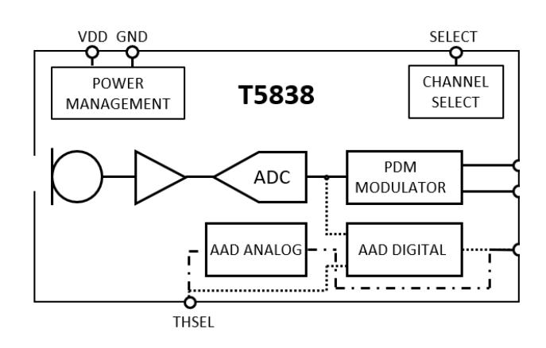

| PART                    | TEMP RANGE     | PACKAGING             |
|-------------------------|----------------|-----------------------|
| <b>MMICT5838-00-012</b> | −40°C to +85°C | 13” Tape and Reel     |
| <b>EV_T5838-FX2</b>     |                | Flex Evaluation Board |

Document Number: DS-000383

Revision: 1.1 Release Date: 4/21/2023

# **TABLE OF CONTENTS**

| General Description                                                        | 1  |
|----------------------------------------------------------------------------|----|
| Applications                                                               | 1  |
| Features                                                                   | 1  |
| Functional Block Diagram                                                   | 1  |
| Ordering Information                                                       | 1  |
| 1. Specifications                                                          | 5  |
| 1.1. Acoustical/Electrical Characteristics – General                       | 5  |
| 1.2. Acoustical/Electrical Characteristics – High Quality Mode             | 5  |
| 1.3. Acoustical/Electrical Characteristics – Low-Power Mode                | 6  |
| 1.4. Acoustical/Electrical Characteristics – Ultrasonic Mode               | 6  |
| 1.5. Acoustical/Electrical Characteristics – AAD Modes                     | 6  |
| 1.6. Digital Input/Output Characteristics                                  | 7  |
| 1.7. PDM Digital Input/Output                                              | 7  |
| 1.8. Timing Diagram                                                        | 8  |
| 2. Absolute Maximum Ratings                                                | 9  |
| 2.1. Absolute Maximum Ratings                                              | 9  |
| 2.2. ESD Caution                                                           | 9  |
| 2.3. Soldering Profile                                                     | 10 |
| 2.4. Recommended Soldering Profile*                                        | 10 |
| 3. Pin Configurations And Function Descriptions                            | 11 |
| 3.1. Pin Function Descriptions                                             | 11 |
| 4. Typical Performance Characteristics                                     | 12 |
| 5. Modes Of Operation                                                      | 14 |
| 5.1. Existing Microphone Modes                                             | 14 |
| 5.2. Acoustic Activity Dectect Microphone Modes                            | 14 |
| 5.3. AAD Modes and Description                                             | 15 |
| 5.4. Acoustic Activity Detect Analog                                       | 15 |
| 5.5. Acoustic Activity Detect Digital 1                                    | 16 |
| 5.6. Acoustic Activity Detect Digital 2                                    | 16 |
| 5.7. Mode Selection and Mode Changes before AAD Activation                 | 16 |
| 5.8. AAD Status And Disable                                                | 17 |
| 5.9. Acoustic Activity Detect Configuration Protocol                       | 17 |
| 5.10. One Wire Serial Protocol Symbols                                     | 17 |
| 5.11. Example One Wire Write                                               | 18 |
| 5.12. AAD Enable Sequence                                                  | 19 |
| 5.13. AAD Enable Sequence Writes                                           | 19 |
| 5.14. Acoustic Activity Detect Analog (AAD A) Operation and Configuration  | 19 |
| 5.15. AAD A Registers                                                      | 20 |
| 5.16. AAD A LPF Values                                                     | 20 |
| 5.17. AAD A TH Values                                                      | 21 |
| 5.18. AAD A Example Configuration and Activation Sequence                  | 21 |
| 5.19. AAD A Register Map                                                   | 22 |
| 5.20. Acoustic Activity Detect Digital (AAD D) Operation and Configuration | 22 |
| 5.21. AAD D Registers                                                      | 22 |
| 5.22. Threshold Algorithms                                                 | 23 |
| 5.23. Absolute Threshold Algorithm                                         | 23 |
| 5.24. Absolute Threshold Values                                            | 23 |
| 5.25. Relative Threshold Algorithm                                         | 24 |
| 5.26. Relative Threshold Values                                            | 24 |
| 5.27. Floor Values                                                         | 25 |
| 5.28. Minimum Pulse Duration Time                                          | 25 |
| 5.29. Minimum Pulse Duration Time Values                                   | 26 |
| 5.30. AAD D1 Example Confirguration And Activation Sequence                | 26 |
| 5.31. AAD D2 Example Confirguration And Activation Sequence                | 27 |
| 5.32. AAD D Register Map                                                   | 28 |
| 6. Theory Of Operation                                                     | 28 |
| 6.1. PDM Data Format                                                       | 28 |
| 6.2. Channel Setting                                                       | 29 |
| 6.3. PDM Microphone Sensitivity                                            | 29 |
| 7. Applications Information                                                | 30 |
| 7.1. Low-Power Mode                                                        | 30 |
| 7.2. Dynamic Range Considerations                                          | 30 |
| 7.3. Connecting PDM Microphones                                            | 30 |
| 7.4. Entering and Exiting Sleep Mode                                       | 32 |
| 7.5. Power-On Start-Up Time                                                | 32 |
| 8. Supporting Documents                                                    | 33 |
| 8.1. Application Notes – General                                           | 33 |
| 9. PCB Design And Land Pattern Layout                                      | 34 |
| 9.1. PCB Material And Thickness                                            | 35 |
| 10. Handling Instructions                                                  | 35 |
| 10.1. Pick And Place Equipment                                             | 35 |
| 10.2. Reflow Solder                                                        | 35 |
| 10.3. Board Wash                                                           | 35 |
| 11. Outline Dimensions                                                     | 36 |
| 12. Reliability Specifications                                             | 37 |
| 13. Ordering Guide                                                         | 38 |
| 14. Revision History                                                       | 39 |
| 15. Compliance Declaration Disclaimer                                      | 40 |

# 1. SPECIFICATIONS

#### 1.1. ACOUSTICAL/ELECTRICAL CHARACTERISTICS - GENERAL

 $T_A$  = 25°C, VDD = 1.8 V, SCK = 2.4 MHz,  $C_{LOAD}$  = 30 pF unless otherwise noted. Typical specifications are not guaranteed.

| PARAMETER               | CONDITIONS                              | MIN          | TYP | MAX  | UNITS | NOTES |
|-------------------------|-----------------------------------------|--------------|-----|------|-------|-------|
| PERFORMANCE             |                                         |              |     |      |       |       |
| Directionality          |                                         | Omni         |     |      |       |       |
| Output Polarity         | Input acoustic pressure vs. output data | Non-Inverted |     |      |       |       |
| Supply Voltage (VDD)    |                                         | 1.62         | 1.8 | 1.98 | V     |       |
| Sleep Mode Current (IS) | SCK < 200 kHz                           |              | 9   |      | μA    |       |
|                         | SCK = OFF                               |              | 0.8 |      | μA    |       |

Table 1. Acoustic/Electrical Characteristics – General

### 1.2. ACOUSTICAL/ELECTRICAL CHARACTERISTICS – HIGH QUALITY MODE

 $T_A$  = 25°C, VDD = 1.8 V, SCK = 2.4 MHz,  $C_{LOAD}$  = 30 pF unless otherwise noted. Typical specifications are not guaranteed.

| guaranteed.                         |                                              |     |      |     |          |       |
|-------------------------------------|----------------------------------------------|-----|------|-----|----------|-------|
| PARAMETER                           | CONDITIONS                                   | MIN | TYP  | MAX | UNITS    | NOTES |
| Sensitivity                         | 1 kHz, 94 dB SPL                             | -42 | -41  | -40 | dB FS    | 1     |
| Signal-to-Noise Ratio (SNR)         | 20 kHz bandwidth, A-weighted                 |     | 68   |     | dBA      |       |
| Equivalent Input Noise (EIN)        | 20 kHz bandwidth, A-weighted                 |     | 26   |     | dBA SPL  |       |
| Acoustic Dynamic Range              | Derived from EIN and acoustic overload point |     | 107  |     | dB       |       |
| Total Harmonic Distortion (THD)     | 94 dB SPL                                    |     | 0.1  |     | %        |       |
| Low Frequency Roll Off              | -3dB, relative to 1kHz Sensitivity           |     | 27   |     | Hz       |       |
| Power Supply Rejection Ratio (PSRR) | 20 Hz, 100 mVpp applied to V DD   |     | -86  |     |          |       |
|                                     | 1 kHz, 100 mVpp applied to V DD   |     | -122 |     |          |       |
|                                     | 5 kHz, 100 mVpp applied to V DD   |     | -112 |     | dB FS(A) |       |
|                                     | 10 kHz, 100 mVpp applied to V DD  |     | -104 |     |          |       |
|                                     | 20 kHz, 100 mVpp applied to V DD  |     | -106 |     |          |       |
| Power Supply Rejection (PSR)        | 217 Hz, 100 mV p-p square wave               |     | 112  |     | dB FS    |       |
|                                     | superimposed on VDD = 1.8 V, A-weighted      |     | -112 |     | (A)      |       |
| Power Supply Rejection—Swept Sine   | 1 kHz sine wave                              |     | -122 |     | dB FS    |       |
| Acoustic Overload Point             | 10% THD                                      |     | 133  |     | dB SPL   |       |
| Supply Current (I S )    | V DD = 1.8 V, no load             |     | 310  | 340 | μΑ       |       |

**Note 1:** Sensitivity is relative to the RMS level of a sine wave with positive amplitude equal to 100% 1s density and negative amplitude equal to 0% 1s density.

Table 2. Acoustic/Electrical Characteristics – High Quality Mode

# **1.3. ACOUSTICAL/ELECTRICAL CHARACTERISTICS – LOW-POWER MODE**

TA = 25°C, VDD = 1.8 V, SCK = 768 kHz, CLOAD = 30 pF unless otherwise noted. Typical specifications are not guaranteed.

| PARAMETER                         | CONDITIONS                                                                | MIN | TYP  | MAX | UNITS   | NOTES |
|-----------------------------------|---------------------------------------------------------------------------|-----|------|-----|---------|-------|
| Sensitivity                       | 1 kHz, 94 dB SPL                                                          | −27 | −26  | −25 | dB FS   | 1     |
| Signal-to-Noise Ratio (SNR)       | 8 kHz bandwidth, A-weighted                                               |     | 65   |     | dBA     |       |
| Equivalent Input Noise (EIN)      | 8 kHz bandwidth, A-weighted                                               |     | 29   |     | dBA SPL |       |
| Acoustic Dynamic Range            | Derived from EIN and acoustic overload point                              |     | 90   |     | dB      |       |
| Total Harmonic Distortion (THD)   | 105 dB SPL                                                                |     | 0.1  |     | %       |       |
| Power Supply Rejection (PSR)      | 217 Hz, 100 mV p-p square wave superimposed on VDD = 1.8 V, A-weighted |     | −98  |     | dB FS   |       |
| Power Supply Rejection—Swept Sine | 1 kHz sine wave                                                           |     | −107 |     | dB FS   |       |
| Acoustic Overload Point           | 10% THD                                                                   |     | 119  |     | dB SPL  |       |
| Supply Current (IS)               | VDD = 1.8 V, no load                                                      |     | 120  | 140 | µA      |       |

**Note 1:** Sensitivity is relative to the RMS level of a sine wave with positive amplitude equal to 100% 1s density and negative amplitude equal to 0% 1s density.

**Table 3. Acoustic/Electrical Characteristics – Low Power Mode**

#### **1.4. ACOUSTICAL/ELECTRICAL CHARACTERISTICS – ULTRASONIC MODE**

TA = 25°C, VDD = 1.8 V, SCK = 4.8 MHz, CLOAD = 30 pF unless otherwise noted. Typical specifications are not guaranteed.

| PARAMETER                         | CONDITIONS                                                                   | MIN | TYP  | MAX | UNITS        | NOTES |
|-----------------------------------|------------------------------------------------------------------------------|-----|------|-----|--------------|-------|
| Sensitivity                       | 1 kHz, 94 dB SPL                                                             | −42 | −41  | −40 | dB FS        | 1     |
| Signal-to-Noise Ratio (SNR)       | 20 kHz bandwidth, A-weighted                                                 |     | 68   |     | dBA          |       |
| Equivalent Input Noise (EIN)      | 20 kHz bandwidth, A-weighted                                                 |     | 26   |     | dBA SPL      |       |
| Acoustic Dynamic Range            | Derived from EIN and acoustic overload point                              |     | 107  |     | dB           |       |
| Total Harmonic Distortion (THD)   | 94 dB SPL                                                                    |     | 0.1  |     | %            |       |
| Low Frequency Roll Off            | -3dB, relative to 1kHz Sensitivity                                           |     | 27   |     | Hz           |       |
| Power Supply Rejection (PSR)      | 217 Hz, 100 mV p-p square wave superimposed on VDD = 1.8 V, A weighted |     | -112 |     | dB FS (A) |       |
| Power Supply Rejection—Swept Sine | 1 kHz sine wave                                                              |     | -123 |     | dB FS        |       |
| Acoustic Overload Point           | 10% THD                                                                      |     | 133  |     | dB SPL       |       |
| Supply Current (IS)               | VDD = 1.8 V, no load                                                         |     | 500  |     | µA           |       |

**Note 1:** Sensitivity is relative to the RMS level of a sine wave with positive amplitude equal to 100% 1s density and negative amplitude equal to 0% 1s density.

**Table 4. Acoustic/Electrical Characteristics – Ultrasonic Mode**

# **1.5. ACOUSTICAL/ELECTRICAL CHARACTERISTICS – AAD MODES**

TA = 25°C, VDD = 1.8 V, SCK = OFF, CLOAD = 30 pF unless otherwise noted. Typical specifications are not guaranteed.

| PARAMETER                          | CONDITIONS                           | MIN | TYP  | MAX | UNITS  | NOTES |
|------------------------------------|--------------------------------------|-----|------|-----|--------|-------|
| AAD ANALOG PARAMETERS              |                                      |     |      |     |        |       |
| Min AAD Analog Threshold           | 1kHz Level, AAD A_TH [3:0] = 0x0;    |     | 60   |     | dB SPL |       |
| Max AAD Analog Threshold           | 1kHz Level, AAD A_TH [3:0] = 0xF;    |     | 97.5 |     | dB SPL |       |
| AAD A Supply Current (IS)          | CLK OFF                              |     | 20   |     | µA     |       |
| AAD DIGITAL PARAMETERS             |                                      |     |      |     |        |       |
| Min AAD Digital Absolute Threshold | 230Hz Level, AADD_TH [12:0] = 0x00F; |     | 40   |     | dB SPL |       |
| Max AAD Digital Absolute Threshold | 230Hz Level, AADD_TH [12:0] = 0x7BC; |     | 87   |     | dB SPL |       |
| AAD D1 Supply Current (IS)         | CLK = 768kHz                         |     | 137  |     | µA     |       |
| AAD D2 Supply Current (IS)         | CLK OFF                              |     | 110  |     | µA     |       |

**Table 5. Acoustic/Electrical Characteristics – AAD Modes**

# **1.6. DIGITAL INPUT/OUTPUT CHARACTERISTICS**

TA = 25°C, VDD = 1.8 V unless otherwise noted. Typical specifications are not guaranteed.

| PARAMETER                 | CONDITIONS            | MIN        | TYP | MAX        | UNITS | NOTES |
|---------------------------|-----------------------|------------|-----|------------|-------|-------|
| Input Voltage High (VIH)  |                       | 0.65 × VDD |     |            | V     |       |
| Input Voltage Low (VIL)   |                       |            |     | 0.35 × VDD | V     |       |
| Output Voltage High (VOH) | ILOAD = 0.5 mA        | 0.7 × VDD  | VDD |            | V     |       |
| Output Voltage Low (VOL)  | ILOAD = 0.5 mA        |            | 0   | 0.3 × VDD  | V     |       |
| Output DC Offset          | Percent of full scale |            | 3   |            | %     |       |

**Table 6. Digital Input/Output Characteristics**

### **1.7. PDM DIGITAL INPUT/OUTPUT**

TA = 25°C, VDD = 1.8 V, unless otherwise noted. Typical specifications are not guaranteed.

| PARAMETER             | CONDITIONS                                                                                           | MIN | TYP | MAX  | UNITS | NOTES |
|-----------------------|------------------------------------------------------------------------------------------------------|-----|-----|------|-------|-------|
| MODE SWITCHING        |                                                                                                      |     |     |      |       |       |
| Sleep Time            | Time from fCLK falling <200 kHz                                                                      |     | 1   |      | ms    |       |
| Wake-Up Time          | High Quality mode, Sleep Mode to fCLK >2 MHz, output within 0.5 dB of final sensitivity, power on |     | 6   |      | ms    |       |
| Wake-Up Time          | Low-Power Mode, Sleep Mode to fCLK >400 kHz, output within 0.5 dB of final sensitivity, power on  |     | 6   |      | ms    |       |
| Switching time        | Between Low-Power and High Quality Mode                                                              |     | 3.5 |      | ms    |       |
| INPUT                 |                                                                                                      |     |     |      |       |       |
| tCLKIN                | Input clock period                                                                                   | 208 |     | 2500 | ns    |       |
|                       | AAD Write Operation                                                                                  | 50  |     |      | kHz   |       |
|                       | Sleep Mode                                                                                           |     |     | 200  | kHz   |       |
| Clock Frequency (CLK) | Low-Power Mode                                                                                       | 400 |     | 800  | kHz   |       |
|                       | High Quality Mode                                                                                    | 2.0 |     | 3.7  | MHz   |       |
|                       | Ultrasonic Mode                                                                                      | 4.2 |     | 4.8  | MHz   |       |
| Clock Duty Cycle      | fCLK <4.8 MHz                                                                                        | 45  |     | 55   | %     |       |
| tRISE                 | CLK rise time (10% to 90% level)                                                                     |     |     | 25   | ns    | 1     |
| tFALL                 | CLK fall time (90% to 10% level)                                                                     |     |     | 25   | ns    | 1     |
| OUTPUT                |                                                                                                      |     |     |      |       |       |
| t1OUTEN               | DATA1 (right) driven after falling clock edge                                                        | 30  |     | 70   | ns    | 2     |
| t1OUTDIS              | DATA1 (right) disabled after rising clock edge                                                       | 5   |     | 18   | ns    | 2     |
| t2OUTEN               | DATA2 (left) driven after rising clock edge                                                          | 30  |     | 70   | ns    | 2     |
| t2OUTDIS              | DATA2 (left) disabled after falling clock edge                                                       | 5   |     | 18   | ns    | 2     |

**Note 1:** Guaranteed by design

**Note 2:** CLOAD = ~54 pF

**Table 7. PDM Digital Input/Output**

# **1.8. TIMING DIAGRAM**

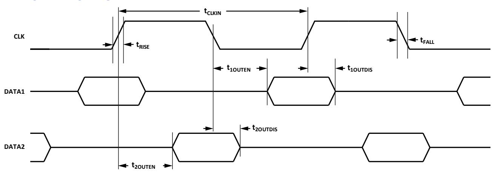

**Figure 1. Pulse Density Modulated Output Timing**

# *2. ABSOLUTE MAXIMUM RATINGS*

Stress above those listed as Absolute Maximum Ratings may cause permanent damage to the device. These are stress ratings only and functional operation of the device at these conditions is not implied. Exposure to the absolute maximum ratings conditions for extended periods may affect device reliability.

#### **2.1. ABSOLUTE MAXIMUM RATINGS**

| PARAMETER                 | RATING                                             |
|---------------------------|----------------------------------------------------|
| Supply Voltage (VDD)      | −0.3 V to +1.98 V                                  |
| Digital Pin Input Voltage | −0.3 V to VDD + 0.3 V or 1.98 V, whichever is less |
| Mechanical Shock          | 10,000 g                                           |
| Vibration                 | Per MIL-STD-883 Method 2007, Test Condition B      |
| Temperature Range         |                                                    |
| Operating                 | −40°C to +85°C                                     |
| Storage                   | −55°C to +150°C                                    |

**Table 8. Absolute Maximum Ratings**

### **2.2. ESD CAUTION**

ESD (electrostatic discharge) sensitive device. Charged devices and circuit boards can discharge without detection. Although this product features patented or proprietary protection circuitry, damage may occur on devices subjected to high energy ESD. Therefore proper ESD precautions should be taken to avoid performance degradation or loss of functionality.

# **2.3. SOLDERING PROFILE**

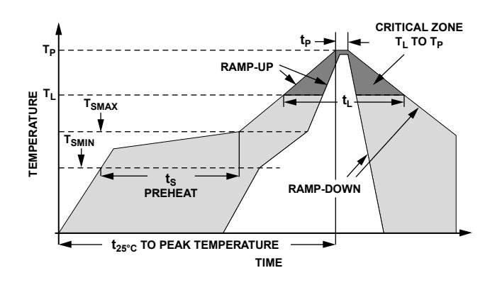

**Figure 2. Recommended Soldering Profile Limits**

# **2.4. RECOMMENDED SOLDERING PROFILE\***

| PROFILE FEATURE                                     |                             | Sn63/Pb37        | Pb-Free          |
|-----------------------------------------------------|-----------------------------|------------------|------------------|
| Average Ramp Rate (TL to TP)                        |                             | 1.25°C/sec max   | 1.25°C/sec max   |
| Preheat                                             | Minimum Temperature (TSMIN) | 100°C            | 100°C            |
|                                                     | Maximum Temperature (TSMAX) | 150°C            | 200°C            |
|                                                     | Time (TSMIN to TSMAX), tS   | 60 sec to 75 sec | 60 sec to 75 sec |
| Ramp-Up Rate (TSMAX to TL)                          |                             | 1.25°C/sec       | 1.25°C/sec       |
| Time Maintained Above Liquidous (tL)                |                             | 45 sec to 75 sec | ~50 sec          |
| Liquidous Temperature (TL)                          |                             | 183°C            | 217°C            |
| Peak Temperature (TP)                               |                             | 215°C +3°C/−3°C  | 260°C +0°C/−5°C  |
| Time Within +5°C of Actual Peak Temperature (tP) |                             | 20 sec to 30 sec | 20 sec to 30 sec |
| Ramp-Down Rate                                      |                             | 3°C/sec max      | 3°C/sec max      |
| Time +25°C (t25°C) to Peak Temperature              |                             | 5 min max        | 5 min max        |

*\*The reflow profile in Table 9 is recommended for board manufacturing with TDK MEMS microphones. All microphones are also compatible with the J-STD-020 profile*

**Note**: After 3 reflows, microphone sensitivity may deviate by up to 2 dB.

**Table 9. Recommended Soldering Profile**

# *3. PIN CONFIGURATIONS AND FUNCTION DESCRIPTIONS*

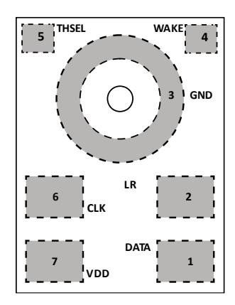

**Figure 3. Pin Configuration (Top View, Terminal Side Down)**

#### **3.1. PIN FUNCTION DESCRIPTIONS**

| PIN | NAME   | FUNCTION                                                                                                                                                                                                                                                                                                 |
|-----|--------|----------------------------------------------------------------------------------------------------------------------------------------------------------------------------------------------------------------------------------------------------------------------------------------------------------|
| 1   | DATA   | Digital Output Signal (DATA1 or DATA2)                                                                                                                                                                                                                                                                   |
| 2   | SELECT | Left Channel or Right Channel Select: DATA 1 (right): SELECT tied to GND DATA 2 (left): SELECT tied to VDD. In this setting, SELECT should be tied to the same voltage source as the VDD pin.                                                                                                   |
| 3   | GND    | Ground                                                                                                                                                                                                                                                                                                   |
| 4   | WAKE   | Wake Output Pin. Interrupt pin for Acoustic Activity Detect (AAD) Modes. Outputs HIGH state to indicate the acoustic stimulus exceeds AAD conditions, returns LOW when the stimulus no longer exceeds them. For operation without AAD modes, this pin can be tied to Gnd or left as No Connect. |
| 5   | THSEL  | Threshold Select Input Pin. Used to both enable and configure AAD Modes. For operation without AAD modes, this pin can be tied to Gnd or left as No Connect.                                                                                                                                          |
| 6   | CLK    | Clock Input to Microphone                                                                                                                                                                                                                                                                                |
| 7   | VDD    | Power Supply. For best performance and to avoid potential parasitic artifacts, place a 0.1 µF (100 nF) ceramic type X7R capacitor between Pin 7 (VDD) and ground. Place the capacitor as close to Pin 7 as possible.                                                                               |

**Table 10. Pin Function Descriptions**

# *4. TYPICAL PERFORMANCE CHARACTERISTICS*

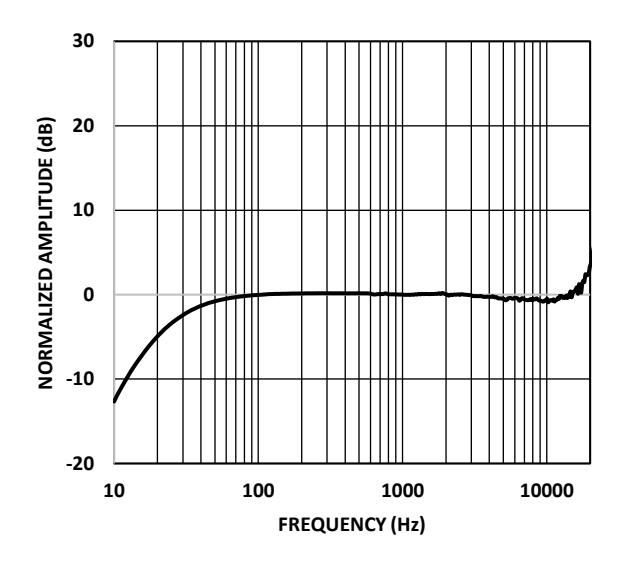

**Figure 4. Typical Audio Frequency Response, High Quality Mode**

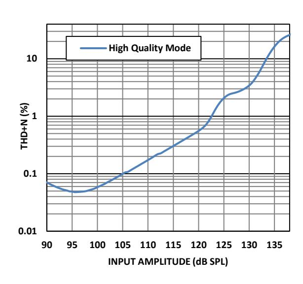

**Figure 5. THD + N High Quality Mode**

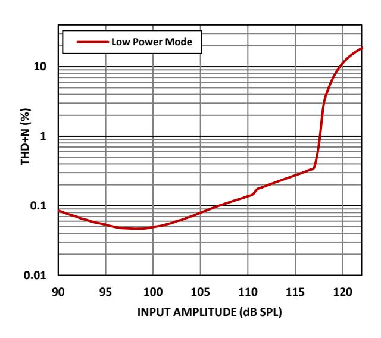

**Figure 6. THD + N Low-Power Mode Figure 7. Linearity**

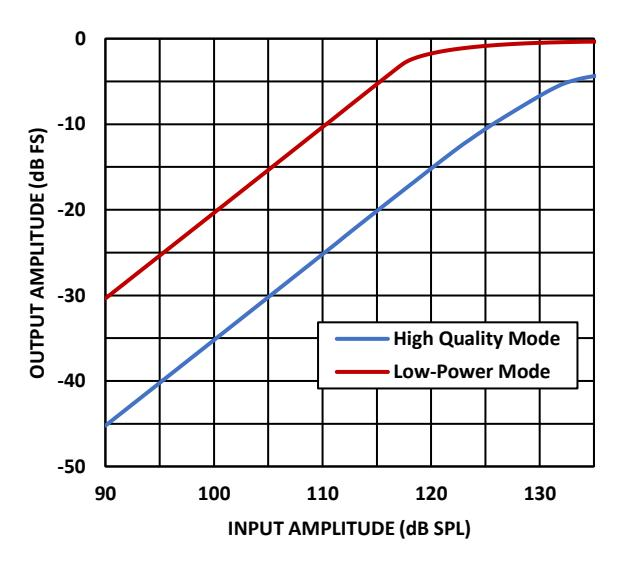

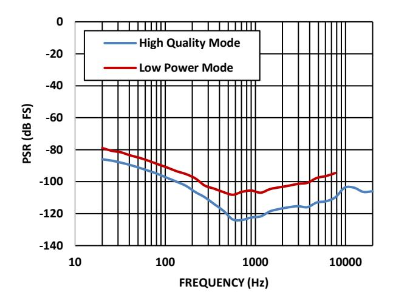

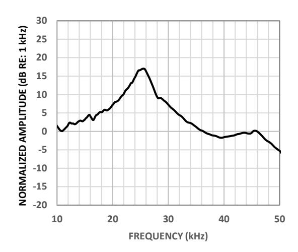

**Figure 8. PSR vs Frequency Figure 9. Typical Ultrasonic Frequency Response, Ultrasonic Mode**

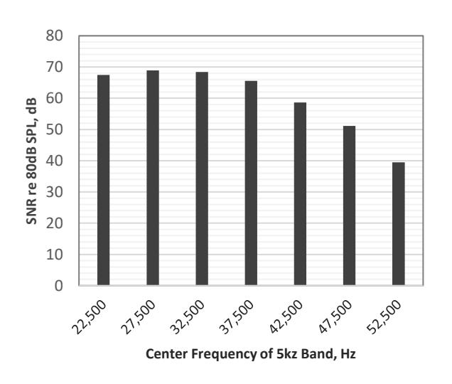

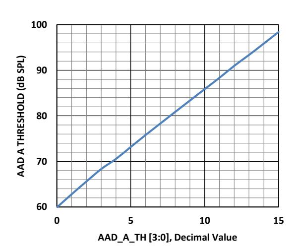

**Figure 10. Typical Ultrasonic SNR, Ultrasonic Mode Figure 11. AAD Analog Threshold vs Register Value**

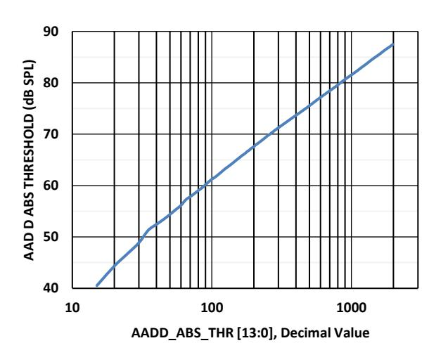

**Figure 12. AAD Digital 1,2 Absolute Threshold vs Register Value**

**Figure 13. AAD Digital 1,2 Relative Threshold vs Register Value**

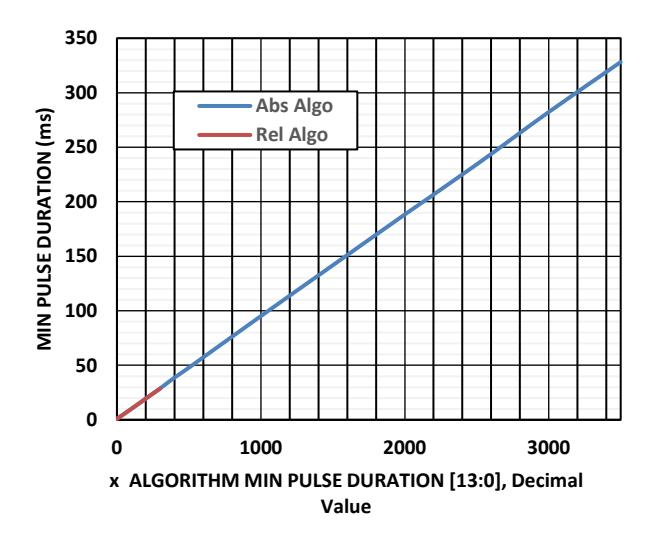

**Figure 14. AAD Digital Min Pulse Duration vs Register Value**

# *5. MODES OF OPERATION*

#### **5.1. EXISTING MICROPHONE MODES**

Commonly used digital MEMS microphone operating modes are offered on T5838: Sleep, Low Power, High Quality Mode, and Ultrasonic Mode. They are selected via the CLK frequency.

#### **5.2. ACOUSTIC ACTIVITY DECTECT MICROPHONE MODES**

T5838 introduces Acoustic Activity Detect (AAD) Modes which are parallel processing features which operate within Sleep and Low Power Modes. The on-chip processing of these AAD Modes determine if acoustic activity has occurred or not. There are three different types: AAD Analog, AAD Digital 1 and AAD Digital 2 as outlined in the table below. The activation and configuration for all AAD Modes is carried out via a one wire write on the THSEL pin. When the activity detect conditions are met, the WAKE pin is set HIGH, when the conditions are no longer met the WAKE pin automatically returns LOW (without any type of reset required from the SoC/master).

# **5.3. AAD MODES AND DESCRIPTION**

| MICROPHONE POWER MODE (IN PARALLEL) | ACOUSTIC ACTIVITY DETECT (AAD) MODE NAME | DESCRIPTION                                      | CONFIGURABLE OPTIONS                                                               |
|-------------------------------------------|------------------------------------------------|--------------------------------------------------|------------------------------------------------------------------------------------|
| Sleep Mode                                | AAD Analog (AAD A)                          | Analog activity detect, lowest power          | Absolute Threshold (60-97.5dB SPL), LPF (1.1kHz-4.4kHz)                         |
| Low-Power Mode                            | AAD Digital 1 (AAD D1)                      | Digital activity detect with PDM bitstream    | Absolute Threshold (40-87dB SPL), Relative Threshold (3dB-20dB), Pulse Duration |
| Sleep Mode                                | AAD Digital 2 (AAD D2)                      | Digital activity detect without PDM bitstream | Absolute Threshold (40-87dB SPL), Relative Threshold (3dB-20dB), Pulse Duration |

**Table 11. AAD Modes and Description**

[Figure 15](#page-14-2) shows the required sequence for transitioning between modes of operation. In order to ensure proper functionality when the system transitions from either Low Power Mode or High Quality Mode, it must pass through an interim sleep mode before entering Sleep Mode with AAD active. To enter this intermediate state the clock frequency must be changed to be between the range of 50 kHz and 200 kHz for a minimum of 2 ms. This allows time for the system to correctly power-down blocks before it moves to Sleep Mode with AAD Active.

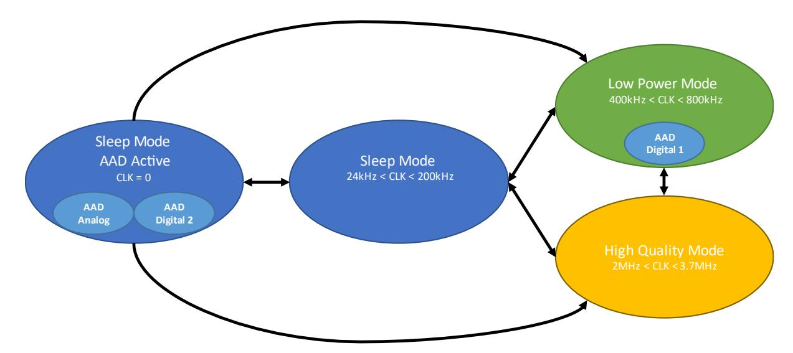

**Figure 15. T5838 Mode Transitions** 

# **5.4. ACOUSTIC ACTIVITY DETECT ANALOG**

AAD Analog takes the signal from the MEMS after the pre-amp and compares it to the preselected conditions, Absolute Threshold and Low Pass Filter Frequency. If the signal is above the Absolute Threshold and is below the LPF cutoff, the WAKE Pin will be set high. The WAKE pin will continue to remain high while these conditions are met and will return low when the signal level returns below this level. AAD\_A\_EN bit needs to be set and CLK needs to be OFF for AAD Analog (AAD A) to operate. The microphone consumes only 20uA in this mode.

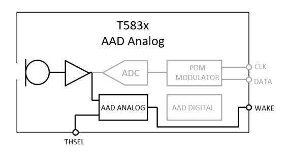

**Figure 16. Block Diagram for AAD Analog Operation**

# **5.5. ACOUSTIC ACTIVITY DETECT DIGITAL 1**

AAD Digital 1 is an add on to Low Power Mode where the digital bitstream is analyzed by the AAD Digital logic to see if it meets the preselected conditions Absolute Threshold, Relative Threshold and Pulse Duration. If the conditions are met the WAKE Pin will be set high. The WAKE pin will remain high while these conditions are met and will return low when the signal level returns below this level. The PDM bitstream is running throughout, which allows the Application Processor to buffer the bitstream and carry out 2nd stage verification or further analysis of the signal which triggered the AAD Digital 1 (AAD D1) event.

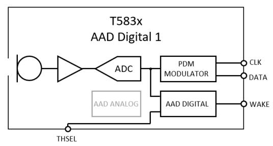

**Figure 17. Block Diagram for AAD Digital 1 Operation**

#### **5.6. ACOUSTIC ACTIVITY DETECT DIGITAL 2**

AAD Digital 2, like AAD D1 analyzes the digital bitstream to check for activity meeting the preselected conditions (same configurable options as AAD D1). However, AAD D2 does not require an external CLK (by using an internal CLK) allowing power savings at the microphone and at the system level but does not facilitate the PDM bitstream like AAD D1. Like the other AAD modes the WAKE pin is set high when the AAD D2 conditions are met and returns low when the conditions are no longer met.

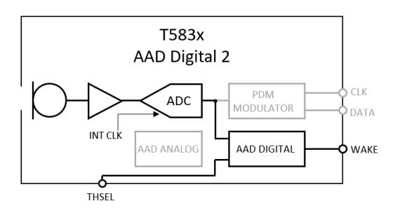

**Figure 18. Block Diagram for AAD Analog Operation**

### **5.7. MODE SELECTION AND MODE CHANGES BEFORE AAD ACTIVATION**

AAD A or AAD D1/2 can be configured and enabled while the microphone is in any of its modes (sleep mode one wire writes require CLK active for communication to function i.e. 50kHz<CLK<200kHz). After configuration and

enabling, AAD will go active (represented by acoustic activity on the WAKE pin) when the microphone enters its corresponding mode (decided by the CLK frequency). AAD A and AAD D2 are run when the device is in Sleep mode (CLK=OFF), AAD D1 is run when the device is in Low Power mode (CLK=768kHz).

#### **5.8. AAD STATUS AND DISABLE**

After an AAD mode has been enabled it will remain enabled as long as power is maintained to the microphone or until it has been specifically disabled by setting the AADx\_EN bit to 0.

#### **5.9. ACOUSTIC ACTIVITY DETECT CONFIGURATION PROTOCOL**

A serial one wire protocol on the THSEL pin controls all the Acoustic Activity Detect modes, AAD A, AAD D1 and AAD D2. The protocol requires the standard PDM CLK to be running at a speed >50kHz and the THSEL pin is modulated proportional to the CLK cycles to create the following symbols for logic zeros or ones which in turn form the device address, register address and data of the command. There are also unique symbols for start/pilot and stop to terminate each write. The start/pilot pulse width is important as it defines the pulse width of the *Zero*, *One*, *Space* and *Stop* symbols. The *Zero* and *One* symbols are a form of encoding to represent bit values of 0 and 1 values respectively. See below for details.

| 5.10. | ONE WIRE SERIAL PROTOCOL SYMBOLS |  |
|-------|----------------------------------|--|
|-------|----------------------------------|--|

| SYMBOL      | DESCRIPTION                                           | THSEL     | SYMBOL PULSE WIDTH |               |               |
|-------------|-------------------------------------------------------|-----------|--------------------|---------------|---------------|
| NAME        |                                                       | CONDITION | MIN                | TYPICAL       | MAX           |
| Start/Pilot | Start symbol which also defines the PILOT width TP | HIGH      | 8 CLK cycles       | 10 CLK cycles | 20 CLK cycles |
| Zero        | Symbol for bit value = 0                              | HIGH      |                    | 1 x TP        | 1.5 x TP      |
| One         | Symbol for bit value = 1                              | HIGH      | 2 x TP             | 3 x TP        | 3.5 x TP      |
| Stop        | Stop symbol                                           | HIGH      | 128 x CLK          |               |               |
| Space       | Separate individual symbols above                     | LOW       | 1 x TP             | 1 x TP        | 2 x TP        |

\*Although operation is guaranteed within the min max ranges it is recommended to use the typical values shown in the table above

**Table 12. One Wire Serial Protocol Symbols**

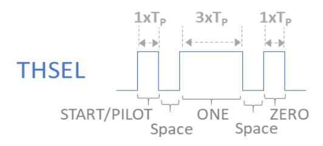

**Figure 19. Example write on THSEL followed by a single bit Zero and One relative to the PILOT**

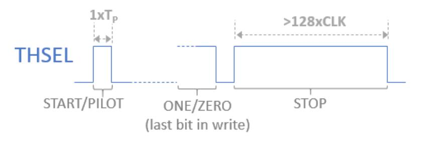

**Figure 20. Write termination with Stop**

The total write sequence consists of START/PILOT + 24 bits of payload + STOP. The payload consists of three 8 bit fields:

- Device Address + RW 7'b1010011 (Constant for this device) + 1'b0 (0 rite, constant for this device)
- Register Address = 8-bit value, determined by AAD function lookup table
- Data = 8-bit value, determined by AAD function lookup table

#### Example of AAD total write sequence:

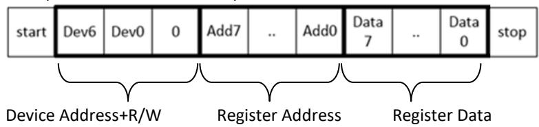

#### Example Write:

Device Addr+R/W = 10100110 (Constant for this device)

Register Address = 00000001 (Example Reg Addr only, not an option)

Register Data = 00000010 (Example data)

CLK = 100kHz TCLK = 10us

The write calculations based on 100kHz CLK, 10 CLK cycle PILOT are shown below:

# **5.11. EXAMPLE ONE WIRE WRITE**

| SYMBOL NAME | DESCRIPTION                                                                  | THSEL CONDITION | CALCULATION       | WIDTH      |
|----------------|------------------------------------------------------------------------------|--------------------|-------------------|------------|
| Start/Pilot    | Start/Pilot which indicates start of write and defines logic pulse widths | HIGH               | 10 X TCLK         | 100us = TP |
| Zero           | Single bit Zero                                                              | HIGH               | 1 x TP            | 100us      |
| One            | Single bit One                                                               | HIGH               | 3 x TP            | 300us      |
| Stop           | Stop Signal                                                                  | HIGH               | >128 x CLK period | >1280us    |
| Space          | Separate individual symbols above                                            | LOW                | 1 x TP            | 100us      |

**Table 13. Example One Wire Write**

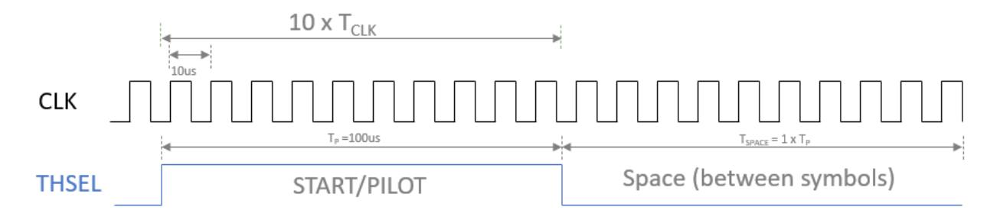

**Figure 21. Timing diagram for example above showing relationship between THSEL pilot and CLK**

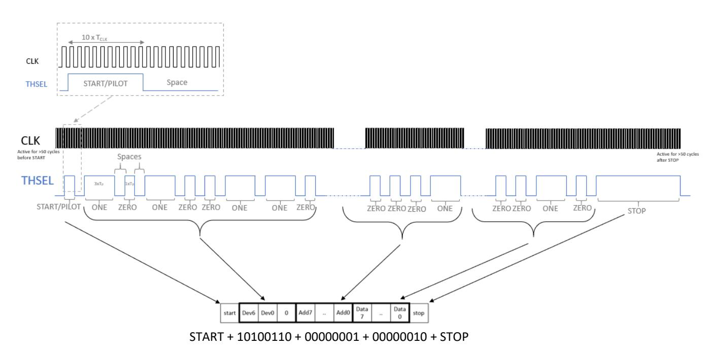

**Figure 22. Expanded Timing diagram example showing start, 3 x 8 bit values and stop being written to the device, with the low level translation of each bit to their respective symbols.**

# **5.12. AAD ENABLE SEQUENCE**

Using the write sequence above, the Acoustic Activity Detect (for all 3 modes) is enabled using the following five writes in this sequence:

### **5.13. AAD ENABLE SEQUENCE WRITES**

| WRITE # | REGISTER ADDRESS (HEX) | REGISTER DATA (HEX) |
|---------|---------------------------|------------------------|
| 1       | 0x5C                      | 0x00                   |
| 2       | 0x3E                      | 0x00                   |
| 3       | 0x6F                      | 0x00                   |
| 4       | 0x3B                      | 0x00                   |
| 5       | 0x4C                      | 0x00                   |

**Table 14. AAD Enable Sequence Writes**

For example, sequence write #1 from above with Address 0x5C (b01011100) and Data 0x00 (b00000000) would be:

#### **START + 10100110 + 01011100 + 00000000 + STOP**

After this sequence has been completed any of the configuration settings for the AAD Analog or AAD Digital modes can be adjusted. The enable sequence can be written once to the microphone and will remain valid as long as power is maintained to the microphone. If the mic goes through a power cycle, then the sequence will have to be repeated.

### **5.14. ACOUSTIC ACTIVITY DETECT ANALOG (AAD A) OPERATION AND CONFIGURATION**

Acoustic Activity Detect Analog (AAD A) compares the analog signal from the MEMS with the defined conditions configured by the user - threshold level and Low Pass Frequency cutoff. If the acoustic signal meets the conditions set (above the threshold and below the LPF cutoff) then the WAKE pin (pin4) will be set high and will stay high

while the acoustic stimulus continues to meet those conditions. When the acoustic stimulus no longer meets the conditions the WAKE pin will automatically return to a LOW state. See [Figure 23.](#page-19-2) The microphone consumes only 20A when in AAD A mode.

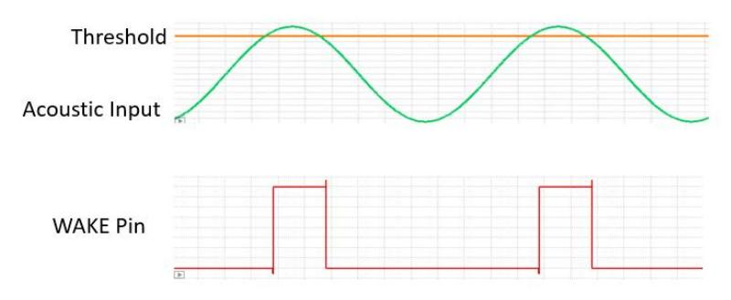

**Figure 23. AAD A Threshold level and WAKE pin activation**

# **5.15. AAD A REGISTERS**

| REG NAME       | REG ADDR [BIT] | FUNCTION                                                                                         |
|----------------|----------------|--------------------------------------------------------------------------------------------------|
| AAD A_LPF[2:0] | Reg 0x35[2:0]  | 3-bits to define the Low Pass Filter corner over a range of 1.2kHz to 4.4 kHz                 |
| AAD A_TH[3:0]  | Reg 0x36[3:0]  | 4-bits to define the Trigger Threshold. Eight levels available from 60 dB SPL to 97.5 dB SPL. |
| AAD A_EN[1]    | Reg 0x29[3]    | Analog Acoustic Activity Detect (AAD A) Enable. 0 = Disabled, 1 = Enabled. Default = 0        |

**Table 15. AAD A Registers**

On AAD A enabling, the microphone will acknowledge by pulsing the WAKE pin HIGH for about 12 us.

#### **5.16. AAD A LPF VALUES**

All levels, frequencies, and timing values in the AAD A and AAD D configuration sections are typical.

| AAD A_LPF (HEX) | FREQUENCY (kHz) |
|--------------------|--------------------|
| 0x1                | 4.4                |
| 0x2                | 2.0                |
| 0x3                | 1.9                |
| 0x4                | 1.8                |
| 0x5                | 1.6                |
| 0x6                | 1.3                |
| 0x7                | 1.1                |

**Table 16. AAD A LPF Values**

#### **5.17. AAD A TH VALUES**

| AAD A_TH [3:0] (HEX) | AAD A_TH (DEC) | THRESHOLD (dB SPL) |
|-------------------------|-------------------|-----------------------|
| 0x0                     | 0                 | 60                    |
| 0x2                     | 2                 | 65                    |
| 0x4                     | 4                 | 70                    |
| 0x6                     | 6                 | 75                    |
| 0x8                     | 8                 | 80                    |
| 0xA                     | 10                | 85                    |
| 0xC                     | 12                | 90                    |
| 0xE                     | 14                | 95                    |
| 0xF                     | 15                | 97.5                  |

**Table 17. AAD A TH Values**

### **5.18. AAD A EXAMPLE CONFIGURATION AND ACTIVATION SEQUENCE**

AAD Analog can be activated with the following sequence of powerup conditions and register writes:

- 1. Apply Vdd, apply CLK > 50 kHz
- 2. Apply AAD Unlock write sequence:

| WRITE # | REGISTER ADDRESS (HEX) | REGISTER DATA (HEX) |
|---------|---------------------------|------------------------|
| 1       | 0x5C                      | 0x00                   |
| 2       | 0x3E                      | 0x00                   |
| 3       | 0x6F                      | 0x00                   |
| 4       | 0x3B                      | 0x00                   |
| 5       | 0x4C                      | 0x00                   |

3. Configure AAD A settings, AAD A\_LPF = 0x1 (4.4kHz), AAD A\_TH = 0x4 (70 dB SPL)

| WRITE # | REGISTER ADDRESS (HEX) | REGISTER DATA (HEX) |
|---------|---------------------------|------------------------|
| 6       | 0x35                      | 0x01                   |
| 7       | 0x36                      | 0x04                   |

4. Enable AAD A

| WRITE # | REGISTER ADDRESS (HEX) | REGISTER DATA (HEX) |
|---------|---------------------------|------------------------|
| 8       | 0x29                      | 0x08                   |

The microphone will acknowledge the enable by pulsing the WAKE pin HIGH for about 12 us.

5. Activate AAD A by setting CLK to a frequency between 50 kHz and 200 kHz for 2 ms followed by setting CLK = OFF. The microphone will now set the WAKE pin HIGH in response to acoustic stimulus above 70 dB SPL and less than 4.4 kHz.

#### **5.19. AAD A REGISTER MAP**

| AAD Analog (AAD A) Register Map |                              |       |                |               |          |              |              |       |
|---------------------------------|------------------------------|-------|----------------|---------------|----------|--------------|--------------|-------|
| Address                         | bit 7                        | bit 6 | bit 5          | bit 4         | bit 3    | bit 2        | bit 1        | bit 0 |
| 29h                             | Reserved                     |       |                | AAD A_EN      | Reserved | AAD D2_EN | AAD D1_EN |       |
| 2Ah                             | Reserved Unused for AAD A |       |                |               |          |              |              |       |
| 2Bh                             | Unused for AAD A             |       |                |               |          |              |              |       |
| 2Eh                             | Unused for AAD A             |       |                |               |          |              |              |       |
| 2Fh                             | Unused for AAD A             |       |                |               |          |              |              |       |
| 30h                             | Unused for AAD A             |       |                |               |          |              |              |       |
| 31h                             | Unused for AAD A             |       |                |               |          |              |              |       |
| 32h                             | Unused for AAD A             |       |                |               |          |              |              |       |
| 33h                             | Unused for AAD A             |       |                |               |          |              |              |       |
| 35h                             | Reserved                     |       | AAD A_LPF[2:0] |               |          |              |              |       |
| 36h                             | Reserved                     |       |                | AAD A_TH[3:0] |          |              |              |       |

**Table 18. AAD A Register Map**

### **5.20. ACOUSTIC ACTIVITY DETECT DIGITAL (AAD D) OPERATION AND CONFIGURATION**

AAD Digital provides a more advanced method of activity detection compared to AAD Analog. It has two modes of operation - AAD D1 and AAD D2, where D1 requires an external CLK and provides a PDM bitstream output, and D2 where no external CLK is required, but no PDM bitstream is produced. The activity detection capability operates in the same way for AAD D1 or AAD D2 so the following settings apply to both modes. Their configuration is still applied via one wire writes on the THSEL pin and the output is shown as activity on the WAKE pin.

Both AAD D1 and AAD D2 share registers which are defined as shown in [Table 19:](#page-21-3)

#### **5.21. AAD D REGISTERS**

| REGISTER NAME                   | REG ADDR [BIT]               | FUNCTION                                                                                                                                                                                          |
|---------------------------------|------------------------------|---------------------------------------------------------------------------------------------------------------------------------------------------------------------------------------------------|
| <b>AADD_EN[1:0]</b>             | Reg 0x29[1:0]                | Digital Acoustic Activity Detect (AADD). 0x1 = AAD D1 Enable, 0x2 = AAD D2 Enable. Default = 0x0 (AAD D1, D2 both disabled).                                                                |
| <b>AADD_FLOOR[12:0]</b>         | Reg0x2A[4:0] Reg0x2B[7:0] | 13-bits used to set the Relative Threshold for both AAD D1 and AAD D2 modes. The allowable range for these bits is 0x0F – 0x7BC.                                                            |
| <b>AADD_REL_PULSE_MIN[11:0]</b> | Reg0x2F[3:0] Reg0x2E[7:0] | 12-bits used to set the minimum duration the acoustic signal must exceed before the Relative Threshold detection mode is activated. The allowable range for these bits is 0x000 to 0x12C |
| <b>AADD_ABS_PULSE_MIN[11:0]</b> | Reg0x2F[7:4] Reg0x30[7:0] | 12-bits used to set the minimum duration the acoustic signal must exceed before the Absolute Threshold detection mode is activated. The allowable range for these bits is 0x000 to 0xDAC |
| <b>AADD_ABS_TH[12:0]</b>        | Reg0x32[4:0] Reg0x31[7:0] | 13-bits used to set the Absolute Threshold detection level. The allowable range for these bits is 0x0F – 0x7BC.                                                                             |
| <b>AADD_REL_TH[7:0]</b>         | Reg0x33[7:0]                 | Configures the gain for the AADD modes. See text for details. Gain range is limited to 3dB to 20dB or 0x24 to 0xFF                                                                          |

**Table 19. AADD Registers**

On AAD D enabling, the microphone will acknowledge by pulsing the WAKE pin HIGH for about 12 us.

The functionality of the AADD mode registers is shown diagrammatically in [Figure 24](#page-22-3) below.

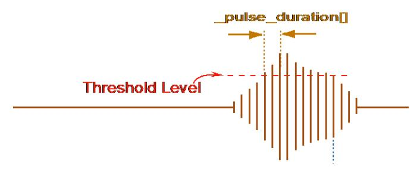

**Figure 24. AADD Parameter Visualization**

#### **5.22. THRESHOLD ALGORITHMS**

Once activated, the AAD D processing block waits for an acoustic signal in the voice band to exceed the defined conditions – threshold and minimum pulse duration. There are two threshold options: an absolute threshold (similar to AAD Analog, but with wider range and voice band filter), or relative threshold (a dynamic/adaptive threshold also with wide range and voice band filter). The absolute and relative threshold algorithms work in parallel and are described in more detail in the next section. Like AAD Analog, the AAD Digital block sets the WAKE pin high when stimulus exceeds the conditions, WAKE stays high while the stimulus remains at those levels and pulls WAKE low when the stimulus drops below the defined conditions.

#### **5.23. ABSOLUTE THRESHOLD ALGORITHM**

This is the simplest of the threshold settings and simply sets the threshold above which the AAD is triggered. AAD D is a more sophisticated version of the AAD A in that it incorporates parameters like a voice filter and configurable minimum pulse duration to help distinguish voice from background sound.

Setting the **AADD\_ABS\_TH** register defines the sound pressure level which will trigger the wake. It operates similar to AAD A, but with the ability to configure an additional voice filter and minimum pulse duration. It is an absolute value that once the acoustic stimulus exceeds the defined threshold the process of activating the WAKE pin is started. The absolute threshold is set by writing to the 13-bits in register *AADD\_ABS\_TH[12:0]* (reg addresses 0x32 and 0x31). The allowed range of values is 0x00F to 0x7BC.

| AADD_ABS_ TH (HEX) | AADD_ABS_ TH (DEC) | THRESHOLD (dB SPL) |
|-----------------------|-----------------------|-----------------------|
| F                     | 15                    | 40                    |
| 16                    | 22                    | 45                    |
| 32                    | 50                    | 50                    |
| 37                    | 55                    | 55                    |
| 5F                    | 95                    | 60                    |
| A0                    | 160                   | 65                    |
| 113                   | 275                   | 70                    |
| 1E0                   | 480                   | 75                    |
| 370                   | 880                   | 80                    |
| 62C                   | 1580                  | 85                    |
| 7BC                   | 1980                  | 87                    |

Note: Values below 0xF or above 0x7BC are not supported or recommended.

**Table 20. Absolute Threshold Values**

# **5.25. RELATIVE THRESHOLD ALGORITHM**

The Relative Threshold mode operates in a way which allows the threshold to be dynamic i.e. an instantaneous threshold, and is triggered if the threshold exceeds the Established SPL (running average background level) plus a configurable relative level i.e. +6dB or +12dB). The configurable relative level also has an option of setting a floor below which this dynamic threshold will become static and the instantaneous threshold level will be fixed at the floor level plus the relative level. This can be used to avoid false detections at lower SPLs. In summary the behavior of the threshold can be defined for the following scenarios:

- If the incoming SPL is less than the Floor + Relative Threshold -> The Instantaneous Threshold is fixed and is calculated from Floor + Relative Threshold
- If the incoming SPL is greater than the Floor + Relative Threshold -> The Instantaneous Threshold is dynamic and is calculated from Established SPL + Relative Threshold

See [Figure 25](#page-23-2) for a graphical illustration.

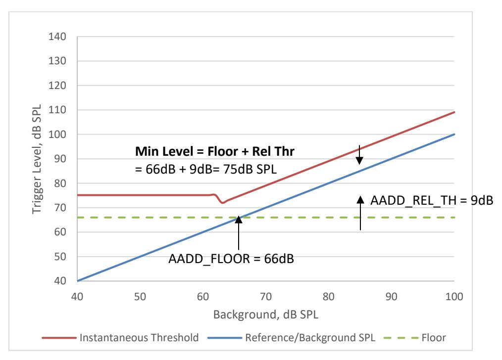

**Figure 25. Relative Threshold with floor indicated**

# **5.26. RELATIVE THRESHOLD VALUES**

| AADD_REL_TH (HEX) | AADD_REL_TH (DEC) | RELATIVE THRESHOLD (dB) |
|----------------------|----------------------|-------------------------------|
| 24                   | 36                   | +3                            |
| 36                   | 50                   | +6                            |
| 48                   | 72                   | +9                            |
| 64                   | 100                  | +12                           |
| 8F                   | 143                  | +15                           |
| CA                   | 202                  | +18                           |
| FF                   | 255                  | +20                           |

**Table 21. Relative Threshold Values**

The floor level register *AADD\_FLOOR[12:0]*, in conjunction with the relative threshold register *AADD\_REL\_TH[7:0],* defines the required FLOOR level in relation to a background acoustic level after which the threshold tracks the

background dB SPL as it increases and at a level above it defined by the **AADD\_REL\_TH** register. The allowed range for *AADD\_FLOOR[12:0]* is 0x00F to 0x7BC. Values below 0x00F are not allowed. The allowed range for the **AADD\_REL\_TH** register is 0x24 to 0xFF.

For example, with *AADD\_FLOOR[12:0]* = 0xFF (255d) the threshold level will be 69dB SPL.

### **5.27. FLOOR VALUES**

| AADD_FLOOR [12:0] (HEX) | AADD_FLOOR [12:0] (DEC) | FLOOR LEVL (dB SPL) |
|----------------------------|----------------------------|------------------------|
| F                          | 15                         | 40                     |
| 16                         | 22                         | 45                     |
| 32                         | 50                         | 50                     |
| 37                         | 55                         | 55                     |
| 5F                         | 95                         | 60                     |
| A0                         | 160                        | 65                     |
| 113                        | 275                        | 70                     |
| 1E0                        | 480                        | 75                     |
| 370                        | 880                        | 80                     |
| 62C                        | 1580                       | 85                     |
| 7BC                        | 1980                       | 87                     |

Note: Values below 0xF or above 0x7BC are not supported or recommended.

**Table 22. Floor Values**

#### **5.28. MINIMUM PULSE DURATION TIME**

To prevent the acoustic activity detect circuitry triggering on every acoustic event that exceeds the defined threshold the system requires a minimum duration for the acoustic stimulus to be present before the AADD mode can be defined. This prevents the systems from activating on short duration acoustic impulses that might not be valid triggers. There are two pulse duration times that are configurable - one for Relative Threshold (**AADD\_REL\_PULSE\_MIN[11:0]** at Reg0x2F[3:0] and Reg0x2E[7:0]) and the other for Absolute Threshold mode (**AADD\_ABS\_PULSE\_MIN[11:0]** at Reg0x2F[7:4] and Reg0x30[7:0]).

The pulse minimum time for the relative threshold has a narrower configurable range compared to the option for the absolute threshold, due to the responsiveness of the relative threshold to the environment. It is not recommended to use a pulse minimum value above 0x12C for the AADD\_REL\_PULSE\_MIN as this could result in unresponsive behavior for the relative algorithm.

AADD\_REL\_PULSE\_MIN and AADD\_ABS\_PULSE\_MIN have approximately the same pulse times vs configuration values where their useable ranges overlap. A selection of values for each is shown i[n Table 23](#page-25-2) below:

# **5.29. MINIMUM PULSE DURATION TIME VALUES**

| AADD_x_PULSE_MIN [12:0] (HEX) | AADD_x_PULSE_MIN [12:0] (DEC) | RELATIVE ALGORITHM MIN PULSE DURATION (ms) | ABSOLUTE ALGORITHM MIN PULSE DURATION (ms) |
|----------------------------------|----------------------------------|-----------------------------------------------------|-----------------------------------------------------|
| 0                                | 0                                | 0.7                                                 | 1.1                                                 |
| 64                               | 100                              | 10                                                  | 10                                                  |
| C8                               | 200                              | 19                                                  | 19                                                  |
| 12C                              | 300                              | 29                                                  | 29                                                  |
| 1F4                              | 500                              | N/A                                                 | 48                                                  |
| 3E8                              | 1000                             | N/A                                                 | 95                                                  |
| 7D0                              | 2000                             | N/A                                                 | 188                                                 |
| BB8                              | 3000                             | N/A                                                 | 282                                                 |
| DAC                              | 3500                             | N/A                                                 | 328                                                 |

**Table 23. Minimum Pulse Duration**

# **5.30. AAD D1 EXAMPLE CONFIRGURATION AND ACTIVATION SEQUENCE**

AAD Digital 1 can be activated with the following sequence of powerup conditions and register writes:

- 1. Apply Vdd, apply CLK > 50 kHz
- 2. Apply AAD Unlock write sequence:

| WRITE # | REGISTER ADDRESS (HEX) | REGISTER DATA (HEX) |
|---------|---------------------------|------------------------|
| 1       | 0x5C                      | 0x00                   |
| 2       | 0x3E                      | 0x00                   |
| 3       | 0x6F                      | 0x00                   |
| 4       | 0x3B                      | 0x00                   |
| 5       | 0x4C                      | 0x00                   |

3. Apply AAD D settings, ABS\_TH = 0x113 (70dB SPL), FLOOR = 0x16 (45dB SPL), RE\_TH = 0x24 (+3dB), REL\_PULSE\_MIN = 0x0, ABS\_PULSE\_MIN = 0

| WRITE # | REGISTER ADDRESS (HEX) | REGISTER DATA (HEX) |
|---------|---------------------------|---------------------|
| 6       | 0x31                      | 0x13 (ABS_TH LSBs)  |
| 7       | 0x32                      | 0x01 (ABS_TH MSBs)  |
| 8       | 0x36                      | 0x04                |
| 9       | 0x2B                      | 0x24                |
| 10      | 0x2E                      | 0x00                |
| 11      | 0x30                      | 0x00                |

4. Enable AAD D1

| WRITE # | REGISTER ADDRESS (HEX) | REGISTER DATA (HEX) |
|---------|---------------------------|------------------------|
| 12      | 0x29                      | 0x01                   |

The microphone will acknowledge the enable by pulsing the WAKE pin HIGH for about 12 us.

5. Activate AAD D1 by setting CLK = 768 kHz. The microphone will now set the WAKE pin HIGH in response to acoustic stimulus in the voice band above the acoustic threshold.

### **5.31. AAD D2 EXAMPLE CONFIRGURATION AND ACTIVATION SEQUENCE**

AAD Digital 2 can be activated with the following sequence of powerup conditions and register writes:

- 1. Apply Vdd, apply CLK > 50 kHz
- 2. Apply AAD Unlock write sequence:

| WRITE # | REGISTER ADDRESS (HEX) | REGISTER DATA (HEX) |
|---------|---------------------------|------------------------|
| 1       | 0x5C                      | 0x00                   |
| 2       | 0x3E                      | 0x00                   |
| 3       | 0x6F                      | 0x00                   |
| 4       | 0x3B                      | 0x00                   |
| 5       | 0x4C                      | 0x00                   |

3. Apply AAD D settings, ABS\_TH = 0x113 (70dB SPL), FLOOR = 0x16 (45dB SPL), RE\_TH = 0x24 (+3dB), REL\_PULSE\_MIN = 0x0, ABS\_PULSE\_MIN = 0 (same as previous example configuration)

| WRITE # | REGISTER ADDRESS (HEX) | REGISTER DATA (HEX) |
|---------|---------------------------|------------------------|
| 6       | 0x31                      | 0x13 (ABS_TH LSBs)     |
| 7       | 0x32                      | 0x01 (ABS_TH MSBs)     |
| 8       | 0x36                      | 0x04                   |
| 9       | 0x2B                      | 0x24                   |
| 10      | 0x2E                      | 0x00                   |
| 11      | 0x30                      | 0x00                   |

4. Enable AAD D2

| WRITE # | REGISTER ADDRESS (HEX) | REGISTER DATA (HEX) |
|---------|---------------------------|------------------------|
| 12      | 0x29                      | 0x01                   |

The microphone will acknowledge the enable by pulsing the WAKE pin HIGH for about 12 us.

5. Activate AAD D2 by setting CLK to a frequency between 50 kHz and 200 kHz for 2 ms followed by setting CLK = OFF. The microphone will now set the WAKE pin HIGH in response to acoustic stimulus in the voice band above the acoustic threshold.

# **5.32. AAD D REGISTER MAP**

| AAD Digital (AADD) Register Map |                          |       |       |       |                          |                 |           |           |
|---------------------------------|--------------------------|-------|-------|-------|--------------------------|-----------------|-----------|-----------|
| Address                         | bit 7                    | bit 6 | bit 5 | bit 4 | bit 3                    | bit 2           | bit 1     | bit 0     |
| 29h                             | Reserved                 |       |       |       | AAD A_EN                 | Reserved        | AAD D2_EN | AAD D1_EN |
| 2Ah                             | Reserved                 |       |       |       | AADD_FLOOR[12:8]         |                 |           |           |
| 2Bh                             | AADD_FLOOR[7:0]          |       |       |       |                          |                 |           |           |
| 2Eh                             | AADD_REL_PULSE_MIN[7:0]  |       |       |       |                          |                 |           |           |
| 2Fh                             | AADD_ABS_PULSE_MIN[11:8] |       |       |       | AADD_REL_PULSE_MIN[11:8] |                 |           |           |
| 30h                             | AADD_ABS_PULSE_MIN[7:0]  |       |       |       |                          |                 |           |           |
| 31h                             | AADD_ABS_THR[7:0]        |       |       |       |                          |                 |           |           |
| 32h                             | Reserved                 |       |       |       | AADD_ABS_THR[12:8]       |                 |           |           |
| 33h                             | AADD_REL_TH[7:0]         |       |       |       |                          |                 |           |           |
| 35h                             | Reserved                 |       |       |       |                          | Unused for AADD |           |           |
| 36h                             | Reserved                 |       |       |       |                          | Unused for AADD |           |           |

**Table 24. AADD Register Map**

# *6. THEORY OF OPERATION*

### **6.1. PDM DATA FORMAT**

The output from the DATA pin of the T5838 is in pulse density modulated (PDM) format. This data is the 1-bit output of a Σ-Δ modulator. The data is encoded so that the left channel is clocked on the falling edge of CLK, and the right channel is clocked on the rising edge of CLK. After driving the DATA signal high or low in the appropriate half frame of the CLK signal, the DATA driver of the microphone tristates. In this way, two microphones, one set to the left channel and the other to the right, can drive a single DATA line. See [Figure 1](#page-7-1) for a timing diagram of the PDM data format; the DATA1 and DATA2 lines shown in this figure are two halves of the single physical DATA signal. [Figure](#page-27-3)  [26](#page-27-3) shows a diagram of the two stereo channels sharing a common DATA line.

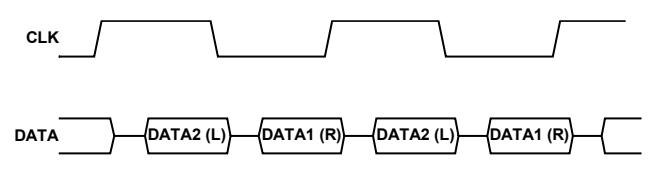

**Figure 26. Stereo PDM Format**

If only one microphone is connected to the DATA signal, the output is only clocked on a single edge [\(Figure 27\)](#page-27-4). For example, a left channel microphone is never clocked on the rising edge of CLK. In a single microphone application, each bit of the DATA signal is typically held for the full CLK period until the next transition because the leakage of the DATA line is not enough to discharge the line while the driver is tristated.

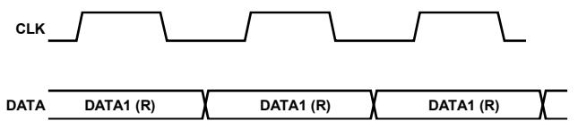

**Figure 27. Mono PDM Format**

See [Table 25](#page-28-2) for the channel assignments according to the logic level on the SELECT pin. The setting on the SELECT pin is sampled at power-up and should not be changed during operation.

# **6.2. CHANNEL SETTING**

| SELECT Pin Setting | Channel       |
|--------------------|---------------|
| Low (tie to GND)   | Right (DATA1) |
| High (tie to VDD)  | Left (DATA2)  |

**Table 25. T5838 Channel Setting**

For PDM data, the density of the pulses indicates the signal amplitude. A high density of high pulses indicates a signal near positive full scale, and a high density of low pulses indicates a signal near negative full scale. A perfect zero (dc) audio signal shows an alternating pattern of high and low pulses.

The output PDM data signal has a small dc offset of about 3% of full scale. A high-pass filter in the codec that is connected to the digital microphone and does not affect the performance of the microphone typically removes this dc signal.

# **6.3. PDM MICROPHONE SENSITIVITY**

The sensitivity of a PDM output microphone is specified with the unit dB FS (decibels relative to digital full scale). A 0 dB FS sine wave is defined as a signal whose peak just touches the full-scale code of the digital word (see [Figure](#page-28-3)  [28\)](#page-28-3). This measurement convention also means that signals with a different crest factor may have an RMS level higher than 0 dB FS. For example, a full-scale square wave has an RMS level of 3 dB FS.This definition of a 0 dB FS signal must be understood when measuring the sensitivity of the T5838. A 1 kHz sine wave at a 94 dB SPL acoustic input to the T5838 results in an output si nal ith a −26 dB FS level (low-power mode). The output digital word peaks at −26 dB below the digital full-scale level. A common misunderstanding is that the output has an RMS level of −29 dB FS; however, this is not true because of the definition of the 0 dB FS sine wave.

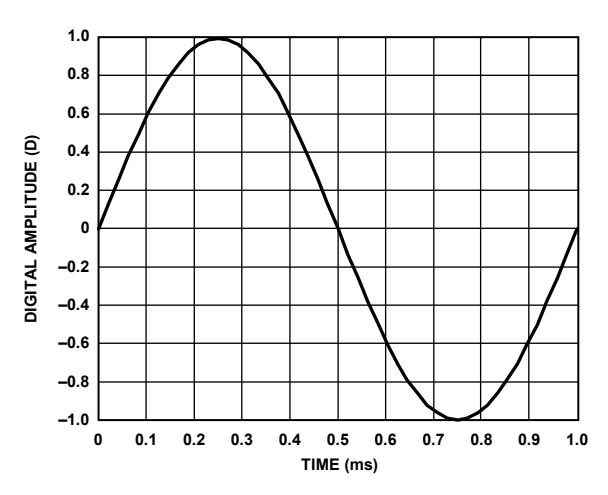

**Figure 28. 1 kHz, 0 dB FS Sine Wave**

There is not a commonly accepted unit of measurement to express the instantaneous level, as opposed to the RMS level of the signal, of a digital signal output from the microphone. Some measurement systems express the instantaneous level of an individual sample in units of D, here 1 0 D is di ital full scale In this case, a −26 dB FS sine wave has peaks at 0.05 D.

# *7. APPLICATIONS INFORMATION*

# **7.1. LOW-POWER MODE**

Low-Power Mode (LPM) enables the T5838 to be used in an AlwaysOn listening mode for keyword spotting and ambient sound analysis. The T5838 will enter LPM when the frequency of SCK is 768 kHz. In this mode, the microphone consumes only 120 µA while retaining high electro-acoustic performance.

When one microphone is in LPM for AlwaysOn listening, a second microphone sharing the same data line may be powered down. In this case, where one microphone is powered up and another is powered down by disabling the VDD supply or in sleep mode by reducing the frequency of a separate clock source, the disabled microphone does not present a load to the signal on the PM microphone's DATA pin.

#### **7.2. DYNAMIC RANGE CONSIDERATIONS**

The microphone clips (THD = 10%) at 119dB SPL in Low-Power Mode and at 133 dB SPL in High Quality Mode (see [Figure 5\)](#page-11-1); however, it continues to output an increasingly distorted signal above that point. The peak output level, which is controlled by the modulator, limits at 0 dB FS.

To fully use the 107 dB dynamic range of the output data of the T5838 in a design, the digital signal processor (DSP) or codec circuit following it must be chosen carefully. The decimation filter that inputs the PDM signal from the T5838 must have a dynamic range sufficiently better than the dynamic range of the microphone so that the overall noise performance of the system is not degraded. If the decimation filter has a dynamic range of 10 dB better than the microphone, the overall system noise only degrades by 0.4 dB. This 117 dB filter dynamic range requires the filter to have at least 20 bit resolution.

# **7.3. CONNECTING PDM MICROPHONES**

A PDM output microphone is typically connected to a codec with a dedicated PDM input. This codec separately decodes the left and right channels and filters the high sample rate modulated data back to the audio frequency band. This codec also generates the clock for the PDM microphones or is synchronous with the source that is generating the clock. [Figure 29](#page-29-4) an[d Figure 30](#page-30-0) show mono and stereo connections of the T5838 to a codec. The mono connection shows an T5838 set to output data on the right channel. To output on the left channel, tie the SELECT pin to VDD instead of tying it to GND.

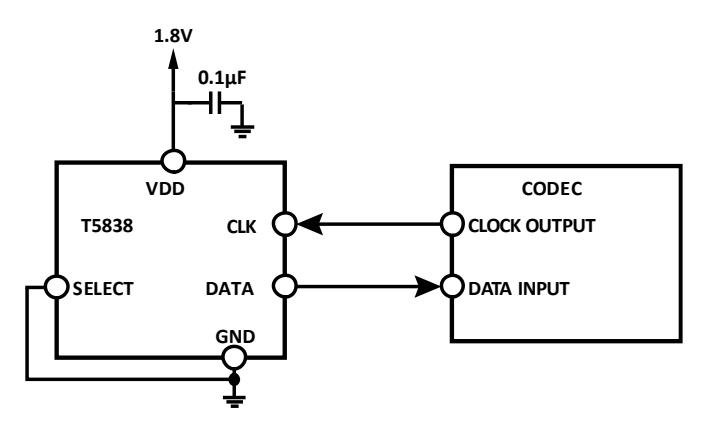

**Figure 29. Mono PDM Microphone (Right Channel) Connection to Codec**

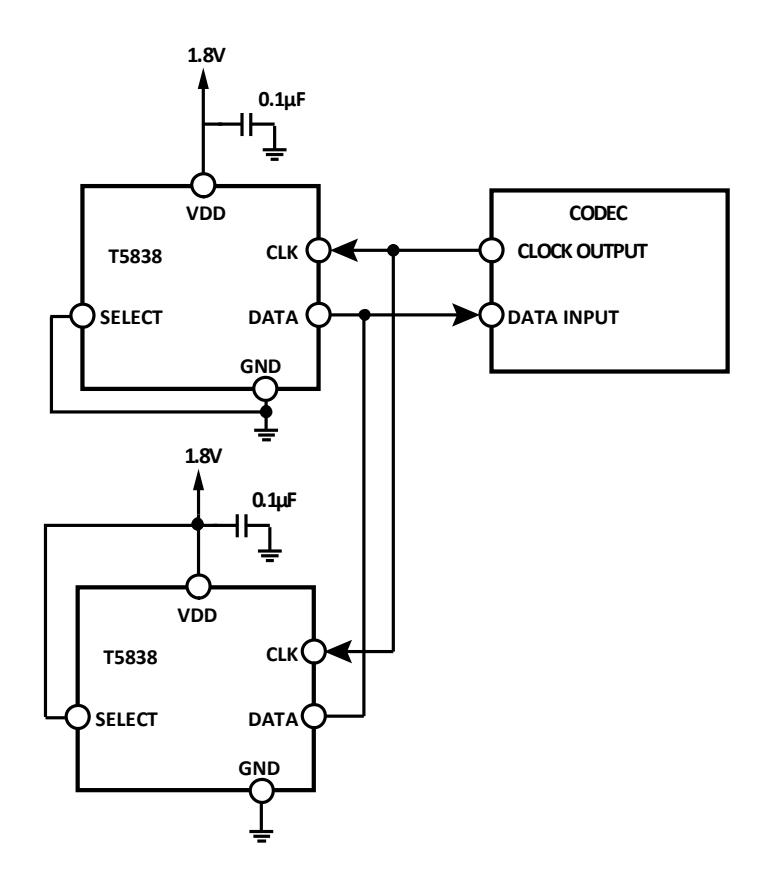

**Figure 30. Stereo PDM Microphone Connection to Codec**

Decouple the VDD pin of the T5838 to GND with a 0.1 µF capacitor. Place this capacitor as close to VDD as the printed circuit board (PCB) layout allows.

Do not use a pull-up or pull-down resistor on the PDM data signal line because it can pull the signal to an incorrect state during the period that the signal line is tristated.

The DATA signal does not need to be buffered in normal use when the T5838 microphone(s) is placed close to the codec on the PCB. If the DATA signal must be driven over a long cable (>15 cm) or other large capacitive load, a digital buffer may be required. Only use a signal buffer on the DATA line when one microphone is in use or after the point where two microphones are connected (see [Figure 31\)](#page-31-2). The DATA output of each microphone in a stereo configuration cannot be individually buffered because the two buffer outputs cannot drive a single signal line. If a buffer is used, take care to select one with low propagation delay so that the timing of the data connected to the codec is not corrupted.

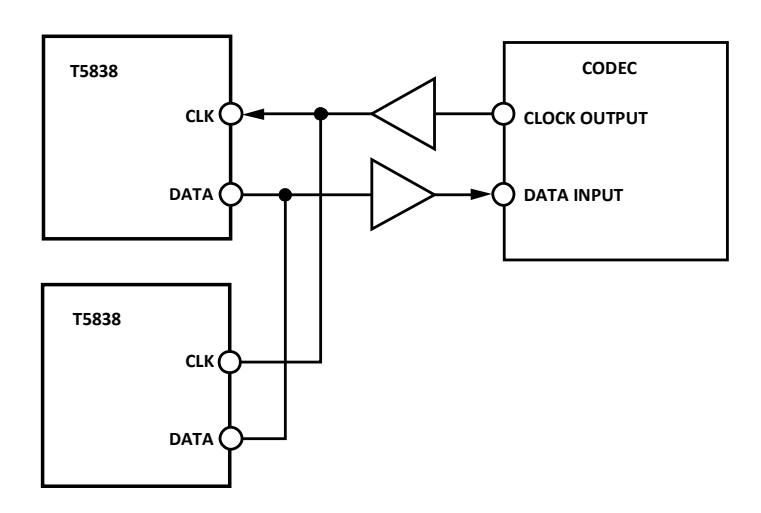

**Figure 31. Buffered Connections Between Stereo T5838s and a Codec**

When long wires are used to connect the codec to the T5838, a source termination resistor can be used on the clock output of the codec instead of a buffer to minimize signal overshoot or ringing. Match the value of this resistor to the characteristic impedance of the CLK trace on the PCB. Depending on the drive capability of the codec clock output, a buffer may still be needed.

#### **7.4. ENTERING AND EXITING SLEEP MODE**

The microphone enters sleep mode when the clock frequency falls below 200 kHz. In this mode, the microphone data output is in a high impedance state. The current consumption in sleep mode is 9 µA with a SCK active, 1uA with SCK OFF.

To exit sleep mode, a clock with a frequency in the range of 400 kHz to 800 kHz, for Low Power Mode, or 2 MHz to 3.7 MHz, for High Quality Mode, must be provided. The microphone wakes up from sleep mode and begins to output data 6 ms after the clock becomes active. The wake-up time indicates the time from when the clock is enabled to when the T5838 outputs data within 0.5 dB of its settled sensitivity.

#### **7.5. POWER-ON START-UP TIME**

The power-on start-up time of the T5838 is typically 6 ms, measured by the time from when power and clock are enabled until sensitivity of the output signal is within 0.5 dB of its settled sensitivity.

# *8. SUPPORTING DOCUMENTS*

For additional information, see the following documents.

### **8.1. APPLICATION NOTES – GENERAL**

AN-000277, T5838 Flex EVB User Guide

AN-100, *MEMS Microphone Handling and Assembly Guide*

AN-1003, *Recommendations for Mounting and Connecting the TDK, Bottom-Ported MEMS Microphones*

AN-1112, *Microphone Specifications Explained*

AN-1124, *Recommendations for Sealing TDK Bottom-Port MEMS Microphones from Dust and Liquid Ingress*

AN-1140, *Microphone Array Beamforming*

AN-000298, *T583x MEMS Microphone Acoustic Activity Detect User Guide*

# *9. PCB DESIGN AND LAND PATTERN LAYOUT*

The recommended PCB land pattern for the T5838 is a 1:1 ratio of the solder pads on the microphone package, as shown i[n Figure 32.](#page-33-1) Avoid applying solder paste to the sound hole in the PCB. A suggested solder paste stencil pattern layout is shown in [Figure 33.](#page-33-2)

The response of the T5838 is not affected by the PCB hole size as long as the hole is not smaller than the sound port of the microphone (0.375 mm in diameter). A 0.5 mm to 1 mm diameter for the hole is recommended. Take care to align the hole in the microphone package with the hole in the PCB. The exact degree of the alignment does not affect the microphone performance as long asthe holes are not partially or completely blocked.

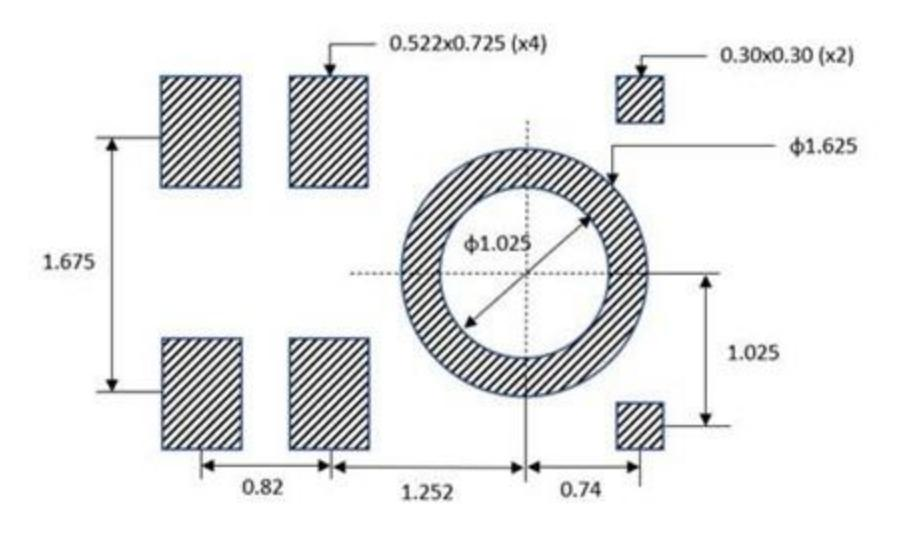

**Figure 32. Recommended PCB Land Pattern Layout**

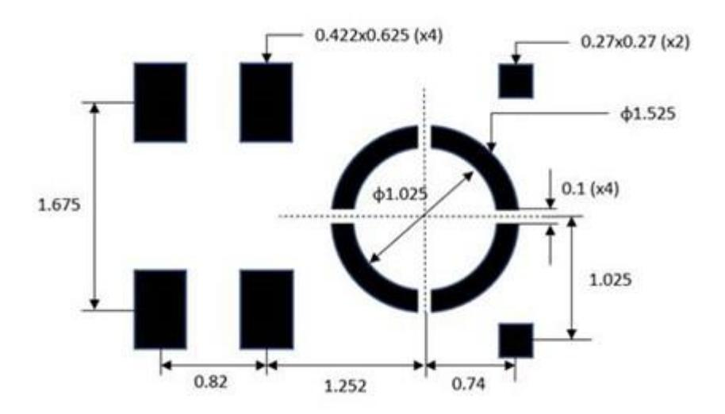

**Figure 33. Suggested Solder Paste Stencil Pattern Layout**

# **9.1. PCB MATERIAL AND THICKNESS**

The performance of the T5838 is not affected by PCB thickness. The T5838 can be mounted on either a rigid or flexible PCB. A flexible PCB with the microphone can be attached directly to the device housing with an adhesive layer. This mounting method offers a reliable seal around the sound port while providing the shortest acoustic path for good sound quality.

# *10. HANDLING INSTRUCTIONS*

# **10.1. PICK AND PLACE EQUIPMENT**

The MEMS microphone can be handled using standard pick-and-place and chip shooting equipment. Take care to avoid damage to the MEMS microphone structure as follows:

- Use a standard pickup tool to handle the microphone. Because the microphone hole is on the bottom of the package, the pickup tool can make contact with any part of the lid surface.
- Do not pick up the microphone with a vacuum tool that makes contact with the bottom side of the microphone.
- Do not pull air out of or blow air into the microphone port.
- Do not use excessive force to place the microphone on the PCB.

### **10.2. REFLOW SOLDER**

For best results, the soldering profile must be in accordance with the recommendations of the manufacturer of the solder paste used to attach the MEMS microphone to the PCB. It is recommended that the solder reflow profile not exceed the limit conditions specified in [Figure 2](#page-9-2) an[d Table 9.](#page-9-3)

T5838 devices have MSL (Moisture Sensitivity Level) rating 1, appropriate JESD22-A113 guidelines should be followed to avoid damaging the part.

#### **10.3. BOARD WASH**

When washing the PCB, ensure that water does not make contact with the microphone port. Do not use blow-off procedures or ultrasonic cleaning.

# *11. OUTLINE DIMENSIONS*

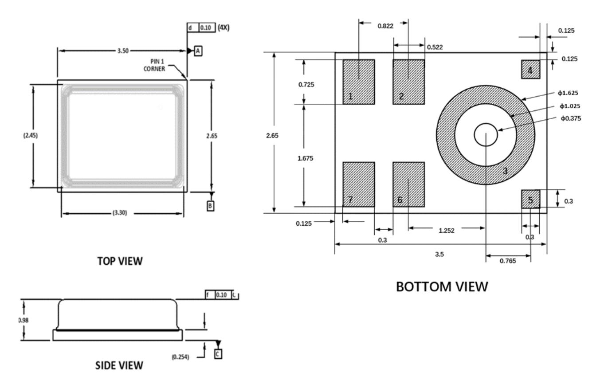

**Figure 34. 5-Terminal Chip Array Small Outline No Lead Cavity [LGA\_CAV] 3.5 mm × 2.65 mm × 0.98 mm Body Dimensions shown in millimeters Dimension tolerance is ±0.15 mm unless otherwise specified**

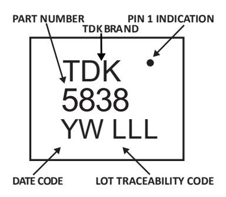

**Figure 35. Package Marking Specification (Top View)**

# *12. RELIABILITY SPECIFICATIONS*

| Test                                      | Standard                                         | Conditions                                                                             |
|-------------------------------------------|--------------------------------------------------|----------------------------------------------------------------------------------------|
| Early Life Failure Rate (ELFR)            | JEDEC JESD22-A108                                | Tj ≥ 125°C, VDD max, 48 hrs.                                                           |
| Temperature Humidity Bias (THB)           | JEDEC JESD22-A101                                | Biased, 85°C, 85% RH, 1000 hrs. Preceded with JESD22-A113 MSL 1 Preconditioning     |
| High Temperature Operating Life (HTOL) | JEDEC JESD22-A108                                | Tj ≥ 125°C, VDD max, 1000 hrs.                                                         |
| High Temperature Storage life (HTS)       | JEDEC JESD22-A103                                | Un-biased bake: Condition B, Ta ≥ 150 (-0/+10) °C                                      |
| Temperature Cycling (TC)                  | JEDEC JESD22 A104                                | -40 to +125°C, Soak Mode 2: 5 min, Preceded with JESD22-A113 MSL 1 preconditioning. |
| ESD Human-Body Model (ESD-HBM)            | ANSI/ESDA/JEDEC JS-001- 2014                  | 1.5 kV, 2.0 kV, All pins, 1 zap per polarity.                                          |
| ESD Charged Device Model (ESD-CDM)        | JESD22-C101                                      | 250 V, 500 V, Std. Sample, 1 zap per polarity.                                         |
| Latch-up (LU)                             | JEDEC JESD-78                                    | Iinj = ± 100 mA; Vos = 1.5*Vdd max at 85°C, Class II.                                  |
| Vibration (VIB)                           | MIL-STD-883K-CHG3, Method 2007.3, Condition B | 20 Hz-2 kH , ≥4 min/cycle, 4 cycles, 50 g peak accel.                               |
| Random Drop (RD)                          | AEC-Q100, Test G5                                | 18 free-fall drops from 1.2 m on concrete surface.                                     |
| Mechanical Shock Test (MS)                | IEC 60068-2-27, Condition E.                     | 10,000 g, 0.1 ms pulse, ±X, ±Y, ±Z – 5 shock pulses, 6 directions                   |

**Note:** Microphone sensitivity variations shall not exceed 3 dB over the lifetime of the device.

**Table 26. Reliability Specifications**

# *13. ORDERING GUIDE*

| PART             | TEMP RANGE     | PACKAGE               | QUANTITY | PACKAGING         |
|------------------|----------------|-----------------------|----------|-------------------|
| MMICT5838-00-012 | −40°C to +85°C | 5-Terminal LGA_CAV    | 10,000   | 13” Tape and Reel |
| EV_T5838-FX2     | -              | Flex Evaluation Board | -        |                   |

# *14. REVISION HISTORY*

| REVISION DATE | REVISION | DESCRIPTION                                         |
|---------------|----------|-----------------------------------------------------|
| 6/11/2022     | 1.0      | Initial version                                     |
| 4/21/2023     | 1.1      | Added Reliability Spec. Table; Updated AAD section. |

# *15. COMPLIANCE DECLARATION DISCLAIMER*

TDK believes the environmental and other compliance information given in this document to be correct but cannot guarantee accuracy or completeness. Conformity documents substantiating the specifications and component characteristics are on file. TDK subcontracts manufacturing, and the information contained herein is based on data received from vendors and suppliers, which has not been validated by TDK.

This information furnished by TDK, Inc ("TDK") is believed to be accurate and reliable. However, no responsibility is assumed by TDK for its use, or for any infringements of patents or other rights of third parties that may result from its use. Specifications are subject to change without notice. TDK reserves the right to make changes to this product, including its circuits and software, in order to improve its design and/or performance, without prior notice. TDK makes no warranties, neither expressed nor implied, regarding the information and specifications contained in this document. TDK assumes no responsibility for any claims or damages arising from information contained in this document, or from the use of products and services detailed therein. This includes, but is not limited to, claims or damages based on the infringement of patents, copyrights, mask work and/or other intellectual property rights.

Certain intellectual property owned by TDK and described in this document is patent protected. No license is granted by implication or otherwise under any patent or patent rights of TDK. This publication supersedes and replaces all information previously supplied. Trademarks that are registered trademarks are the property of their respective companies. TDK sensors should not be used or sold in the development, storage, production or utilization of any conventional or mass-destructive weapons or for any other weapons or life threatening applications, as well as in any other life critical applications such as medical equipment, transportation, aerospace and nuclear instruments, undersea equipment, power plant equipment, disaster prevention and crime prevention equipment.

©2022 TDK. All rights reserved. TDK, MotionTracking, MotionProcessing, MotionProcessor, MotionFusion, MotionApps, DMP, AAR, and the TDK logo are trademarks of TDK, Inc. The TDK logo is a trademark of TDK Corporation. Other company and product names may be trademarks of the respective companies with which they are associated.

